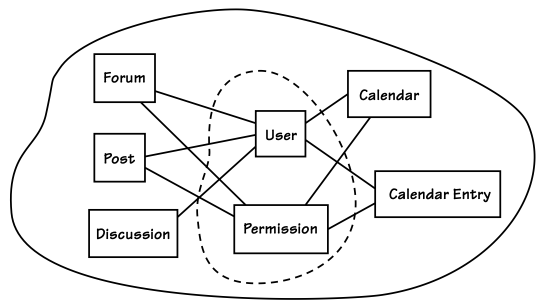
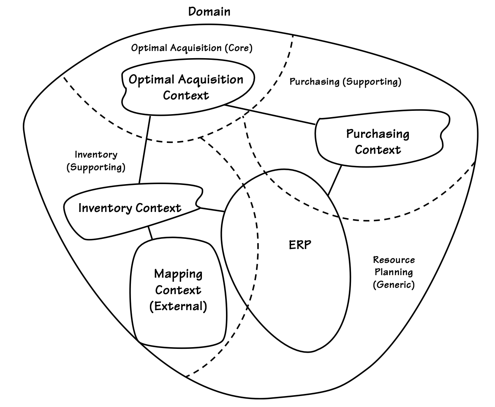

# Bölüm 2 - Domains, Subdomains and Bounded Contexts

Üç temel kavramı çok net bir şekilde anlamanız gerekecek:

-   Alanınızın (Domain) ne olduğunu,
-   Alt alanlarınızın (Subdomains) neler olduğunu,
-   Sınırlandırılmış bağlamlarınızın (Bounded Contexts) nasıl çalıştığını.

Bu kavramların [Evans] kitabının ikinci yarısında detaylı bir şekilde ele alınmış olması, onların ikinci planda olduğu anlamına gelmez. **DDD’yi başarılı bir şekilde uygulamak istiyorsanız, bu kavramları doğru bir şekilde anlamanız şarttır.**

---

> **Bu Bölümdeki Yol Haritası**
>
> - DDD’nin büyük resmini kavrayarak Alanlar, Alt Alanlar ve Sınırlandırılmış Bağlamları anlayın.
> - Stratejik tasarımın neden bu kadar önemli olduğunu ve onsuz yapılan tasarımın neden sorunlara yol açtığını öğrenin.
> - Gerçek dünyadan, birden fazla Alt Alana sahip pratik bir Alan inceleyin.
> - Bounded Context'leri hem kavramsal hem de teknik olarak anlamlandırın.
> - SaaSOvation ekibinin stratejik tasarımı keşfederken yaşadığı "aha!" anlarını görün.

## Büyük Resim

**Alan (Domain)** geniş anlamda, bir organizasyonun yaptığı işi ve bunu gerçekleştirdiği dünyayı ifade eder. İşletmeler bir pazar belirler ve ürünler veya hizmetler satar. Her organizasyonun kendine özgü bir bilgi birikimi ve iş yapma yöntemi vardır. Bu bilgi birikimi ve operasyonlarını yürütme yöntemleri, organizasyonun **alanıdır (Domain).**

Bir organizasyon için yazılım geliştirdiğinizde, **o organizasyonun alanında çalışıyorsunuz demektir.** Alanınızın ne olduğu sizin için oldukça açık olmalıdır; çünkü zaten içinde çalışıyorsunuz.

Ancak dikkat edilmesi gereken bir nokta var: "Alan" terimi bazen farklı anlamlarda kullanılabilir. Alan, hem işletmenin tamamını ifade edebilir hem de sadece belirli bir çekirdek veya destekleyici bölümü gösterebilir. Bu kitap boyunca, terimi hangi anlamda kullandığımı netleştirmeye özen göstereceğim. Eğer yalnızca işletmenin belirli bir bölümünden bahsediyorsam, genellikle **"Çekirdek Alan (Core Domain)", "Alt Alan (Subdomain)"** gibi ifadeler kullanacağım.

**Alan Modeli (Domain Model)** teriminde "alan" kelimesi geçtiği için, organizasyonun tüm iş alanını kapsayan büyük, tek bir model oluşturmamız gerektiği gibi bir izlenim edinebiliriz. Yani, bir kurumsal model (Enterprise Model) gibi düşünebiliriz. Ancak DDD'de amaç kesinlikle bu değildir. Tam tersine, DDD **büyük resmi daha küçük, yönetilebilir parçalara bölmeye odaklanır.**

Bir organizasyonun tamamı birden fazla Alt Alandan (Subdomains) oluşur. DDD ile yazılım geliştirirken, modellerimizi belirli Sınırlandırılmış Bağlamlar (Bounded Contexts) içinde oluştururuz. Aslında, Alan Modeli oluşturmak, işletmenin tamamına değil, yalnızca belirli bir kısmına odaklanmamıza yardımcı olan bir yöntemdir.

Orta veya büyük ölçekli bir işletmenin tüm iş süreçlerini tek bir modelde tanımlamaya çalışmak aşırı derecede zor olacak ve büyük olasılıkla başarısızlıkla sonuçlanacaktır. Bu bölümde de açıkça göreceğiniz gibi, **iş alanının farklı bölümlerini kesin çizgilerle ayırmak, başarıya ulaşmamız için kritik öneme sahiptir.**

***Peki, bir Alan Modeli (Domain Model) tam olarak ne olmalıdır?***

Neredeyse her yazılım alanı (Domain) birden fazla Alt Alana (Subdomains) sahiptir. Organizasyon devasa ve karmaşık da olsa, küçük ve basit de olsa, işletmenin başarılı olmasını sağlayan farklı işlevler vardır. Bu işlevleri ayrı ayrı düşünmek büyük avantaj sağlar.

### Subdomains ve Bounded Contexts at Work

Alt Alanların (Subdomains) nasıl kullanılabileceğini göstermek için oldukça basit bir örnekle başlayalım. **Çevrimiçi (online) ürün satan bir perakende şirketi düşünelim.** Şirketin sattığı ürünler herhangi bir şey olabilir, bu yüzden ürünler üzerinde çok fazla düşünmemize gerek yok. Bu alanda iş yapabilmek için şirketin yerine getirmesi gereken temel işlevler şunlardır:

- Müşterilere bir ürün kataloğu sunmak,
- Sipariş verilmesine izin vermek,
- Satılan ürünler için ödeme almak,
- Ürünleri alıcılara göndermek (sevkiyat).

Bu çevrimiçi perakendecinin **alanı (Domain)**, dört ana alt alandan (Subdomains) oluşuyor gibi görünüyor:

1.  Ürün Kataloğu (Product Catalog)
2.  Sipariş Yönetimi (Orders)
3.  Faturalandırma (Invoicing)
4.  Sevkiyat (Shipping)

**Figure 2.1:** A Domain with Subdomains and Bounded Contexts

Şimdiye kadar her şey oldukça basit görünüyor. Ancak tek bir ekstra detay eklersek, örneğimiz biraz daha karmaşık hale gelecek. **Şirketin bir de Stok Yönetimi (Inventory) ile ilgilenmesi gerektiğini düşünelim.** Bu noktada, sistemin fiziksel alt sistemleri ve mantıksal Alt Alanlarını inceleyelim.

Bu perakendecinin alanını (Domain) gerçekleştirmek için kullanılan üç fiziksel sistem mevcut ve bunlardan yalnızca ikisi şirket içinde barındırılıyor. Bu iki iç sistem, iki farklı Sınırlandırılmış Bağlam (Bounded Contexts) olarak düşünülebilir. Ancak, günümüzde çoğu sistem **DDD yaklaşımıyla tasarlanmadığı için**, tek bir sistem birçok farklı işlevden sorumlu hale gelebiliyor. Bu, yaygın ama problemli bir durumdur.

Örneğin, E-Ticaret Sınırlandırılmış Bağlamı (e-Commerce Bounded Context) içinde, birden fazla iç içe geçmiş alan modeli (Domain Model) bulunmaktadır. Ancak bu modeller temiz bir şekilde ayrılmamıştır. Aksine, tek bir yazılım modeli içinde birleştirilmişlerdir, ki bu oldukça kötü bir durumdur.

Eğer perakendeci şirket **bu E-Ticaret sistemini dışarıdan satın almış olsaydı**, bu kadar büyük bir sorun olmayabilirdi. Ancak bu sistemi bakımını üstlenen ekip, zamanla artan karmaşıklığın olumsuz etkilerini hissetmeye başlamıştır. **Ürün Kataloğu, Sipariş Yönetimi, Faturalandırma ve Sevkiyat modellerinin** tek bir büyük e-ticaret modeli içinde birleştirilmesi nedeniyle, her bir işlevin geliştirilmesi diğerlerini engellemeye başlamıştır. Özellikle de yeni bir büyük özellik eklenmek istendiğinde, mevcut modellerin birbirine olan bağımlılıkları büyük bir engel yaratacaktır.

***Neden Tek Bir Büyük Sistem Problem Yaratır?***

Ne yazık ki pek çok yazılım geliştiricisi, her şeyi tek bir sistem içine dahil etmenin akıllıca olduğunu düşünür. Bunun sonucunda "her şeyi bilen, her şeyi yapan" devasa e-ticaret sistemleri ortaya çıkar. Bu yaklaşım, her ihtiyacı karşılayabilecekmiş gibi görünebilir, ancak aslında büyük bir yanılgıdır. **Ne kadar çok işlev tek bir sisteme yığılırsa yığılsın, hiçbir zaman tüm kullanıcıların ihtiyaçlarını tam anlamıyla karşılayamaz.** Ayrıca, farklı Alt Alanlara (Subdomains) ait yazılım modellerinin birbirinden ayrılmaması, sistemin bakımını ve değişiklik yapılmasını aşırı derecede zorlaştırır. Çünkü:

- Her bileşen birbirine bağımlıdır.
- Bir yerde yapılan değişiklik, beklenmedik hatalara yol açabilir.
- Yeni özellikler eklemek giderek zorlaşır.

***DDD ile Karmaşıklığın Üstesinden Gelmek***

DDD’nin stratejik tasarım araçlarını kullanarak, bu iç içe geçmiş modelleri mantıksal olarak ayrılmış Alt Alanlara (Subdomains) bölebiliriz. Şekil 2.1’de görüldüğü gibi, **bu ayrımları kesikli çizgilerle belirtebiliriz.** Bu noktada, üçüncü taraf sistemleri temiz bir şekilde refaktör etmiş değiliz. Ancak bu sistemlerin nasıl ayrılması gerektiğini tanımladık. Böylece, **mantıksal Alt Alanları (Subdomains) belirleyerek iş süreçlerini daha iyi yönetebilir ve hangi alanların hangi fiziksel Sınırlandırılmış Bağlamlara (Bounded Contexts) bağlı olduğunu açıkça görebiliriz.**

***İşletme Açısından Bakıldığında Zorluklar***

Şimdi teknik karmaşıklıklardan **işletmenin karşılaştığı iş zorluklarına** geçelim. Bu küçük şirketin:

-  Sınırlı bütçesi var.
-  Sınırlı depo alanı var.
-  Sürekli bir dengeleme süreci içinde.

Şirket, çok fazla satmayan ürünlere aşırı harcama yapmamalıdır. Çünkü bazı ürünler belirli dönemlerde daha fazla satarken, diğer zamanlarda durgunluk gösterebilir. Eğer bazı ürünler planlandığı gibi satılmazsa, şirketin fonları müşteri talebi olmayan ürünlere bağlanmış olur ve para adeta donmuş hale gelir. Bu da şirketin, o an talep gören ürünleri stoklamak için yeterli alan bulamaması anlamına gelir.

Bu kadarla da bitmiyor. Başka bir sorun daha ortaya çıkıyor. Bazı ürünler beklenenden daha hızlı satıldığında, şirket bu ürünlerden yeterince stok yapamayabilir ve bu da müşteri taleplerini karşılamada yetersiz kalmasına neden olabilir. Yetersiz stok sorunu, müşterilerin acil olarak ihtiyaç duydukları bu ürünleri başka yerlerden temin etmelerine yol açabilir. Evet, bazı ürün toptancıları perakendeci adına doğrudan sevkiyat (drop-shipping) yapmaya isteklidir, ancak bu seçenek daha pahalıdır ve beraberinde istenmeyen başka sonuçlar da getirebilir. Bazı maliyet düşürme stratejileri, bazı ürünleri yerel olarak stoklamayı, uzak bölgelere daha iyi satılan diğer ürünleri ise doğrudan sevk etmeyi gerektirir. Bu yüzden, doğrudan sevkiyat (drop-shipping), yalnızca başarısız olmuş bir satışı kurtarmak için son anda başvurulan bir yöntem olmamalıdır.

Sonuçta, **çok satan ürünler aslında kıt olduğu için değil, perakende şirketi bunları en iyi şekilde stoklayamadığı için müşterilere hızlıca ulaştırılamıyor.** Eğer müşteriler sürekli gecikmeler yaşarsa, bu çevrimiçi satış şirketinin kazandığı rekabet avantajını kaybetmesine yol açabilir.

Ancak şunu da açıkça belirtelim: Stok yönetimiyle ilgili karşılaşılan zorlukların sınırlarını tam olarak araştırmış değiliz. Bu olumsuz durumlar yalnızca küçük ölçekli perakendeciler için geçerli değildir. Bütün perakendeciler, maliyetleri en aza indirirken stoklarını tam olarak ihtiyaçlarına uygun şekilde satın almak ve yönetmek ister. Yine de, küçük ölçekli perakendeciler, düşük performansın getirdiği dezavantajları büyük ölçekli perakendecilere kıyasla çok daha hızlı hisseder.

Herhangi bir çevrimiçi perakendeci için en büyük avantajlardan biri, gelecekteki stok ve satış taleplerini geçmiş eğilimlere göre tahmin edebilmek olurdu. Eğer bir perakendeci, **stok ve satış geçmişi verilerini işleyebilen bir tahmin motoru (forecasting engine) kullanabilseydi**, stoklarını optimize etmek için net tahminler elde edebilirdi:
- Ne zaman sipariş vermeli?
- Hangi üründen ne kadar sipariş etmeli?

Küçük bir perakendecinin böyle bir tahmin sistemini geliştirmesi muhtemelen yeni bir **"Temel Alan (Core Domain)"** oluşturmasını gerektirir. Çünkü bu, çözülmesi kolay bir problem değildir ve başarılı olunursa şirkete büyük bir rekabet avantajı kazandırabilir. Gerçekten de, Şekil 2.1'deki üçüncü fiziksel Sınırlandırılmış Bağlam (Bounded Context), harici bir **Tahminleme Sistemi**’dir **(External Forecasting System)**.

- Orders Subdomain ve Inventory Bounded Context, geçmiş ürün satışları ve iadeleri hakkında veri sağlamak için Tahminleme Sistemi ile entegre olur.
- Ayrıca, Catalog Subdomain, küresel olarak tanınan barkodları (product barcodes) sağlamalıdır.
	- Böylece, Tahminleme Sistemi, küçük ölçekli perakendecinin ürünlerini küresel satış trendleriyle karşılaştırabilir.
    - Bu da, daha geniş bir bakış açısı sunarak, en doğru stoklama miktarlarını hesaplamasına yardımcı olur.

Eğer bu yeni çözüm gerçekten bir "Temel Alan (Core Domain)" olacaksa (ki büyük olasılıkla öyledir), bu alanı geliştiren ekibin iş alanını, Alt Alanları (Subdomains) ve gerekli entegrasyonları iyi anlaması çok önemli olacaktır. Bu yüzden, Şekil 2.1’de gösterilen mevcut entegrasyonların belirlenmesi, projenin başlangıcında durumu net bir şekilde kavramak için kilit rol oynar.

Her zaman Alt Alanların (Subdomains) büyük ve işlevsel olarak kapsamlı modeller içermesi gerekmez. Bazen bir Alt Alan, yalnızca birkaç algoritmadan oluşan küçük bir sistem olabilir. Bu algoritmalar, iş çözümü açısından kritik olabilir, ancak "Temel Alan (Core Domain)" içinde yer almak zorunda değildir. İyi bir DDD yaklaşımı uygulandığında, bu tür basit Alt Alanlar, **Modüller (Modules)** kullanılarak Temel Alan’dan ayrılabilir ve ağır bir mimari bileşen içinde barındırılmak zorunda kalmaz.

DDD uygularken, her Sınırlandırılmış Bağlamın (Bounded Context), kullanılan her terimin anlamının net bir şekilde tanımlandığı yerler olmasını sağlamaya çalışırız. Bu aslında bir dil sınırıdır (linguistic boundary). Bu bağlamsal sınırlar, DDD'nin en önemli uygulama noktalarından biridir.

Tek bir Sınırlandırılmış Bağlam (Bounded Context) her zaman yalnızca tek bir Alt Alan (Subdomain) içinde yer almaz, ancak bazen alabilir. Şekil 2.1'de yalnızca bir Sınırlandırılmış Bağlamın (Inventory - Stok Yönetimi), tek bir Alt Alan içinde bulunduğunu görüyoruz. Bu durum, e-Ticaret Sistemi geliştirilirken doğru bir DDD yaklaşımının kullanılmadığını açıkça gösteriyor. Bu sistemde şu ana kadar dört farklı Alt Alan belirledik ve muhtemelen daha fazlası da var.

Öte yandan, Stok Yönetimi Sistemi (Inventory System), yalnızca ürünlerin stoklanmasını içeren bir alan olarak tek bir Alt Alan içinde sınırlandırılmış gibi görünüyor. Bunun sebebi, gerçekten DDD uygulanmış olması olabilir ya da bu sadece tesadüfi bir durum da olabilir. Kesin bir sonuca varmak için sistemin iç yapısını detaylıca incelememiz gerekir. Ancak ne olursa olsun, **Stok Yönetimi Sistemi'ni yeni Temel Alanımızı (Core Domain) geliştirmek için pratik bir şekilde kullanabiliriz.**

***Dilbilimsel Açıdan Hangi Sınırlandırılmış Bağlam Daha İyi Bir Tasarıma Sahip?***

Şekil 2.1'e baktığımızda hangi Sınırlandırılmış Bağlamın (Bounded Context) daha iyi tasarlandığını dilbilimsel açıdan değerlendirebiliriz. Örneğin, e-Ticaret Sisteminde (e-Commerce System) terimler ve anlamlar muhtemelen birbiriyle çakışmaktadır. Bunu **"Müşteri" (Customer)** terimi üzerinden inceleyelim:

- Bir kullanıcı Katalog tarayıp ürünleri incelerken, Müşteri terimi farklı bir anlam taşır.
- Aynı kullanıcı bir Sipariş oluşturduğunda ise, "Müşteri" kelimesinin anlamı değişir.

**Bunun nedeni şu:**

- Katalog içinde "Müşteri" kavramı; önceki alışverişler, sadakat programı, mevcut ürünler, indirimler ve gönderim seçenekleriyle ilişkilidir.
- Ancak, Sipariş oluştururken "Müşteri" yalnızca şu bilgileri içerir:
    -   İsim
    -   Teslimat adresi
    -   Fatura adresi
    -   Ödenecek toplam tutar
    -   Ödeme koşulları

Bu basit analiz bile, e-Ticaret Sisteminde "Müşteri" kavramının tek ve net bir anlama sahip olmadığını gösteriyor. Bu durumda, sistemi detaylı incelediğimizde benzer şekilde anlamı değişen birçok başka terim de bulmamız olasıdır. Bu, temiz ve net anlamlara sahip olmayan bir Sınırlandırılmış Bağlam örneğidir.

Bununla birlikte, **Stok Yönetimi Sistemi'nin tamamen temiz bir modele sahip olduğunun garantisi de yoktur.** Bu sistemin odaklanmış bir model gibi görünmesine rağmen stoklanan ürünlerin farklı kullanımları arasında kavramsal anlam farklılıkları olabilir. Örneğin:

- Sipariş edilen bir ürün (Ordered Item),
- Teslim alınan bir ürün (Goods Received),
- Stokta bulunan bir ürün (Stock Item),
- Stoktan çıkan bir ürün (Item Leaving Inventory),
- Bozulan veya kırılan bir ürün (Wasted Inventory Item)

bu sistemde **farklı anlamlara gelebilir.**

Şekil 2.1'e bakarak, bu kavramların nasıl modellenmiş olduğunu kesin olarak bilemeyiz. Ancak DDD uygulandığında, hiçbir şeyi varsaymak yerine her kavramın açıkça tanımlandığından emin oluruz. Alan uzmanlarının (domain experts) bu kavramları nasıl tanımladığına bağlı olarak, bazılarını farklı Sınırlandırılmış Bağlamlara ayırmamız gerekebilir.

Dışarıdan bakıldığında, **Stok Yönetimi Sistemi'nin DDD açısından daha sağlıklı bir model sunduğunu söyleyebiliriz.** Muhtemelen, bu sistemin geliştirici ekibi "Bir Ürün" (Item) kavramını, tüm stok durumlarını kapsayacak şekilde zorlamamıştır. Bu kesin olmamakla birlikte, **Stok Yönetimi Sistemi'nin e-Ticaret Sistemi'ne kıyasla entegrasyon açısından daha kolay olabileceğini gösteriyor.**

Şekil 2.1'de bir işletmedeki Sınırlandırılmış Bağlamların (Bounded Contexts) nadiren tek başına çalıştığını görüyoruz. Örneğin:

- Üçüncü taraf e-Ticaret Sistemi (Third-Party e-Commerce System),
- Stok Yönetimi Sistemi (Inventory System),
- Harici Tahminleme Sistemi (External Forecasting System),

arasında **zorunlu entegrasyon ilişkileri bulunmaktadır.** Bu farklı modellerin birlikte çalışmak zorunda olduğunu gösterir. Bütünleşik büyük bir model sunmaya çalışan üçüncü taraf e-Ticaret Sistemi bile, perakendecinin ihtiyaç duyduğu her şeyi tam olarak karşılayamaz. Şekil 2.1’de gösterilen **düz çizgiler (solid straight lines), farklı Alt Alanlar arasındaki entegrasyon ilişkilerini gösterir.**
Bu ilişkiler her zaman belirli bir entegrasyon türünü içerir ve "Bağlam Haritaları" (Context Maps) konsepti ile bu entegrasyon türlerini daha ayrıntılı olarak inceleyeceğiz.

**Bu bölümde, basit bir iş alanının (business domain) yüksek seviyeli bir özetini gördük.** Temel Alan (Core Domain) kavramıyla tanıştık. DDD’nin bu kavramı nasıl ele aldığını gördük. Şimdi, bunu daha iyi anlamamız gerekiyor.

### Çekirdek Alana Odaklanın

Alt Alanlar ve Sınırlandırılmış Bağlamlar hakkında bir anlayış geliştirdikten sonra, Şekil 2.2’de gösterilen farklı bir Alanın soyut bir görünümünü ele alalım. Bu, herhangi bir alanı temsil edebilir. Belki de sizin çalıştığınız alanı ☺. Bu kez, belirli isimleri kaldırdım, böylece boşlukları kendi zihninizde doldurabilirsiniz. Doğal olarak, iş hedeflerimiz sürekli olarak rafine edilmekte ve genişlemektedir. Bu süreç, değişen Alt Alanlara ve içlerindeki modellere yansımaktadır. Bu diyagram, yalnızca belirli bir bakış açısıyla ve belirli bir zaman diliminde iş alanının tamamını yakalıyor. Ancak, bu perspektif kısa ömürlü olabilir ve zamanla değişebilir.

**Figure 2.2:** An abstract business Domain that includes Subdomains and Bounded Contexts

---

> **Alıştırma Zamanı**
>
> - Bir sütunda, günlük işinizde farkında olduğunuz tüm Alt Alanları (Subdomains) listeleyin. Diğer sütunda ise Sınırlandırılmış Bağlamları (Bounded Contexts) listeleyin. Alt Alanlar birden fazla Sınırlandırılmış Bağlam ile kesişiyor mu? Eğer öyleyse, bu çok kötü bir şey değil, kurumsal yazılım dünyasının bir gerçeği.
> -   Şimdi, Şekil 2.2’deki şablonu kullanarak işletmenizde çalışan bazı yazılım isimlerini, Alt Alanlar, Sınırlandırılmış Bağlamlar ve bunlar arasındaki entegrasyon ilişkileriyle birlikte diyagrama ekleyin.
> > Bu zor muydu? Muhtemelen öyle, çünkü Şekil 2.2’deki şablon, Alanınızdaki mevcut sınırlarla tam olarak örtüşmüyor olabilir.
> - Tekrar başlayın. Bu kez, Alanınızı, Alt Alanlarınızı ve Sınırlandırılmış Bağlamlarınızı daha iyi yansıtacak bir diyagram çizin. Şekil 2.2’deki teknikleri kullanın**, ancak bunları kendi iş dünyanıza uygun hale getirin.
> > Elbette, işletmenizdeki tüm Alt Alanlar ve Sınırlandırılmış Bağlamlar hakkında her şeyi biliyor olmayabilirsiniz. Özellikle Alanınız büyük ve karmaşıksa.   Ancak, günlük olarak çalıştığınız bölümleri belirleyebilirsiniz.  Yanılmaktan korkmayın! Bu, “Bağlam Haritalama (Context Mapping)” pratiği yapmanız için iyi bir fırsat. Bu konu bir sonraki bölümde daha ayrıntılı ele alınacak.  Eğer oraya göz atmak isterseniz, bu da gayet iyi. Ancak şimdilik mükemmel olmaya çalışmayın—öncelikle temel fikirleri kavramaya odaklanın.

---

Şimdi Şekil 2.2’deki İş Alanı sınırının üst kısmına bakın; burada **"Çekirdek Alan" (Core Domain)** olarak etiketlenmiş bir **Alt Alan** göreceksiniz. Daha önce tanıtılan bu kavram, DDD’nin en önemli unsurlarından biridir. Çekirdek Alan, iş alanının **kuruluşun başarısı için birincil öneme sahip olan** bölümüdür. **Stratejik açıdan bakıldığında, işletmenin Çekirdek Alanında mükemmelleşmesi gerekir.** Bu alan, işletmenin sürekliliği ve başarısı için en kritik noktadır. Bu yüzden, bu projeye en yüksek öncelik verilir; **derin bilgiye sahip bir veya daha fazla alan uzmanı, en iyi geliştiriciler ve ekip için mümkün olan en fazla özgürlük ve destek sağlanır**. Bu sayede, ekip başarıya ulaşma yolunda herhangi bir engelle karşılaşmadan ilerleyebilir. DDD proje çalışmalarınızın büyük bir kısmı **Çekirdek Alana odaklanacaktır**. 

Şekil 2.2’de ayrıca **iki farklı Alt Alan türü** daha bulunur:

- Destekleyici Alt Alan (Supporting Subdomain)
- Genel Alt Alan (Generic Subdomain)

Bazı durumlarda, işletmeyi desteklemek amacıyla **sınırlı bir bağlam (Bounded Context)** oluşturulur veya dışarıdan temin edilir. Eğer bu bağlam, işletme için temel olmasa da önemli bir süreci modelliyorsa, buna **Destekleyici Alt Alan (Supporting Subdomain)** denir. İşletme, özelleştirilmiş bir ihtiyacı karşılamak için Destekleyici Alt Alan oluşturur. 

Öte yandan, eğer bir Alt Alan işletme için herhangi bir özel katma değer sağlamıyor ancak genel işleyişin bir parçası olarak gereklilik arz ediyorsa, buna **Generic Subdomain** denir.

Bir Alt Alanın **Supporting veya Generic olması, onun önemsiz olduğu anlamına gelmez**. Bu Alt Alanlar da işletmenin başarısı için kritik olabilir. Ancak işletmenin bu alanlarda mükemmelleşmesine gerek yoktur. Asıl mükemmeliyet Çekirdek Alanda sağlanmalıdır, çünkü işletmeye özgü rekabet avantajını sunan alan burasıdır.

---

> **Alıştırma Zamanı**
> - Çekirdek Alan kavramlarının önemini tam olarak kavrayıp kavramadığınızı anlamak için, yeni oluşturduğunuz beyaz tahta çiziminize geri dönün ve organizasyonunuzda hangi alanların Çekirdek Alan olarak geliştirildiğini belirlemeye çalışın.
> - Ardından, iş alanınızda Destekleyici Alt Alanlar ve Genel Alt Alanları belirlemeye çalışın.

---

> **Unutmayın: Alan Uzmanlarına Sorun!**  
İlk seferde tam olarak doğru yapmasanız da, bu alıştırma yazılımınızın işinizi en çok nasıl ayırt ettiğini, ayırt edici yazılımı neyin desteklediğini ve işinizin başarısı için hiçbir şekilde ayırt edici olmayan yazılımı dikkatlice düşünmenize yardımcı olacaktır. Bu süreç üzerinde çalışmaya devam edin, böylece düşünme süreçleri ve teknikler konusunda daha rahat hale gelirsiniz.  
Çiziminizdeki her bir Alt Alan ve Bağlantılı Bağlamı, farklı alanlarda uzmanlaşmış birkaç alan uzmanıyla tartışın.  
Sadece onlardan çok şey öğreneceksiniz, aynı zamanda uzmanları dinleme konusunda değerli deneyimler kazanacaksınız. Bu, DDD’yi iyi bir şekilde uygulamanın bir özelliğidir.

---

Az önce öğrendikleriniz stratejik tasarımın büyük resim temelidir.

## Stratejik Tasarımın Neden Bu Kadar Önemli Olduğu

Tamam, şimdiye kadar bazı DDD terimlerini ve bunların anlamlarını öğrendiniz, ancak bunun neden bu kadar önemli olduğu hakkında pek bir şey söylemedik. Aslında sadece bunun çok önemli olduğunu iddia ettim ve bana inanmanızı umdum. Ancak çoğu “gerçek” beyanında olduğu gibi, şimdi bu iddiamı desteklemeliyim. Hadi, SaaSOvation’da yürütülen projeler üzerinden devam eden örneğimize dönelim. Oradaki ekip gerçekten zor bir duruma düşmüş durumda.

---

DDD ile ilgili ilk çalışmalarına başladıklarında, iş birliği projesi ekibi temiz bir model geliştirme yolundan sapmaya başladı. Bunun nedeni, en temel seviyede bile stratejik tasarımı anlamamış olmalarıydı. Çoğu geliştirici gibi onların da odağı **Varlıklar (Entities)** ve **Değer Nesneleri (Value Objects)** gibi detaylardaydı. Bu durum, daha büyük resmi görmelerini engelledi. Çekirdek kavramları ile genel kavramları birbirine karıştırarak tek bir model yerine iki modeli bir arada oluşturdular. Çok geçmeden, **Şekil 2.3'te gösterilen tasarımın neden olduğu sorunları hissetmeye başladılar.** Sonuç olarak, DDD’yi tam anlamıyla uygulama hedeflerine ulaşamamışlardı.

**Figure 2.3:** Ekip temel stratejik tasarımı anlamamış, bu da işbirliği modelinde uyumsuz kavramlara yol açmıştır. Çizgiler sorunlu unsurları çevrelemektedir.

SaaSOvation ekibindeki birkaç kişi, **“Peki, iş birliği kavramlarının Kullanıcılar ve İzinler ile sıkı sıkıya bağlı olması neden bu kadar önemli? Sonuçta, kimin ne yaptığını takip etmeliyiz!”** diye savundu. Ancak kıdemli geliştirici ekibe, **sorunun yalnızca bağımlılık olmadığını** açıkladı:

> Sonuçta bir Forum, bir Gönderi, bir Tartışma, bir Takvim ve bir Takvim Girdisi her halükarda bir insan iş birlikçi nesnesine bağlı olacak. İşte asıl sorun burada. Dilbilimsel olarak bu yaklaşım hatalı.

Daha detaylı açıklamalar yaparak ekibe, Forum, Gönderi, Tartışma gibi kavramların yanlış dilbilimsel terimlerle ilişkilendirildiğini gösterdi. Kullanıcılar (Users) ve İzinler (Permissions), iş birliği (collaboration) ile ilgili değildir ve gerçek "Ortak Dil" (Ubiquitous Language) ile uyumlu değildir. Kullanıcılar ve İzinler aslında **kimlik ve erişim yönetimi (security)** ile ilgili kavramlardır.

> İş birliği bağlamında modellenen her kavramın, iş birliğiyle doğrudan ilişkili bir dilbilimsel bağlantısı olmalıdır. Şu anda ise bu bağlantı eksik. Asıl odaklanmamız gereken kavramlar ‘Yazar (Author)’ ve ‘Moderatör (Moderator)’ gibi iş birliği ile ilgili terimler olmalıdır. İş birliği bağlamında doğru olan kavramlar bunlardır.

> **Sınırlandırılmış Bağlamı (Bounded Context) Adlandırma**
>
> Burada **Collaboration Context** adının kullanıldığını fark ettiniz mi? Sınırlandırılmış Bağlamlar bu > şekilde adlandırılır: **Model-Adı Bağlamı (Name-of-Model Context).** Bu durumda, İş Birliği Projesi’nin alan modelini içeren Sınırlandırılmış Bağlam olduğu için "Collaboration Context" adını kullanıyoruz. Benzer şekilde, **Kimlik ve Erişim (Identity and Access)** projesinin modelini içeren Sınırlandırılmış Bağlam için **Identity and Access Context** adını kullanıyoruz. Aynı şekilde, **Çevik Proje Yönetimi (Agile Project Management - PM)** projesinin modelini içeren Sınırlandırılmış Bağlam için de **Agile PM Context** adını veriyoruz.

SaaSOvation geliştiricileri, en temel düzeyde **Kullanıcılar (Users) ve İzinlerin (Permissions), iş birliği (collaboration) araçlarıyla doğrudan ilgili olmadığını başlangıçta anlayamamışlardı.** Evet, yazılımlarını kullanan kullanıcılar vardı ve bu kullanıcıların kimliklerinin belirlenmesi, hangi görevleri yerine getirebileceklerinin tespit edilmesi gerekiyordu. Ancak, iş birliği araçlarının **odaklanması gereken şey, kullanıcıların kim oldukları değil, onların rolleriydi.** Her kullanıcının hangi küçük eylemleri gerçekleştirebileceği ile ilgilenmemeliydi.

Ancak, **mevcut iş birliği modeli kullanıcı ve izin detaylarıyla tamamen iç içe geçmişti.** Kullanıcıların veya izinlerin işleyişinde bir değişiklik olması durumunda, **modelin büyük bir kısmı bundan olumsuz etkilenecekti.** Aslında, bu problem çoktan belirginleşmişti. Ekip, izinler tabanlı bir yaklaşım yerine rol tabanlı erişim yönetimine geçmek istiyordu. Bu değişikliği yapmaya karar verdiklerinde, ellerindeki stratejik modelleme sorununun farkına daha fazla vardılar.

Artık, bir Forum'un kimlerin bir konu açabileceğiyle veya bunun hangi koşullarda izin verildiğiyle ilgilenmemesi gerektiğini anladılar. Forum'un sadece bir Yazar’ın (Author) şu anda bir konu açtığını ya da daha önce açtığını bilmesi yeterliydi. Ekip, **kimlerin hangi işlemleri yapabileceğini belirlemenin tamamen farklı bir modelin sorumluluğu olduğunu** ve temel iş birliği modelinin yalnızca, bu soruların çoktan cevaplanmış olduğunu bilmesi gerektiğini kavramaya başladı. Böylece, Forum'un sadece bir Tartışmaya (Discussion) gönderi paylaşmak isteyen bir Yazar ile ilgilenmesi gerektiği ortaya çıktı. Forum ve Yazar, iş birliği modelinin Ortak Dil’ine (Ubiquitous Language) ait kavramlardır ve Collaboration Context adlı Sınırlandırılmış Bağlam'ın (Bounded Context) bir parçasıdır. **Kullanıcı ve İzin (ya da benzer şekilde Rol gibi kavramlar) tamamen farklı bir yere ait olmalı** ve **İş Birliği Bağlamı’ndan izole edilmelidir.**

Ekip, yalnızca Kullanıcı ve İzin kavramlarına olan sıkı bağımlılığı ortadan kaldırmaları gerektiğini düşünebilirdi. Kullanıcı ve İzin/Rol'ü **ayrı bir Modül’e** çıkarmakta yanlış bir şey yoktu. Bu yaklaşım, bu kavramları **aynı Sınırlandırılmış Bağlam içinde, ayrı bir Güvenlik Alt Alanına (Security Subdomain) yerleştirmelerine yardımcı olabilirdi.** Ancak, en iyi modelleme seçeneğini daha belirgin hale getiren şey, ekibin bir sonraki Çekirdek Alan (Core Domain) projesinin de benzer rol tabanlı erişim ihtiyaçlarına sahip olacağıydı. Üstelik, bu proje alanına özgü (domain-specific) rol özelliklerine dayanacaktı. Bu durum, Kullanıcılar ve Roller'in aslında Destekleyici (Supporting) veya Genel (Generic) bir Alt Alan’ın parçası olduğunu ve gelecekte tüm şirket genelinde hatta müşteri odaklı bir rol oynayabileceğini gösterdi.

Daha titiz bir modelleme yaklaşımı benimsemek, daha büyük bir sorundan kaçınmalarına yardımcı olacaktı. Çünkü ekip, farkında olmadan **"Big Ball of Mud" (Büyük Çamur Yumağı)** adı verilen **karmakarışık, düzensiz bir yapıya doğru ilerliyordu.** Buradaki asıl sorun, yalnızca Kullanıcı ve İzin kavramlarının düzgün şekilde modüler hale getirilmemesi değildi. Modülerleştirme, **DDD modelleme için önemli bir araç olsa da, dilbilimsel uyumsuzluğu (linguistic misalignment) tek başına çözmez.**

Kıdemli geliştirici, bu durumun kontrol edilmezse disiplinli bir düşünme biçimini kaybetmelerine yol açabileceği konusunda endişeliydi. Eğer ekip, ileride iş birliğiyle ilgisi olmayan başka bir alanı modellemek zorunda kalırsa, Çekirdek Alan (Core Domain) giderek daha belirsiz hale gelebilirdi. Sonunda, yalnızca kaynak kod içinde var olan, açıkça tanımlanmamış, zayıf bir model ortaya çıkabilirdi ve bu model, İş Birliği’nin Ortak Dil’ini yansıtmaktan uzak olurdu. Ekip için **gerçekten gerekli olan şey, iş alanlarını (business Domain), Alt Alanlarını (Subdomains) ve geliştirdikleri Sınırlandırılmış Bağlamları (Bounded Contexts) net bir şekilde anlamaktı.** Bunu başarmak, stratejik tasarımın en büyük düşmanı olan "Big Ball of Mud" bataklığına sürüklenmelerini engelleyecekti. Bu nedenle, ekip **stratejik modelleme zihniyetini** kazanmalıydı.

> **Ah, Hayır! Yine Tasarım Kelimesi Karşımıza Çıktı!**
>
> Eğer **tasarım** kelimesinin, çevik (agile) yöntemler kullanılırken kötü bir şey olduğunu düşünüyorsanız, DDD için durum böyle değil. DDD'yi çevik yöntemlerle birlikte kullanmak son derece doğaldır. Tasarımı her zaman çevikle denge içinde tutun. Tasarımın **ağır bir süreç olması gerekmez.**

Evet, bu önemli bir ders oldu. Ekip, **çok fazla araştırma yaparak** ve **sürecin içinde deneyim kazanarak** bu sorunun üstesinden gelmeyi başardı. Sonunda **Alanlarını (Domain) ve Alt Alanlarını (Subdomains) kavramayı başardılar.** Bunu nasıl yaptıkları birazdan anlatılacak...

---

> **DDD Topluluğu ile Uyum**
>
> Bu kitaptaki örnekler, **üç farklı Sınırlandırılmış Bağlam (Bounded Context)** üzerinden anlatılmaktadır. Bu bağlamlar, sizin çalıştıklarınızdan farklı olabilir. Ancak, sunulan örnekler genellikle karşılaşılan modelleme senaryolarını temsil etmektedir. Herkes, Kullanıcılar (Users) ve Yetkilendirme (Permissions) kavramlarının bir Çekirdek Alan’dan (Core Domain) ayrılması gerektiği konusunda hemfikir olmayabilir. Bazı durumlarda, bunları çekirdek model ile iç içe geçirmek mantıklı olabilir. Sonuçta, bu karar her ekibin kendisine aittir. Ancak, **benim deneyimime göre**, DDD'ye yeni başlayan ekiplerin sık yaptığı temel hatalardan biri de **bu ayrımı yapmamalarıdır.** Bu da genellikle **karmaşık ve düzensiz bir sonuç doğurur.** Bir diğer yaygın hata, **iş birliği (collaboration) ve çevik proje yönetimi (agile project management) modellerini tek bir model içinde birleştirmektir.** Bunlar yalnızca yaygın hatalardan birkaçıdır. Bunların dışında yapılan modelleme hataları da kitabın ilerleyen bölümlerinde ele alınacaktır.
>
> En azından, burada ve ilerleyen bölümlerde ele alınan hatalar, DDD’nin dilsel yönlendiricilerini (linguistic drivers) ve Sınırlandırılmış Bağlamları anlamayan ekiplerin yaptığı tipik modelleme hatalarını temsil etmektedir. Dolayısıyla, verilen örneklere tamamen katılmasanız bile, sorunlar ve çözümler tüm DDD projelerine genel olarak uygulanabilir. Çünkü bu yaklaşım, belirli bir Sınırlandırılmış Bağlam içindeki dilbilimsel (linguistic) kurallara odaklanmaktadır.
>
> Amacım, DDD’yi uygulamak için en basit, ancak anlamlı örnekleri kullanarak temel ilkeleri öğretmektir. Örneklerin, öğretim sürecinin önüne geçmesine izin veremem. Eğer kimlik ve erişim yönetimi (identity and access management), iş birliği (collaboration) ve çevik proje yönetimi (agile project management) modellerinin ayrı dilbilimlere sahip olduğunu gösterebilirsem, bu örnekler okuyucular için önemli bir rehber olacaktır. Her ekip, **alan uzmanlarının (domain experts) vizyonuna uygun olarak kendi dilsel yönlendiricilerini keşfetmekle sorumludur.** Bu nedenle, SaaSOvation ekibinin modelleme seçimlerinin ve vardıkları nihai sonuçların kesin doğru olduğunu varsayabilirsiniz.
> 
> Benim **Alt Alanlar (Subdomains) ve Sınırlandırılmış Bağlamlar (Bounded Contexts) hakkındaki tüm rehberliğim, DDD topluluğunun genel yaklaşımı ile uyumludur** ve kendi deneyimlerime dayanmaktadır. Diğer DDD liderleri farklı odak noktalarına sahip olabilir. Ancak, benim açıklamalarım, herhangi bir ekibin açık bir yönlendirme ile ilerlemesini sağlayacak sağlam bir temel sunmaktadır. DDD'nin belirsiz görünen yönlerini netleştirmek, topluluk için en önemli hizmettir ve benim de birincil hedefimdir. Sizin amacınız da bu yönergeleri projenizde en pratik şekilde uygulamak ve en iyi şekilde faydalanmak olmalıdır.

## Gerçek Dünya Alanları (Domains) ve Alt Alanlar (Subdomains)

Size alanlar (domains) hakkında biraz daha fazla bilgi vermek istiyorum. Bir alanın hem bir ***problem alanı (problem space)*** hem de bir ***çözüm alanı (solution space)*** vardır. Problem alanı, çözüme kavuşturulması gereken stratejik bir iş problemini düşünmemizi sağlar. Çözüm alanı ise, bu iş problemini çözmek için yazılımı nasıl uygulayacağımıza odaklanır. Şimdiye kadar öğrendiğiniz bilgilerle bu kavramları şu şekilde ilişkilendirebiliriz:

- Problem alanı, yeni bir **Çekirdek Alan (Core Domain)** oluşturmak için geliştirilmesi gereken alan parçalarından oluşur. Problem alanını değerlendirirken mevcut Alt Alanlar (Subdomains) ve ihtiyaç duyulan yeni Alt Alanlar incelenir. Bu nedenle problem alanı, Çekirdek Alan ile onun kullanması gereken Alt Alanların birleşimidir. Alt Alanlar, genellikle her projede farklılık gösterir, çünkü her stratejik iş problemi farklı bir analiz gerektirir. Alt Alanlar, problem alanını değerlendirmek için oldukça kullanışlı araçlardır. Belirli bir problemi çözmek için gereken alanın farklı parçalarını hızlı bir şekilde görmemizi sağlarlar.
- Çözüm alanı ise **bir veya daha fazla Sınırlandırılmış Bağlamdan (Bounded Contexts) oluşan** bir yazılım modelidir. Sınırlandırılmış Bağlam, belirli bir çözümü somutlaştıran yazılımın bir görünümüdür (realization view). Çözüm, yazılım olarak geliştirildiğinde, bu bağlam içinde gerçekleştirilir.

**İdeal olarak, Alt Alanların birebir Sınırlandırılmış Bağlamlarla eşleşmesi hedeflenmelidir.** Bu yaklaşım, alan modellerini iş hedeflerine göre iyi tanımlanmış bölgelere ayırarak problem alanını çözüm alanı ile uyumlu hale getirir. Ancak, pratikte her zaman bu mümkün olmayabilir. **Yeni (greenfield)** projelerde bu yaklaşım uygulanabilir olsa da, **eski (legacy)** sistemlerde veya "Büyük Çamur Yumağı (Big Ball of Mud)" tarzı sistemlerde Alt Alanlar genellikle birden fazla Sınırlandırılmış Bağlam ile kesişir. Bu tür büyük ve karmaşık sistemlerde, problem alanını anlamak için bir **değerlendirme görünümü (assessment view) kullanabiliriz.** Bu, bizi maliyetli hatalardan kurtarabilir. Bir Sınırlandırılmış Bağlamı kavramsal olarak iki veya daha fazla Alt Alan’a bölebiliriz.
Ayrıca tek bir Alt Alanın birden fazla Sınırlandırılmış Bağlam içerdiği durumlarla da karşılaşabiliriz.

***Bunu daha iyi anlamak için bir örnek düşünelim:***

Bir **ERP (Kurumsal Kaynak Planlama) sistemi** olan büyük bir monolitik uygulamayı ele alalım. Katı bir tanımlamayla bakıldığında, bir ERP tek bir Sınırlandırılmış Bağlam olarak düşünülebilir. Ancak, ERP sistemleri birçok modüler iş hizmeti sunduğu için, farklı modülleri farklı Alt Alanlar olarak ele almak mantıklıdır. Örneğin:

- Envanter modülü (inventory module) ve Satın alma modülü (purchasing module)

iki ayrı, mantıksal Alt Alan olarak ayrılabilir. Bu iki modül tamamen farklı sistemler aracılığıyla sunulmasa da, iş alanı açısından çok farklı hizmetler sundukları için Alt Alan olarak adlandırılmaları faydalıdır. Şimdi neden bu ayrımın önemli olduğunu görelim:

Bir kuruluş, iş maliyetlerini azaltmak için yeni bir Çekirdek Alan modeli tasarlamayı ve geliştirmeyi planlıyor.

- Bu model, satın alma görevlilerinin kullanabileceği karar destek araçları sunacak.
- Yıllar içinde manuel olarak yürütülen işlemler, artık yazılım tarafından otomatikleştirilecek.
- Böylece tüm satın alma görevlileri, hatasız ve daha verimli bir şekilde karar alabilecek.
- Bu yeni Çekirdek Alan, kuruluşun daha rekabetçi olmasını sağlayacak.
- Daha iyi anlaşmaların hızla tespit edilmesine ve gerekli envanterin sağlanmasına yardımcı olacak.

Ayrıca, doğru envanter stoklamayı sağlamak için, daha önce incelenen **Tahminleme Sistemi (Forecasting System)** gibi bir bileşenin de kullanılması gerekecek.

**Figure 2.4:** Satın alma ve envanterle ilgili Çekirdek Alan ve diğer Alt Alanlar. Bu bakış açısı, tüm Alanı (Domain) değil, belirli bir problem alanı analizinde kullanılan seçili Alt Alanları kapsar.

Belirli bir çözümü uygulamadan önce, problem alanı (problem space) ve çözüm alanı (solution space) değerlendirmesi yapmamız gerekir. Projeyi doğru yöne yönlendirmek için aşağıdaki soruların yanıtlanması gerekir:

- Stratejik Çekirdek Alanın (Core Domain) adı ve vizyonu nedir?
- Stratejik Çekirdek Alanın bir parçası olarak hangi kavramlar ele alınmalıdır?
- Gerekli Supporting Subdomains ve Generic Subdomains nelerdir?
- Alan içindeki her bölümde çalışacak kişiler kimlerdir?
- Doğru ekipler oluşturulabilir mi?

Eğer Çekirdek Alanın vizyonunu ve hedeflerini, ayrıca onu destekleyecek alanları tam olarak anlayamazsak, bunlardan stratejik olarak faydalanamayız ve beraberinde gelen riskleri yönetemeyiz. Problem alanı değerlendirmesini üst düzeyde tutun, ancak kapsamlı yapın. Tüm paydaşların vizyonu başarıyla hayata geçirme konusunda uyumlu ve kararlı olduğundan emin olun.

> ***Alıştırma Zamanı***
>
> Beyaz tahtanızdaki çalışmalara bir göz atın ve şunu düşünün: Sizin problem alanınız nedir?  
Unutmayın, problem alanı stratejik Çekirdek Alan ve onu destekleyen Alt Alanların birleşimidir.

Problem alanını iyi anladıktan sonra çözüm alanına geçilir. İlk değerlendirme, ikinci değerlendirmeye bilgi sağlayacaktır. Çözüm alanı, mevcut sistemler ve teknolojiler ile yeni oluşturulacak olanlardan güçlü bir şekilde etkilenecektir. Burada, her bir Bağlı Bağlamın (Bounded Context) Kapsayıcı Dilini (Ubiquitous Language) dikkate alarak temizce ayrılmış olup olmadığını düşünmemiz gerekir.  
Aşağıdaki kritik sorulara yanıt arayın:

- Hangi yazılım varlıkları halihazırda mevcut ve yeniden kullanılabilir?
- Hangi varlıkların edinilmesi veya oluşturulması gerekiyor?
- Bunların tümü birbirine nasıl bağlanıyor veya entegre ediliyor?
- Ek entegrasyon ihtiyacı var mı?
- Mevcut varlıklar ve oluşturulması gerekenler göz önüne alındığında, gerekli çaba nedir?
- Stratejik girişim ve tüm destekleyici projeler yüksek başarı olasılığına sahip mi, yoksa herhangi biri genel programın gecikmesine veya başarısız olmasına neden olabilir mi?
- Bağlı Bağlamlar arasında tamamen farklı olan Kapsayıcı Dil (Ubiquitous Language) terimleri nerede bulunuyor?
- Bağlı Bağlamlar arasında kavramların ve verilerin paylaşımı ve örtüşmesi nerede meydana geliyor?
- Paylaşılan terimler ve/veya örtüşen kavramlar Bağlı Bağlamlar arasında nasıl eşleştirilip çevriliyor?
- Çekirdek Alanı ele alan kavramlar hangi Bağlı Bağlam içinde yer alıyor ve [Evans]’ın hangi taktiksel desenleri modellemede kullanılacak?

Unutmayın, **Çekirdek Alandaki çözümleri geliştirmeye yönelik çabalar, temel bir iş yatırımıdır!**

Önceden açıklanan ve Şekil 2.4’te gösterilen özel satın alma modeli—karar verme araçlarını ve algoritmaları içeren model—Çekirdek Alan için bir çözümü temsil eder.   Bu alan, **Optimal Satın Alma Bağlamı (Optimal Acquisitions Context)** adı verilen belirli bir Bağlı Bağlam içinde uygulanacaktır. Bu Bağlı Bağlam, **Optimal Satın Alma Çekirdek Alanı** ile bire bir hizalanacaktır.
Sadece tek bir Alt Alan ile uyumlu olması ve dikkatlice tasarlanmış bir alan modeli içermesi, bu Bağlı Bağlamı iş alanındaki en iyi modellerden biri yapacaktır.

Ayrıca, **Satın Alma Bağlamı (Purchasing Context)** adı verilen bir başka Bağlı Bağlam geliştirilecektir. Bu bağlam, Optimal Satın Alma Bağlamına bir yardımcı olarak, satın alma sürecinin bazı teknik yönlerini iyileştirmek amacıyla oluşturulacaktır. Ancak, bu iyileştirmeler satın alma konusunda özel bir bilgi içermeyecektir. Bunun yerine, Optimal Satın Alma Bağlamının ERP ile etkileşimde bulunmasını kolaylaştıracak bir model sunacaktır. Bu yeni **Satın Alma Bağlamı ve mevcut ERP satın alma modülü, Satın Alma (Purchasing) Destekleyici Alt Alanı içinde yer alacaktır.**

ERP satın alma modülü **Genel bir Alt Alan (Generic Subdomain) olarak sınıflandırılır.** Çünkü **bu Alt Alan, temel iş gereksinimlerini karşılayan herhangi bir hazır satın alma sistemiyle değiştirilebilir.**  Bununla beraber, Satın Alma Bağlamı (Purchasing Context) ile birlikte kullanılması onu Destekleyici bir Alt Alan (Supporting Subdomain) olarak konumlandırır.

> **Kötü Yazılım Tasarımı Dünyasını Değiştiremezsiniz**
>
> Tipik bir **brownfield** (mevcut sistem üzerine inşa edilen) kurumsal yapıda, Şekil 2.1 ve Şekil 2.4’te gösterilen olumsuz durumlarla karşılaşmanız kaçınılmazdır. Bu, kötü tasarlanmış yazılımlardaki Alt Alanların (Subdomains), ideal bir şekilde Bağlı Bağlamlarla (Bounded Contexts) bire bir hizalanmayacağı anlamına gelir. Kötü yazılım tasarımı dünyasını değiştiremezsiniz. Ancak, çalıştığınız projelerde doğru DDD uygulamalarını hayata geçirebilirsiniz. Sonuç olarak, brownfield alanlarla entegre olmanız ve hatta bu alanlarda çalışmanız gerekecektir. Bu yüzden, bu bölümün ilk üçte birlik kısmında öğretilen teknikleri uygulamaya hazır olun. Bunu yaparken, tek bir düzensiz Bağlı Bağlam içinde birden fazla örtük modeli analiz etmek zorunda kalacağınızı unutmayın.

Şekil 2.4’e Bağlı Kalarak **Optimal Alım Bağlamı (Optimal Acquisition Context)**, aynı zamanda **Envanter Bağlamı (Inventory Context)** ile de etkileşim kurmalıdır. Envanter, depolama öğelerini yönetir ve ERP envanter modülünü kullanır. Bu modül, **Envanter (Destekleyici) Alt Alanı (Inventory Supporting Subdomain)** içinde yer alır. Teslimat yüklenicilerine kolaylık sağlamak amacıyla, Envanter Bağlamı, coğrafi haritalama hizmeti kullanarak her deposuna giden yol tariflerini sunabilir.
Ancak, Envanter Bağlamı açısından bakıldığında, haritalamanın özel bir yönü yoktur. Piyasada birden fazla coğrafi haritalama hizmeti bulunmaktadır ve zaman içinde farklı bir haritalama sistemine geçmenin avantajları olabilir.

Çözüm alanı (solution space) açısından bakıldığında, coğrafi haritalama hizmeti Envanter Bağlamının bir parçası değildir, ancak problem alanında (problem space) Envanter Alt Alanına dahil edilir. Çözüm alanında, haritalama hizmeti basit bir bileşen tabanlı API olarak sağlansa bile farklı bir Bağlı Bağlam (Bounded Context) içinde yer alır. Envanter ve Haritalama Ubiquitous Dilleri birbirinden tamamen farklıdır. Bu, onların farklı Bağlı Bağlamlara ait olduğunu gösterir. Envanter Bağlamı, Haritalama Bağlamından (Mapping Context) bir bileşen kullanırken, verilerin uygun şekilde tüketilebilmesi için en azından temel bir çeviri işleminden geçmesi gerekebilir.

Öte yandan, haritalama hizmetini geliştiren ve abonelik modeliyle sunan harici iş organizasyonu açısından bakıldığında, haritalama bir Çekirdek Alan’dır (Core Domain). Bu harici organizasyon, kendi iş alanına ve operasyonlarına sahiptir. Rekabetçi kalabilmek için sürekli olarak alan modelini iyileştirmek zorundadır. Mevcut abonelerini elde tutmak ve yenilerini çekmek için hizmetlerini geliştirmelidir. Eğer bu haritalama organizasyonunun CEO’su siz olsaydınız, müşterilerin başka bir hizmet sağlayıcısına geçmek yerine sizin hizmetinizde kalmasını sağlamak için her türlü stratejiyi uygulardınız. Ancak, bu perspektif, haritalama hizmetini kullanan envanter sisteminin bakış açısını değiştirmez. **Envanter sistemi için haritalama hala bir Genel Alt Alan’dır (Generic Subdomain).**  
Eğer avantajına olursa, farklı bir haritalama hizmetine abone olmayı seçebilir.

> ***Alıştırma Zamanı***
> 
> Çözüm alanınızdaki Bounded Context'ler nelerdir? Bu noktada, beyaz tahtadaki diyagramınıza bakarak iyi bir fikre sahip olmalısınız. Yine de, Bounded Context'leri doğru şekilde kullanma konusunda daha derinlemesine inceleme yaptıkça biraz şaşırabilirsiniz. Bu yüzden, olası düzeltmeler için hazır olun. Sonuçta, **çevik (agile) geliştirme** yapıyoruz.

Bu bölümün geri kalan kısmında, Bounded Context'lerin, DDD için temel bir çözüm alanı modelleme aracı olarak önemini ele alacağız. Context Maps (Bağlam Haritaları) başlığında, farklı ama ilişkili Ubiquitous Dillerin (Universal Diller) haritalanması ve Bounded Context'lerin entegrasyonu konusunun önemi üzerinde durulacaktır.

** 62. sayfada kaldım