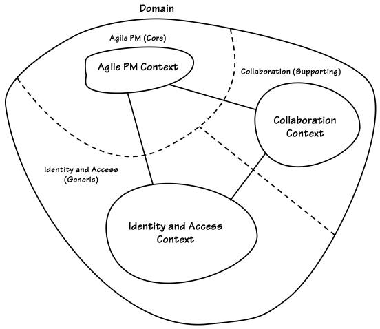

# Bölüm 2 - Domains, Subdomains and Bounded Contexts

Üç temel kavramı çok net bir şekilde anlamanız gerekecek:

-   Alanınızın (Domain) ne olduğunu,
-   Alt alanlarınızın (Subdomains) neler olduğunu,
-   Sınırlandırılmış bağlamlarınızın (Bounded Contexts) nasıl çalıştığını.

Bu kavramların [Evans] kitabının ikinci yarısında detaylı bir şekilde ele alınmış olması, onların ikinci planda olduğu anlamına gelmez. **DDD’yi başarılı bir şekilde uygulamak istiyorsanız, bu kavramları doğru bir şekilde anlamanız şarttır.**

---

> **Bu Bölümdeki Yol Haritası**
>
> - DDD’nin büyük resmini kavrayarak Alanlar, Alt Alanlar ve Sınırlandırılmış Bağlamları anlayın.
> - Stratejik tasarımın neden bu kadar önemli olduğunu ve onsuz yapılan tasarımın neden sorunlara yol açtığını öğrenin.
> - Gerçek dünyadan, birden fazla Alt Alana sahip pratik bir Alan inceleyin.
> - Bounded Context'leri hem kavramsal hem de teknik olarak anlamlandırın.
> - SaaSOvation ekibinin stratejik tasarımı keşfederken yaşadığı "aha!" anlarını görün.

## Büyük Resim

**Alan (Domain)** geniş anlamda, bir organizasyonun yaptığı işi ve bunu gerçekleştirdiği dünyayı ifade eder. İşletmeler bir pazar belirler ve ürünler veya hizmetler satar. Her organizasyonun kendine özgü bir bilgi birikimi ve iş yapma yöntemi vardır. Bu bilgi birikimi ve operasyonlarını yürütme yöntemleri, organizasyonun **alanıdır (Domain).**

Bir organizasyon için yazılım geliştirdiğinizde, **o organizasyonun alanında çalışıyorsunuz demektir.** Alanınızın ne olduğu sizin için oldukça açık olmalıdır; çünkü zaten içinde çalışıyorsunuz.

Ancak dikkat edilmesi gereken bir nokta var: "Alan" terimi bazen farklı anlamlarda kullanılabilir. Alan, hem işletmenin tamamını ifade edebilir hem de sadece belirli bir çekirdek veya destekleyici bölümü gösterebilir. Bu kitap boyunca, terimi hangi anlamda kullandığımı netleştirmeye özen göstereceğim. Eğer yalnızca işletmenin belirli bir bölümünden bahsediyorsam, genellikle **"Çekirdek Alan (Core Domain)", "Alt Alan (Subdomain)"** gibi ifadeler kullanacağım.

**Alan Modeli (Domain Model)** teriminde "alan" kelimesi geçtiği için, organizasyonun tüm iş alanını kapsayan büyük, tek bir model oluşturmamız gerektiği gibi bir izlenim edinebiliriz. Yani, bir kurumsal model (Enterprise Model) gibi düşünebiliriz. Ancak DDD'de amaç kesinlikle bu değildir. Tam tersine, DDD **büyük resmi daha küçük, yönetilebilir parçalara bölmeye odaklanır.**

Bir organizasyonun tamamı birden fazla Alt Alandan (Subdomains) oluşur. DDD ile yazılım geliştirirken, modellerimizi belirli Sınırlandırılmış Bağlamlar (Bounded Contexts) içinde oluştururuz. Aslında, Alan Modeli oluşturmak, işletmenin tamamına değil, yalnızca belirli bir kısmına odaklanmamıza yardımcı olan bir yöntemdir.

Orta veya büyük ölçekli bir işletmenin tüm iş süreçlerini tek bir modelde tanımlamaya çalışmak aşırı derecede zor olacak ve büyük olasılıkla başarısızlıkla sonuçlanacaktır. Bu bölümde de açıkça göreceğiniz gibi, **iş alanının farklı bölümlerini kesin çizgilerle ayırmak, başarıya ulaşmamız için kritik öneme sahiptir.**

***Peki, bir Alan Modeli (Domain Model) tam olarak ne olmalıdır?***

Neredeyse her yazılım alanı (Domain) birden fazla Alt Alana (Subdomains) sahiptir. Organizasyon devasa ve karmaşık da olsa, küçük ve basit de olsa, işletmenin başarılı olmasını sağlayan farklı işlevler vardır. Bu işlevleri ayrı ayrı düşünmek büyük avantaj sağlar.

### Subdomains ve Bounded Contexts at Work

Alt Alanların (Subdomains) nasıl kullanılabileceğini göstermek için oldukça basit bir örnekle başlayalım. **Çevrimiçi (online) ürün satan bir perakende şirketi düşünelim.** Şirketin sattığı ürünler herhangi bir şey olabilir, bu yüzden ürünler üzerinde çok fazla düşünmemize gerek yok. Bu alanda iş yapabilmek için şirketin yerine getirmesi gereken temel işlevler şunlardır:

- Müşterilere bir ürün kataloğu sunmak,
- Sipariş verilmesine izin vermek,
- Satılan ürünler için ödeme almak,
- Ürünleri alıcılara göndermek (sevkiyat).

Bu çevrimiçi perakendecinin **alanı (Domain)**, dört ana alt alandan (Subdomains) oluşuyor gibi görünüyor:

1.  Ürün Kataloğu (Product Catalog)
2.  Sipariş Yönetimi (Orders)
3.  Faturalandırma (Invoicing)
4.  Sevkiyat (Shipping)


**Figure 2.1:** A Domain with Subdomains and Bounded Contexts

Şimdiye kadar her şey oldukça basit görünüyor. Ancak tek bir ekstra detay eklersek, örneğimiz biraz daha karmaşık hale gelecek. **Şirketin bir de Stok Yönetimi (Inventory) ile ilgilenmesi gerektiğini düşünelim.** Bu noktada, sistemin fiziksel alt sistemleri ve mantıksal Alt Alanlarını inceleyelim.

Bu perakendecinin alanını (Domain) gerçekleştirmek için kullanılan üç fiziksel sistem mevcut ve bunlardan yalnızca ikisi şirket içinde barındırılıyor. Bu iki iç sistem, iki farklı Sınırlandırılmış Bağlam (Bounded Contexts) olarak düşünülebilir. Ancak, günümüzde çoğu sistem **DDD yaklaşımıyla tasarlanmadığı için**, tek bir sistem birçok farklı işlevden sorumlu hale gelebiliyor. Bu, yaygın ama problemli bir durumdur.

Örneğin, E-Ticaret Sınırlandırılmış Bağlamı (e-Commerce Bounded Context) içinde, birden fazla iç içe geçmiş alan modeli (Domain Model) bulunmaktadır. Ancak bu modeller temiz bir şekilde ayrılmamıştır. Aksine, tek bir yazılım modeli içinde birleştirilmişlerdir, ki bu oldukça kötü bir durumdur.

Eğer perakendeci şirket **bu E-Ticaret sistemini dışarıdan satın almış olsaydı**, bu kadar büyük bir sorun olmayabilirdi. Ancak bu sistemi bakımını üstlenen ekip, zamanla artan karmaşıklığın olumsuz etkilerini hissetmeye başlamıştır. **Ürün Kataloğu, Sipariş Yönetimi, Faturalandırma ve Sevkiyat modellerinin** tek bir büyük e-ticaret modeli içinde birleştirilmesi nedeniyle, her bir işlevin geliştirilmesi diğerlerini engellemeye başlamıştır. Özellikle de yeni bir büyük özellik eklenmek istendiğinde, mevcut modellerin birbirine olan bağımlılıkları büyük bir engel yaratacaktır.

***Neden Tek Bir Büyük Sistem Problem Yaratır?***

Ne yazık ki pek çok yazılım geliştiricisi, her şeyi tek bir sistem içine dahil etmenin akıllıca olduğunu düşünür. Bunun sonucunda "her şeyi bilen, her şeyi yapan" devasa e-ticaret sistemleri ortaya çıkar. Bu yaklaşım, her ihtiyacı karşılayabilecekmiş gibi görünebilir, ancak aslında büyük bir yanılgıdır. **Ne kadar çok işlev tek bir sisteme yığılırsa yığılsın, hiçbir zaman tüm kullanıcıların ihtiyaçlarını tam anlamıyla karşılayamaz.** Ayrıca, farklı Alt Alanlara (Subdomains) ait yazılım modellerinin birbirinden ayrılmaması, sistemin bakımını ve değişiklik yapılmasını aşırı derecede zorlaştırır. Çünkü:

- Her bileşen birbirine bağımlıdır.
- Bir yerde yapılan değişiklik, beklenmedik hatalara yol açabilir.
- Yeni özellikler eklemek giderek zorlaşır.

***DDD ile Karmaşıklığın Üstesinden Gelmek***

DDD’nin stratejik tasarım araçlarını kullanarak, bu iç içe geçmiş modelleri mantıksal olarak ayrılmış Alt Alanlara (Subdomains) bölebiliriz. Şekil 2.1’de görüldüğü gibi, **bu ayrımları kesikli çizgilerle belirtebiliriz.** Bu noktada, üçüncü taraf sistemleri temiz bir şekilde refaktör etmiş değiliz. Ancak bu sistemlerin nasıl ayrılması gerektiğini tanımladık. Böylece, **mantıksal Alt Alanları (Subdomains) belirleyerek iş süreçlerini daha iyi yönetebilir ve hangi alanların hangi fiziksel Sınırlandırılmış Bağlamlara (Bounded Contexts) bağlı olduğunu açıkça görebiliriz.**

***İşletme Açısından Bakıldığında Zorluklar***

Şimdi teknik karmaşıklıklardan **işletmenin karşılaştığı iş zorluklarına** geçelim. Bu küçük şirketin:

-  Sınırlı bütçesi var.
-  Sınırlı depo alanı var.
-  Sürekli bir dengeleme süreci içinde.

Şirket, çok fazla satmayan ürünlere aşırı harcama yapmamalıdır. Çünkü bazı ürünler belirli dönemlerde daha fazla satarken, diğer zamanlarda durgunluk gösterebilir. Eğer bazı ürünler planlandığı gibi satılmazsa, şirketin fonları müşteri talebi olmayan ürünlere bağlanmış olur ve para adeta donmuş hale gelir. Bu da şirketin, o an talep gören ürünleri stoklamak için yeterli alan bulamaması anlamına gelir.

Bu kadarla da bitmiyor. Başka bir sorun daha ortaya çıkıyor. Bazı ürünler beklenenden daha hızlı satıldığında, şirket bu ürünlerden yeterince stok yapamayabilir ve bu da müşteri taleplerini karşılamada yetersiz kalmasına neden olabilir. Yetersiz stok sorunu, müşterilerin acil olarak ihtiyaç duydukları bu ürünleri başka yerlerden temin etmelerine yol açabilir. Evet, bazı ürün toptancıları perakendeci adına doğrudan sevkiyat (drop-shipping) yapmaya isteklidir, ancak bu seçenek daha pahalıdır ve beraberinde istenmeyen başka sonuçlar da getirebilir. Bazı maliyet düşürme stratejileri, bazı ürünleri yerel olarak stoklamayı, uzak bölgelere daha iyi satılan diğer ürünleri ise doğrudan sevk etmeyi gerektirir. Bu yüzden, doğrudan sevkiyat (drop-shipping), yalnızca başarısız olmuş bir satışı kurtarmak için son anda başvurulan bir yöntem olmamalıdır.

Sonuçta, **çok satan ürünler aslında kıt olduğu için değil, perakende şirketi bunları en iyi şekilde stoklayamadığı için müşterilere hızlıca ulaştırılamıyor.** Eğer müşteriler sürekli gecikmeler yaşarsa, bu çevrimiçi satış şirketinin kazandığı rekabet avantajını kaybetmesine yol açabilir.

Ancak şunu da açıkça belirtelim: Stok yönetimiyle ilgili karşılaşılan zorlukların sınırlarını tam olarak araştırmış değiliz. Bu olumsuz durumlar yalnızca küçük ölçekli perakendeciler için geçerli değildir. Bütün perakendeciler, maliyetleri en aza indirirken stoklarını tam olarak ihtiyaçlarına uygun şekilde satın almak ve yönetmek ister. Yine de, küçük ölçekli perakendeciler, düşük performansın getirdiği dezavantajları büyük ölçekli perakendecilere kıyasla çok daha hızlı hisseder.

Herhangi bir çevrimiçi perakendeci için en büyük avantajlardan biri, gelecekteki stok ve satış taleplerini geçmiş eğilimlere göre tahmin edebilmek olurdu. Eğer bir perakendeci, **stok ve satış geçmişi verilerini işleyebilen bir tahmin motoru (forecasting engine) kullanabilseydi**, stoklarını optimize etmek için net tahminler elde edebilirdi:
- Ne zaman sipariş vermeli?
- Hangi üründen ne kadar sipariş etmeli?

Küçük bir perakendecinin böyle bir tahmin sistemini geliştirmesi muhtemelen yeni bir **"Temel Alan (Core Domain)"** oluşturmasını gerektirir. Çünkü bu, çözülmesi kolay bir problem değildir ve başarılı olunursa şirkete büyük bir rekabet avantajı kazandırabilir. Gerçekten de, Şekil 2.1'deki üçüncü fiziksel Sınırlandırılmış Bağlam (Bounded Context), harici bir **Tahminleme Sistemi**’dir **(External Forecasting System)**.

- Orders Subdomain ve Inventory Bounded Context, geçmiş ürün satışları ve iadeleri hakkında veri sağlamak için Tahminleme Sistemi ile entegre olur.
- Ayrıca, Catalog Subdomain, küresel olarak tanınan barkodları (product barcodes) sağlamalıdır.
	- Böylece, Tahminleme Sistemi, küçük ölçekli perakendecinin ürünlerini küresel satış trendleriyle karşılaştırabilir.
    - Bu da, daha geniş bir bakış açısı sunarak, en doğru stoklama miktarlarını hesaplamasına yardımcı olur.

Eğer bu yeni çözüm gerçekten bir "Temel Alan (Core Domain)" olacaksa (ki büyük olasılıkla öyledir), bu alanı geliştiren ekibin iş alanını, Alt Alanları (Subdomains) ve gerekli entegrasyonları iyi anlaması çok önemli olacaktır. Bu yüzden, Şekil 2.1’de gösterilen mevcut entegrasyonların belirlenmesi, projenin başlangıcında durumu net bir şekilde kavramak için kilit rol oynar.

Her zaman Alt Alanların (Subdomains) büyük ve işlevsel olarak kapsamlı modeller içermesi gerekmez. Bazen bir Alt Alan, yalnızca birkaç algoritmadan oluşan küçük bir sistem olabilir. Bu algoritmalar, iş çözümü açısından kritik olabilir, ancak "Temel Alan (Core Domain)" içinde yer almak zorunda değildir. İyi bir DDD yaklaşımı uygulandığında, bu tür basit Alt Alanlar, **Modüller (Modules)** kullanılarak Temel Alan’dan ayrılabilir ve ağır bir mimari bileşen içinde barındırılmak zorunda kalmaz.

DDD uygularken, her Sınırlandırılmış Bağlamın (Bounded Context), kullanılan her terimin anlamının net bir şekilde tanımlandığı yerler olmasını sağlamaya çalışırız. Bu aslında bir dil sınırıdır (linguistic boundary). Bu bağlamsal sınırlar, DDD'nin en önemli uygulama noktalarından biridir.

Tek bir Sınırlandırılmış Bağlam (Bounded Context) her zaman yalnızca tek bir Alt Alan (Subdomain) içinde yer almaz, ancak bazen alabilir. Şekil 2.1'de yalnızca bir Sınırlandırılmış Bağlamın (Inventory - Stok Yönetimi), tek bir Alt Alan içinde bulunduğunu görüyoruz. Bu durum, e-Ticaret Sistemi geliştirilirken doğru bir DDD yaklaşımının kullanılmadığını açıkça gösteriyor. Bu sistemde şu ana kadar dört farklı Alt Alan belirledik ve muhtemelen daha fazlası da var.

Öte yandan, Stok Yönetimi Sistemi (Inventory System), yalnızca ürünlerin stoklanmasını içeren bir alan olarak tek bir Alt Alan içinde sınırlandırılmış gibi görünüyor. Bunun sebebi, gerçekten DDD uygulanmış olması olabilir ya da bu sadece tesadüfi bir durum da olabilir. Kesin bir sonuca varmak için sistemin iç yapısını detaylıca incelememiz gerekir. Ancak ne olursa olsun, **Stok Yönetimi Sistemi'ni yeni Temel Alanımızı (Core Domain) geliştirmek için pratik bir şekilde kullanabiliriz.**

***Dilbilimsel Açıdan Hangi Sınırlandırılmış Bağlam Daha İyi Bir Tasarıma Sahip?***

Şekil 2.1'e baktığımızda hangi Sınırlandırılmış Bağlamın (Bounded Context) daha iyi tasarlandığını dilbilimsel açıdan değerlendirebiliriz. Örneğin, e-Ticaret Sisteminde (e-Commerce System) terimler ve anlamlar muhtemelen birbiriyle çakışmaktadır. Bunu **"Müşteri" (Customer)** terimi üzerinden inceleyelim:

- Bir kullanıcı Katalog tarayıp ürünleri incelerken, Müşteri terimi farklı bir anlam taşır.
- Aynı kullanıcı bir Sipariş oluşturduğunda ise, "Müşteri" kelimesinin anlamı değişir.

**Bunun nedeni şu:**

- Katalog içinde "Müşteri" kavramı; önceki alışverişler, sadakat programı, mevcut ürünler, indirimler ve gönderim seçenekleriyle ilişkilidir.
- Ancak, Sipariş oluştururken "Müşteri" yalnızca şu bilgileri içerir:
    -   İsim
    -   Teslimat adresi
    -   Fatura adresi
    -   Ödenecek toplam tutar
    -   Ödeme koşulları

Bu basit analiz bile, e-Ticaret Sisteminde "Müşteri" kavramının tek ve net bir anlama sahip olmadığını gösteriyor. Bu durumda, sistemi detaylı incelediğimizde benzer şekilde anlamı değişen birçok başka terim de bulmamız olasıdır. Bu, temiz ve net anlamlara sahip olmayan bir Sınırlandırılmış Bağlam örneğidir.

Bununla birlikte, **Stok Yönetimi Sistemi'nin tamamen temiz bir modele sahip olduğunun garantisi de yoktur.** Bu sistemin odaklanmış bir model gibi görünmesine rağmen stoklanan ürünlerin farklı kullanımları arasında kavramsal anlam farklılıkları olabilir. Örneğin:

- Sipariş edilen bir ürün (Ordered Item),
- Teslim alınan bir ürün (Goods Received),
- Stokta bulunan bir ürün (Stock Item),
- Stoktan çıkan bir ürün (Item Leaving Inventory),
- Bozulan veya kırılan bir ürün (Wasted Inventory Item)

bu sistemde **farklı anlamlara gelebilir.**

Şekil 2.1'e bakarak, bu kavramların nasıl modellenmiş olduğunu kesin olarak bilemeyiz. Ancak DDD uygulandığında, hiçbir şeyi varsaymak yerine her kavramın açıkça tanımlandığından emin oluruz. Alan uzmanlarının (domain experts) bu kavramları nasıl tanımladığına bağlı olarak, bazılarını farklı Sınırlandırılmış Bağlamlara ayırmamız gerekebilir.

Dışarıdan bakıldığında, **Stok Yönetimi Sistemi'nin DDD açısından daha sağlıklı bir model sunduğunu söyleyebiliriz.** Muhtemelen, bu sistemin geliştirici ekibi "Bir Ürün" (Item) kavramını, tüm stok durumlarını kapsayacak şekilde zorlamamıştır. Bu kesin olmamakla birlikte, **Stok Yönetimi Sistemi'nin e-Ticaret Sistemi'ne kıyasla entegrasyon açısından daha kolay olabileceğini gösteriyor.**

Şekil 2.1'de bir işletmedeki Sınırlandırılmış Bağlamların (Bounded Contexts) nadiren tek başına çalıştığını görüyoruz. Örneğin:

- Üçüncü taraf e-Ticaret Sistemi (Third-Party e-Commerce System),
- Stok Yönetimi Sistemi (Inventory System),
- Harici Tahminleme Sistemi (External Forecasting System),

arasında **zorunlu entegrasyon ilişkileri bulunmaktadır.** Bu farklı modellerin birlikte çalışmak zorunda olduğunu gösterir. Bütünleşik büyük bir model sunmaya çalışan üçüncü taraf e-Ticaret Sistemi bile, perakendecinin ihtiyaç duyduğu her şeyi tam olarak karşılayamaz. Şekil 2.1’de gösterilen **düz çizgiler (solid straight lines), farklı Alt Alanlar arasındaki entegrasyon ilişkilerini gösterir.**
Bu ilişkiler her zaman belirli bir entegrasyon türünü içerir ve "Bağlam Haritaları" (Context Maps) konsepti ile bu entegrasyon türlerini daha ayrıntılı olarak inceleyeceğiz.

**Bu bölümde, basit bir iş alanının (business domain) yüksek seviyeli bir özetini gördük.** Temel Alan (Core Domain) kavramıyla tanıştık. DDD’nin bu kavramı nasıl ele aldığını gördük. Şimdi, bunu daha iyi anlamamız gerekiyor.

### Çekirdek Alana Odaklanın

Alt Alanlar ve Sınırlandırılmış Bağlamlar hakkında bir anlayış geliştirdikten sonra, Şekil 2.2’de gösterilen farklı bir Alanın soyut bir görünümünü ele alalım. Bu, herhangi bir alanı temsil edebilir. Belki de sizin çalıştığınız alanı ☺. Bu kez, belirli isimleri kaldırdım, böylece boşlukları kendi zihninizde doldurabilirsiniz. Doğal olarak, iş hedeflerimiz sürekli olarak rafine edilmekte ve genişlemektedir. Bu süreç, değişen Alt Alanlara ve içlerindeki modellere yansımaktadır. Bu diyagram, yalnızca belirli bir bakış açısıyla ve belirli bir zaman diliminde iş alanının tamamını yakalıyor. Ancak, bu perspektif kısa ömürlü olabilir ve zamanla değişebilir.


**Figure 2.2:** An abstract business Domain that includes Subdomains and Bounded Contexts

---

> **Alıştırma Zamanı**
>
> - Bir sütunda, günlük işinizde farkında olduğunuz tüm Alt Alanları (Subdomains) listeleyin. Diğer sütunda ise Sınırlandırılmış Bağlamları (Bounded Contexts) listeleyin. Alt Alanlar birden fazla Sınırlandırılmış Bağlam ile kesişiyor mu? Eğer öyleyse, bu çok kötü bir şey değil, kurumsal yazılım dünyasının bir gerçeği.
> -   Şimdi, Şekil 2.2’deki şablonu kullanarak işletmenizde çalışan bazı yazılım isimlerini, Alt Alanlar, Sınırlandırılmış Bağlamlar ve bunlar arasındaki entegrasyon ilişkileriyle birlikte diyagrama ekleyin.
> > Bu zor muydu? Muhtemelen öyle, çünkü Şekil 2.2’deki şablon, Alanınızdaki mevcut sınırlarla tam olarak örtüşmüyor olabilir.
> - Tekrar başlayın. Bu kez, Alanınızı, Alt Alanlarınızı ve Sınırlandırılmış Bağlamlarınızı daha iyi yansıtacak bir diyagram çizin. Şekil 2.2’deki teknikleri kullanın**, ancak bunları kendi iş dünyanıza uygun hale getirin.
> > Elbette, işletmenizdeki tüm Alt Alanlar ve Sınırlandırılmış Bağlamlar hakkında her şeyi biliyor olmayabilirsiniz. Özellikle Alanınız büyük ve karmaşıksa.   Ancak, günlük olarak çalıştığınız bölümleri belirleyebilirsiniz.  Yanılmaktan korkmayın! Bu, “Bağlam Haritalama (Context Mapping)” pratiği yapmanız için iyi bir fırsat. Bu konu bir sonraki bölümde daha ayrıntılı ele alınacak.  Eğer oraya göz atmak isterseniz, bu da gayet iyi. Ancak şimdilik mükemmel olmaya çalışmayın—öncelikle temel fikirleri kavramaya odaklanın.

---

Şimdi Şekil 2.2’deki İş Alanı sınırının üst kısmına bakın; burada **"Çekirdek Alan" (Core Domain)** olarak etiketlenmiş bir **Alt Alan** göreceksiniz. Daha önce tanıtılan bu kavram, DDD’nin en önemli unsurlarından biridir. Çekirdek Alan, iş alanının **kuruluşun başarısı için birincil öneme sahip olan** bölümüdür. **Stratejik açıdan bakıldığında, işletmenin Çekirdek Alanında mükemmelleşmesi gerekir.** Bu alan, işletmenin sürekliliği ve başarısı için en kritik noktadır. Bu yüzden, bu projeye en yüksek öncelik verilir; **derin bilgiye sahip bir veya daha fazla alan uzmanı, en iyi geliştiriciler ve ekip için mümkün olan en fazla özgürlük ve destek sağlanır**. Bu sayede, ekip başarıya ulaşma yolunda herhangi bir engelle karşılaşmadan ilerleyebilir. DDD proje çalışmalarınızın büyük bir kısmı **Çekirdek Alana odaklanacaktır**. 

Şekil 2.2’de ayrıca **iki farklı Alt Alan türü** daha bulunur:

- Destekleyici Alt Alan (Supporting Subdomain)
- Genel Alt Alan (Generic Subdomain)

Bazı durumlarda, işletmeyi desteklemek amacıyla **sınırlı bir bağlam (Bounded Context)** oluşturulur veya dışarıdan temin edilir. Eğer bu bağlam, işletme için temel olmasa da önemli bir süreci modelliyorsa, buna **Destekleyici Alt Alan (Supporting Subdomain)** denir. İşletme, özelleştirilmiş bir ihtiyacı karşılamak için Destekleyici Alt Alan oluşturur. 

Öte yandan, eğer bir Alt Alan işletme için herhangi bir özel katma değer sağlamıyor ancak genel işleyişin bir parçası olarak gereklilik arz ediyorsa, buna **Generic Subdomain** denir.

Bir Alt Alanın **Supporting veya Generic olması, onun önemsiz olduğu anlamına gelmez**. Bu Alt Alanlar da işletmenin başarısı için kritik olabilir. Ancak işletmenin bu alanlarda mükemmelleşmesine gerek yoktur. Asıl mükemmeliyet Çekirdek Alanda sağlanmalıdır, çünkü işletmeye özgü rekabet avantajını sunan alan burasıdır.

---

> **Alıştırma Zamanı**
> - Çekirdek Alan kavramlarının önemini tam olarak kavrayıp kavramadığınızı anlamak için, yeni oluşturduğunuz beyaz tahta çiziminize geri dönün ve organizasyonunuzda hangi alanların Çekirdek Alan olarak geliştirildiğini belirlemeye çalışın.
> - Ardından, iş alanınızda Destekleyici Alt Alanlar ve Genel Alt Alanları belirlemeye çalışın.

---

> **Unutmayın: Alan Uzmanlarına Sorun!**  
İlk seferde tam olarak doğru yapmasanız da, bu alıştırma yazılımınızın işinizi en çok nasıl ayırt ettiğini, ayırt edici yazılımı neyin desteklediğini ve işinizin başarısı için hiçbir şekilde ayırt edici olmayan yazılımı dikkatlice düşünmenize yardımcı olacaktır. Bu süreç üzerinde çalışmaya devam edin, böylece düşünme süreçleri ve teknikler konusunda daha rahat hale gelirsiniz.  
Çiziminizdeki her bir Alt Alan ve Bağlantılı Bağlamı, farklı alanlarda uzmanlaşmış birkaç alan uzmanıyla tartışın.  
Sadece onlardan çok şey öğreneceksiniz, aynı zamanda uzmanları dinleme konusunda değerli deneyimler kazanacaksınız. Bu, DDD’yi iyi bir şekilde uygulamanın bir özelliğidir.

---

Az önce öğrendikleriniz stratejik tasarımın büyük resim temelidir.

## Stratejik Tasarımın Neden Bu Kadar Önemli Olduğu

Tamam, şimdiye kadar bazı DDD terimlerini ve bunların anlamlarını öğrendiniz, ancak bunun neden bu kadar önemli olduğu hakkında pek bir şey söylemedik. Aslında sadece bunun çok önemli olduğunu iddia ettim ve bana inanmanızı umdum. Ancak çoğu “gerçek” beyanında olduğu gibi, şimdi bu iddiamı desteklemeliyim. Hadi, SaaSOvation’da yürütülen projeler üzerinden devam eden örneğimize dönelim. Oradaki ekip gerçekten zor bir duruma düşmüş durumda.

---

DDD ile ilgili ilk çalışmalarına başladıklarında, iş birliği projesi ekibi temiz bir model geliştirme yolundan sapmaya başladı. Bunun nedeni, en temel seviyede bile stratejik tasarımı anlamamış olmalarıydı. Çoğu geliştirici gibi onların da odağı **Varlıklar (Entities)** ve **Değer Nesneleri (Value Objects)** gibi detaylardaydı. Bu durum, daha büyük resmi görmelerini engelledi. Çekirdek kavramları ile genel kavramları birbirine karıştırarak tek bir model yerine iki modeli bir arada oluşturdular. Çok geçmeden, **Şekil 2.3'te gösterilen tasarımın neden olduğu sorunları hissetmeye başladılar.** Sonuç olarak, DDD’yi tam anlamıyla uygulama hedeflerine ulaşamamışlardı.


**Figure 2.3:** Ekip temel stratejik tasarımı anlamamış, bu da işbirliği modelinde uyumsuz kavramlara yol açmıştır. Çizgiler sorunlu unsurları çevrelemektedir.

SaaSOvation ekibindeki birkaç kişi, **“Peki, iş birliği kavramlarının Kullanıcılar ve İzinler ile sıkı sıkıya bağlı olması neden bu kadar önemli? Sonuçta, kimin ne yaptığını takip etmeliyiz!”** diye savundu. Ancak kıdemli geliştirici ekibe, **sorunun yalnızca bağımlılık olmadığını** açıkladı:

> Sonuçta bir Forum, bir Gönderi, bir Tartışma, bir Takvim ve bir Takvim Girdisi her halükarda bir insan iş birlikçi nesnesine bağlı olacak. İşte asıl sorun burada. Dilbilimsel olarak bu yaklaşım hatalı.

Daha detaylı açıklamalar yaparak ekibe, Forum, Gönderi, Tartışma gibi kavramların yanlış dilbilimsel terimlerle ilişkilendirildiğini gösterdi. Kullanıcılar (Users) ve İzinler (Permissions), iş birliği (collaboration) ile ilgili değildir ve gerçek "Ortak Dil" (Ubiquitous Language) ile uyumlu değildir. Kullanıcılar ve İzinler aslında **kimlik ve erişim yönetimi (security)** ile ilgili kavramlardır.

> İş birliği bağlamında modellenen her kavramın, iş birliğiyle doğrudan ilişkili bir dilbilimsel bağlantısı olmalıdır. Şu anda ise bu bağlantı eksik. Asıl odaklanmamız gereken kavramlar ‘Yazar (Author)’ ve ‘Moderatör (Moderator)’ gibi iş birliği ile ilgili terimler olmalıdır. İş birliği bağlamında doğru olan kavramlar bunlardır.

> **Sınırlandırılmış Bağlamı (Bounded Context) Adlandırma**
>
> Burada **Collaboration Context** adının kullanıldığını fark ettiniz mi? Sınırlandırılmış Bağlamlar bu > şekilde adlandırılır: **Model-Adı Bağlamı (Name-of-Model Context).** Bu durumda, İş Birliği Projesi’nin alan modelini içeren Sınırlandırılmış Bağlam olduğu için "Collaboration Context" adını kullanıyoruz. Benzer şekilde, **Kimlik ve Erişim (Identity and Access)** projesinin modelini içeren Sınırlandırılmış Bağlam için **Identity and Access Context** adını kullanıyoruz. Aynı şekilde, **Çevik Proje Yönetimi (Agile Project Management - PM)** projesinin modelini içeren Sınırlandırılmış Bağlam için de **Agile PM Context** adını veriyoruz.

SaaSOvation geliştiricileri, en temel düzeyde **Kullanıcılar (Users) ve İzinlerin (Permissions), iş birliği (collaboration) araçlarıyla doğrudan ilgili olmadığını başlangıçta anlayamamışlardı.** Evet, yazılımlarını kullanan kullanıcılar vardı ve bu kullanıcıların kimliklerinin belirlenmesi, hangi görevleri yerine getirebileceklerinin tespit edilmesi gerekiyordu. Ancak, iş birliği araçlarının **odaklanması gereken şey, kullanıcıların kim oldukları değil, onların rolleriydi.** Her kullanıcının hangi küçük eylemleri gerçekleştirebileceği ile ilgilenmemeliydi.

Ancak, **mevcut iş birliği modeli kullanıcı ve izin detaylarıyla tamamen iç içe geçmişti.** Kullanıcıların veya izinlerin işleyişinde bir değişiklik olması durumunda, **modelin büyük bir kısmı bundan olumsuz etkilenecekti.** Aslında, bu problem çoktan belirginleşmişti. Ekip, izinler tabanlı bir yaklaşım yerine rol tabanlı erişim yönetimine geçmek istiyordu. Bu değişikliği yapmaya karar verdiklerinde, ellerindeki stratejik modelleme sorununun farkına daha fazla vardılar.

Artık, bir Forum'un kimlerin bir konu açabileceğiyle veya bunun hangi koşullarda izin verildiğiyle ilgilenmemesi gerektiğini anladılar. Forum'un sadece bir Yazar’ın (Author) şu anda bir konu açtığını ya da daha önce açtığını bilmesi yeterliydi. Ekip, **kimlerin hangi işlemleri yapabileceğini belirlemenin tamamen farklı bir modelin sorumluluğu olduğunu** ve temel iş birliği modelinin yalnızca, bu soruların çoktan cevaplanmış olduğunu bilmesi gerektiğini kavramaya başladı. Böylece, Forum'un sadece bir Tartışmaya (Discussion) gönderi paylaşmak isteyen bir Yazar ile ilgilenmesi gerektiği ortaya çıktı. Forum ve Yazar, iş birliği modelinin Ortak Dil’ine (Ubiquitous Language) ait kavramlardır ve Collaboration Context adlı Sınırlandırılmış Bağlam'ın (Bounded Context) bir parçasıdır. **Kullanıcı ve İzin (ya da benzer şekilde Rol gibi kavramlar) tamamen farklı bir yere ait olmalı** ve **İş Birliği Bağlamı’ndan izole edilmelidir.**

Ekip, yalnızca Kullanıcı ve İzin kavramlarına olan sıkı bağımlılığı ortadan kaldırmaları gerektiğini düşünebilirdi. Kullanıcı ve İzin/Rol'ü **ayrı bir Modül’e** çıkarmakta yanlış bir şey yoktu. Bu yaklaşım, bu kavramları **aynı Sınırlandırılmış Bağlam içinde, ayrı bir Güvenlik Alt Alanına (Security Subdomain) yerleştirmelerine yardımcı olabilirdi.** Ancak, en iyi modelleme seçeneğini daha belirgin hale getiren şey, ekibin bir sonraki Çekirdek Alan (Core Domain) projesinin de benzer rol tabanlı erişim ihtiyaçlarına sahip olacağıydı. Üstelik, bu proje alanına özgü (domain-specific) rol özelliklerine dayanacaktı. Bu durum, Kullanıcılar ve Roller'in aslında Destekleyici (Supporting) veya Genel (Generic) bir Alt Alan’ın parçası olduğunu ve gelecekte tüm şirket genelinde hatta müşteri odaklı bir rol oynayabileceğini gösterdi.

Daha titiz bir modelleme yaklaşımı benimsemek, daha büyük bir sorundan kaçınmalarına yardımcı olacaktı. Çünkü ekip, farkında olmadan **"Big Ball of Mud" (Büyük Çamur Yumağı)** adı verilen **karmakarışık, düzensiz bir yapıya doğru ilerliyordu.** Buradaki asıl sorun, yalnızca Kullanıcı ve İzin kavramlarının düzgün şekilde modüler hale getirilmemesi değildi. Modülerleştirme, **DDD modelleme için önemli bir araç olsa da, dilbilimsel uyumsuzluğu (linguistic misalignment) tek başına çözmez.**

Kıdemli geliştirici, bu durumun kontrol edilmezse disiplinli bir düşünme biçimini kaybetmelerine yol açabileceği konusunda endişeliydi. Eğer ekip, ileride iş birliğiyle ilgisi olmayan başka bir alanı modellemek zorunda kalırsa, Çekirdek Alan (Core Domain) giderek daha belirsiz hale gelebilirdi. Sonunda, yalnızca kaynak kod içinde var olan, açıkça tanımlanmamış, zayıf bir model ortaya çıkabilirdi ve bu model, İş Birliği’nin Ortak Dil’ini yansıtmaktan uzak olurdu. Ekip için **gerçekten gerekli olan şey, iş alanlarını (business Domain), Alt Alanlarını (Subdomains) ve geliştirdikleri Sınırlandırılmış Bağlamları (Bounded Contexts) net bir şekilde anlamaktı.** Bunu başarmak, stratejik tasarımın en büyük düşmanı olan "Big Ball of Mud" bataklığına sürüklenmelerini engelleyecekti. Bu nedenle, ekip **stratejik modelleme zihniyetini** kazanmalıydı.

> **Ah, Hayır! Yine Tasarım Kelimesi Karşımıza Çıktı!**
>
> Eğer **tasarım** kelimesinin, çevik (agile) yöntemler kullanılırken kötü bir şey olduğunu düşünüyorsanız, DDD için durum böyle değil. DDD'yi çevik yöntemlerle birlikte kullanmak son derece doğaldır. Tasarımı her zaman çevikle denge içinde tutun. Tasarımın **ağır bir süreç olması gerekmez.**

Evet, bu önemli bir ders oldu. Ekip, **çok fazla araştırma yaparak** ve **sürecin içinde deneyim kazanarak** bu sorunun üstesinden gelmeyi başardı. Sonunda **Alanlarını (Domain) ve Alt Alanlarını (Subdomains) kavramayı başardılar.** Bunu nasıl yaptıkları birazdan anlatılacak...

---

> **DDD Topluluğu ile Uyum**
>
> Bu kitaptaki örnekler, **üç farklı Sınırlandırılmış Bağlam (Bounded Context)** üzerinden anlatılmaktadır. Bu bağlamlar, sizin çalıştıklarınızdan farklı olabilir. Ancak, sunulan örnekler genellikle karşılaşılan modelleme senaryolarını temsil etmektedir. Herkes, Kullanıcılar (Users) ve Yetkilendirme (Permissions) kavramlarının bir Çekirdek Alan’dan (Core Domain) ayrılması gerektiği konusunda hemfikir olmayabilir. Bazı durumlarda, bunları çekirdek model ile iç içe geçirmek mantıklı olabilir. Sonuçta, bu karar her ekibin kendisine aittir. Ancak, **benim deneyimime göre**, DDD'ye yeni başlayan ekiplerin sık yaptığı temel hatalardan biri de **bu ayrımı yapmamalarıdır.** Bu da genellikle **karmaşık ve düzensiz bir sonuç doğurur.** Bir diğer yaygın hata, **iş birliği (collaboration) ve çevik proje yönetimi (agile project management) modellerini tek bir model içinde birleştirmektir.** Bunlar yalnızca yaygın hatalardan birkaçıdır. Bunların dışında yapılan modelleme hataları da kitabın ilerleyen bölümlerinde ele alınacaktır.
>
> En azından, burada ve ilerleyen bölümlerde ele alınan hatalar, DDD’nin dilsel yönlendiricilerini (linguistic drivers) ve Sınırlandırılmış Bağlamları anlamayan ekiplerin yaptığı tipik modelleme hatalarını temsil etmektedir. Dolayısıyla, verilen örneklere tamamen katılmasanız bile, sorunlar ve çözümler tüm DDD projelerine genel olarak uygulanabilir. Çünkü bu yaklaşım, belirli bir Sınırlandırılmış Bağlam içindeki dilbilimsel (linguistic) kurallara odaklanmaktadır.
>
> Amacım, DDD’yi uygulamak için en basit, ancak anlamlı örnekleri kullanarak temel ilkeleri öğretmektir. Örneklerin, öğretim sürecinin önüne geçmesine izin veremem. Eğer kimlik ve erişim yönetimi (identity and access management), iş birliği (collaboration) ve çevik proje yönetimi (agile project management) modellerinin ayrı dilbilimlere sahip olduğunu gösterebilirsem, bu örnekler okuyucular için önemli bir rehber olacaktır. Her ekip, **alan uzmanlarının (domain experts) vizyonuna uygun olarak kendi dilsel yönlendiricilerini keşfetmekle sorumludur.** Bu nedenle, SaaSOvation ekibinin modelleme seçimlerinin ve vardıkları nihai sonuçların kesin doğru olduğunu varsayabilirsiniz.
> 
> Benim **Alt Alanlar (Subdomains) ve Sınırlandırılmış Bağlamlar (Bounded Contexts) hakkındaki tüm rehberliğim, DDD topluluğunun genel yaklaşımı ile uyumludur** ve kendi deneyimlerime dayanmaktadır. Diğer DDD liderleri farklı odak noktalarına sahip olabilir. Ancak, benim açıklamalarım, herhangi bir ekibin açık bir yönlendirme ile ilerlemesini sağlayacak sağlam bir temel sunmaktadır. DDD'nin belirsiz görünen yönlerini netleştirmek, topluluk için en önemli hizmettir ve benim de birincil hedefimdir. Sizin amacınız da bu yönergeleri projenizde en pratik şekilde uygulamak ve en iyi şekilde faydalanmak olmalıdır.

## Gerçek Dünya Alanları (Domains) ve Alt Alanlar (Subdomains)

Size alanlar (domains) hakkında biraz daha fazla bilgi vermek istiyorum. Bir alanın hem bir ***problem alanı (problem space)*** hem de bir ***çözüm alanı (solution space)*** vardır. Problem alanı, çözüme kavuşturulması gereken stratejik bir iş problemini düşünmemizi sağlar. Çözüm alanı ise, bu iş problemini çözmek için yazılımı nasıl uygulayacağımıza odaklanır. Şimdiye kadar öğrendiğiniz bilgilerle bu kavramları şu şekilde ilişkilendirebiliriz:

- Problem alanı, yeni bir **Çekirdek Alan (Core Domain)** oluşturmak için geliştirilmesi gereken alan parçalarından oluşur. Problem alanını değerlendirirken mevcut Alt Alanlar (Subdomains) ve ihtiyaç duyulan yeni Alt Alanlar incelenir. Bu nedenle problem alanı, Çekirdek Alan ile onun kullanması gereken Alt Alanların birleşimidir. Alt Alanlar, genellikle her projede farklılık gösterir, çünkü her stratejik iş problemi farklı bir analiz gerektirir. Alt Alanlar, problem alanını değerlendirmek için oldukça kullanışlı araçlardır. Belirli bir problemi çözmek için gereken alanın farklı parçalarını hızlı bir şekilde görmemizi sağlarlar.
- Çözüm alanı ise **bir veya daha fazla Sınırlandırılmış Bağlamdan (Bounded Contexts) oluşan** bir yazılım modelidir. Sınırlandırılmış Bağlam, belirli bir çözümü somutlaştıran yazılımın bir görünümüdür (realization view). Çözüm, yazılım olarak geliştirildiğinde, bu bağlam içinde gerçekleştirilir.

**İdeal olarak, Alt Alanların birebir Sınırlandırılmış Bağlamlarla eşleşmesi hedeflenmelidir.** Bu yaklaşım, alan modellerini iş hedeflerine göre iyi tanımlanmış bölgelere ayırarak problem alanını çözüm alanı ile uyumlu hale getirir. Ancak, pratikte her zaman bu mümkün olmayabilir. **Yeni (greenfield)** projelerde bu yaklaşım uygulanabilir olsa da, **eski (legacy)** sistemlerde veya "Büyük Çamur Yumağı (Big Ball of Mud)" tarzı sistemlerde Alt Alanlar genellikle birden fazla Sınırlandırılmış Bağlam ile kesişir. Bu tür büyük ve karmaşık sistemlerde, problem alanını anlamak için bir **değerlendirme görünümü (assessment view) kullanabiliriz.** Bu, bizi maliyetli hatalardan kurtarabilir. Bir Sınırlandırılmış Bağlamı kavramsal olarak iki veya daha fazla Alt Alan’a bölebiliriz.
Ayrıca tek bir Alt Alanın birden fazla Sınırlandırılmış Bağlam içerdiği durumlarla da karşılaşabiliriz.

***Bunu daha iyi anlamak için bir örnek düşünelim:***

Bir **ERP (Kurumsal Kaynak Planlama) sistemi** olan büyük bir monolitik uygulamayı ele alalım. Katı bir tanımlamayla bakıldığında, bir ERP tek bir Sınırlandırılmış Bağlam olarak düşünülebilir. Ancak, ERP sistemleri birçok modüler iş hizmeti sunduğu için, farklı modülleri farklı Alt Alanlar olarak ele almak mantıklıdır. Örneğin:

- Envanter modülü (inventory module) ve Satın alma modülü (purchasing module)

iki ayrı, mantıksal Alt Alan olarak ayrılabilir. Bu iki modül tamamen farklı sistemler aracılığıyla sunulmasa da, iş alanı açısından çok farklı hizmetler sundukları için Alt Alan olarak adlandırılmaları faydalıdır. Şimdi neden bu ayrımın önemli olduğunu görelim:

Bir kuruluş, iş maliyetlerini azaltmak için yeni bir Çekirdek Alan modeli tasarlamayı ve geliştirmeyi planlıyor.

- Bu model, satın alma görevlilerinin kullanabileceği karar destek araçları sunacak.
- Yıllar içinde manuel olarak yürütülen işlemler, artık yazılım tarafından otomatikleştirilecek.
- Böylece tüm satın alma görevlileri, hatasız ve daha verimli bir şekilde karar alabilecek.
- Bu yeni Çekirdek Alan, kuruluşun daha rekabetçi olmasını sağlayacak.
- Daha iyi anlaşmaların hızla tespit edilmesine ve gerekli envanterin sağlanmasına yardımcı olacak.

Ayrıca, doğru envanter stoklamayı sağlamak için, daha önce incelenen **Tahminleme Sistemi (Forecasting System)** gibi bir bileşenin de kullanılması gerekecek.


**Figure 2.4:** Satın alma ve envanterle ilgili Çekirdek Alan ve diğer Alt Alanlar. Bu bakış açısı, tüm Alanı (Domain) değil, belirli bir problem alanı analizinde kullanılan seçili Alt Alanları kapsar.

Belirli bir çözümü uygulamadan önce, problem alanı (problem space) ve çözüm alanı (solution space) değerlendirmesi yapmamız gerekir. Projeyi doğru yöne yönlendirmek için aşağıdaki soruların yanıtlanması gerekir:

- Stratejik Çekirdek Alanın (Core Domain) adı ve vizyonu nedir?
- Stratejik Çekirdek Alanın bir parçası olarak hangi kavramlar ele alınmalıdır?
- Gerekli Supporting Subdomains ve Generic Subdomains nelerdir?
- Alan içindeki her bölümde çalışacak kişiler kimlerdir?
- Doğru ekipler oluşturulabilir mi?

Eğer Çekirdek Alanın vizyonunu ve hedeflerini, ayrıca onu destekleyecek alanları tam olarak anlayamazsak, bunlardan stratejik olarak faydalanamayız ve beraberinde gelen riskleri yönetemeyiz. Problem alanı değerlendirmesini üst düzeyde tutun, ancak kapsamlı yapın. Tüm paydaşların vizyonu başarıyla hayata geçirme konusunda uyumlu ve kararlı olduğundan emin olun.

> ***Alıştırma Zamanı***
>
> Beyaz tahtanızdaki çalışmalara bir göz atın ve şunu düşünün: Sizin problem alanınız nedir?  
Unutmayın, problem alanı stratejik Çekirdek Alan ve onu destekleyen Alt Alanların birleşimidir.

Problem alanını iyi anladıktan sonra çözüm alanına geçilir. İlk değerlendirme, ikinci değerlendirmeye bilgi sağlayacaktır. Çözüm alanı, mevcut sistemler ve teknolojiler ile yeni oluşturulacak olanlardan güçlü bir şekilde etkilenecektir. Burada, her bir Bağlı Bağlamın (Bounded Context) Kapsayıcı Dilini (Ubiquitous Language) dikkate alarak temizce ayrılmış olup olmadığını düşünmemiz gerekir.  
Aşağıdaki kritik sorulara yanıt arayın:

- Hangi yazılım varlıkları halihazırda mevcut ve yeniden kullanılabilir?
- Hangi varlıkların edinilmesi veya oluşturulması gerekiyor?
- Bunların tümü birbirine nasıl bağlanıyor veya entegre ediliyor?
- Ek entegrasyon ihtiyacı var mı?
- Mevcut varlıklar ve oluşturulması gerekenler göz önüne alındığında, gerekli çaba nedir?
- Stratejik girişim ve tüm destekleyici projeler yüksek başarı olasılığına sahip mi, yoksa herhangi biri genel programın gecikmesine veya başarısız olmasına neden olabilir mi?
- Bağlı Bağlamlar arasında tamamen farklı olan Kapsayıcı Dil (Ubiquitous Language) terimleri nerede bulunuyor?
- Bağlı Bağlamlar arasında kavramların ve verilerin paylaşımı ve örtüşmesi nerede meydana geliyor?
- Paylaşılan terimler ve/veya örtüşen kavramlar Bağlı Bağlamlar arasında nasıl eşleştirilip çevriliyor?
- Çekirdek Alanı ele alan kavramlar hangi Bağlı Bağlam içinde yer alıyor ve [Evans]’ın hangi taktiksel desenleri modellemede kullanılacak?

Unutmayın, **Çekirdek Alandaki çözümleri geliştirmeye yönelik çabalar, temel bir iş yatırımıdır!**

Önceden açıklanan ve Şekil 2.4’te gösterilen özel satın alma modeli—karar verme araçlarını ve algoritmaları içeren model—Çekirdek Alan için bir çözümü temsil eder.   Bu alan, **Optimal Satın Alma Bağlamı (Optimal Acquisitions Context)** adı verilen belirli bir Bağlı Bağlam içinde uygulanacaktır. Bu Bağlı Bağlam, **Optimal Satın Alma Çekirdek Alanı** ile bire bir hizalanacaktır.
Sadece tek bir Alt Alan ile uyumlu olması ve dikkatlice tasarlanmış bir alan modeli içermesi, bu Bağlı Bağlamı iş alanındaki en iyi modellerden biri yapacaktır.

Ayrıca, **Satın Alma Bağlamı (Purchasing Context)** adı verilen bir başka Bağlı Bağlam geliştirilecektir. Bu bağlam, Optimal Satın Alma Bağlamına bir yardımcı olarak, satın alma sürecinin bazı teknik yönlerini iyileştirmek amacıyla oluşturulacaktır. Ancak, bu iyileştirmeler satın alma konusunda özel bir bilgi içermeyecektir. Bunun yerine, Optimal Satın Alma Bağlamının ERP ile etkileşimde bulunmasını kolaylaştıracak bir model sunacaktır. Bu yeni **Satın Alma Bağlamı ve mevcut ERP satın alma modülü, Satın Alma (Purchasing) Destekleyici Alt Alanı içinde yer alacaktır.**

ERP satın alma modülü **Genel bir Alt Alan (Generic Subdomain) olarak sınıflandırılır.** Çünkü **bu Alt Alan, temel iş gereksinimlerini karşılayan herhangi bir hazır satın alma sistemiyle değiştirilebilir.**  Bununla beraber, Satın Alma Bağlamı (Purchasing Context) ile birlikte kullanılması onu Destekleyici bir Alt Alan (Supporting Subdomain) olarak konumlandırır.

> **Kötü Yazılım Tasarımı Dünyasını Değiştiremezsiniz**
>
> Tipik bir **brownfield** (mevcut sistem üzerine inşa edilen) kurumsal yapıda, Şekil 2.1 ve Şekil 2.4’te gösterilen olumsuz durumlarla karşılaşmanız kaçınılmazdır. Bu, kötü tasarlanmış yazılımlardaki Alt Alanların (Subdomains), ideal bir şekilde Bağlı Bağlamlarla (Bounded Contexts) bire bir hizalanmayacağı anlamına gelir. Kötü yazılım tasarımı dünyasını değiştiremezsiniz. Ancak, çalıştığınız projelerde doğru DDD uygulamalarını hayata geçirebilirsiniz. Sonuç olarak, brownfield alanlarla entegre olmanız ve hatta bu alanlarda çalışmanız gerekecektir. Bu yüzden, bu bölümün ilk üçte birlik kısmında öğretilen teknikleri uygulamaya hazır olun. Bunu yaparken, tek bir düzensiz Bağlı Bağlam içinde birden fazla örtük modeli analiz etmek zorunda kalacağınızı unutmayın.

Şekil 2.4’e Bağlı Kalarak **Optimal Alım Bağlamı (Optimal Acquisition Context)**, aynı zamanda **Envanter Bağlamı (Inventory Context)** ile de etkileşim kurmalıdır. Envanter, depolama öğelerini yönetir ve ERP envanter modülünü kullanır. Bu modül, **Envanter (Destekleyici) Alt Alanı (Inventory Supporting Subdomain)** içinde yer alır. Teslimat yüklenicilerine kolaylık sağlamak amacıyla, Envanter Bağlamı, coğrafi haritalama hizmeti kullanarak her deposuna giden yol tariflerini sunabilir.
Ancak, Envanter Bağlamı açısından bakıldığında, haritalamanın özel bir yönü yoktur. Piyasada birden fazla coğrafi haritalama hizmeti bulunmaktadır ve zaman içinde farklı bir haritalama sistemine geçmenin avantajları olabilir.

Çözüm alanı (solution space) açısından bakıldığında, coğrafi haritalama hizmeti Envanter Bağlamının bir parçası değildir, ancak problem alanında (problem space) Envanter Alt Alanına dahil edilir. Çözüm alanında, haritalama hizmeti basit bir bileşen tabanlı API olarak sağlansa bile farklı bir Bağlı Bağlam (Bounded Context) içinde yer alır. Envanter ve Haritalama Ubiquitous Dilleri birbirinden tamamen farklıdır. Bu, onların farklı Bağlı Bağlamlara ait olduğunu gösterir. Envanter Bağlamı, Haritalama Bağlamından (Mapping Context) bir bileşen kullanırken, verilerin uygun şekilde tüketilebilmesi için en azından temel bir çeviri işleminden geçmesi gerekebilir.

Öte yandan, haritalama hizmetini geliştiren ve abonelik modeliyle sunan harici iş organizasyonu açısından bakıldığında, haritalama bir Çekirdek Alan’dır (Core Domain). Bu harici organizasyon, kendi iş alanına ve operasyonlarına sahiptir. Rekabetçi kalabilmek için sürekli olarak alan modelini iyileştirmek zorundadır. Mevcut abonelerini elde tutmak ve yenilerini çekmek için hizmetlerini geliştirmelidir. Eğer bu haritalama organizasyonunun CEO’su siz olsaydınız, müşterilerin başka bir hizmet sağlayıcısına geçmek yerine sizin hizmetinizde kalmasını sağlamak için her türlü stratejiyi uygulardınız. Ancak, bu perspektif, haritalama hizmetini kullanan envanter sisteminin bakış açısını değiştirmez. **Envanter sistemi için haritalama hala bir Genel Alt Alan’dır (Generic Subdomain).**  
Eğer avantajına olursa, farklı bir haritalama hizmetine abone olmayı seçebilir.

> ***Alıştırma Zamanı***
> 
> Çözüm alanınızdaki Bounded Context'ler nelerdir? Bu noktada, beyaz tahtadaki diyagramınıza bakarak iyi bir fikre sahip olmalısınız. Yine de, Bounded Context'leri doğru şekilde kullanma konusunda daha derinlemesine inceleme yaptıkça biraz şaşırabilirsiniz. Bu yüzden, olası düzeltmeler için hazır olun. Sonuçta, **çevik (agile) geliştirme** yapıyoruz.

Bu bölümün geri kalan kısmında, Bounded Context'lerin, DDD için temel bir çözüm alanı modelleme aracı olarak önemini ele alacağız. Context Maps (Bağlam Haritaları) başlığında, farklı ama ilişkili Ubiquitous Dillerin (Universal Diller) haritalanması ve Bounded Context'lerin entegrasyonu konusunun önemi üzerinde durulacaktır.

## Bounded Contextleri Anlamlandırma

Unutmayın, Bounded Context (Sınırlı Bağlam), bir domain modelinin var olduğu **açık bir sınırdır**. Bu domain modeli, Ubiquitous Language’i (Evrensel Dil) bir yazılım modeli olarak ifade eder. Sınırın belirlenme sebebi, içerideki her kavramın, özelliklerin ve işlemlerin özel bir anlama sahip olmasıdır. Eğer böyle bir modelleme ekibinin üyesi olsaydınız, Context’inizdeki her kavramın ne anlama geldiğini tam olarak bilirdiniz.

> ***Bounded Context: Açık ve Dil Odaklıdır***
>
> Bir Bounded Context, bir domain modelinin var olduğu açık bir sınırdır. Bu sınırın içinde, Ubiquitous Language’in tüm terimleri ve ifadeleri kesin ve belirli bir anlama sahiptir. Model, bu dili tam doğrulukla yansıtacak şekilde oluşturulur.

Genellikle, iki farklı modelde aynı veya benzer isimlere sahip nesneler farklı anlamlara gelir. Her bir modelin çevresine açık bir sınır yerleştirildiğinde, her bir bağlamdaki kavramların anlamları netleşir. Bu yüzden, **Bounded Context** esas olarak **dilsel bir sınırdır**. Bounded Contextleri doğru şekilde kullanıp kullanmadığınızı belirlemek için bu mantıksal çıkarımları bir referans noktası olarak kullanmalısınız.

Bazı projeler, **tüm organizasyon için kapsayıcı bir model oluşturma tuzağına** düşer. Bu yaklaşımda, her kavramın tek ve evrensel bir anlama sahip olması için tüm paydaşların mutabakata varması amaçlanır. Ancak bu **yanıltıcı bir yaklaşımdır.** Öncelikle, tüm paydaşların tüm kavramlar için tek ve saf bir küresel anlam üzerinde anlaşmasını sağlamak neredeyse imkânsızdır. Büyük ve karmaşık organizasyonlarda, tüm paydaşları bir araya getirmek bile mümkün olmayabilir, kaldı ki herkesin aynı kavramlar üzerinde tam bir mutabakata varmasını beklemek gerçekçi değildir. Küçük ölçekli bir şirkette dahi, tek bir küresel kavram tanımı oluşturmak ve bunun kalıcılığını sağlamak genellikle başarısız olur. Bu nedenle, en iyi strateji, farklılıkların her zaman var olduğunu kabul etmek ve Bounded Context kullanarak her domain modelini bu farklılıkları net bir şekilde tanımlayacak şekilde ayrıştırmaktır.

Bir Bounded Context, tek tip bir **proje çıktısının (artifact)** oluşturulmasını zorunlu kılmaz. Bir bileşen, belge veya diyagram değildir. Yani, bir JAR dosyası ya da DLL olarak tanımlanmaz, ancak ilerleyen bölümlerde anlatılacağı gibi Bounded Context'leri dağıtmak için bu tür bileşenler kullanılabilir.

Örneğin, bir Bankacılık Bağlamındaki **Account** ile bir Edebiyat Bağlamındaki **Account** kavramı birbirinden tamamen farklıdır. Her iki bağlam için ortak bir tanım oluşturmaya çalışmak yanlış olur. Bunun yerine, **her bağlamı kendi Bounded Context’i içinde ele almak** en doğru yaklaşımdır.

| Bağlam | Anlam | Örnek |
|  --------  |  -------  | ------- |
| Bankacılık | Bir Hesap, bir müşterinin bankadaki mevcut mali durumunu gösteren borç ve alacak işlemlerinin kaydını tutar. | Çek Hesabı ve Tasarruf Hesabı |
| Edebiyat | Bir Hesap, belirli bir zaman aralığında bir veya daha fazla ilgili olay hakkında bir dizi edebi ifadedir. | Amazon.com kitap satıyor _Into Thin Air: A Personal Account of the Mt. Everest Disaster_ |

Şekil 2.5’e baktığımızda, "Account" türlerinin adları açısından onları ayırt eden belirgin bir özellik olmadığını görüyoruz. Ancak her bir **kavramsal konteynerin**—yani Bounded Context’in—adına bakarak farkları anlayabiliriz.

Bu iki Bounded Context muhtemelen aynı Domain (Alan) içinde yer almıyor. Burada önemli olan, **bağlamın (Context) her şeyden üstün olduğu gerçeğini vurgulamaktır**.

> ***Bağlam Her Şeydir***
>
> Özellikle DDD uygularken bağlam en kritik unsurdur. Finans dünyasında "security" (menkul kıymet) kelimesi sıkça kullanılır. Örneğin, _Securities and Exchange Commission (SEC)_, "security" terimini yalnızca hisse senetleri gibi finansal varlıklar için kullanır. _Vadeli işlemler (Futures Contracts)_ ise emtia (commodity) olarak kabul edilir ve SEC’in yetki alanına girmez. Ancak bazı finansal firmalar, vadeli işlemleri (Futures) "security" olarak adlandırabilir ve bunları Standart Tür (6) Vadeli İşlemler olarak etiketleyebilir.
> Bu terimlendirme ideal mi? **Cevap: Kullandığınız Domain’e bağlıdır.** Bazı uzmanlar vadeli işlemleri "security" olarak adlandırmanın yanlış olduğunu savunabilir. Bazıları ise bu kullanımın bağlama uygun olduğunu düşünebilir. Ayrıca, **bağlam sadece teknik değil, kültürel bir unsurdur**.  
Örneğin, Vadeli İşlemler ile uğraşan belirli bir finans firmasının iç kültüründe, "Security" kelimesi yaygın olarak kullanılıyorsa, bu firma için en iyi Ubiquitous Language kullanımı bu olabilir. Sonuç olarak: ***Terimlerin doğru olup olmadığı, içinde bulunduğunuz bağlama bağlıdır.***


**Figure 2.5:** İki farklı Bounded Context altındaki hesap nesneleri tamamen farklı anlamlara sahiptir, anlamlarını ancak her bir Bounded Context adını göz önünde bulundurarak bilirsiniz.

Kurumsal yazılım geliştirme süreçlerinde, farklı bağlamlarda (Context) kullanılan terimlerin anlamları genellikle ince farklılıklar taşır. Bunun nedeni, her ekibin kendi bağlamındaki Ubiquitous Language’ı  dikkate alarak kavramlara isim vermesidir. Bir terim, bir bağlamda farklı bir anlama gelirken, başka bir bağlamda farklı bir şekilde yorumlanabilir. ***Örneğin***, bankacılık sektöründe iki farklı bağlamı ele alalım:

-   **Vadesiz Hesap (Checking Context)**
-   **Tasarruf Hesabı (Savings Context)**

Her iki bağlamda da Account (Hesap) kavramı kullanılabilir, ancak her biri kendi Bounded Context’inde farklı bir anlama sahiptir. Bu nedenle, bir bağlam içinde bir terimi rastgele farklılaştırmak gereksizdir. Ancak, ekibinizin gereksinimlerine bağlı olarak daha açıklayıcı isimler kullanmak mümkündür.

Eğer farklı Bounded Context’ler arasında entegrasyon gerekiyorsa, **veri dönüşümlerinin (mapping)** yapılması gerekir. Bu dönüşümler **DDD'nin en zorlayıcı alanlarından biridir** ve dikkatlice ele alınmalıdır. Normalde bir nesneyi kendi bağlamının dışına çıkarmayız, ancak birden fazla bağlamda ortak bir veri alt kümesi paylaşılabilir.

***Yayıncılık Örneği***: "Book" Kavramı Farklı Bağlamlarda Nasıl Modellenir? Bir yayınevinin kitapların yaşam döngüsünü yönetmesi gerektiğini düşünelim. Yayıncılık sürecinde bir kitabın şu aşamalardan geçtiğini varsayalım:

- Kitap fikrinin oluşturulması ve önerilmesi
- Yazarlarla sözleşme yapılması
- Kitabın yazım ve editoryal sürecinin yönetilmesi
- Tasarım süreci (sayfa düzeni, illüstrasyonlar vb.)
- Kitabın farklı dillere çevrilmesi
- Baskı ve dijital sürümlerinin üretilmesi
- Pazarlama faaliyetleri
- Satış süreci
- Fiziksel kitabın depodan müşterilere gönderilmesi

***Her aşamada*** "Book nesnesi farklı bir anlama sahiptir:

1. _Editörler için_ "Book", taslaklar, yorumlar ve düzeltmeler içeren bir koleksiyondur.
2. _Grafik tasarımcılar_ için sayfa düzenlerinden ve illüstrasyonlardan oluşur.
3. _Üretim ekibi_ için baskı öncesi materyaller ve kalıplardan ibarettir.
4. _Pazarlama ekibi_ için kitap kapağı ve açıklamalar yeterlidir.
5. _Lojistik ekibi_ için sadece kitap kimliği, envanter bilgileri, ağırlık ve boyut önemlidir.

Eğer her departmanın tüm detayları içeren merkezi bir model oluşturmaya çalışırsak, fikir birliği sağlamak zor olur (herkes farklı verilerle çalışmak ister), gereksiz karmaşıklık yaratır ve yazılım geliştirme süreci uzar ve herkesin ihtiyacına uygun tek bir model oluşturmak neredeyse imkânsızdır. ***Çözüm:*** içinHer süreci ayrı bir Bounded Context içinde modellemek gerekir. Book her bağlamda kimlik bazında aynı olabilir, ancak modeli her bağlam için farklı olmalıdır. Bu sayede her ekip, yalnızca kendi ihtiyaç duyduğu verilerle çalışır ve yazılımın teslimi hızlanır.

SaaSOvation işbirliği ekibi modelleme zorluklarını şu şekilde çözüyor:

1. **Collaboration Context** kullanıcılar **User** olarak değil, **yaptıkları role göre tanımlanır**:
	- Author (Yazar)
    - Owner (Sahip)
    - Participant (Katılımcı)
    - Moderator (Moderatör)
2. **Identity and Access Context** kullanıcılar **User olarak tanımlanır**:
    -   Kullanıcı adı
    -   Kişisel bilgiler
    -   İletişim bilgileri

Örneğin, **bir Moderatör nesnesi doğrudan oluşturulmaz**. Öncelikle **Identity and Access Context içinde bir User nesnesinin varlığı doğrulanır** ve ardından ilgili rol atanarak bir **Moderator** nesnesi oluşturulur. Bu süreç Şekil 2.6'da gösterilmektedir.


**Figure 2.6:** Bağlamındaki Moderatör nesnesi, farklı bir bağlamdaki Kullanıcı ve Role dayanır.

> ***Alıştırma Zamanı***
> 
> • Alanınızda birden fazla Bounded Context içinde var olan, ancak ince farklılıklara sahip bazı kavramları belirleyebilir misiniz?  
> • Bu kavramların doğru şekilde ayrılıp ayrılmadığını belirleyin ya da geliştiricilerin kodu basitçe iki bağlama da kopyalayıp kopyalamadığını kontrol edin.

<br>

> Genellikle, doğru bir ayrım yapıldığını, benzer nesnelerin farklı özelliklere ve işlemlere sahip olmasıyla anlayabilirsiniz. Bu durumda sınır, kavramları uygun şekilde ayırmıştır. Ancak, eğer aynı nesneleri birden fazla bağlamda tamamen aynı şekilde görüyorsanız, bu muhtemelen bir modelleme hatasıdır—tabii ki iki Bounded Context, **Shared Kernel (Paylaşılan Çekirdek)** kullanmıyorsa.

### Modelin Ötesinde Daha Fazla Alan (Room for More than the Model)

Bounded Context yalnızca domain modelini kapsamak zorunda değildir. Doğru, model bu kavramsal alanın ana öğesidir, ancak Bounded Context yalnızca modelle sınırlı değildir. Çoğu zaman bir sistemi, bir uygulamayı veya bir iş hizmetini de kapsar. Bazen, **Generic Subdomain gibi daha basit yapılar, yalnızca bir domain modeli içerebilir.** Bir Bounded Context içinde genellikle aşağıdaki sistem bileşenleri bulunur:

- **Veri tabanı şeması**: Eğer model veri tabanı şema tasarımını yönlendiriyorsa, **bu şema da Bounded Context'in içinde yer alır.** Bunun nedeni, şemanın doğrudan modelleme ekibi tarafından tasarlanması, geliştirilmesi ve sürdürülmesidir. Tablo ve sütun adları doğrudan modelde kullanılan isimleri yansıtmalıdır, farklı bir tarza çevrilmemelidir.

Örneğin, modelimizde `BacklogItem` adlı bir sınıf olduğunu ve bu sınıfın `backlogItemId` ve `businessPriority` adında `Value Object` özelliklerine sahip olduğunu varsayalım:

```
public class BacklogItem extends Entity  {
	... 
	private BacklogItemId backlogItemId;
	private BusinessPriority businessPriority;
	... 
}
```

Bunların benzer şekilde veritabanıyla eşleştirildiğini görmeyi bekleriz:

```
CREATE TABLE `tbl_backlog_item` (
	... 
	`backlog_item_id_id` varchar(36) NOT NULL,
	`business_priority_ratings_benefit` int NOT NULL,
	`business_priority_ratings_cost` int NOT NULL,
	`business_priority_ratings_penalty` int NOT NULL,
	`business_priority_ratings_risk` int NOT NULL,
	... 
) ENGINE=InnoDB;
```

Öte yandan, eğer bir veri tabanı şeması önceden mevcutsa veya ayrı bir veri modelleme ekibi çelişkili tasarımlar dayatıyorsa, bu durumda **şema, domain modelinin bulunduğu Bounded Context içinde yer almaz.**

Eğer **kullanıcı arayüzü (UI)** modelin görselleştirilmesini sağlıyor ve modelin davranışlarını tetikliyorsa, bu bileşenler de Bounded Context içinde yer alır. Ancak, bu, domain modelini doğrudan kullanıcı arayüzünde modellememiz gerektiği anlamına gelmez. **Smart UI Anti-Pattern’i** (Akıllı UI Karşı Deseni) reddetmeliyiz. Domain’e ait kavramları, sistemin farklı alanlarına yaymak yerine model içinde tutmalıyız.

Sistemin kullanıcıları her zaman insanlar olmayabilir; diğer bilgisayar sistemleri de olabilir. Web servisleri gibi bileşenler olabilir. Model ile etkileşim sağlamak için RESTful kaynakları kullanabiliriz **(Open Host Service modeli)**. Alternatif olarak **SOAP veya mesajlaşma servis uç noktaları** kullanılabilir. Bu tür tüm servis tabanlı bileşenler de Bounded Context’in içinde yer alır.

UI bileşenleri ve service-oriented endpoints, Uygulama Servislerine yönlendirme yapar. Application Services, güvenlik ve işlem yönetimi sağlar. Aynı zamanda model için bir **Facade (Arayüz)** görevi görür. Kullanım senaryolarını (use case flow) domain mantığına dönüştüren görev yöneticileridir. Application Services de Bounded Context içinde yer alır.

> Eğer DDD’nin farklı mimari stillerle nasıl uyum sağladığını görmek istiyorsanız, **Architecture (4)** bölümüne bakabilirsiniz. Ayrıca, **Application Services, Application (14)** bölümünde özel olarak ele alınmaktadır. Her iki bölümde de faydalı diyagramlar ve kod örnekleri bulunmaktadır.

Bounded Context, öncelikli olarak Ubiquitous Language (Ortak Dil) ve domain modelini kapsar, ancak domain modeliyle etkileşimi sağlamak ve onu desteklemek için var olan unsurları da içerir. Mimari ile ilgili her bir unsuru doğru yerde tutmaya özen gösterin.

> ***Alıştırma Zamanı***
>
> - Beyaz tahta diyagramınızda belirlediğiniz her bir Bounded Context’e bakın. Bu bağlamları düşündüğünüzde, **sadece domain modelini mi yoksa başka bileşenleri de sınır içinde hayal ediyorsunuz?
> - Eğer bir UI ve bir dizi Application Service varsa, bunların da sınır içinde olduğundan emin olun. (Bunları nasıl temsil edeceğiniz konusunda geniş bir alana sahibiz. Fikir edinmek için Şekil 2.8, 2.9 ve 2.10'a bakabilirsiniz.)
>  - Eğer veritabanı şeması veya başka bir kalıcı veri deposu modeliniz için geliştirilmişse, onun da sınır içinde olduğundan emin olun.** (Şekil 2.8, 2.9 ve 2.10, veritabanı şemasını temsil etmenin bir yolunu gösterir.)

### Bounded Context’lerin Boyutu

Bir Bounded Context kaç Modül (Modules), Aggregate (Kümeler), Olay (Events) ve Servis (Services) içermelidir? Bu soru, "Bir ip ne kadar uzun olmalıdır?" sorusuna benzer. ***Bir Bounded Context, kendi Ubiquitous Language'ını tam olarak ifade edebilecek kadar büyük olmalıdır.***

Çekirdek Domain’e (Core Domain) gerçekten ait olmayan kavramlar ayrıştırılmalıdır. Eğer bir kavram Ubiquitous Language içinde yer almıyorsa, modelinize dahil edilmemelidir. Eğer farkında olmadan gereksiz kavramlar modelinize sızdıysa, bunları kaldırmalısınız. Bu kavramlar muhtemelen Destekleyici (Supporting) veya Genel Alt Domain’de (Generic Subdomain) yer almalıdır—ya da hiç model içinde bulunmamalıdır.
    
Ancak, Çekirdek Domain’e ait olan kavramları yanlışlıkla çıkarmamaya dikkat edin. Modeliniz, Ubiquitous Language’ın tüm zenginliğini eksiksiz şekilde ifade etmelidir. Hiçbir temel kavram dışarıda bırakılmamalıdır. Bu dengeyi sağlamak için iyi bir değerlendirme süreci gereklidir. Context Map gibi araçlar, ekibinizin doğru kararlar almasına yardımcı olabilir.
    
Bu sürecin zorluğunu anlamak için "Amadeus" filminde geçen bir sahne güzel bir örnektir. Avusturya İmparatoru II. Joseph, Mozart’a yeni eserini dinledikten sonra, eserin "çok fazla nota içerdiğini" söyler. Mozart ise ***"Tam olarak ihtiyacım olan kadar nota var, ne bir eksik ne bir fazla."*** şeklinde yanıt verir. DDD'de de modelleme yaparken tam olarak bu zihniyet benimsenmelidir. Bir Bounded Context içindeki domain kavramları ne eksik ne de fazla olmalıdır—tam gerektiği kadar olmalıdır.

Bu dengeyi sağlamak Mozart’ın bir senfoni bestelemesi kadar kolay değildir. Modeli sürekli gözden geçirmeli, gerektiğinde kavramları eklemeli veya çıkarmalı, ilişkileri değiştirmeli ve modelin nasıl işlediğini değerlendirmelisiniz. Her yinelemede model hakkında varsayımlarımızı sorgularız. Bu süreç, hangi kavramların gerçekten Çekirdek Domain’e ait olduğunu anlamamıza yardımcı olur. DDD ilkelerine bağlı kalarak Bounded Context ve Context Map gibi araçları kullanarak modelimizi sürekli geliştiririz. Ancak, rastgele ayrıştırma kuralları uygulamaktan kaçınmalıyız. Modelimizi DDD prensiplerine uygun şekilde tasarlamalıyız.

> ***Domain Modellerinin Güzel Melodisi***
> Eğer modellerimiz bir müzik olsaydı, tamlık, saflık, güç ve hatta zarafet ve güzellik içeren eşsiz bir melodiye sahip olurlardı.

Eğer bir Bounded Context'i gereğinden fazla sıkı sınırlandırırsak, hayati ancak eksik olan bağlamsal kavramlardan dolayı büyük boşluklar oluşur. Öte yandan, modele iş çözümünün özünü ifade etmeyen kavramları eklemeye devam edersek, bağlamı o kadar bulanık hale getiririz ki esas olanı görmek ve anlamak imkânsız hale gelir.

Hedefimiz nedir? Eğer modellerimiz bir müzik olsaydı, tamlık, saflık, güç ve hatta zarafet ve güzellik içeren eşsiz bir melodiye sahip olurlardı. İçerisindeki **Modüller**, **Aggregate**’ler, **Events** ve **Services** ne gereğinden fazla ne de eksik olurdu. Bu modeli “dinleyenler” asla garip ve uyumsuz bir sesin nereden geldiğini merak etmezlerdi. Aynı şekilde, eksik nota sayfalarından dolayı tam bir sessizlik anları yaşanmazdı.

Yanlış boyutta bir **Bounded Context** oluşturmamıza ne sebep olabilir? Mimari etkilerin, Ubiquitous Language yerine bize yön vermesine izin vermek. Örneğin, kullanılan platform, framework veya altyapının bileşenleri paketleme ve dağıtma biçimi, bizi Bounded Context'leri teknik sınırlar olarak görmeye itebilir.

Geliştirici ekiplerinin iş yükünü dağıtmak için bağlamları bölmek. Proje yöneticileri ve teknik liderler, küçük görevlerin yönetilmesinin daha kolay olduğunu düşünebilir. Ancak bu sınırları yalnızca görev dağıtımı amacıyla dayatmak, bağlamsal modellemeye zarar verir. Teknik kaynakları yönetmek için sahte sınırlar koymaya gerek yoktur.

***Önemli soru şudur:*** Alan uzmanlarının dili, gerçek bağlamsal sınırların nerede olduğunu nasıl gösteriyor?

Eğer bağlamlar, sadece teknik bileşenler veya geliştirici yönetimi için yapay olarak belirlenirse, dil bölünür ve ifade gücünü kaybeder. Bunun yerine Core Domain’e odaklanmalı ve doğal olarak birbirine uyum sağlayan kavramları tek bir bağlama (Bounded Context) yerleştirmeliyiz. Bazen bu minyatür Bounded Context’ler sorununu Modülleri dikkatlice kullanarak önleyebiliriz. Dağıtılmış birçok hizmetin aslında tek bir Bounded Context içinde gruplanabileceğini görebiliriz. Ayrıca, Modüller, geliştirici sorumluluklarını bölmenin ve görevleri uygun bir taktiksel yaklaşımla yönetmenin daha iyi bir yolu olabilir.

> ***Alıştırma Zamanı***
> - Mevcut modelinizin Bounded Context’ini, büyük ve düzensiz şekilli bir elips olarak çizin.
> > Henüz açık bir modeliniz olmasa bile, yine de **dil (Language)** hakkında düşünün.
> - Elipsin içine, kodunuzda kesinlikle uyguladığınız ana kavramların isimlerini yazın. Orada olması gereken ama eksik olan kavramları fark edebiliyor musunuz? Olmaması gerekirken bulunan kavramlar var mı? Bu sorunları nasıl çözmelisiniz?

----------

> ***DDD Uygularken Dil Odaklı Olmaya Dikkat Edin***
>
> Özetle: Eğer Language odaklı bir yaklaşım izlemiyorsanız, alan uzmanlarıyla çalışmıyor ve onları dinlemiyorsunuz demektir. Bounded Context’lerinizin boyutunu dikkatlice değerlendirin. Çok hızlı bir şekilde onları küçültmeye çalışmayın.

### Teknik Bileşenlerle Uyum Sağlamak

Bounded Context’i teknik bileşenler açısından düşünmek zarar vermez. Ancak unutulmaması gereken nokta, teknik bileşenlerin Bounded Context’i tanımlamadığıdır. Şimdi, bu bileşenlerin nasıl oluşturulup dağıtıldığına bakalım.

Eclipse veya IntelliJ IDEA gibi bir **IDE kullanıldığında**, Bounded Context genellikle **tek bir proje** içinde bulunur. Visual Studio ve .NET kullanırken, UI, Application Services ve domain modeli farklı projelere ayrılabilir. Veya farklı bir yapı tercih edilebilir. Java projelerinde, en üst düzey ***package*** genellikle Bounded Context’in ana modül adını belirler:
    
`com.mycompany.optimalpurchasing`
    
İkinci seviye package yapısı, mimari sorumluluklara göre bölünebilir:
        
```
com.mycompany.optimalpurchasing.presentation
com.mycompany.optimalpurchasing.application
com.mycompany.optimalpurchasing.domain.model
com.mycompany.optimalpurchasing.infrastructure
```

📌 ***Modüler bir yapı benimsenebilir, ancak Bounded Context içinde yalnızca bir ekip çalışmalıdır.***

> ***Her Bounded Context İçin Tek Bir Ekip***
>
> Bir Bounded Context üzerinde tek bir ekibin çalışması, esneklik kısıtlaması değildir. Ekiplerin farklı projelerde çalışması mümkündür. Ancak tek bir Bounded Context için tek bir odaklanmış ekip olmalıdır. Eğer birden fazla ekip aynı Bounded Context üzerinde çalışırsa Ubiquitous Language (Ortak Dil) parçalanır ve tutarsız hale gelir.
> 
> İki ekibin birlikte çalışması gerektiğinde, ***Shared Kernel*** modeli kullanılabilir. Ancak bu, standart bir Bounded Context değildir. ***Shared Kernel modeli, ekipler arasında sıkı bir iş birliği gerektirir. Model değişiklikleri için sürekli iletişim zorunludur, bu yüzden genellikle kaçınılması gereken bir yaklaşımdır.***

Java projelerinde _Bounded Context_, bir veya daha fazla ***JAR, WAR veya EAR*** dosyasında barındırılabilir. Modülerleştirme için JAR dosyaları ayrı bileşenler halinde dağıtılabilir. OSGi veya Java 8 Jigsaw modülleri ile bağımsız sürüm yönetimi sağlanabilir.

Windows/.NET projelerinde _Bounded Context_ dağıtımı ***DLL dosyaları*** kullanılarak yapılır. .NET'in CLR modülerleştirme sistemi, assembly’ler üzerinden yönetilir. Assembly manifest dosyasında, bağımlılıkları ve sürüm bilgileri kayıt altına alınır.

***Sonuç:*** Bounded Context’in nasıl paketleneceği teknik tercihlere bağlıdır. Ancak asıl önemli olan, teknik bileşenlerin modeli değil, modelin teknik bileşenleri belirlemesidir. 🚀

## Örnek Bağlamlar

Örnekler, sıfırdan geliştirilen bir ortamı temsil ettiğinden, seçilen üç Bounded Context sonunda en arzu edilen şekilde kendi Alt Alanları (Subdomains) ile birebir hizalanmıştır. Ancak, ekip başlangıçta bunu başaramamış ve bu da önemli bir ders öğretmiştir. Nihai sonuç Şekil 2.7'de gösterilmektedir.


**Figure 2.7:** Tamamen hizalanmış Subdomains'lerdeki örnek Bounded Context'lerin değerlendirme görünümü

Aşağıdaki materyal, bu üç modelin gerçekçi, modern bir kurumsal çözümü nasıl oluşturduğunu göstermektedir. Gerçek dünyadaki her projede her zaman birden fazla Bounded Context bulunur. Bunlar arasındaki entegrasyon, günümüz kurumsal sistemleri için önemli bir senaryodur. Bounded Context ve Alt Alanları (Subdomains) anlamanın yanı sıra, Context Mappin ve Entegrasyonu (13. Bölüm) da kavramamız gerekir.

Şimdi, örnek DDD uygulamaları olarak sunulan üç Bounded Context'e bakalım: **Collaboration Context, Identity and Access Context ve Agile Project Management Context.**

### Collaboration Context

İş dünyasında işbirliği araçları, hızlı tempolu ekonomide sinerjik bir çalışma ortamı yaratmak ve kolaylaştırmak için en önemli alanlardan biridir. Üretkenliği artırmaya, bilgi transferini sağlamaya, fikir paylaşımını teşvik etmeye ve yaratıcı süreci düzenli bir şekilde yönetmeye yardımcı olabilecek her şey, kurumsal başarı denklemine büyük bir katkıdır. Yazılım araçları, geniş topluluklara hitap eden özellikler sunabileceği gibi, günlük aktiviteler ve projeler için dar bir kitleye yönelik de olabilir. Şirketler en iyi çevrimiçi araçlara yönelirken, SaaSOvation da bu pazardan pay almak istiyor.

Collaboration Context) tasarlamak ve uygulamakla görevlendirilen çekirdek ekip, ilk sürüm için aşağıdaki asgari araçları destekleme görevini aldı:

- Forumlar
- Paylaşılan takvimler
- Bloglar
- Anlık mesajlaşma
- Wiki
- Mesaj panoları
- Doküman yönetimi
- Duyurular ve uyarılar
- Aktivite takibi
- RSS beslemeleri

Geniş bir özellik yelpazesini desteklerken, bu işbirliği araçlarının her biri, belirli ve dar ekip ortamlarını da destekleyebilir. Ancak, tüm bu araçlar işbirliğinin bir parçası oldukları için aynı Bounded Context içinde yer almaktadır. Ne yazık ki, bu kitap tüm işbirliği araçlarını kapsayan tam bir çözüm sunamamaktadır. Ancak Şekil 2.8'de temsil edilen Forumlar ve Paylaşılan Takvimler araçlarının alan modeli üzerine bazı bölümleri inceleyeceğiz.

Şimdi, ekibin deneyimine geçelim...


**Figure 2.8:** Ubiquitous Dili, sınırın içine neyin ait olduğunu belirler. Okunabilirlik için bazı model öğeleri gösterilmemiştir. Aynı durum UI ve Application Service'ler için de geçerlidir.

---

Ürün geliştirme sürecinin başından itibaren ***Tactical DDD*** kullanıldı, ancak ekip hâlâ DDD’nin daha ince noktalarını öğrenme sürecindeydi. Aslında, gerçekte kullandıkları yöntem ***DDD-Lite*** olarak tanımlanabilecek bir yaklaşımdı; yani taktiksel desenleri ağırlıklı olarak teknik bir kazanç sağlamak için uyguluyorlardı. İşbirliği bağlamının Ortak Dilini (Ubiquitous Language) yakalamaya çalışıyorlardı, ancak modelin belirli sınırları olduğunu ve bu sınırların fazla zorlanamayacağını tam olarak anlamamışlardı.

Sonuç olarak, güvenlik ve yetkilendirme mekanizmasını işbirliği modeline gömerek bir hata yaptılar. Projenin ilerleyen aşamalarında, güvenlik ve yetkilendirme mekanizmasını modelin bir parçası olarak tasarlamanın ilk başta düşündükleri kadar iyi bir fikir olmadığını fark ettiler. Başlangıçta, bir uygulama silosu oluşturma tehlikesine karşı yeterince dikkatli ya da bilinçli değillerdi. Ancak merkezi bir güvenlik sağlayıcısı kullanmadıkları sürece, tam da böyle bir durumla karşı karşıya kalacaklardı. Bu, iki farklı modeli tek bir model içinde birleştirmek anlamına geliyordu.

Kısa sürede, güvenlik konularını Çekirdek Alan (Core Domain) içine entegre etmenin karmaşık bir düğüme yol açtığını öğrendiler. İş mantığının tam ortasında, davranışsal metotlar içinde geliştiriciler istemcinin yetkisini kontrol ediyordu:

---

```
public class Forum extends Entity {
	... 
	public Discussion startDiscussion(String aUsername, String aSubject) { 
		if (this.isClosed()) {
			throw new IllegalStateException("Forum is closed."); 
		}

		User user = userRepository.userFor(this.tenantId(), aUsername); 

		if (!user.hasPermissionTo(Permission.Forum.StartDiscussion)) {
			throw new IllegalStateException("User may not start forum discussion."); 
		}

		String authorUser = user.username();
		String authorName = user.person().name().asFormattedName();
		String authorEmailAddress = user.person().emailAddress(); 

		Discussion discussion = new Discussion(
			this.tenant(),
			this.forumId(), 
			DomainRegistry.discussionRepository().nextIdentity(),
			authorUser,
			authorName,
			authorEmailAddress,
			aSubject); 

		return discussion;
	}
	...
}
```
<br>

> ***Bir Tren Kazası mı Gördüm?***
>
> Bazı geliştiriciler, `user.person().name().asFormattedName()` gibi birden fazla ifadeyi zincirleme kullanmayı _tren kazası" (train wreck)_ olarak görür. Diğerleri ise bunu kodda ifadeliğin (expressiveness) bir göstergesi olarak kabul eder. Ben burada bu iki görüşten birini savunmuyorum. Asıl odak noktam, ***karışık bir modelin ortaya çıkması***. _Tren kazası_ ise tamamen farklı bir konu.

----------

Bu, gerçekten kötü bir tasarımdı. Geliştiricilerin burada doğrudan User nesnesine referans vermemesi gerekiyordu; **hatta bir Repository'den (12) User sorgulamak bile yanlış bir yaklaşımdı**. Dahası, **Permission (Yetki)** bile erişim sınırlarının dışında olmalıydı. Ancak bu nesneler yanlış bir şekilde **işbirliği modelinin** bir parçası olarak tasarlandığı için bunlar mümkün hale gelmişti. Bundan daha da kötüsü, bu hatalı tasarım yüzünden modellenmesi gereken önemli bir kavramı gözden kaçırdılar: "Author" (Yazar). Üç ilgili niteliği ***Value Object*** içinde toplamak yerine, geliştiriciler bu veri öğelerini ayrı ayrı ele almakla yetindiler. Yani, **işbirliğine odaklanmak yerine güvenliği düşünerek tasarım yaptılar**.

Bu yalnızca tek bir örnek değildi. Tüm işbirliği nesneleri benzer sorunlar içeriyordu. Kod hızla Big Ball of Mud (Çamur Yığını) haline gelme riskiyle karşı karşıya kalınca ekip, kodun değiştirilmesi gerektiğine karar verdi. Ayrıca, ekip yetkilendirme (permission) yaklaşımını bırakıp rol tabanlı erişim yönetimine geçmek istiyordu. Peki bunu nasıl yapacaklardı?

Ekip, çevik geliştirme metodolojilerini benimseyen ve çevik proje yönetim araçları geliştiren bir gruptu. Bu yüzden tam zamanında (just-in-time) refaktörizasyon yapmaktan çekinmiyorlardı. Ancak asıl soru şuydu:

> Yanlış giden bu karmaşık kod yapısından kurtulmak için en iyi DDD desenleri hangileriydi?

Ekipten birkaç kişi, ekstra mesai yaparak **[Evans]’ın Tactical Building Block) Patterns** inceledi. Ancak bu desenlerin de çözüm getirmediğini fark ettiler. Çünkü bu desenler doğrultusunda _Entities_ ve _Value Objects_ ile _Aggregates_ oluşturmuş ve bunu yaparken, _Repositories_ ve _Domain Services_ de kullanmışlardı. Ancak eksik olan bir şey vardı. Bu da muhtemelen [Evans]’ın ikinci bölümüne daha yakından bakmaları gerektiğini gösteriyordu.

Nihayet **"Bölüm III: Daha Derin İçgörüye Doğru Refaktörizasyon" ([Evans])** bölümüne odaklandıklarında, DDD’nin düşündüklerinden çok daha fazlasını sunduğunu fark ettiler. Bu teknikleri inceledikçe, modeli Ortak Dil’e (Ubiquitous Language) daha iyi uyarlayarak geliştirebileceklerini anladılar. Alan uzmanlarıyla daha fazla zaman geçirerek, onların zihnindeki modeli daha iyi yansıtan bir tasarım ortaya koyabilirlerdi. Ancak bu bile güvenlik sorunlarıyla bulanıklaşan işbirliği modelini tamamen düzeltemezdi.

Daha sonra, kitapta **"Bölüm IV: Stratejik Tasarım" ([Evans])** bölümüne geldiklerinde, içlerinden biri kilit bir yönlendirme keşfetti. Bu yönlendirme, ekibin Çekirdek Alan’ı (Core Domain) daha iyi kavramasını sağlayacaktı. Ekip, ilk olarak Bağlam Haritalarını (Context Maps) kullanmaya başladı. Bu, mevcut proje durumlarını daha iyi anlamalarına yardımcı oldu. Basit bir egzersiz olmasına rağmen, ilk Bağlam Haritası’nı çizmek ve mevcut çıkmazlarını tartışmaya açmak ileriye doğru büyük bir adım oldu. Bu süreç, üretken analizlere ve nihayetinde ekibin önündeki engelleri aşmasına olanak sağladı.

Ekip, giderek daha kırılgan hale gelen modellerini istikrara kavuşturmak için birkaç geçici iyileştirme seçeneğine sahipti:

1.  ***Sorumluluk Katmanlarına (Responsibility Layers) Geçiş Yapmak*** [Evans]: Bu yaklaşım, güvenlik ve izinler özelliklerini mevcut modelin alt mantıksal bir katmanına yerleştirerek modeli yeniden düzenlemeyi öneriyordu. Ancak, bu yöntem en iyi yaklaşım gibi görünmüyordu. Sorumluluk Katmanları, büyük ölçekli modelleri ele almak veya zamanla büyük ölçeklere ulaşacak modelleri planlamak için kullanılmalıdır. Her katman, çekirdek alanda yer almalı ve dikkatlice bölünmelidir. Ancak ekibin karşılaştığı sorun, çekirdek alana ait olmayan, yanlış yerleştirilmiş kavramlardı.
    
2.  ***Alternatif Olarak Ayrılmış Çekirdek (Segregated Core) Modeline Yönelmek*** [Evans]: Bu yöntem, işbirliği bağlamındaki tüm güvenlik ve izin endişelerini kapsamlı bir şekilde araştırmayı ve ardından kimlik ve erişim bileşenlerini tamamen ayrı paketlere ayırmayı içeriyordu. Bu, tamamen ayrı bir Bounded Context oluşturmanın nihai sonucunu vermezdi, ancak ekibi bu hedefe daha da yaklaştırırdı. Bu yaklaşım, aslında _Segregated Core oluşturma zamanı, sistem için kritik olan büyük bir Bağlam’ınız olduğunda, ancak modelin temel kısmının çok fazla destekleyici işlev tarafından gizlendiği zaman gelir_ şeklinde belirtilen örüntüyle uyumluydu. Destekleyici işlevler kesinlikle güvenlik ve izinlerdi. Ekip, bu çabalarla ayrı bir **Kimlik ve Erişim Bağlamı** nın ortaya çıkacağı ve bu Bağlam’ın **Generic Subdomain** olarak işbirliği bağlamına hizmet edeceğini fark etti.

Segregated Core oluşturma girişimi kolay olmayacaktı. Bu, planlanmamış birkaç hafta süren bir çalışma gerektirebilirdi. Ancak, düzeltici bir eylemde bulunmazlarsa, hatalarla birlikte, değişime duyarlı olmayan kırılgan bir kod tabanı ile karşılaşacaklardı. İş liderliği, yeni bir iş hizmetine başarılı bir şekilde ayrılmanın, ileride yeni bir **SaaS** ürünü oluşturma yoluna gidebileceğini belirleyerek bu yönün doğruluğunu onayladı.

Önemli olarak, ekip **Bağlı Bağlamların (Bounded Contexts)** değerini ve bir **cohesive Core Domain** (bütünsel bir çekirdek alan) korumak için güçlü bir şekilde mücadele etmenin önemini artık anlıyordu. Stratejik tasarım desenlerini kullanarak, yeniden kullanılabilir modelleri ayrı Bağlamlarda izole edebilir ve gerektiğinde entegrasyon sağlayabilirlerdi.

Gelecekteki **Kimlik ve Erişim Bağlamı**, yerleşik güvenlik ve izinler tasarımından farklı görünecekti. **Yeniden kullanım** için tasarım yapmak, ekibin **çok daha genel amaçlı bir model** oluşturmasına zorlayacaktı, böylece bu model farklı uygulamalar tarafından gerektiğinde kullanılabilirdi. Bu özel ekip — işbirliği bağlamı ekibinden birkaç üye alarak oluşturulacak olan ekip — ayrıca çeşitli uygulama stratejileri de sunabilecekti. Stratejiler, üçüncü taraf ürünlerin ve müşteri özel entegrasyonlarının kullanılmasını içerebilir, çünkü bunlar yerleşik güvenlik karmaşası nedeniyle oldukça ulaşılamaz hale gelmişti.

Segregated Core geliştirmenin geçici bir adım haline gelmesi nedeniyle, bu sonuçlar burada detaylı olarak ele alınmamaktadır. Ancak kısaca, tüm güvenlik ve izin sınıflarının ayrılmış Modüllere taşındığı ve Uygulama Servisi müşterilerinin güvenlik ve izinleri bu nesneler aracılığıyla kontrol ettikten sonra çekirdek alana çağrı yapmalarının gerektiği belirtilmiştir. Bu, çekirdeği yalnızca işbirliği modeli nesne kompozisyonları ve davranışlarıyla sınırlamayı sağladı. Uygulama Servisi, güvenlik ve nesne çevirisini ele alıyordu.

```
public class ForumApplicationService ... {
	...
	@Transactional
	public Discussion startDiscussion( 
		String aTenantId,
		String aUsername,
		String aForumId,
		String aSubject) {
		Tenant tenant = new Tenant(aTenantId);
		ForumId forumId = new ForumId(aForumId);
		Forum forum = this.forum(tenant, forumId);

		if (forum == null) {
			throw new IllegalStateException("Forum does not exist."); 
		}

		Author author = this.collaboratorService.authorFrom(tenant, anAuthorId); 
		Discussion newDiscussion = forum.startDiscussion(
			this.forumNavigationService(), 
			author, 
			aSubject); 

		this.discussionRepository.add(newDiscussion); 
		return newDiscussion;
	} 
	...
}
```

`Forum`'un sonucu şu şekilde oldu:

```
public class Forum extends Entity {
	...
	public Discussion startDiscussionFor(
		ForumNavigationService aForumNavigationService,
		Author anAuthor,
		String aSubject) {
		if (this.isClosed()) { 
			throw new IllegalStateException("Forum is closed.");
		}
		Discussion discussion = new Discussion(
			this.tenant(), 
			this.forumId(),
			aForumNavigationService.nextDiscussionId(),
			anAuthor,
			aSubject); 

		DomainEventPublisher
			.instance()
			.publish(new DiscussionStarted(
				discussion.tenant(),
				discussion.forumId(),
				discussion.discussionId(),
				discussion.subject())); 

		return discussion;
	} 
	...
}
```

Bu, ***User*** ve ***Permission*** karmaşasını ortadan kaldırarak modeli yalnızca işbirliği üzerinde odaklamalarını sağladı. Yine de bu, mükemmel bir sonuç değildi, ancak ekip, **Bağlı Bağlamları (Bounded Contexts)** ayırma ve entegre etme konusunda gelecekteki yeniden yapılandırmalar için hazır hale geldi. İşbirliği Bağlamı ekibi, tüm güvenlik ve izin Modülleri ve türlerini Bağlı Bağlamlarından çıkaracak ve memnuniyetle yeni Kimlik ve Erişim Bağlamını kullanacaklardı. Güvenliği merkezi ve yeniden kullanılabilir hale getirme hedefi artık ulaşılabilir durumdaydı.

Ekip, başlangıçta diğer yönde ilerlemeyi de seçebilirdi. **Bağlı Bağlamları** minyatürleştirerek, her işbirliği aracını (örneğin, Forum ve Takvim gibi) ayrı modeller olarak oluşturabilirlerdi, bu da toplamda on ya da daha fazla Bağlam’a yol açabilirdi. Ekipleri bu yöne itebilecek ne olabilirdi? Çoğu işbirliği aracı diğerlerine bağlı olmadığından, her birini bağımsız bir bileşen olarak dağıtmak mümkündü. Her bir aracı ayrı bir Bağlı Bağlamda yerleştirerek, ekip yaklaşık on doğal dağıtım birimi oluşturabilirdi. Doğru, ancak on farklı domain modelinin oluşturulması, bu dağıtım hedeflerine ulaşmak için gereksizdi ve muhtemelen Ubiquitous Language'ın modelleme ilkelerine karşı çalışırdı.

Bunun yerine, ekip modeli bir olarak tutmaya karar verdi, ancak her işbirliği aracı için ayrı bir JAR dosyası oluşturdu. **Jigsaw** modularizasyonu kullanarak, her bir araç için sürüm tabanlı dağıtım birimleri oluşturdu. Doğal işbirliği bölümleri için JAR dosyalarının yanı sıra, ***Tenant***, ***Moderator***, ***Author***, ***Participant*** gibi ortak model nesneleri için de bir dosyaya ihtiyaçları vardı. Bu yaklaşım, Ubiquitous Language'ı geliştirmeyi desteklerken, mimari ve uygulama yönetimi açısından dağıtım hedeflerini de karşıladı.

---

Bu anlayışla, **Kimlik ve Erişim Bağlamı**'nın nasıl oluştuğunu inceleyebiliriz.

### Kimlik ve Erişim Bağlamı

Bugün çoğu kurumsal uygulama, sisteme erişmeye çalışan kişilerin kimliklerini doğrulamak ve gerçekleştirmeye çalıştıkları işlemleri yapmaya yetkili olduklarından emin olmak için bazı güvenlik ve izin bileşenlerine sahip olmalıdır. Az önce analiz ettiğimiz gibi, uygulama güvenliğine yönelik basit bir yaklaşım, kullanıcıları ve izinleri her bir ayrı sistemle birlikte oluşturur, bu da her uygulamada bir silo etkisi yaratır.

Bir sistemin kullanıcıları, her ne kadar onları kullanan birçok kişi aynı olsa da, diğer sistemlerin kullanıcılarıyla kolayca ilişkilendirilemez. Silo etkilerinin iş dünyasında her yerde ortaya çıkmasını önlemek için mimarların güvenlik ve izinleri merkezi bir hale getirmeleri gerekir. Bu, bir kimlik ve erişim yönetim sistemi satın alarak veya geliştirerek yapılır. Seçilen yol, gereken karmaşıklık düzeyine, mevcut zaman ve toplam sahiplik maliyetine bağlı olacaktır.

> CollabOvation'daki kimlik ve erişim karışıklığını düzeltmek, çok aşamalı bir süreç olacaktı. İlk olarak, ekip Segregated Core [Evans] kullanarak yeniden yapılandırma yaptı; "Collaboration Context" bölümüne bakın. Bu adım, o dönemde CollabOvation'un güvenlik ve izin endişelerinden arındırılmasını sağlamak amacıyla belirlenen hedefi yerine getirdi. Ancak, kimlik ve erişim yönetiminin nihayetinde kendi bağlam sınırını oluşturması gerektiğini düşündüler. Bu, daha büyük bir çaba gerektirecekti.

Bu, yeni bir Bounded Context'i oluşturur—Identity and Access Context—ve bu, diğer Bounded Context'ler tarafından standart DDD entegrasyon teknikleriyle kullanılacaktır. Bu contenxt'i kullanan context'ler için **Identity and Access Context**, bir <ins>***Generic Subdomain***</ins>'dir. Ürün ***IdOvation*** olarak adlandırılacaktır.

Şekil 2.9'da gösterildiği gibi, Identity and Access Context _çoklu kiracıyı (multitenant)_ destekler. Bir SaaS ürünü geliştirirken bu, açıkça gereklidir. Her kiracı ve her kiracının sahip olduğu nesne varlıklarının tamamen benzersiz bir kimliği olacak, böylece her kiracı diğerlerinden mantıksal olarak izole edilir. Sistem kullanıcıları, yalnızca davet yoluyla kendinize ait bir hizmet üzerinden kayıt edilir. Güvenli erişim, bir kimlik doğrulama servisi aracılığıyla sağlanır ve şifreler her zaman yüksek seviyede şifrelenir. Kullanıcı grupları ve iç içe geçmiş gruplar, tüm organizasyon ve en küçük ekipler dahil olmak üzere sofistike kimlik yönetimi sağlar. Sistem kaynaklarına erişim, basit, zarif ancak güçlü bir rol tabanlı izin sistemi ile yönetilir.


**Figure 2.9:** Sınırın içindeki her şey Ubiquitous Language'e göre bağlam içindedir. Bu Bounded Context'de, bazıları modelde ve bazıları diğer katmanlarda olmak üzere başka bileşenler de vardır, ancak okunabilirlik açısından burada gösterilmemiştir. Aynı şey UI ve Application Services için de geçerlidir.

Daha ileri bir adım olarak, modeldeki davranışlar, böyle bir durumu takip edenler için **önemli durum dönüşümleri** oluşturduğunda, ***Domain Events (8)*** yayınlanır. Bu Etkinlikler genellikle, **geçmiş zamanla birleşen fiillerle** yapılan isimlerden oluşur, örneğin _TenantProvisioned_, _UserPasswordChanged_, _PersonNameChanged_ ve diğerleri.

Bir sonraki bölüm (_Context Maps_ bölümü) Identity and Access Context'in diğer iki örnek Context tarafından nasıl kullanıldığını ve DDD entegrasyon desenlerini gösterir.

### Agile Project Management Context

Agile geliştirme yöntemlerinin hafif yapısı, özellikle 2001'de Agile Manifesto'nun yaratılmasının ardından popülerliğini artırdı. SaaSOvation, vizyon beyanında, ikinci ana ve stratejik girişim olarak bir **agile proje yönetim uygulaması** geliştirmeyi hedefliyor. İşte gelişmeler...

----------

Üç çeyrek boyunca başarılı CollabOvation abonelik satışları, müşteri geri bildirimlerine göre planlanan yükseltmeler ve beklenenden daha iyi gelirlerle, şirketin ProjectOvation planları başlatıldı. Bu, onların yeni **Core Domain**'idir ve CollabOvation’dan en iyi geliştiriciler, SaaS çok kiracılık özellikleri ve yeni DDD deneyimlerini kullanmak için dahil edilecektir.

Bu proje, **agile projelerin yönetimine** odaklanır ve **Scrum**'ı iteratif ve artımlı proje yönetim çerçevesi olarak kullanır. ProjectOvation, ürün, ürün sahibi, takım, iş listesindeki maddeler, planlı sürümler ve sprint'lerle birlikte geleneksel Scrum proje yönetim modelini takip eder. İş listesi maddesi tahminleri, maliyet-fayda analizi kullanan iş değeri hesaplayıcılarıyla sağlanır.

İş planı, iki başlı bir vizyonla başladı. **CollabOvation** ve **ProjectOvation** tamamen ayrı yollara gitmeyeceklerdi. SaaSOvation ve yönetim kurulu, **işbirliği araçları** ile **agile yazılım geliştirmeyi** birleştirerek yenilik yapmayı öngördüler. Böylece, CollabOvation özellikleri, ProjectOvation'a isteğe bağlı bir ek olarak sunulacaktır. CollabOvation, ProjectOvation için bir **Supporting Subdomain**'dir. Ürün sahipleri ve takım üyeleri, ürün tartışmaları, sürüm ve sprint planlaması, iş listesi maddesi tartışmaları yapacak ve takvimleri paylaşacaklardır. Gelecekte, ProjectOvation ile kurumsal kaynak planlaması eklemek planlanmaktadır, ancak ilk agile ürün hedeflerinin önce karşılanması gerekmektedir.

Teknik paydaşlar, başlangıçta ProjectOvation özelliklerini, CollabOvation modelinin bir uzantısı olarak bir versiyon kontrol sistemi dalı kullanarak geliştirmeyi planladılar. Bu aslında büyük bir hata olurdu, ancak sorun alanlarında Subdomains ve çözüm alanlarında Bounded Context'ler üzerinde doğru dikkat gösterilmemesinin tipik bir örneğiydi.

Neyse ki, teknik ekip **CollabOvation** modelindeki karmaşık sorunlardan ders aldı. O deneyimden çıkarılan ders, **agile proje yönetimi modeli** ile işbirliği modelini birleştirmenin büyük bir hata olacağına dair ekipte bir farkındalık yaratmıştı. Artık ekip, DDD stratejik tasarımına güçlü bir şekilde eğilerek düşünmeye başlamıştı.

Şekil 2.10, stratejik tasarım zihniyetini benimsemenin bir sonucu olarak, ProjectOvation ekibinin **tüketicilerini** **Ürün Sahipleri** ve **Takım Üyeleri** olarak doğru bir şekilde düşündüğünü göstermektedir. Sonuçta, bu rol, Scrum uygulayıcıları tarafından oynanan proje üyeliği rolleridir. Kullanıcılar ve roller, ayrı **Identity and Access Context** içinde yönetilmektedir. Bu Bounded Context kullanılarak, **self-service**, abonelerin kişisel kimliklerini yönetmelerini sağlar. Yönetim kontrolleri, **üretim sahiplerinin** ürün takım üyelerini belirlemelerini sağlar. Roller doğru şekilde yönetildiğinde, Ürün Sahipleri ve Takım Üyeleri Agile Project Management Context içinde oluşturulabilir. Projenin geri kalanı, ekip agile proje yönetimi için Ubiquitous Language'i dikkatle oluşturulmuş bir alan modeli ile yakalamaya odaklanırken fayda sağlayacaktır.


**Figure 2.10:** Bu Sınırlı Bağlamın Ubiquitous Language'i, Scrum tabanlı çevik ürünler, iterasyonlar ve sürümlerle ilgilidir. Okunabilirlik için, UI ve Appilcation Services de dahil olmak üzere bazı bileşenler burada gösterilmemiştir.


Bir gereksinim, ProjectOvation'ın otonom bir uygulama servisleri seti olarak çalışması gerektiğini belirtmektedir. Ekip, ProjectOvation’ın diğer Bounded Context'lere olan bağımlılığını mantıklı bir periyodiklikte sınırlamak istemektedir veya en azından pratik olduğu kadar. Genel olarak, _ProjectOvation_ kendi başına çalışabilme kapasitesine sahip olacaktır ve eğer _IdOvation_ veya _CollabOvation_ herhangi bir nedenle çevrimdışı olursa, ProjectOvation otonom olarak çalışmaya devam edecektir. Tabii ki, bu durumda bazı şeyler bir süreliğine senkronize olmayabilir ve muhtemelen çok kısa bir süre için, ancak sistem çalışmaya devam edecektir.

----------

> **Bağlam Her Terime Çok Belirli Bir Anlam Verir**
>
> Bir Scrum tabanlı Ürün, inşa edilen yazılımı tanımlayan herhangi bir sayıda _BacklogItem_ örneğine sahiptir. Bu, bir e-ticaret sitesinde alışveriş sepetine eklediğiniz satın alacağınız ürünlerden çok farklıdır. Bunu nasıl biliyoruz? Çünkü Bağlam var. _Ürün_'ün ne anlama geldiğini Agile PM Bağlamı içinde anlıyoruz. Bir Online Store Context'nda, _Ürün_ çok farklı bir anlam taşır. Ekip, ürünü _ScrumProduct_ olarak adlandırmak zorunda kalmadı çünkü farkı iletmek için bu yeterliydi.

----------

**Product**, **Backlog Items**, **Tasks**, **Sprints** ve **Releases**'dan oluşan Core Domain , SaaSOvation deneyimiyle çok daha iyi bir başlangıç yapmıştır. Yine de, **Aggregate** (10) modellerini dikkatlice oluşturmanın dik öğrenme eğrisindeki büyük derslere bir göz atmak istiyoruz.

## Sonuç

Bu, DDD stratejik tasarımının önemini derinlemesine tartıştık!

- ***Domains***, ***Subdomains*** ve ***Bounded Contexts*** üzerinde durdunuz. 
- Hem **problem space** hem de **solution space** değerlendirmeleri yaparak, mevcut işletme manzarasını stratejik olarak nasıl değerlendirebileceğinizi keşfettiniz.
- Bounded Context'leri, dilsel olarak modelleri açıkça ayırmak için nasıl kullanılacağına dair kapsamlı bir şekilde incelediniz.
- Bounded Context'lerde neler olduğunu, nasıl doğru boyutlandırılacaklarını ve nasıl dağıtıma uygun hale getirilebileceğini öğrendiniz.
- SaaSOvation ekibinin Collaboration Context'in tasarımındaki ilk başlarda yaşadığı acıyı hissettiniz ve ekibin bu kötü durumdan nasıl çıktığını gördünüz.
- Şu anki Core Domain olan Agile Project Management Context'in nasıl şekillendiğini, tasarım ve uygulama örneklerinin odak noktası olduğunu gözlemlediniz.

Söz verildiği gibi, bir sonraki bölüm _Context Mapping_ üzerine derinlemesine bir inceleme yapacak. Bu, tasarımlarda kullanılacak temel bir stratejik modelleme aracıdır. Bu bölümde aslında biraz Context Mapping yaptığımızı fark etmiş olabilirsiniz. Bu kaçınılmazdı, çünkü farklı domain'leri değerlendiriyorduk. Yine de, bir sonraki bölümde çok daha ayrıntılı bir şekilde inceleyeceğiz.
