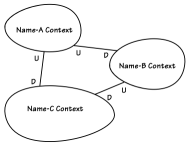
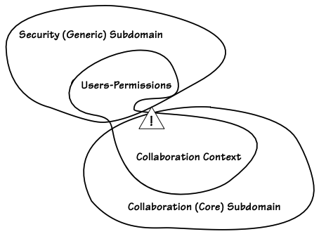
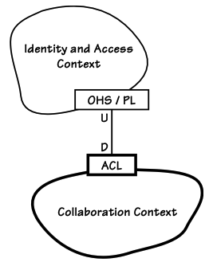
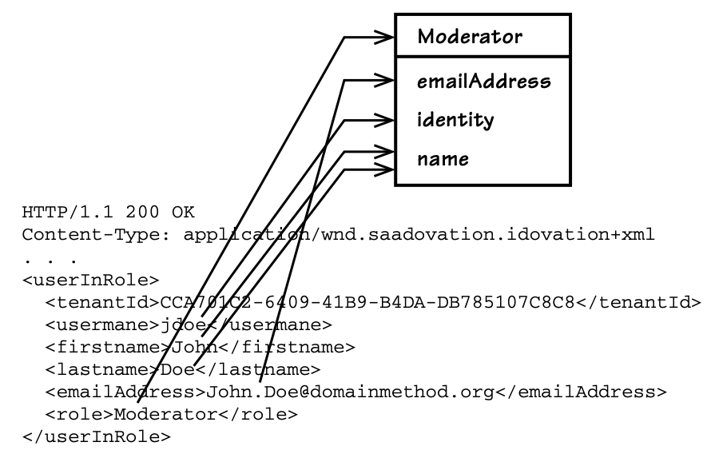
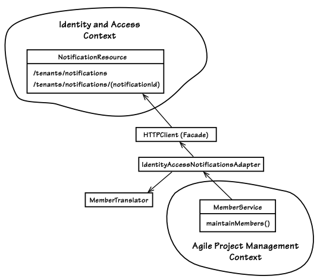

# Bağlam Haritaları (Context Maps)

> Hangi yolu seçerseniz seçin, her zaman size yanlış olduğunuzu söyleyen biri olacaktır. Her zaman, eleştirmenlerinizin haklı olduğuna inanmanıza neden olabilecek zorluklar ortaya çıkar. Bir eylem planı oluşturmak ve onu sonuna kadar takip etmek cesaret gerektirir.
>
> — Ralph Waldo Emerson

Bir Projenin Bağlam Haritası (Context Map) İki Şekilde İfade Edilebilir. _Daha kolay olan yol_, iki veya daha fazla mevcut Bounded Context arasındaki ilişkileri gösteren basit bir diyagram çizmektir (2). Ancak unutmayın ki bu sadece mevcut durumu gösteren bir diyagramdır. Bu çizim, çözüm alanındaki gerçek yazılım Bounded Context’lerinin entegrasyon yoluyla birbirleriyle nasıl ilişkili olduğunu görselleştirir. Bağlam Haritalarını ifade etmenin _daha ayrıntılı yolu_, entegrasyonların kaynak kodu ile uygulanmış hâlini göstermektir. Bu bölümde her iki yöntemi de ele alacağız, ancak çoğu uygulama detayı için **Bounded Context’lerin Entegrasyonu (13)** bölümüne bakabilirsiniz.

Genel bir bakışla, bu bölüm çözüm alanı değerlendirmesine odaklanırken, önceki bölüm büyük ölçüde problem alanı değerlendirmesiyle ilgileniyordu.

> ***Bu Bölümün Yol Haritası***
>
> - Context Map çizmenin proje başarısı için neden kritik olduğunu öğrenin.
> - Anlamlı bir Context Map çizmenin ne kadar kolay olabileceğini görün.
> - Ortak organizasyonel ve sistem ilişkilerini değerlendirin ve bunların projelerinizi nasıl etkilediğini anlayın.
> - SaaSOvation ekiplerinden ders çıkararak projelerini kontrol altına almak için nasıl haritalar oluşturduklarını keşfedin.

## Bağlam Haritaları Neden Bu Kadar Önemli?

DDD sürecine başlarken, öncelikle mevcut proje durumunuzun görsel bir Bağlam Haritasını (Context Map) çizin. Projenize dâhil olan mevcut Bounded Context’leri ve bunlar arasındaki entegrasyon ilişkilerini içeren bir Bağlam Haritası oluşturun. Şekil 3.1, soyut bir Bağlam Haritasını göstermektedir. İlerledikçe detayları dolduracağız.



**Figure 3.1:** Soyut bir Context Map Haritası. Üç Sınırlandırılmış Bağlam ve bunların ilişkileri çizilmiştir. U Yukarı Akış ve D Aşağı Akış anlamına gelir.

Bu basit çizim ***ekibinizin haritasıdır.*** Diğer proje ekipleri buna başvurabilir, ancak DDD uyguluyorlarsa kendi haritalarını oluşturmaları gerekir. Haritanız, öncelikle ekibinize çözüm alanı perspektifi kazandırmak için çizilir. Diğer ekipler DDD kullanmıyor olabilir ve sizin bakış açınızı umursamayabilir.

> ***Ah, Hayır! Yeni Terimler Mi?***
> 
> Burada Big Ball of Mud (Çamur Yumağı), Customer-Supplier (Müşteri-Tedarikçi) ve Conformist (Uyumcu) gibi yeni terimleri tanıtıyoruz. Sabırlı olun; bu ve diğer DDD ekip ve entegrasyon ilişkileri ilerleyen bölümlerde detaylı olarak ele alınacaktır.

Örneğin, büyük bir kurumsal sistemde Bounded Context’leri entegre ederken **Big Ball of Mud** (dağınık, düzensiz bir kod yığını) ile arayüz oluşturmanız gerekebilir. Bu monolitik ve düzensiz sistemi yöneten ekip, projenizin hangi yönde ilerlediğiyle ilgilenmeyebilir, tek şartları API'lerine uymanız olabilir. Bu yüzden, onların API’lerini nasıl kullandığınızla ilgilenmeseler bile, haritanızda onlarla olan ilişkinizi göstermeniz gerekir. Çünkü bu, ekibinize gereken içgörüyü sağlayacak ve hangi noktaların ekipler arası iletişim gerektirdiğini belirleyecektir. Bu farkındalık, ekibinizin başarısı için kritik bir rol oynayabilir.

> ***Bağlam Haritaları Bir İletişim Aracı Olarak Kullanılır***
>
> Bağlam Haritası, etkileşimde bulunmanız gereken sistemlerin envanterini çıkarmanın yanı sıra ekipler arası iletişimi güçlendiren bir araçtır.

Örneğin, ekibiniz dağınık monolit sistemini yöneten ekibin yeni API’ler sağlayacağını varsayabilir, ancak gerçekte böyle bir niyetleri olmayabilir ya da sizin ihtiyaçlarınızdan haberdar bile olmayabilirler. Ekibiniz, bu monolitik sistemle bir ***Müşteri-Tedarikçi (Customer-Supplier)*** ilişkisi içinde olduğunu sanırken, eski sistem ekibi sadece mevcut API’lerini sunarak sizi zorunlu bir ***Uyumcu (Confirmist)*** ilişkisine itebilir. Eğer bu gerçek ilişkiyi çok geç fark ederseniz, proje teslim tarihiniz ertelenebilir hatta proje tamamen başarısız olabilir. Erken aşamada bir Bağlam Haritası çizerek, bağımlı olduğunuz diğer projelerle ilişkilerinizi dikkatlice düşünmek zorunda kalırsınız.

> **Projede yer alan her modeli belirleyin ve onun Bounded Context’ini tanımlayın.  Her Bounded Context’e isim verin ve bu isimleri Ubiquitous Language’in bir parçası yapın.  Modeller arasındaki temas noktalarını tanımlayın, iletişim için açık çevirileri belirleyin ve varsa paylaşımı vurgulayın.** [Evans, s. 345]

---

CollabOvation ekibi, yeşil alan (greenfield) modelini geliştirmeye ilk başladığında bir Bağlam Haritası (Context Map) kullanmalıydı. Neredeyse sıfırdan başlıyor olsalar bile, **projeye dair varsayımlarını bir harita şeklinde ifade etmek, onları ayrı Bounded Context'leri düşünmeye teşvik ederdi.** Önemli modelleme öğelerini bir beyaz tahtaya yazabilir ve ardından bunları ilgili dilsel terimler halinde gruplandırabilirlerdi. Bu süreç, dilsel sınırların fark edilmesini sağlayarak basit bir Bağlam Haritası ortaya çıkarırdı. Ancak, stratejik modellemeyi hiç anlamadıkları için bunu yapmadılar. Öncelikle stratejik modelleme konusunda bir atılım yapmaları gerekiyordu. Daha sonra, bu projeyi kurtaran kritik aracı keşfederek uyguladılar ve bundan büyük fayda sağladılar. Sonrasında başlatılan Core Domain projesinde de aynı yaklaşım önemli ölçüde karşılığını verdi.

----------

Şimdi hızlıca nasıl etkili bir Bağlam Haritası oluşturabileceğinize bakalım.

### Bağlam Haritalarını Çizmek

Context Map, mevcut durumu yansıtır. Öncelikle, hayal edilen geleceği değil, şu anki durumu haritalamalısınız. Eğer mevcut proje ilerledikçe manzara değişecekse, haritayı o zaman güncelleyebilirsiniz. ***Öncelikle mevcut duruma odaklanarak nerede olduğunuzu anlamalı ve sonraki adımları belirlemelisiniz.***

Grafiksel bir Bağlam Haritası oluşturmak karmaşık olmak zorunda değildir. En basit yöntem, beyaz tahtalar ve silinebilir kalemler kullanarak elle çizim yapmaktır. Burada kullanılan stil, ***[Brandolini]*** tarafından gösterildiği gibi kolayca uyarlanabilir. Eğer çizimi dijital bir araçla oluşturmayı tercih ederseniz, resmi olmayan bir yaklaşımı korumaya dikkat edin.

Şekil 3.1’e geri dönersek, Bounded Context isimleri sadece yer tutucudur; entegrasyon ilişkileri de öyledir. Gerçek bir haritada bunların hepsi somut isimlerden oluşur. Bağlam Haritasında gösterilen yukarı akış (upstream) ve aşağı akış (downstream) ilişkileri, bu bölümde daha sonra detaylandırılacaktır.

> ***Alıştırma Zamanı***
>
> Mevcut proje durumunu basit bir diyagram çizerek gösterin. Bu diyagram, Bounded Context'lerin sınırlarını, aralarındaki ilişkileri ve ekip yapılarını, hangi tür entegrasyonların bulunduğunu ve aralarındaki gerekli çevirileri yüksek seviyede anlatmalıdır.
> Unutmayın ki, ***yazılım çizimde ne varsa onu uygular.*** Ne çizmeniz gerektiği konusunda daha fazla bilgiye ihtiyacınız varsa, Bounded Context'lerinizin hangi sistemlerle entegre olduğunu düşünün.

Bazen Bağlam Haritasının belirli bir bölümüne daha yakından bakmak ve daha fazla ayrıntı eklemek isteyebilirsiniz. Bu, aynı Bağlam(lar)a farklı bir perspektiften bakmanın bir yoludur. Sınırların, ilişkilerin ve çevirilerin yanı sıra,
- **Modules (9),**  
- **Önemli Aggregates (10),**
- **Ekip dağılımı ve organizasyonu,**
- **Bağlamlarla ilgili diğer önemli bilgiler**

gibi unsurlar da dahil edilebilir. Bu teknikler bölümün ilerleyen kısımlarında gösterilecektir.

Çizimler ve açıklamalar, ekibiniz için değerliyse tek bir referans dokümanda toplanabilir. Ancak, gereksiz prosedürlerden kaçınmalı ve basit, çevik bir yaklaşımı korumalısınız. ***Ne kadar çok prosedür eklerseniz, haritayı kullanmak isteyen insan sayısı o kadar azalır.*** Diyagramlara gereğinden fazla detay eklemek ekibe pek bir fayda sağlamaz. ***Açık iletişim esastır.*** Stratejik içgörüler ortaya çıktıkça bunları Bağlam Haritasına ekleyin.

> ***Hayır, Bu Bir Kurumsal Mimari Diyagramı Değil***
> Context Map, bir Kurumsal Mimari veya sistem topolojisi diyagramı değildir.

Bağlam Haritası, bir Kurumsal Mimari veya sistem topolojisi diyagramı değildir. İçerdiği bilgiler, etkileşimde bulunan modeller ve DDD organizasyonel kalıplarıyla ilgilidir. Yine de, Bağlam Haritaları yüksek seviyeli mimari analizlerde kullanılabilir ve kurumsal yapıya dair başka yollarla elde edilemeyecek bakış açıları sunabilir. Bağlam Haritaları, entegrasyon darboğazları gibi mimari eksiklikleri öne çıkarabilir. Ayrıca organizasyonel dinamikleri gösterdiğinden, ilerlemeyi engelleyebilecek yönetimsel sorunları ve çözülmesi zor ekip yönetimi zorluklarını tespit etmemize yardımcı olabilir.

Bu diyagramlar, ekibin çalıştığı alandaki bir duvarda herkesin görebileceği bir şekilde asılmayı hak eder. Eğer ekip bir wiki platformunu aktif olarak kullanıyorsa, diyagramlar oraya da yüklenebilir. Ancak, eğer wiki büyük ölçüde göz ardı edilecekse, yüklemenin pek bir anlamı olmayacaktır. Çünkü sıkça söylenir ki, ***"Wiki, bilginin ölüme terk edildiği bir yer olabilir."*** Bağlam Haritaları nerede sergilenirse sergilensin, ekibin düzenli olarak dikkatini çekmezse görünmez hale gelir. Bunun önüne geçmek için ekip içinde ***bu haritalar üzerine anlamlı tartışmalar yapılmalı ve düzenli olarak gözden geçirilmelidir.***

### Projeler ve Organizasyonel İlişkiler

Kısaca özetlemek gerekirse, SaaSOvation üç ürünü geliştirme ve iyileştirme yolunda ilerlemektedir:

1. ***Sosyal iş birliği (collaboration) platformu*** olarak çalışan bu ürün, kayıtlı kullanıcıların forumlar, paylaşılan takvimler, bloglar, wikis gibi popüler web tabanlı araçları kullanarak iş dünyasına yönelik içerikler yayımlamasını sağlar. SaaSOvation’ın en önemli ürünü ve firmanın ilk Çekirdek Alanı (Core Domain) olarak geliştirilmiştir (her ne kadar ekip o dönemde DDD terminolojisini bilmese de). IdOvation’ın modeli (madde 2) CollabOvation'dan türetilmiştir. Şu an IdOvation'ı bir Genel Alt Alan (Generic Subdomain) olarak kullanmaktadır. Kendi başına da bir Destekleyici Alt Alan (Supporting Subdomain) olarak kullanılabilecek** ve **ProjectOvation'a (madde 3) isteğe bağlı bir eklenti olarak entegre edilecektir.
        
2. ***Yeniden kullanılabilir kimlik ve erişim yönetimi (IdOvation) modeli*** olup, kayıtlı kullanıcılar için güvenli rol tabanlı erişim yönetimi sağlar. Başlangıçta CollabOvation (madde 1) ile entegre edilmiştir, ancak bu ilk uygulama yeniden kullanılabilir bir yapı sunmuyordu. SaaSOvation, CollabOvation’ı yeniden düzenleyerek temiz bir Bağlamlı Alan (Bounded Context) oluşturmuştur. _Çoklu kiracı (multi-tenant) desteği_ en önemli özelliklerinden biridir ve _SaaS uygulamaları için kritik bir bileşendir._ ***IdOvation, kendisini kullanan tüm modeller için Genel Alt Alan (Generic Subdomain) olarak hizmet eder.***
        
3. ***Çevik proje yönetimi (ProjectOvation)*** platformudur ve şu anda SaaSOvation’ın yeni Çekirdek Alanı’dır. Kullanıcılar proje yönetimi varlıkları oluşturabilir, analiz ve tasarım belgeleri hazırlayabilir ve Scrum tabanlı bir yürütme çerçevesiyle ilerlemeyi takip edebilir. CollabOvation gibi, ProjectOvation da IdOvation'ı bir Genel Alt Alan (Generic Subdomain) olarak kullanmaktadır. Öne çıkan bir yenilikçi özelliği, çevik proje yönetimine ekip iş birliğini (madde 1) ekleyerek, Scrum ürünleri, sürümleri, sprintler ve bireysel backlog öğeleri etrafında tartışmalara olanak tanımasıdır.

Bu Sınırlandırılmış Bağlamlar ve bunların bağımsız proje ekipleri arasındaki ilişkiler nelerdir? Herhangi iki Bounded Contexts arasında yaygın olarak var olan birkaç DDD organizasyon ve entegrasyon modeli vardır. Aşağıdaki tanımların her biri büyük ölçüde **_[Evans, Ref]_**'den alıntılanmıştır:

- **_Ortaklık (Partnership)_**: İki ekibin birlikte başarılı olması veya başarısız olması durumunda ortaya çıkan iş birliği modelidir. Geliştirme ve entegrasyon süreçleri için koordineli bir planlama süreci oluşturulmalıdır. Bağımlı özellikler, aynı sürümde tamamlanacak şekilde planlanmalıdır.

- **_Paylaşılan Çekirdek (Shared Kernel)_**: İki ekibin, modelin belirli bir bölümünü ve ilgili kodu paylaşarak birbirine bağımlı olduğu durumdur. Paylaşılan alan açıkça belirlenmeli ve mümkün olduğunca küçük tutulmalıdır. Bu ortak bileşen, diğer ekiplerin onayı olmadan değiştirilmemelidir. Sürekli entegrasyon süreci sağlanarak, Ubiquitous Language uyumlu hale getirilmelidir.
        
- **_Müşteri-Tedarikçi Geliştirme (Customer-Supplier Development)_**: İki ekip arasında yukarıdan aşağıya bir ilişki olduğunda ortaya çıkar. Üst akıştaki ekip, alt akıştaki ekibin taleplerini karşılamak zorunda değildir. Ancak alt akış ekibi için kritik talepler, bütçe ve planlama sürecine dahil edilmelidir.
        
- **_Uyumcu (Conformist)_**: Üst akış ekibinin, alt akış ekibinin ihtiyaçlarını karşılamak için hiçbir motivasyonu olmadığı senaryodur. Alt akış ekibi, kendi modelini oluşturmak yerine üst akış ekibinin modeline tamamen bağımlı hale gelir. Bu durum, alt akış ekibinin esnekliğini ciddi şekilde kısıtlar.
        
- **_Bağışıklık Katmanı (Anticorruption Layer)_**: İki Bağlamlı Alan arasında çeviri katmanı eklenerek bağımsızlık sağlanır. Eğer iki ekip arasında ortak bir kernel, iş birliği veya müşteri-tedarikçi ilişkisi kurulamıyorsa, çeviri katmanı daha karmaşık hale gelir. Bağışıklık Katmanı, sistemler arasındaki etkileşimi soyutlayarak her sistemin kendi alan modeliyle çalışmasına olanak tanır.
        
- **_Açık Ana Bilgisayar Hizmeti (Open Host Service)_**: Alt sistemlere erişim sağlayan bir protokol tanımlanır ve herkesin kullanımına açık hale getirilir. Yeni entegrasyon gereksinimleri için protokol genişletilir. Ancak, tek bir ekip için özel bir ihtiyaç varsa, protokol yerine bir çevirici (translator) kullanılır.
        
- **_Yayınlanmış Dil (Published Language)_**: İki Bounded Contexts arasındaki çeviriyi kolaylaştırmak için ortak bir dil oluşturulur. Bu dil iyi belgelenmiş ve gerekli tüm alan bilgilerini içerecek şekilde tasarlanmalıdır. Çoğunlukla Açık Ana Bilgisayar Hizmeti (Open Host Service) ile birlikte kullanılır.
        
- **_Ayrı Yollar (Separate Ways)_**: Eğer iki işlev seti arasında anlamlı bir ilişki yoksa, entegrasyon tamamen iptal edilebilir. Entegrasyon pahalı bir süreçtir ve bazen getirdiği fayda düşük olabilir. Bu sayede, her bir ekip kendi alanında özgün ve bağımsız çözümler geliştirebilir.
        
- **_Büyük Çamur Yumağı (Big Ball of Mud)_**: Bazı sistemlerde, model sınırları belirsizdir ve farklı modeller birbiriyle iç içe geçmiş durumdadır. Bu tür sistemlerde sofistike modelleme yöntemleri kullanmaya çalışmak yerine, sistemin tamamı için tek bir büyük sınır çizilir. Bu sistemlerin diğer Bağlamlı Alanlara yayılmasını engellemek için dikkatli olunmalıdır.

Identity and Access Context ile entegre olarak, Collaboration Context ve Agile Project Management Context, güvenlik ve izinler konusunda Ayrı Yollar (Separate Ways) izlemekten kaçınmaktadır. Doğrudur, Ayrı Yollar stratejisi bir sistemin tamamına uygulanabileceği gibi, belirli durumlar için de kullanılabilir. Örneğin, bir ekip merkezi bir güvenlik sistemini kullanmayı reddedebilir ancak yine de bazı diğer kurumsal standart sistemlerle entegre olmayı tercih edebilir.

Ekipler, Müşteri-Tedarikçi (Customer-Supplier) rollerinde iş birliği yapacaktır. SaaSOvation yönetimi, bir ekibin diğerlerini Uyumcu (Conformist) olmaya zorlamasına asla izin vermeyecektir. Confirmist ilişkisi her zaman olumsuz değildir. Ancak Müşteri-Tedarikçi modeli, Tedarikçinin (Supplier) Müşteriye (Customer) destek sağlamasını gerektirir ve bu da SaaSOvation’ın başarıya ulaşması için ihtiyaç duyduğu takım içi ilişkileri güçlendirmektedir. Tabii ki, Müşteriler her zaman haklı değildir, bu yüzden belli bir esneklik ve karşılıklı anlayış gereklidir. Genel olarak ekiplerin koruması gereken pozitif bir organizasyonel ilişki vardır.

Ekiplerin entegrasyonu, Açık Ana Bilgisayar Hizmeti (Open Host Service) ve Yayınlanmış Dil (Published Language) kullanacaktır. Şaşırtıcı gelebilir ancak Bağışıklık Katmanı (Anticorruption Layer) da uygulanacaktır. Bu bir çelişki değildir, çünkü Bağlamlı Alanlar arasında açık standartlar oluşturulsa da, aşağı akıştaki (downstream) Bağlamlı Alanlarda izole çeviri prensipleri uygulanabilir. Ancak bu, Büyük Çamur Yumağı (Big Ball of Mud) tüketildiğinde gereken çeviri katmanlarından çok daha basit ve zarif olacaktır.

Aşağıdaki Bağlam Haritaları (Context Maps) ve açıklayıcı metinlerde, her ilişkinin iki ucunda kullanılan kalıpları göstermek için şu kısaltmalar kullanılmıştır:
-   **ACL**   → Bağışıklık Katmanı (Anticorruption Layer)
-   **OHS** → Açık Ana Bilgisayar Hizmeti (Open Host Service)
-   **PL**     → Yayınlanmış Dil (Published Language)
    

Aşağıdaki örnek Bağlam Haritalarını ve destekleyici metni incelerken, 2. Bölüm olan "Alanlar, Alt Alanlar ve Bağlamlı Alanlar" kısmına göz atmak faydalı olabilir. Üç örnek Bağlamlı Alanın diyagramları burada tekrar edilmemiş olsa da, bu haritaların bir parçası olarak kullanılabilir.

### Üç Bağlamın Haritalanması

Şimdi ekip deneyimine dalarak, onların süreçlerinden neler öğrenebileceğimize bakalım...

----------

CollabOvation ekibi, oluşturdukları karmaşayı fark ettiğinde, çözüm bulmak için [Evans]’ın çalışmalarına başvurdu. Stratejik tasarım desenleri içinde büyük değer taşıyan çeşitli keşifler yaparken, "Bağlam Haritaları (Context Maps)" adlı pratik bir araç buldular. Ayrıca, bu tekniği daha da detaylandıran [Brandolini]’nin çevrimiçi bir makalesine rastladılar. Araç, mevcut yapıyı haritalamaları gerektiğini belirttiği için, ilk adım olarak bunu yaptılar.  Şekil 3.2, elde ettikleri sonuçları göstermektedir.

Ekip tarafından üretilen ilk Context Map, Bounded Context varlığını erken fark ettiklerini ortaya koydu. Bu bağlamı **İş Birliği Bağlamı (Collaboration Context)** olarak adlandırdılar.  Ancak mevcut sınırın düzensiz şekli, belirgin şekilde ayrılmamış ikinci bir Bağlamın varlığına işaret ediyordu. Bu ikinci Bağlamın, **Çekirdek Alan (Core Domain)** ile net ve temiz bir ayrımı olmadığı açıkça görülüyordu.


**Figure 3.2:** İstenmeyen kavramların İşbirliği Bağlamında yol açtığı karmaşa bu Harita tarafından ortaya çıkarılmaktadır. Uyarı işareti kirlilik alanına işaret etmektedir.

----------

Üst kısımda dar bir geçiş, yabancı kavramların neredeyse kontrolsüz şekilde iki bağlam arasında gidip gelmesine olanak tanıyordu. Bu durum dikkat edilmesi gereken bir işaret olarak gösterildi. ***Bağlam sınırlarının tamamen geçirimsiz olması gerekmez.*** Ancak,  İş Birliği Bağlamı (Collaboration Context), kendi sınırlarından neyin geçtiğini ve bunun hangi amaçla gerçekleştiğini tam olarak kontrol etmelidir.
Aksi takdirde, bilinmeyen ve belki de istenmeyen unsurlar tarafından istila edilebilir. Bir model bağlamında, bu tür yabancı unsurlar genellikle belirsizlik ve hatalara yol açar. Modelleyiciler nazik ve misafirperver olmalı, ancak yalnızca düzen ve uyumu koruyacak koşullar altında. Bağlam sınırlarına giren yabancı kavramlar, bu alanda var olma hakkını kanıtlamalı ve hatta bağlam içindeki özelliklere uyum sağlamalıdır.

---

> Bu analiz, yalnızca mevcut modelin durumunu daha iyi anlamalarına yardımcı olmakla kalmadı, aynı zamanda projenin ilerlemesi gereken yönü de netleştirdi.
>
> Ekip, güvenlik, kullanıcılar ve izinler gibi kavramların İş Birliği Bağlamı (Collaboration Context) içinde yer almaması gerektiğini fark ettiğinde, buna uygun şekilde hareket etti. Bu kavramları Çekirdek Alan’dan (Core Domain) ayırmak ve yalnızca belirli koşullar altında girişlerine izin vermek zorunda kaldılar.

---

Bu, bir DDD projesinde kritik bir taahhüttür. Her Bağlamlı Alanın dili (Ubiquitous Language) korunmalıdır ki tüm modeller saf kalabilsin. Linguistik ayrım ve buna sıkı sıkıya bağlı kalmak, projeye dahil olan her ekibin kendi Bağlamına odaklanmasını sağlar ve vizyonlarını doğru yönlendirmelerine yardımcı olur.

---

Subdomain analizi veya problem alanı değerlendirmesi uygulandığında, ekip Şekil 3.3'te gösterilen diyagrama ulaştı. Tek bir Bounded Context iki Subdomain'e ayrıştırıldı. Subdomain'leri, Bounded Context'lerle birebir hizalamak iyi bir hedef olduğundan, bu analiz tek bir Bounded Context'in ikiye ayrılması gerektiğini gösterdi.



**Figure 3.3:** Ekibin Alt Etki Alanı analizi, bir Collaboration Core Domain ve bir Security Generic Subdomain olmak üzere iki alanın keşfedilmesine yol açtı

---

Subdomain ve boundary analizi, bazı kararlara yol açtı. CollabOvation’ın insan kullanıcıları mevcut özelliklerle etkileşimde bulunduklarında, Katılımcılar, Yazarlar, Moderatörler vb. olarak etkileşime girerler. Daha sonra tartışılacak başka bağlamsal ayrımlar olsa da, bu, yaratılan gerekli bölümleri iyi bir şekilde gösteriyor. Bu bilgiyle, Şekil 3.4'te gösterilen yüksek seviyeli Bağlam Haritasında belirtilen temiz ve net sınırlar ortaya çıktı. Ekip, bu netlik noktasına ulaşmak için Segregated Core [Evans] kullanarak yeniden yapılandırma yaptı. Sınırların tanınabilir şekilleri, her Bağlam için simgeler veya görsel ipuçları olarak işlev görür. Farklı diyagramlar arasında aynı göreceli şekilleri tutmak, bilişsel süreçleri kolaylaştırabilir.



**Figure 3.4:** Orijinal Core Domain kalın bir sınır ve entegrasyon noktaları ile işaretlenmiştir. Burada IdOvation, downstream CollabOvation için bir Generic Subdomain olarak hizmet vermektedir.

---

Bağlam Haritaları genellikle bir anda ortaya çıkmaz, farklı eskizler size öyleymiş gibi görünebilir, ancak nihayet anlaşıldığında, bunları üretmek zor değildir. Düşünme ve tartışma, bir Haritayı hızlı iterasyonlarla geliştirmeye yardımcı olur. Refinement'lar bazen entegrasyon noktaları şeklinde olabilir, bu noktalar Bağlamlar arasındaki ilişkileri tanımlar.

---

İlk iki Harita, stratejik tasarım uygulandıktan sonra elde edilen kazançları göstermektedir. Orijinal CollabOvation projesi yolunda ilerledikçe, ekip kimlik ve erişim konularını ayırmıştı. İlerledikçe, Şekil 3.4'teki Bağlam Haritasını ürettiler. Ekip yalnızca **Core Domain** olan **Collaboration Context** ile yeni **Generic Subdomain** olan **Identity and Access Context** modelini çizdi. **Agile Project Management Context** gibi gelecekteki modelleri tasvir etmediler. Ekip için çok ileriye gitmek faydalı olmazdı. Yalnızca mevcut olanlardaki kusurları düzeltmeleri gerekiyordu. Gelecek sistemleri destekleyecek dönüşümler yakında gerekli olacaktı ve o Harita, gelecekteki ekibin üretmesi gereken bir şeydi.

> ***Alıştırma Zamanı***
>
> - Kendi Bounded Context'inizi düşünerek, ait olmayan kavramları tanımlayabiliyor musunuz? Eğer tanımlayabiliyorsanız, istenen Bağlamlar ve bunlar arasındaki ilişkileri gösteren yeni bir Context Map çizin.
> - Dokuz DDD organizasyonel ve entegrasyonel ilişkilerinden hangisini seçersiniz ve neden?

---

Bir sonraki ProjectOvatio* projesi başlatıldığında, mevcut Map'i yeni Core Domain olan Agile Project Management Context ile genişletme zamanı gelmişti. Bu haritalamanın sonuçları Şekil 3.5'te görülmektedir. Henüz kodda olmasa da planlamada olanı yakalamak erken değildi. Yeni Context'in içindeki detaylar tam olarak anlaşılmamıştı, ancak bu, tartışmalarla zamanla çözülecekti. Bu erken aşamada yüksek seviyeli stratejik tasarım uygulamak, tüm takımların sorumluluklarını anlamalarına yardımcı olacaktı. Üçüncü yüksek seviyeli harita, bir öncekinin sadece bir genişletmesidir, bu yüzden buna odaklanacağız. SaaSOvation bu yolda ilerliyor. Şirket, yeni projeye deneyimli baş geliştiriciler atamıştır. Üç Context'ten en zengin ve şu anda izlenen yön olan yeni Core Domain, en iyi geliştiricilerin çalışması gereken yer.

Bazı temel ayrımlar zaten iyi anlaşılmıştır. Collaboration Context'e benzer şekilde, ProjectOvation kullanıcıları ürünler oluşturduğunda, sürüm planları yaparken, sprintler planlarken ve backlog öğelerinin görevleri üzerinde çalışırken, bunu Product Owner ve Team Member olarak yapmaktadırlar. Identity and Access Context, Core Domain'den ayrılmıştır. Aynı şekilde, Collaboration Context'i kullanımları artık bir Supporting Subdomain'dir. Yeni modelin bu kullanımına, sınırlar ve Core Domain kavramlarına yapılan çevirilerle koruma sağlanacaktır.

---

Bu diyagramların ince detaylarını dikkate alın. Bunlar sistem mimarisi diyagramları değildir. Eğer öyle olsalardı, **Agile Project Management Context** bizim yeni **Core Domain**'imiz olduğundan, diagramda üstte veya ortada yer almasını beklerdik. Ancak burada, en altta yer almaktadır. Bu, görsel olarak **core model**'in diğer modellerin aşağısında olduğunu gösteren, belki de ilginç bir özelliktir.


**Figure 3.5:** Mevcut Core Domain kalın bir sınır ve entegrasyon noktaları ile işaretlenmiştir. CollabOvation Supporting Subdomain ve IdOvation Generic Subdomain yukarı akış yönündedir.

Bu nüans, başka bir görsel ipucu işlevi görmektedir. Yukarı akıştaki modeller, aşağı akıştaki modellere etki eder. Nehirdeki yukarı akışta gerçekleşen aktiviteler, aşağı akıştaki popülasyonları olumlu ya da olumsuz bir şekilde etkiler. Örneğin, bir büyük şehir tarafından nehre bırakılan kirleticiler, o şehir üzerinde çok fazla etki yaratmayabilir, ancak aşağı akıştaki şehirlerde ciddi sonuçlara yol açabilir. Diyagramdaki modellerin dikey yakınlığı, yukarı akıştaki modellerin aşağı akıştaki modellere olan etkilerini tanımlamaya yardımcı olur. **U** ve **D** etiketleri, her bir ilişkili model arasındaki bu durumu açıkça belirtir. Bu etiketler, her **Context**'in dikey konumlandırılmasının önemini azaltır, ancak yine de görsel açıdan çekici olabilmesi için bunları kullanmak faydalıdır.

Kimlik ve Erişim Bağlamı en yukarı akışta yer alır. Hem Collaboration Context hem de Agile Project Management Context üzerinde etkisi vardır. Collaboration Context ayrıca Agile Project Management Context'in yukarı akışında yer alır, çünkü agile modeli, collaboration modeli ve hizmetlerine dayanır. **Bounded Contexts (2)**'de belirtildiği gibi, ProjectOvation mümkün olduğunca bağımsız bir şekilde çalışacaktır. Çalışma, çevredeki sistemlerin mevcut olmasından büyük ölçüde bağımsız olarak devam etmelidir. Bu, otonom hizmetlerin, yukarı akıştaki modellerden tamamen bağımsız çalışabileceği anlamına gelmez. Doğrudan gerçek zamanlı bağımlılıkları önemli ölçüde sınırlayacak şekilde tasarım yapmalıyız. Otonom olsa da, **Agile Project Management Context** yine de diğerlerinin aşağı akışındadır (downstream).

Bir uygulamayı otonom hizmetlerle donatmak, yukarı akıştaki Context'lerin veritabanlarının sadece bağımlı Context'e replicated olduğu anlamına gelmez. **Replication**, yerel sistemin birçok istenmeyen sorumluluğu üstlenmesine yol açar. Bu, gerçekten otonomi sağlamayan bir **Shared Kernel** yaratmayı gerektirirdi.

Son diyagramda, her bağlantının yukarı akış tarafında bağlantı kutuları bulunduğuna dikkat edin. Bağlantı kutularının her ikisi de **OHS/PL** olarak etiketlenmiştir, bu da **Open Host Service** ve **Published Language**'i tanımlayan bir kısaltmadır. Üç aşağı akış bağlantı kutusunun tümü ise **ACL** olarak etiketlenmiştir, bu da **Anticorruption Layer**'ın kısaltmasıdır. Teknik uygulamalar, **Integrating Bounded Contexts (13)** altında ele alınmaktadır. Kısaca, bu entegrasyon desenlerinin teknik özellikleri şunlardır:

- ***Open Host Service***: Bu desen, istemci Bounded Context'lerin etkileşimde bulunduğu REST tabanlı kaynaklar olarak uygulanabilir. Open Host Service, genellikle uzak prosedür çağrısı (RPC) API'si olarak düşünülse de, mesaj değişimi kullanılarak da uygulanabilir.
    
- ***Published Language***: Bu, birkaç farklı şekilde uygulanabilir ancak çoğunlukla bir XML şeması olarak yapılır. REST tabanlı hizmetlerle ifade edildiğinde, Published Language, domain kavramlarının temsilleri olarak sunulur. Temsil, örneğin XML ve JSON'ı içerebilir. Temsil, ayrıca Google Protocol Buffers olarak da sunulabilir. Web kullanıcı arayüzleri yayımlıyorsanız, HTML temsilleri de içerebilir. REST kullanmanın avantajlarından biri, her istemcinin tercih ettiği Published Language'ı belirtmesi ve kaynakların talep edilen içerik türünde temsiller sunmasıdır. REST'in bir diğer avantajı, _hypermedia_ temsillerini üretmesidir, bu da HATEOAS'u kolaylaştırır. Hypermedia, Published Language'ı çok dinamik ve etkileşimli hale getirir, istemcilerin bağlı kaynaklar kümesine gitmelerine olanak tanır. Published Language, standart ve/veya özel medya türlerini kullanarak yayımlanabilir. Published Language, ayrıca bir **Event-Driven Architecture (4)** içinde kullanılır, burada **Domain Events (8)** mesajlar olarak ilgilenen taraflara teslim edilir.
    
-   **Anticorruption Layer**: Aşağı akıştaki Context'te her tür Anticorruption Layer için bir **Domain Service (7)** tanımlanabilir. Ayrıca bir Anticorruption Layer'ı, bir **Repository (12)** arabiriminin arkasına koyabilirsiniz. REST kullanıyorsanız, bir istemci Domain Service uygulaması, uzak Open Host Service'e erişir. Sunucu yanıtları, Published Language olarak temsiller üretir. Aşağı akıştaki Anticorruption Layer, temsilleri yerel Context'inin domain nesnelerine dönüştürür. İşte burada, ***örneğin Collaboration Context, Identity and Access Context'ten bir User-in-Moderator-role kaynağını talep eder. İstenilen kaynak, XML veya JSON olarak alınabilir ve sonra Moderator'a, yani bir Value Object'e dönüştürülür. Yeni Moderator örneği, aşağı akış modeline göre bir kavramı yansıtır, yukarı akış modeline göre değil.***

Seçilen desenler yaygın olanlardır. Seçimlerin sınırlandırılması, bu kitapta tartışılan entegrasyon kapsamının yönetilebilir olmasına yardımcı olur. Bu seçilen birkaç desen arasında bile, nasıl uygulanabilecekleri konusunda çeşitlilik olduğunu göreceğiz.

_Geriye şöyle bir soru kalır:_ Bir Context Map oluşturmanın tek yolu bu mu? Muhtemelen. Yüksek düzeydeki görünüm, proje hakkında oldukça fazla bilgi sağlar. Yine de, her Context'teki bağlantılar ve adlandırılmış ilişkilerle neler olup bittiğine dair merakımız olabilir. Takım üyeleri arasındaki merak, bizi biraz daha ayrıntı üretmeye yönlendirebilir. Yaklaşalım, üç entegrasyon deseninin biraz bulanık olan resmi daha netleşmeye başlıyor.

Bir adım geri gidelim. Collaboration Context ilk Core Domain olduğundan, ona bir göz atalım. İlk olarak, daha basit entegrasyonlarla **zooming** tekniğini tanıtacağız, ardından daha ileri düzey olanlara geçeceğiz.

***Collaboration Context***

Şimdi, **Collaboration** ekibinin deneyimine geri dönelim...

----------

Collaboration Context, ilk model ve sistem —ilk Core Domain— olduğundan, artık işleyişi iyi anlaşılmış durumdadır. Burada kullanılan entegrasyonlar daha basit olmakla birlikte, güvenilirlik ve otonomi açısından daha az sağlamdır. Yakınlaştırılmış bir Context Map oluşturmak nispeten kolaydır.

----------

**Identity and Access Context** tarafından yayımlanan **REST tabanlı hizmetlerin** bir istemcisi olarak, **Collaboration Context**, kaynaklara erişirken geleneksel bir **RPC benzeri** yaklaşım benimser. Bu Context, Identity and Access Context'ten aldığı verileri yerel olarak yeniden kullanmak için kalıcı olarak saklamaz. Bunun yerine, her ihtiyacı olduğunda uzak sisteme bağlanarak bilgiyi tekrar tekrar talep eder. Bu durum, Collaboration Context'in ***uzak hizmetlere yüksek bağımlılığı olduğunu ve otonom olmadığını*** açıkça gösterir. SaaSOvation, şimdilik bu durumu kabul etmeye razıdır.

Beklenmedik şekilde, Generic Subdomain ile bir entegrasyon ortaya çıkmıştır. Ekip, zorlu teslimat takvimine uyabilmek için daha karmaşık ve otonom bir tasarım geliştirmeye zaman ayıramadı. Tasarımın başlangıçtaki kolaylığı, göz ardı edilemeyecek bir avantaj sundu. ProjectOvation'ın devreye alınması ve burada edinilen otonomi deneyimi sonrasında, benzer teknikler CollabOvation için de uygulanabilir.

Yakınlaştırılmış diyagramda gösterilen **sınır nesneleri (boundary objects)**, kaynağı senkron bir şekilde talep ede*. Uzak modelin temsili alındığında, sınır nesneleri, ilgilenilen içeriği bu temsilden alır ve çevirerek uygun bir **Value Object** örneği oluşturur. Figure 3.7'de gösterildiği gibi, bir Moderator rolündeki Kullanıcı (Identity and Access Context) alınarak, Collaboration Context içinde bir Moderator Value Object**'e dönüştürülür.


**Figure 3.6:** Collaboration Context ve Identity and Access Context arasındaki entegrasyonun Anticorruption Layer ve Open Host Service'İne daha yakından bakmak



**Figure 3.7:** Temsili bir durumun (bu durumda XML) yerel modeldeki bir Value Object'ine nasıl eşlendiğini gösteren mantıksal bir Çeviri Haritası.

---

> ***Düşünme Zamanı***
> Projenizdeki Bounded Context’lerden birinde ilginç entegrasyon noktalarından birine dair bir Çeviri Haritası (Translation Map) oluşturun.
>
> * Eğer çeviriler çok karmaşıksa, fazla veri kopyalama ve senkronizasyon gerektiriyorsa ve çevrilen nesneniz, diğer modeldeki nesneye fazla benziyorsa, belki de yabancı Bounded Context’ten çok fazla unsur alıyorsunuzdur. Bu durum, modelinizde kafa karıştırıcı çakışmalara neden olabilir.

----------

_Ne yazık ki, senkron isteğin başarısız olması durumunda, çünkü uzak sistem kullanılamıyorsa, tüm yerel işlem başarısız olmalıdır. Kullanıcıya sorun hakkında bilgi verilir ve daha sonra tekrar denemesi istenir._

Sistem entegrasyonları genellikle RPC’ye dayanır. Yüksek seviyede bakıldığında RPC, normal bir programlama prosedürü çağrısına oldukça benzer görünür. Kütüphaneler ve araçlar, kullanımı çekici ve kolay hale getirir. Ancak, kendi işlem alanınızdaki bir prosedürü çağırmakla, uzak bir sistemdeki prosedürü çağırmak aynı şey değildir. Uzak çağrılar, **_performansı düşürebilecek gecikmelere_** veya **_doğrudan hatalara_** neden olabilir. Ağ trafiği ve uzak sistemin yükü, RPC işlemini geciktirebilir. **Hedef sistem kullanılamazsa, kullanıcı isteği başarıyla tamamlanamaz.

Her ne kadar REST tabanlı kaynak kullanımı doğrudan bir RPC olmasa da, benzer özelliklere sahiptir. Tam sistem hatası nispeten nadir olsa da, bu durum potansiyel olarak can sıkıcı bir sınırlamadır. Ekip, bu durumu en kısa sürede iyileştirmeyi dört gözle bekliyor.

***Agile Project Management Context***

Çevik Proje Yönetimi Bağlamı yeni Çekirdek Alan (Core Domain) olduğu için ona özellikle dikkat edelim. Bu bağlamı ve diğer modellerle olan bağlantılarını daha yakından inceleyelim.

RPC'nin sunduğundan daha yüksek bir özerklik derecesine ulaşmak için, Çevik Proje Yönetimi Bağlamı ekibinin kullanımını dikkatlice kısıtlaması gerekecek. Bu nedenle, bant dışı (out-of-band) veya asenkron olay işleme stratejik olarak tercih edilmektedir.

Bağımlı durumların zaten yerel sistemimizde bulunması, daha yüksek bir özerklik derecesine ulaşmayı sağlar. Bazıları bunu, bağımlı nesnelerin tamamının bir önbelleği olarak düşünebilir, ancak DDD yaklaşımında bu genellikle böyle değildir. Bunun yerine, yabancı modelden çevrilen yerel alan nesneleri oluşturulur ve yalnızca yerel modelin ihtiyaç duyduğu en az miktarda durum tutulur.

Bu durumu ilk etapta elde etmek için bazı sınırlı ve iyi yerleştirilmiş **RPC çağrıları*** veya ***REST tabanlı kaynak istekleri*** yapılabilir. Ancak, uzak modeldeki değişikliklerle senkronizasyon sağlamak için genellikle en iyi yaklaşım, ***uzak sistemler tarafından yayınlanan mesaj tabanlı bildirimleri kullanmaktır***. Bu bildirimler:

- Bir servis veri yolu (service bus) veya mesaj kuyruğu üzerinden gönderilebilir
- REST aracılığıyla yayınlanabilir
    

> ***Minimalist Düşün***
>
> Senkronize edilen durum, yalnızca yerel modelin ihtiyaç duyduğu uzak modellerin minimal öznitelikleridir. Bu yaklaşım, yalnızca veri senkronizasyon ihtiyacını azaltmak için değil, aynı zamanda modelleme kavramlarını doğru şekilde oluşturmak için gereklidir.

Örneğin, ***ProductOwner*** ve ***TeamMember*** nesnelerinin aslında ***UserOwner*** ve ***UserMember***'ı yansıtmasını istemeyiz. Eğer ***remote user object***'in çok fazla özelliğini miras alırlarsa, farkında olmadan ***hibritleşmiş (hybridized) nesneler*** oluşturmuş oluruz.

***Kimlik ve Erişim Bağlamı ile Entegrasyon***

Yakınlaştırılmış Harita'ya (Şekil 3.8) baktığımızda, Kaynak URI'lerinin, Kimlik ve Erişim Bağlamında meydana gelen önemli ***Alan Olayları (Domain Events)*** hakkında bildirimler sağladığını görüyoruz. Bu bildirimler, ***NotificationResource*** sağlayıcısı aracılığıyla yayınlanan bir RESTful kaynak olarak sunulmaktadır. Notification resources, yayınlanan Domain Event'lerin gruplarıdır. Yayınlanan her olay, gerçekleşme sırasına göre her zaman tüketilmeye hazırdır. Ancak, her istemci, yinelenen (dublicated) tüketimi önlemekten sorumludur.
    

Özel bir medya türü (custom media type), iki farklı kaynağın talep edilebileceğini gösterir:

```
application/vnd.saasovation.idovation+json
//iam/notifications
//iam/notifications/{notificationId}
```



**Figure 3.8:** Agile Project Management Context ile Identity and Access Context arasındaki entegrasyonun Anticorruption Katmanı ve Open Host Service'ini yakından inceleme

İlk kaynak URI'si, istemcilerin **geçerli notification loglarını (HTTP GET ile) almasını sağlar**. Belirlenmiş özel medya türüne göre:

`application/vnd.saasovation.idovation+json`

Bu URI sabittir ve değişmez, yani her zaman aynı kalır. Mevcut log, Kimlik ve Erişim modelinde meydana gelen en son olayların bir setidir. İkinci kaynak URI'si ise, önceden arşivlenmiş event-based notification'ların bildirimlerin tamamını almak ve gezinmek için kullanılır. Peki, neden hem mevcut log'lara hem de farklı archived notification log'larına ihtiyaç var? **Alan Olayları (Domain Events)** ve **Bağlamların Entegrasyonu (Integrating Bounded Contexts)** bölümlerinde, **beslemeye dayalı (feed-based) bildirimlerin nasıl çalıştığına dair detaylar** verilmektedir.
    
Şu an için, ProjectOvation ekibi tüm durumlarda REST kullanmaya kesin karar vermiş değil. Örneğin, CollabOvation ekibiyle mesajlaşma altyapısı kullanıp kullanmama konusunda görüşmeler sürüyor. RabbitMQ kullanımı da değerlendiriliyor. Ancak, şu anki Kimlik ve Erişim Bağlamı ile entegrasyonlar REST tabanlı olacak.

Şimdilik teknoloji detaylarının çoğunu resmin dışında bırakalım ve etkileşime giren nesnelerin her birinin rolünü daha yakından ele alalım. Aşağıda, Şekil 3.9'daki sıralı diyagramda görselleştirilen entegrasyon adımlarının açıklaması yer almaktadır:
    
- `MemberService`, `ProductOwner` ve `TeamMember` nesnelerini yerel modele sağlamakla sorumlu bir `Domain Service`’dir. Bu servis, temel ***Anticorruption Layer***’ın arayüzünü oluşturur. Özellikle `maintainMembers()` metodu, Kimlik ve Erişim Bağlamından gelen yeni bildirimleri periyodik olarak kontrol etmek için kullanılır. Bu metot, modelin normal istemcileri tarafından doğrudan çağrılmaz. Belirli aralıklarla çalışan bir zamanlayıcı (timer) tetiklendiğinde, bildirim alan bileşen `MemberService`'in `maintainMembers()` metodunu çağırır. Şekil 3.9'da, bu zamanlayıcının alıcısı (recipient) olarak `MemberSynchronizer` gösterilmiştir ve bu bileşen çağrıyı `MemberService`'e devreder.
        
- `MemberService`, `IdentityAccessNotificationAdapter`’a yetki devreder. Bu bileşen, Domain Service ile uzak sistemin Open Host Service’i arasında bir Adaptör (Adapter) rolü oynar. Adaptör, uzak sisteme istemci olarak davranır. Uzak NotificationResource ile olan etkileşim diyagramda gösterilmemiştir.
        
3.  Adaptör, uzak Open Host Hizmeti’nden yanıt aldıktan sonra, bunu `MemberTranslator`’a yönlendirir. `MemberTranslator`, Published Language ortamını yerel sistemin kavramlarına çevirir.
Eğer yerel `Member` nesnesi zaten varsa, çeviri işlemi mevcut etki alanı nesnesini günceller.
Bu, `MemberService`'in kendi içindeki `updateMember()` metodunu çağırmasıyla belirtilir. `Member` sınıfının alt sınıfları olan `ProductOwner` ve `TeamMember`, yerel bağlamsal kavramları yansıtır.


**Figure 3.9:** Agile Project Management Context ve Identity and Access Anticorruption Katmanının iç işleyişine bir bakış

***Teknolojilere veya entegrasyon ürünlerine odaklanmamalıyız.*** Bunun yerine, Bounded Context'leri temiz bir şekilde ayırarak, her bir bağlamı saf tutabilir ve diğer bağlamlardaki verileri kendi bağlamımızda kavramları ifade etmek için kullanabiliriz.

Diyagramlar ve destekleyici metinler, Bağlam Haritası (Context Map) dokümanlarının nasıl oluşturulabileceğini örneklendirir. Bu doküman kapsamlı olmak zorunda değildir, ancak yeni bir proje üyesinin süreci hızlıca kavrayabilmesi için yeterli arka plan ve açıklama sağlamalıdır. Ancak, ekibin işine yarayacaksa böyle bir doküman oluşturulmalıdır.

***Collaboration Context ile Entegrasyon***

Şimdi, Agile Project Management Context'in Collaboration Context ile nasıl etkileşim kurduğunu ele alalım. Burada da **bağımsızlık (autonomy)** hedefleniyor, ancak bu, sistemin bağımsız çalışmasını sağlamak adına bazı zorluklar doğuruyor.

ProjectOvation, CollabOvation tarafından sağlanan ek özelliklere sahiptir. Bunlar arasında:

- Proje bazlı forum tartışmaları    
- Paylaşılan takvim planlaması
    
Kullanıcılar doğrudan CollabOvation ile etkileşime girmeyecek. ProjectOvation, belirli bir kiracının (tenant) bu özelliklere sahip olup olmadığını belirlemeli ve eğer sahipse, ilgili kaynakları CollabOvation içinde kendi başına oluşturmalıdır.

Bir Ürün (Product) Oluşturma Kullanım Senaryosunu ele alalım:

***Ön Koşul:*** İş birliği (collaboration) özelliği etkinleştirilmiş olmalıdır (bu seçenek satın alınmış olmalıdır).

1. Kullanıcı, Ürün tanımlayıcı bilgilerini sağlar. 
2. Kullanıcı, bir ekip tartışması başlatmak istediğini belirtir.
3. Kullanıcı, tanımlanan Ürünün oluşturulmasını talep eder. 
4. Sistem, Ürünü bir Forum ve Tartışma (Discussion) ile birlikte oluşturur.

Bu senaryoda, **Forum ve Tartışma (Discussion), Collaboration Context içinde oluşturulmalıdır.** Buna karşılık, **Identity and Access Context'te kiracı (tenant) zaten oluşturulmuş olur ve kullanıcılar, gruplar ve roller önceden tanımlanmıştır.** Bu bağlamda, ilgili olaylara ilişkin bildirimler zaten sistem tarafından sağlanmaktadır. Ancak Agile Project Management Context'te ihtiyacımız olan nesneler henüz var değildir ve biz talep edene kadar da var olmayacaktır. Bu da bağımsız çalışabilme açısından bir engel oluşturur, çünkü Collaboration Context'in mevcut ve erişilebilir olmasına bağımlıyız. Bağımsızlık hedefi düşünüldüğünde, bu durum önemli bir tasarım zorluğu ortaya çıkarır.

> ***"Discussion" Kavramı Neden İki Bağlamda da Kullanılıyor?***
>
> Bu durum ilginçtir, çünkü her iki Bounded Context’te de aynı kavram ismi (Discussion) kullanılıyor, ancak bunlar farklı türde nesneler olup farklı duruma ve davranışlara sahiptir.
>
> Collaboration Context'te _Discussion bir Aggregate_ olup, kendisine bağlı bir Post kümesini yönetir. Bu Post'lar da bağımsız Aggregate'lerdir. Buna karışın Agile Project Management Context'te ise _Discussion bir Value Object_’tir ve sadece Collaboration Context’teki gerçek Discussion nesnesine referans tutar. Ancak, 13. bölümde entegrasyonlar uygulanırken, ekip Agile PM Context içinde farklı türdeki Tartışma (Discussion) nesnelerini güçlü bir şekilde (strongly typed) tanımlamanın önemli olduğunu keşfedecektir.

**Domain Events (8)** ve **Event-Driven Architecture (4)** kullanarak ***eventual consistenc***’den yararlanmamız gerekiyor. Yerel sistemimiz tarafından üretilen bildirimleri (notifications) yalnızca uzak sistemlerin tüketebileceğine dair bir kural yoktur. Örneğin, modelimiz tarafından bir `ProductInitiatedDomainEvent` yayımlandığında, bu event bizim kendi sistemimiz tarafından da ele alınır. Yerel event handler, Forum ve Tartışma (Discussion) nesnelerinin uzaktan oluşturulmasını talep eder. Bu işlem **RPC ile yapılabilir.** Ancak, uzaktaki iş birliği (collaboration) sistemi o an için mevcut değilse, yerel handler belirli aralıklarla tekrar denemeye devam eder ve nihayet başarılı olana kadar süreci sürdürür. **Mesajlaşma (messaging) destekleniyorsa,** yerel handler iş birliği sistemine bir mesaj gönderir. CollabOvation, kaynak oluşturma tamamlandığında kendi mesajıyla yanıt verir. ProjectOvation içindeki Event Handler, bu bildirimi aldığında Ürün (Product) nesnesini, yeni oluşturulan Tartışma (Discussion) nesnesinin kimlik referansı ile günceller.
        
***Peki, Ürün Sahibi veya Ekip Üyeleri Tartışmayı (Discussion) Daha Önce Kullanmak İsterse Ne Olur?*** Mevcut olmayan (henüz oluşturulmamış) bir tartışma modelde bir hata (bug) olarak mı görülmelidir Sistem bu durumda güvenilmez mi çalışacaktır? Aslında herhangi bir abonelik sahibi (tenant), iş birliği eklentisini satın almamış olabilir. Bu, teknik olmayan bir sebepten dolayı da kaynağın mevcut olmamasına neden olabilir. Bu yüzden eventual consistency’yi göz ardı etmeden bir modelleme çözümü geliştirmek gereklidir.

Tüm erişilememe senaryolarını açık bir şekilde ele almak en zarif çözümlerden biridir. Bunu yapmak için, **Value Objects (6)** içinde açıklanan bir **Standard Type**’ı **State Pattern [Gamma et al.]** kullanarak uygulamayı düşünebiliriz.

```
public enum DiscussionAvailability {
	ADD_ON_NOT_ENABLED, NOT_REQUESTED, REQUESTED, READY;
}

public final class Discussion implements Serializable {
	private DiscussionAvailability availability;
	private DiscussionDescriptor descriptor;
	...
}

public class Product extends Entity {
	private Discussion discussion;
	... 
}
```

Bu tasarımı kullanarak, `Discussion`bir Value Object olarak yanlış kullanımlardan korunur, çünkü `DiscussionAvailability` tarafından tanımlanan State (Durum) onu korur. Birisi Ürün (Product) hakkında bir tartışmaya katılmaya çalıştığında, sistem güvenli bir şekilde tartışmanın mevcut durumunu gösterebilir. Eğer Discussion hazır (READY) değilse, kullanıcıya şu üç mesajdan biri gösterilir:

- Takım iş birliğini kullanmak için eklenti seçeneğini satın almanız gerekiyor.   
- Ürün sahibi, bir ürün tartışmasının oluşturulmasını talep etmedi.
- Tartışma kurulumu henüz tamamlanmadı; lütfen daha sonra tekrar kontrol edin.

Eğer Discussion READY durumundaysa, tüm takım üyelerinin tam katılımına izin verilir.

İş birliği seçeneklerinin açık olması bir satış stratejisi olabilir. İlk hata mesajında ima edildiği gibi, iş birliği seçeneklerinin satın alınmadan önce bile seçilebilir olması iş açısından bilinçli bir tercih olabilir. _İş birliği arayüzünü açık bırakmak, kullanıcıların bu özelliği satın almaları için teşvik edici bir etki yaratabilir._ Sonuçta, bu özelliği her gün kullanmak isteyen ancak erişimi olmayan kullanıcılar, yönetime satın almaları için baskı yapabilir. Bu nedenle, ***availability state (mevcut olma durumu) kullanmanın yalnızca teknik değil, ticari faydaları da bulunmaktadır.***

Şu an ekip, iş birliği entegrasyonunun tam olarak nasıl olacağından emin değil. Ancak Customer-Supplier görüşmeleri için Şekil 3.10’daki diyagramı hazırladılar. Büyük olasılıkla, Agile Project Management Context, Collaboration Context ile entegrasyonunu yönetmek için ikinci bir Anticorruption Layer (ACL) kullanacaktır. Bu yapı, Identity and Access Context ile entegrasyonda kullanılan ACL’ye benzer olacaktır. Diyagramda temel sınır nesneleri (boundary objects) gösterilmektedir ve bunlar kimlik ve erişim yönetimi entegrasyonu için kullanılan nesnelere benzemektedir. Aslında tek bir `CollaborationAdapter` bulunmamaktadır; bu, şu an bilinmeyen ancak gelecekte gerekli olacak birkaç adapterin bir temsili olarak yer almaktadır.

Yerel Bağlam (Local Context) içinde `DiscussionService` ve `SchedulingService` gösterilmektedir.  
Bunlar, iş birliği sisteminde tartışmaları ve takvim girişlerini yönetmek için kullanılabilecek Domain Servisleri olarak temsil edilmektedir. Gerçek mekanizmalar, ekipler arasındaki Customer-Supplier görüşmeleri sonucunda belirlenecektir. Bu entegrasyonlar, **"Bounded Context’leri Entegre Etme" (Bölüm 13)** kapsamında uygulanacaktır.

Ekip, modelin bazı bölümlerini şimdiden anlayabiliyor. Örneğin, bir tartışma oluşturulduğunda ve sonucu yerel bağlama (Context) iletildiğinde ne olur? **Asenkron bileşen** (RPC istemcisi veya mesaj işleyici) Product nesnesine `attachDiscussion()` metodunu çağırarak yeni bir Discussion Value örneği iletir. Uzaktaki kaynaklara bağımlı olan tüm yerel Aggregateler, bu şekilde güncellenerek yönetilir.


**Figure 3.10:**Agile Project Management Context ve Collaboration Context arasındaki olası entegrasyon bileşenlerinin Anticorruption Katmanı ve Open Host Hizmetinin yakından gösterimi
    
Bu inceleme, Context Maps hakkında bazı yararlı detaylara değindi. Ancak, aşırı detaylandırmadan kaçınılmalıdır. Örneğin, Modülleri (Modules - 9. bölüm) dahil edebilirdik, ancak bunlar kendi özel bölümlerine ayrıldı. Ekip için gerçekten kritik olan yüksek seviyeli unsurları ekleyin. Ancak, gereksiz detaylar eklenmeye başlandığında bunu geri çevirmekte tereddüt etmeyin.
    
Diyagramları ve Context Maps’i fiziksel olarak duvara asın veya ekip odasında sergileyin. Bunları bir takım wiki’sine yükleyin, ancak unutulmuş bir proje arşivi haline gelmediğinden emin olun. Proje hakkındaki tartışmaları sürekli olarak Context Map’e geri yönlendirerek, yararlı güncellemeler yapılmasını sağlayın.

## Sonuç

Bu bölüm, Context Mapping açısından kesinlikle çok verimliydi.

- Bağlam Haritalarının (Context Maps) ne olduğunu, ekibinize nasıl yardımcı olduğunu ve bunları nasıl kolayca oluşturabileceğinizi tartıştık.
- SaaSOvation'ın üç Bounded Context’ini ve bunları destekleyen Context Map'leri detaylı bir şekilde incelediniz.
- Haritalama (mapping) kullanarak, her bir Bağlam arasındaki entegrasyonlara derinlemesine baktınız.
- Anticorruption Layer’ı destekleyen sınır nesnelerini ve bunların etkileşimlerini değerlendirdiniz.
- REST tabanlı kaynaklar ile tüketici alan modelindeki karşılık gelen nesneler arasındaki yerel eşlemeyi gösteren bir Çeviri Haritası (Translation Map) üretme sürecini gördünüz.

Her proje burada gösterilen detay seviyesine ihtiyaç duymayabilir. Bazıları daha fazlasına gereksinim duyabilir. Önemli olan, anlamayı pratiklikle dengelemek ve gereksiz ayrıntılara boğulmaktan kaçınmaktır. ***Unutmayın,*** proje ilerledikçe çok detaylı grafiksel bir haritayı güncel tutmak zor olabilir. Bunun yerine, duvara asılabilecek ve ekip üyelerinin tartışmalar sırasında gösterebileceği haritalardan daha fazla fayda sağlayacağız. Ceremony odaklı yaklaşımları reddedip, basitlik ve çevikliği (agility) benimsediğimizde, bizi ileriye taşıyan ve projeyi yavaşlatmayan faydalı Context Map'ler üretebiliriz.
