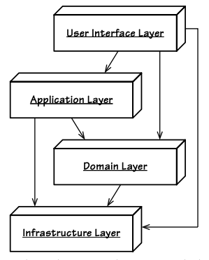
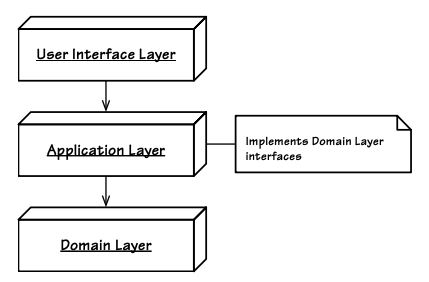
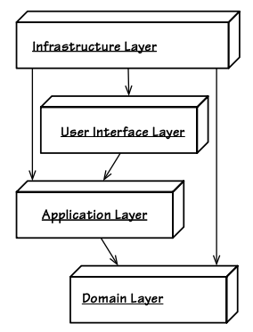
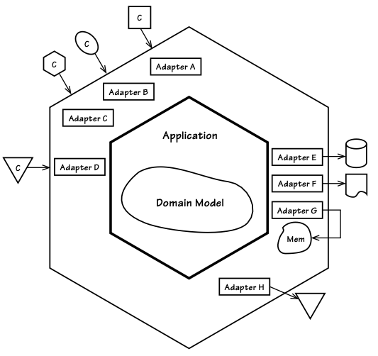
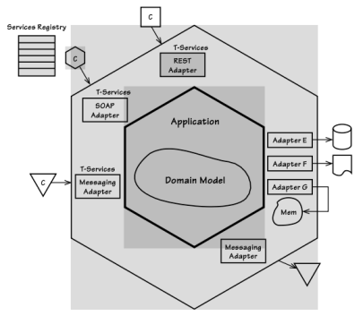
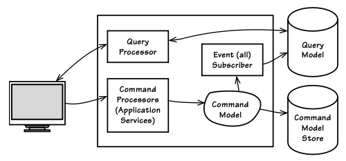
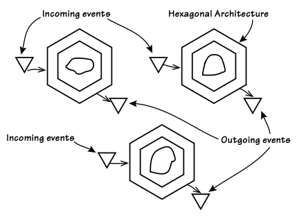
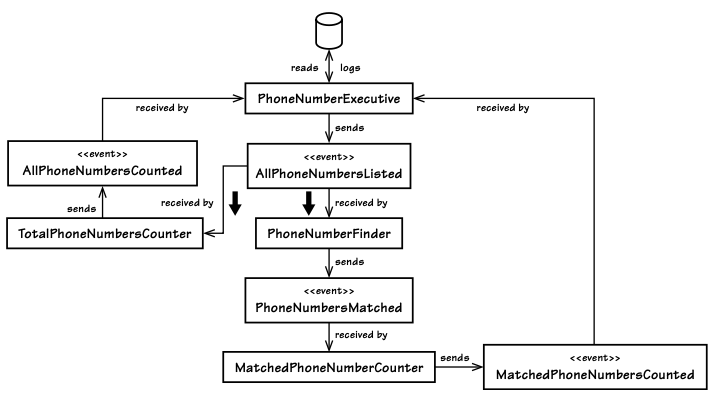
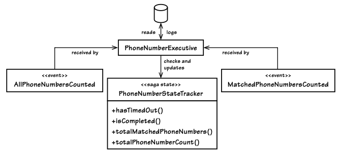
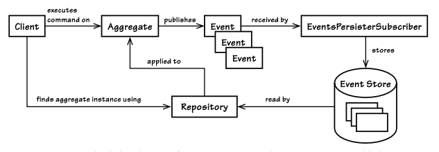

# Mimari (Architecture)

> Mimari, kendi zamanını ve yerini anlatmalı, ancak zamansızlığa özlem duymalıdır.
>
>— Frank Gehry

DDD'nin en büyük avantajlarından biri, belirli bir mimariyi zorunlu kılmamasıdır.
Özenle oluşturduğumuz Core Domain (Çekirdek Alan) (2), Bounded Context (Sınırlı Bağlam) (2) içinde yer aldığı için, bir veya daha fazla mimari yaklaşımın tüm uygulama veya sistem üzerinde etkili olmasını sağlar. Bazı **mimari etkiler** doğrudan alan modelinin etrafında şekillenir ve genel bir etkiye sahiptir,  bazıları ise belirli ihtiyaçlara odaklanır. Buradaki _amaç, doğru mimari seçimleri ve desenleri bir araya getirmektir._

Gerçek yazılım kalite gereksinimleri, hangi mimari stillerin ve desenlerin kullanılacağını belirlemelidir.  
Seçilen mimari ve desenler, bu kalite gereksinimlerini karşıladığından veya aştığından emin olmalıdır.

-   Gereğinden fazla mimari karmaşıklık getirmek, doğru seçim yapmak kadar tehlikelidir.    
-   Mimariyi, yalnızca başarısızlık riskini azaltmak için kullanmalıyız.
-   Gereksiz bir mimari yaklaşımı haklı çıkaramıyorsak, onu sistemimizden çıkarmalıyız.
    

Bir mimari stil veya deseni seçme yeteneğimiz, kullanılabilir işlevsel gereksinimlerle (ör. kullanım senaryoları, kullanıcı hikayeleri, alan modeline özgü senaryolar) sınırlıdır. Bu nedenle, işlevsel gereksinimler olmadan doğru mimari seçimleri yapamayız. Bu da, kullanım senaryolarına dayalı bir mimari yaklaşımın günümüzde hâlâ geçerli olduğunu gösterir.

> ***Bu Bölümde Ele Alınacak Konular***
>
> - SaaSOvation’ın CIO’su ile yapılan retrospektif bir röportajı inceleyin.
> - Katmanlı Mimari’nin (Layered Architecture) Bağımlılık Tersine Çevirme Prensibi (DIP) ve Altıgen Mimari (Hexagonal) ile nasıl geliştirildiğini görün.
> - Hexagonal mimarinin, Servis Odaklı (SOA) ve REST tabanlı sistemleri nasıl desteklediğini keşfedin. 
> - Data Fabric veya Grid Tabanlı Dağıtık Önbellek ve Event-Driven Mimariyi değerlendirin.
> - CQRS’in DDD ile nasıl fayda sağladığını anlayın.
> - SaaSOvation ekiplerinin kullandığı mimari yaklaşımlardan ders çıkarın.

> ***Mimari, Sadece "Havalı" Görünmek İçin Kullanılmaz!***
>
> Aşağıdaki mimari stiller ve desenler, her projeye uygulanabilecek "havalı araçlar" değildir. Bunları yalnızca gerçek bir ihtiyacı karşıladığında ve proje başarısızlık riskini azalttığında kullanmalıyız.

---

[Evans], Katmanlı Mimariyi (Layers Architecture) merkeze aldı. Bu nedenle, SaaSOvation ekibi başlangıçta DDD’nin yalnızca bu iyi bilinen desenle etkili olabileceği sonucuna vardı. Ancak zamanla, DDD’nin bundan çok daha esnek olduğunu anladılar. [Evans] yazıldığında dönemde Katmanlı Mimari en popüler yaklaşım olsa da, DDD’nin yalnızca bununla sınırlı olmadığı fark edildi.

----------

Katmanlı Mimari prensipleri, hâlâ iyi kararlar almayı yönlendiren bir rehber olarak kullanılabilir.   Ancak burada durmamıza gerek yok! Gerektiğinde daha modern mimarileri ve desenleri ele alacağız. Bu da DDD’nin ne kadar esnek ve geniş çapta uygulanabilir olduğunu kanıtlayacak.

Elbette, SaaSOvation ekibi tüm mimari yaklaşımları aynı anda uygulamak zorunda değildi.  
Ancak ellerindeki seçeneklerden en doğru olanlarını seçmeleri gerekiyordu.

## Başarılı Bir CIO (Chef Information Officer) ile Röportaj

Bu bölümde, ele alınan mimari yaklaşımların neden kullanıldığına dair bir perspektif sunmak için on yıl sonrasına bir yolculuk yapacağız ve SaaSOvation’ın CIO’su ile konuşacağız. Şirketin başlangıçları mütevazıydı, ancak ***mimari kararlar her adımda başarının anahtarı oldu.*** Hadi, TechMoney programının sunucusu Maria Finance-Ilmundo ile birlikte bu röportaja kulak verelim...

**Maria:** Bu akşamki özel konuğum, büyük bir başarı hikayesine imza atan SaaSOvation’ın CIO’su Mitchell Williams. Şu an devam eden _"Mimari Tarzlarınızı Tanıyın"_ serimizde, ***doğru mimari seçimlerin nasıl kalıcı bir başarı getirdiğini*** tartışacağız. Mitchell, programımıza hoş geldiniz ve katıldığınız için teşekkürler.

**Mitchell:** Burada olmak çok güzel, Maria. Her zaman keyif alıyorum.

**Maria:** Bize erken dönemde aldığınız mimari kararları ve bunları neden tercih ettiğinizi anlatabilir misiniz?

**Mitchell:** Tabii ki! Belki inanmayacaksınız ama ilk başta projelerimizi masaüstü dağıtımı etrafında planlıyorduk. Ekibimiz, masaüstü uygulamasının merkezi bir veritabanına kaydetmek üzere tasarlanmasını sağladı. Bu yaklaşım için Katmanlı Mimariyi (Layers Architecture) seçtik.

**Maria:** Peki, bu mantıklı mıydı?

**Mitchell:** Bizce öyleydi. Çünkü yalnızca tek bir uygulama katmanı ve merkezi bir veritabanı ile çalışıyorduk. Bu yapı, basit bir istemci-sunucu (client-server) modelinde bizim için yeterliydi.

**Maria:** Ama çok geçmeden işler değişti, değil mi?

**Mitchell:** Kesinlikle! Bir iş ortağıyla güçlerimizi birleştirdik ve SaaS abonelik modeli ile ilerlemeye karar verdik. Bunu desteklemek için önemli bir finansman arayışına girdik ve bunu başardık.  
Öncelikle bir dizi iş birliği aracı geliştirmeye odaklanarak _çevik proje yönetimi uygulamamızı_ bir süreliğine arka planda tuttuk. Bunun iki temel faydası oldu:

1. Hızla büyüyen iş birliği pazarına (collaboration market) girdik. 
2. Proje yönetimi uygulamamıza doğal bir eklenti olarak bir iş birliği modülü oluşturduk.

Bildiğiniz gibi, yazılım geliştirme projelerinde iş birliği yapmak çok kritik bir konudur.

**Maria:** Oldukça ilginç. Kararlarınızın sizi nereye götürdüğünü anlatır mısınız?

**Mitchell:** Yazılım karmaşıklığı arttıkça, kaliteyi yönetmek için birim (unit) ve özellik (feature) test araçları kullanmamız gerekti. Bunu yapmak için Katmanlı Mimaride tersine mühendislik yaparak Dependency Inversion Prensibini (DIP) uyguladık. Bu çok önemliydi çünkü ekip, UI ve Altyapı Katmanlarını (Infrastructure Layer) devre dışı bırakarak Application ve Domain Katmanlarını bağımsız olarak test edebiliyordu. Aslında, UI'yi izole olarak geliştirebilir ve veritabanı teknolojisine karar vermeyi erteleyebilirdik. Bu, Katmanlı Mimariyi (Layers) tamamen terk etmekten ziyade onun doğal bir evrimiydi ve ekibimiz için rahat bir geçiş oldu.

**Maria:** Vay canına! Kullanıcı arayüzünü ve veritabanını değiştirebilmek oldukça riskli görünüyor. Bunu yapmak zor oldu mu?

**Mitchell:** Aslında hiç de zor olmadı. DDD'nin taktik desenlerini (tactical patterns) kullanmamız bu süreci çok kolaylaştırdı. Örneğin, _Aggregate Pattern_ ve _Repositories_ sayesinde öncelikle bellek içi (in-memory) veri saklama çözümleri ile geliştirme yapabilir ve veritabanı teknolojisini daha sonra entegre edebilirdik.

**Maria:** Vay.

**Mitchell:** Kesinlikle.

**Maria:** Ve sonra?

**Mitchell:** Boom! İşler yolunda gitti. _CollabOvation ve ProjectOvation_ ürünlerini çıkardık ve ardışık kârlı çeyrek dönemler yaşadık.

**Maria:** Ka-ching!

**Mitchell:** Kesinlikle! Daha sonra, masaüstü tarayıcılar için geliştirdiğimiz uygulamayı mobil cihazları da destekleyecek hale getirmek istedik. Bunun için REST mimarisini benimsedik.   Bu sırada abone olan şirketler, kimlik yönetimi, güvenlik ve gelişmiş proje yönetimi araçları talep etmeye başladı. Ayrıca, yeni yatırımcılar, iş zekası panellerinden (BI-Business Intelligence dashboards) gelen raporları görmek istiyorlardı.

**Maria:** Harika! Yani sadece mobil değil, birçok yeni ihtiyaç ortaya çıktı. Bunları nasıl yönettiniz?

**Mitchell:** Ekibimiz, _Hexagonal Mimariyi (Ports and Adapters)_ kullanmanın en iyi seçenek olduğunu düşündü. Bu yaklaşım sayesinde, yeni istemci türlerini neredeyse bir defaya mahsus şekilde ekleyebiliyorduk. Aynı şekilde, NoSQL ve mesajlaşma (messaging) gibi yeni çıkış noktalarını (output ports) da kolayca entegre edebildik. Ve bütün bunlar bizi ***cloud***'a buluta taşıdı.

**Maria:** Peki, bu değişiklikler konusunda kendinize güvendiniz mi?

**Mitchell:** Kesinlikle.

**Maria:** Bu büyük bir olay! Eğer tüm bu değişikliklerden zarar görmediyseniz, demek ki doğru seçimleri yapmışsınızdır.

**Mitchell:** Aynen öyle! Her ay yüzlerce yeni müşteri ekliyorduk. Eski sistemlerden veri taşımak için bir servis geliştirdik ve SOA mimarisini kullanarak bu süreçleri daha iyi yönetmeyi başardık.

**Maria:** Harika. Yani SOA’yı sadece "havalı" olduğu için değil, gerçekten ihtiyaç duyduğunuzda uyguladınız.

**Mitchell:** Evet, Maria, aslında en başından beri benimsediğimiz yaklaşım buydu. Bu bizim başarı için yol haritamızdı. Örneğin, zaman içinde ***TrackOvation*** adlı hata takip yazılımını ekledik ve bu, ProjectOvation ile entegre çalıştı. ProjectOvation’ın özellikleri arttıkça, kullanıcı arayüzü de giderek daha sofistike hale geldi. Scrum ürünleri ve sistemlerindeki hataların tamamını gösteren Ürün Sahibi panosu, her uygulama komutu ve ilgili olay gerçekleştiğinde anlık olarak güncellendi. Abone olan farklı kiracılardaki Ürün Sahipleri, panoları farklı şekillerde görüntülemeyi tercih ettiğinden, arayüz daha da karmaşık hale geldi. Ve elbette, mobil cihazları da desteklememiz gerekti. Ekip, ***CQRS mimari desenini dahil etmenin avantajlarını*** değerlendirdi.

**Maria:** CQRS mi? Hadi ama Mitch, bu bayağı karmaşık bir konu. Bunun nasıl sonuçlanacağını bilemediğimiz belirsizliklerden biri miydi? Yoksa uçurumdan aşağı adım atmak gibi bir risk mi taşıyordu?

**Mitchell:** Hayır, pek sayılmaz. Ekip, command ve query dünyaları arasındaki sürtünmeyi azaltmak için CQRS kullanmak adına geçerli bir neden bulduğunda, tam gaz ilerledi ve bir daha asla geriye bakmadı.

**Maria:** Aynen öyle. Bu, abonelerinizin dağıtık işlem gerektiren özellikler istemeye başladığı zaman değil miydi?

**Mitchell:** Evet; bunu doğru yapmasaydık kısa sürede karmaşıklık içinde boğulabilirdik. Bazı özellikler, bir sonuca ulaşmadan önce bir dizi dağıtılmış süreçten geçmeyi gerektiriyordu. ProjectOvation ekibi, kullanıcıyı bu potansiyel olarak uzun sürebilecek işlemler için bekletmek ve zaman aşımı riskiyle karşı karşıya bırakmak istemedi. Bu yüzden, tamamen Event-Driven bir Mimariyi hayata geçirdiler ve bu süreci yönetmek için ***klasik "Pipes and Filters" desenini*** kullandılar.

**Maria:** Ama bu, Karmaşıklık Yolu'ndaki yolculuğunuzun sonu değildi, değil mi? Ne kadar zorluydu?

**Mitchell:** Haha, hayır, hayır. Öyle bir şey asla olmadı gibi görünüyor. Ancak, zeki bir ekibiniz varsa, Karmaşıklık Yolu parkta yürüyüş yapmak gibi gelir. Aslında, Olay Tabanlı Mimari, genişleyen sistem paketinin birçok alanını basitleştirdi.

**Maria:** Doğru, bu. Devam et. Bu belli bir fırsattı. Hikayenin en sevdiğim kısmına geliyoruz. Biliyorsun... [gözleri parlıyor $$$]

**Mitchell:** Mimari yapımız, o kadar hızlı ölçeklenmemizi ve değişimi o kadar iyi yönetmemizi sağladı ki, RoaringCloud, SaaSOvation'ı satın aldı ... yani, bunun hepsi kamuya açık bir kayıt meselesi.

**Maria:** Derim ki, çok da kamuya açık bir durumdu. Hisse başına 50 dolardan, yaklaşık 3 milyar dolarlık bir kamu kaydıydı.

**Mitchell:** Finansal veriler konusunda gerçekten iyi bir hafızan var! Ve bu, entegrasyonu doğru yapabilmek için ciddi bir teşvikti. Yeni abonelerle birlikte kullanıcı tabanı, ProjectOvation altyapısını zorlamaya başladı. Artık Pipes and Filters'ı dağıtmak ve paralel hale getirme zamanıydı. Bu da uzun süreli işlemler eklemeyi gerektiriyordu, ki bunlara bazen ***Sagas*** denir.

**Maria:** Harika. Kesinlikle eğlenceli diyebilir misiniz?

**Mitchell:** Eğlenceliydi, ancak daha da önemlisi gereklilikti.

**Maria:** Ve eğlence sona ermemiş gibi görünüyor. Başarı hikayenizde belki de en beklenmedik ve şok edici bölüm bir sonraki adım oldu, değil mi?

**Mitchell:** Bunu biliyorsun. Artık RoaringCloud, pazarda abonelik uygulamalarının ve milyonlarca kullanıcının çokluğu nedeniyle bir tekel haline gelmişti ve hükümet bu durumu fark etti ve sektörü düzenlemeye başladı. Yeni bir yasa çıkarıldı ve RoaringCloud'dan her proje değişikliğini takip etmesi istenmeye başlandı. Aslında, bu uyumluluk durumunu domain modelinin doğal bir parçası olarak en iyi şekilde ele almanın yolu ***Event Sourcing*** kullanmaktı.

**Maria:** Vay, tam hazırlıklısınız! Gerçekten de deli bir durum.

**Mitchell:** Evet, aslında **çılgınca iyi bir problem bu**.

**Maria:** Beni en çok etkileyen şey şu ki, tüm bu yıllar boyunca uygulamalarınızın temeli DDD yazılım modellerine dayanıyordu. Ama kesinlikle DDD size zarar vermedi. Bu süreç boyunca herhangi bir zorluk yaşamadınız gibi görünüyor.

**Mitchell:** Aslında tam tersi oldu. DDD’yi erken seçip onu tamamen anlamak için zaman ayırdığımız için, kaçamayacağımız ve istemediğimiz iş durumları bile kolayca yönetildi.

**Maria:** Benim de dediğim gibi, "Ka-ching!" Bir kez daha teşekkürler Mitchell. Burada, _"Doğru mimariyi seçmenin nasıl kalıcı bir başarı getirdiğini"_ öğrendik.  _"Know Your Architectural $tyles"_ programında tekrar görüşmek üzere.

**Mitchell:** Benim için de bir zevkti, Maria. Davet ettiğiniz için teşekkür ederim.

Bu röportaj, **mimari etkilerin nasıl DDD ile entegre edilebileceğini** ve **her bir yaklaşımın en uygun zamanda nasıl devreye alınabileceğini** gösteren harika bir örnek sunuyor. 🚀

## Katmanlar (Layers)

Layered Architecture [Buschmann et al.] deseni, birçok kişi tarafından tüm mimarilerin atası olarak kabul edilir. N-tiers (çok katmanlı) sistemleri destekler ve bu nedenle genellikle Web, kurumsal ve masaüstü uygulamalarında kullanılır. Burada, uygulamamızın veya sistemimizin çeşitli endişelerini iyi tanımlanmış katmanlara ayırırız.

> **Domain modelinin** ve **iş mantığının** ifadesini izole eder ve altyapı, kullanıcı arayüzü ya da iş mantığı olmayan herhangi bir uygulama mantığına olan bağımlılığı ortadan kaldırırız. Karmaşık bir programı katmanlara böleriz. Her katmanda, yalnızca alt katmanlara bağımlı olan, uyumlu bir tasarım geliştiririz. [Evans, Ref, p. 16]

Şekil 4.1, geleneksel Katmanlar Mimarisi kullanan bir DDD uygulamasında yaygın olan katmanları gösterir. Burada, izole edilmiş **Core Domain**, mimarideki bir katmanda yer alır. Üstünde **UI** ve **Uygulama Katmanları**, altında ise **Altyapı Katmanı** bulunur.



**Figure 4.1:** DDD'nin uygulandığı geleneksel Katmanlar Mimarisi

Bu mimarinin temel kuralı, her katmanın yalnızca kendisine ve altındaki katmanlara bağımlı olmasıdır. Bu tarz içinde bazı farklılıklar bulunmaktadır. **Sıkı Katmanlar Mimarisi**, yalnızca doğrudan altındaki katmana bağlanmaya izin veren bir yaklaşımdır. **Gevşek Katmanlar Mimarisi** ise, herhangi bir üst düzey katmanın altındaki herhangi bir katmana bağlanmasına izin verir. Çünkü, _Kullanıcı Arayüzü_ ve _Uygulama Servisleri_ genellikle altyapıyı kullanması gerektiğinden, çoğu sistem Gevşek Katmanlar Mimarisi üzerine kuruludur.

Alt katmanlar, üst katmanlarla doğrudan bağlantıya sahip olmasa da, **Observer** veya **Mediator** gibi bir mekanizma kullanarak gevşek bir şekilde üst katmanlara bağlanabilirler [Gamma et al.]. Alt katmandan üst katmana doğrudan bir referans bulunmaz. Örneğin, Mediator kullanıldığında, üst katman, alt katman tarafından tanımlanan bir arayüzü uygular, ardından uygulayan nesneyi alt katmana argüman olarak gönderir. Alt katman, uygulayan nesneyi, nerede yer aldığı konusunda herhangi bir bilgi sahibi olmadan kullanır.

Kullanıcı Arayüzü, yalnızca kullanıcı görünümü ve istekleriyle ilgili endişeleri ele alan kodları içermelidir. Domain/iş mantığı içermemelidir. Bazıları, Kullanıcı Arayüzü'nün doğrulama gerektirdiği için iş mantığını içermesi gerektiğini düşünebilir. Ancak, Kullanıcı Arayüzü'nde bulunan doğrulamalar, yalnızca domain modelinde bulunması gereken doğrulamalarla aynı türden değildir (yalnızca). **Entities (5)** bölümünde de tartışıldığı gibi, yalnızca domain modelinde derin iş bilgilerini ifade eden kaba doğrulamaları sınırlamak istiyoruz.

Eğer UI bileşenleri domain modelinden nesneler kullanıyorsa, bu genellikle yalnızca verilerini ekranda render etmekle sınırlıdır. Bu yaklaşımı kullanırken, **Presentation Model (14)** kullanılarak görünümün domain nesneleri hakkında bilgi sahibi olmasının önüne geçilebilir.

Bir kullanıcı insan olabileceği gibi başka sistemler de olabilir, bu nedenle bazen bu katman, **Open Host Service (13)** şeklinde bir API servislerinin uzaktan çağrılmasını sağlamak için olanaklar sunar.

UI bileşenleri, **Application Layer**'nın doğrudan istemcileridir.

**Application Services (14)**, Application Layer'da bulunur. **Domain Servisleri (7)**'nden farklıdırlar ve bu nedenle domain mantığından yoksundur. Persistence transaction ve security gibi konuları kontrol edebilirler. Ayrıca, diğer sistemlere yönelik Event tabanlı bildirimler göndermek veya kullanıcılara e-posta mesajları göndermek gibi işlemlerden sorumlu olabilirler. Domain modelinin doğrudan istemcileridir ancak kendileri iş mantığı içermez. Son derece hafif olurlar ve **Aggregate (10)** gibi domain nesneleri üzerinde gerçekleştirilen işlemleri koordine ederler. Uygulama Servislerinin birincil işlevi, model üzerindeki kullanım senaryolarını veya kullanıcı hikayelerini ifade etmektir. Dolayısıyla, bir Application Service'in ortak işlevi, Kullanıcı Arayüzü'nden parametreler alıp, bir **Repository (12)** kullanarak bir Aggregate örneği elde etmek ve ardından bu örnek üzerinde bazı komut işlemleri gerçekleştirmektir:

```java
@Transactional
public void commitBacklogItemToSprint(String aTenantId, String aBacklogItemId, String aSprintId) {
	TenantId tenantId = new TenantId(aTenantId); 
	
	BacklogItem backlogItem = backlogItemRepository.backlogItemOfId( 
		tenantId,
		new BacklogItemId(aBacklogItemId)); 

	Sprint sprint = sprintRepository.sprintOfId(tenantId, new SprintId(aSprintId)); 

	backlogItem.commitTo(sprint);
}
```

Eğer Application Service, bundan çok daha karmaşık hale gelirse, bu muhtemelen domain mantığının servis içine sızdığının ve modelin anemik hale geldiğinin bir göstergesidir. Bu nedenle, bu model istemcilerini çok ince tutmak en iyi uygulamadır. Yeni bir Aggregate oluşturulması gerektiğinde, Application Service, **Factory (11)** veya Aggregate'in constructor'ını kullanarak onu başlatır ve ardından ilgili Repository'yi kullanarak kalıcı hale getirir. Application Service, ayrıca bazı domain-specific görevlerini yerine getirmek için bir **Domain Servisi**'lerini kullanabilir; bu, stateless bir işlem olarak tasarlanmıştır.

Eğer domain modeli **Domain Events (8)** yayınlamak üzere tasarlandıysa, Application Layer herhangi bir sayıda **Event**'e abone olmak için aboneler kaydedebilir. Bu, **Events**'lerin saklanmasını, iletilmesini ve başka şekilde uygulamanın görevlerinden biri olarak ele alınmasını sağlar. Bu, domain modelinin yalnızca kendi temel endişelerini bilmesini sağlar ve **Domain Event Publisher (8)**'ın hafif kalmasını ve mesajlaşma altyapısı bağımlılıklarından kurtulmasını sağlar.

⚠️ Domain modeli, tüm iş mantığını içerdiği için diğer bölümlerde uzun uzadıya tartışılmaktadır, burada tekrar edilmemektedir. Bununla birlikte, domain ve geleneksel Layers kullanımı ile ilgili bazı zorluklar bulunmaktadır. Layers kullanmak, Domain Katmanının Infrastructure'ı sınırlı bir şekilde kullanmasını gerektirebilir. Bununla, temel domain nesnelerinin bunu yapmasını kastetmiyorum; bu kesinlikle tamamen kaçınılması gereken bir şeydir. Ancak, Layers tanımına sadık kalmak, Domain Katmanında Infrastructure tarafından sağlanan teknolojilere dayanan bazı arabirimlerin implementasyonlarını gerektirebilir.

Örneğin, Repository interface'leri, Infrastructure içinde barındırılan kalıcılık mekanizmaları gibi bileşenleri kullanan implementasyonlar gerektirir. Peki ya Repository interface'leri sadece Infrastructure içinde implement etsek? Çünkü Infrastructure Katmanı, Domain Katmanının altındadır, bu durumda Infrastructure'dan Domain'e yapılan referanslar Layers Architecture kurallarını ihlal eder. Yine de, bunun önlenmesi, temel domain nesnelerinin Infrastructure'a bağlanacağı anlamına gelmez. Bunu önlemek için, teknik sınıfları gizlemek için **implementation Modules (9)** kullanabiliriz:

`com.saasovation.agilepm.domain.model.product.impl`

Modüller (9) bölümünde belirtildiği gibi, `MongoProductRepository` bu paket içinde barındırılabilir. Ancak, bu sorunu ele almanın tek yolu bu değildir. Bunun yerine, bu tür arabirimleri Application Layer içinde implement etmeyi tercih edebiliriz, böylece Layers kurallarını korumuş oluruz. Şekil 4.2, bu yaklaşımın bir örneğini sunmaktadır. Ancak, bunu yapmak biraz hoş olmayan bir çözüm gibi görünebilir.

Daha iyi bir yol vardır, bu ***Dependency Inversion Principle*** başlıklı bölümde tartışılmıştır. 
 
Geleneksel bir Katmanlı Mimaride, Infrastructure en alttadır. Kalıcılık ve mesajlaşma mekanizmaları gibi şeyler burada yer alır. Mesajlar, kurumsal mesajlaşma ara katmanları veya daha temel e-postalar (SMTP) veya metin mesajları (SMS) gibi şeyleri içerebilir. Uygulamaya düşük seviyede hizmetler sağlayan tüm teknik bileşenleri ve çerçeveleri düşünün. Bunlar genellikle Infrastructure'ın bir parçası olarak kabul edilir. Daha yüksek seviyedeki katmanlar, daha alt seviyedeki bileşenlere bağlanarak sağlanan teknik imkanları yeniden kullanır. Bu durumda, tekrar belirtmek gerekirse, core domain model nesnelerinin Infrastructur*'a bağlanması fikrini reddetmek istiyoruz.



**Figure 4.2:** Application Layer, Domain Layer tarafından tanımlanan interface'lerin bazı teknik uygulamalarını barındırabilir.

---

SaaSOvation takımları, Infrastructure Layer'ın en altta olmasının bazı dezavantajlar sunduğunu fark etti. Birincisi, Domain Layer tarafından gereken teknik yönlerin implementasyonunun, Layers kurallarının ihlal edilmesi gerektiği için biraz tatsız hale gelmesiydi. Ayrıca, kodları test etmek oldukça zor oluyordu. Bu dezavantajı nasıl aşabilirlerdi?

---

Katmanların sırasını biraz ayarlayarak daha tatlı bir çözüm bulabilir miydik?

### Bağımlılık Tersine Çevirme Prensibi (Dependency Inversion Principle)

Geleneksel Layers Architecture üzerinde, bağımlılıkların işleyiş şeklini ayarlayarak iyileştirme yapmanın bir yolu vardır. **Dependency Inversion Principle (DIP)**, Robert C. Martin tarafından öne sürülmüş ve [Martin, DIP]'te açıklanmıştır. Resmi tanım şu şekilde ifade edilmektedir:

> Yüksek seviyedeki modüller, düşük seviyedeki modüllere bağımlı olmamalıdır. Her ikisi de soyutlamalara bağımlı olmalıdır.
>
> Soyutlamalar, detaylara bağımlı olmamalıdır. Detaylar, soyutlamalara bağımlı olmalıdır.

Bu tanımın özünde, düşük seviyeli hizmetleri sağlayan bir bileşenin (bu tartışma için Infrastructure), yüksek seviyeli bileşenler (bu tartışma için UI, Application ve Domain) tarafından tanımlanan arayüzlere bağımlı olması gerektiği ifade edilmektedir. DIP kullanan bir mimarinin birçok farklı şekilde ifade edilmesi mümkün olsa da, bunu Şekil 4.3'te gösterilen yapıya indirgemek mümkündür.

> ***DIP Gerçekten Tüm O Katmanları Destekler mi?***
> 
> Bazıları, DIP'nin sadece iki katmandan oluştuğunu düşünebilir: biri üstte, diğeri altta. Üstteki katman, alttaki katmanda tanımlanan arayüz soyutlamalarını uygular. Şekil 4.3'ü buna uyacak şekilde ayarladığınızda, Infrastructure Layer üstteki katman olurken, User Interface Layer, Application Layer ve Domain Layer alttaki katmanları oluşturur. Bu bakış açısını veya DIP mimarisinin bu şekilde görsel bir sunumunu tercih edip etmeyeceğiniz size bağlıdır. Endişelenmeyin, **Hexagonal Architecture** [Cockburn] veya **Ports and Adapters Architecture** tüm bunların gittiği yön olacaktır.



**Figure 4.3:** Bağımlılık Tersine Çevirme İlkesi kullanıldığında olası Katmanlar. Infrastructure Katmanını diğerlerinin üzerine taşıyarak aşağıdaki tüm Katmanlar için arayüzler uygulamasını sağlıyoruz.

Şekil 4.3'teki mimariye göre, Domain katmanında tanımlanan bir interface için Infrastructure katmanında implementasyonu olan bir Repository'imiz olacaktır:

````java
package com.saasovation.agilepm.infrastructure.persistence;

import com.saasovation.agilepm.domain.model.product.*;

public class HibernateBacklogItemRepository implements BacklogItemRepository {
    ...
    @Override
    @SuppressWarnings("unchecked")
    public Collection<BacklogItem> allBacklogItemsCommitedTo(Tenant aTenant, SprintId aSprintId) {
        Query query = this.session().createQuery("from -BaklogItem as _obj_ where _obj_.tenant = ? and _obj_.sprintId = ?");

        query.setParameter(0, aTenant);
        query.setParameter(1, aSprintId);

        return (Collection<BacklogItem>) query.List();
    }
    ...
}
````

Domain katmanına odaklanırsak, DIP kullanmak, Domain ve Infrastructure katmanlarının, domain model tarafından tanımlanan soyutlamalara (interfaces) bağımlı olmasını sağlar. Application Layer doğrudan Domain katmanının istemcisidir ve Domain interface'lerine bağımlıdır. Bu sayede, Repository ve Domain Service gibi teknik implementasyon sınıflarına Infrastructure tarafından dolaylı bir şekilde erişebilir. Implementasyonları edinmenin birkaç yolu olabilir, bunlar arasında **Dependency Injection**, **Service Factory** ve **Plug In** [Fowler, P of EAA] yer alır. Kitap boyunca kullanılan örneklerde, Spring Framework tarafından sağlanan Dependency Injection ve bazen Service Factory sınıfı olan DomainRegistry kullanılmıştır. Aslında, DomainRegistry, Spring'i kullanarak domain modeli tarafından tanımlanan arayüzleri implement eden bean'lere, bunlar arasında Repositories ve Domain Services de dahil olmak üzere referanslar aramak için kullanır.

İlginç bir şekilde, DIP'nin bu mimari üzerindeki etkisini düşündüğümüzde, aslında artık hiç katman olmadığı sonucuna varabiliriz. Hem yüksek seviyeli hem de düşük seviyeli endişeler yalnızca soyutlamalara bağımlıdır, bu da yığılımın (stack) çökeceği anlamına gelir. Peki, bu mimariyi tamamen tersine çevirmeyi ve biraz daha simetri eklemeyi düşündüğümüzde nasıl olur? Şimdi bunun nasıl çalıştığına bakalım.

## Hexagonal veya Ports ve Adapters

Hexagonal Mimari (Alistair Cockburn tarafından şekillendirilen), simetri üretmek için bir tarz önerir. Bu hedefi, çok çeşitli istemcilerin sistemi eşit şekilde etkileşimde bulunabilmesini sağlayarak ilerletir. Yeni bir istemci mi gerekiyor? Sorun değil. Sadece, verilen istemcinin girişini, iç uygulamanın API'sinin anlayabileceği bir forma dönüştürmek için bir ***Adapter*** ekleyin. Aynı zamanda, sistemin kullandığı çıktı mekanizmaları, örneğin grafikler, kalıcılık ve mesajlaşma, çeşitli ve değiştirilebilir olabilir. Bu, uygulama sonuçlarını, belirli bir çıktı mekanizmasının kabul edeceği bir forma dönüştüren bir Adapter oluşturularak mümkündür.

Bunu tartışırken, bu mimarinin zamanlar üstü bir potansiyele sahip olduğunu kabul edebilirsiniz. Bugün, Layers Architecture kullandığını söyleyen birçok ekip aslında bunun yerine Hexagonal kullanıyor. Bunun bir nedeni de, şu anda bazı formda Dependency Injection kullanan projelerin sayısının artmış olmasıdır. Dependency Injection'ın otomatik olarak Hexagonal olduğu söylenemez. Sadece, Ports and Adapters tarzı bir mimari geliştirmeye doğal olarak eğilimli bir şekilde bir mimari üretmeyi teşvik eder. Her halükarda, daha kapsamlı bir anlayış bu noktayı netleştirecektir.

Genellikle, istemcilerin sistemle etkileşime girdiği yeri "front end" olarak düşünürüz. Benzer şekilde, uygulamanın kalıcı verileri aldığı, yeni kalıcı verileri depoladığı veya çıktıyı gönderdiği yer, "back end" olarak kabul edilir. Ancak **Hexagonal** mimari, bir sistemin alanlarını farklı bir şekilde ele almayı teşvik eder, bu da Şekil 4.4'te gösterildiği gibi. İki ana alan vardır: ***outside*** ve ***inside***. Dış alan, çeşitli istemcilerin _input_ göndermesine olanak tanırken, aynı zamanda kalıcı verileri almak, uygulamanın çıktısını (örneğin veritabanı) depolamak veya başka bir yere göndermek (örneğin mesajlaşma) için mekanizmalar sağlar.



**Figure 4.4:** Hexagonal Mimari, Ports and Adapters olarak da bilinir. Dış tiplerin her biri için Adaptörler vardır. Dışarısı içeriye uygulamanın API'si aracılığıyla ulaşır.

Şekil 4.4'te her istemci türünün kendi **Adapter**'ı vardır, bu da giriş protokollerini, uygulamanın API'siyle uyumlu hale getiren giriş verilerine dönüştürür—iç kısım. Altıgenin her bir kenarı, giriş veya çıkış için farklı bir **Port** türünü temsil eder. Üç istemci, aynı türdeki giriş Port'u (Adapter A, B ve C) üzerinden istek gönderirken, biri farklı bir Port türünü kullanır (Adapter D). Belki üçü HTTP (tarayıcı, REST, SOAP vb.) kullanırken, diğeri AMQP (örneğin, RabbitMQ) kullanıyordur. Bir Port'un anlamı için çok net bir tanım yoktur, bu yüzden esnek bir kavramdır. Port'lar hangi şekilde bölünürse bölünsün, istemci istekleri gelir ve ilgili Adapter, girişlerini dönüştürür. Ardından, uygulama üzerinde bir işlem çağırır veya uygulamaya bir olay gönderir. Böylece kontrol içeriye aktarılır.

> ***Muhtemelen Port'ları Kendimiz Uygulamıyoruz***
>
> Aslında, Port'ları genellikle kendimiz uygulamayız. Bir Port'u HTTP olarak düşünün ve Adapter'ı Java Servlet veya JAX-RS anotasyonlu bir sınıf olarak kabul edin; bu sınıf, bir konteynerden (JEE) veya bir çerçeveden (RESTEasy veya Jersey) metod çağrılarını alır. Veya NServiceBus veya RabbitMQ için bir mesaj dinleyicisi oluşturabiliriz. Bu durumda, Port daha çok mesajlaşma mekanizmasıdır ve Adapter, mesaj dinleyicisi olacaktır, çünkü mesaj dinleyicisinin sorumluluğu, mesajdan verileri alıp, bunları uygulamanın API'sine (domain modelinin istemcisi) geçmek için uygun parametrelere çevirmektir.

> ***Uygulamayı Fonksiyonel Gereksinimlere Göre Tasarlayın***
> 
> Hexagonal kullanırken, uygulamayı, desteklenen istemci sayısından değil, kullanım senaryolarını (use case) göz önünde bulundurarak tasarlarız. Herhangi bir sayıda ve türde istemci, çeşitli Port'lar aracılığıyla istek gönderebilir, ancak her Adapter, aynı API'yi kullanarak uygulamaya yönlendirme yapar.

Uygulama, istekleri API'si aracılığıyla alır. Uygulama sınırı veya iç hexagon, aynı zamanda kullanım senaryosu (ya da kullanıcı hikayesi) sınırıdır. Diğer bir deyişle, kullanım senaryolarını uygulamanın fonksiyonel gereksinimlerine dayanarak oluşturmalıyız, çeşitli istemcilerin veya çıktı mekanizmalarının sayısına göre değil. Uygulama, API'si aracılığıyla bir istek aldığında, iş mantığının yürütülmesini içeren tüm istekleri yerine getirmek için domain modelini kullanır. Böylece, uygulamanın API'si, Application Services'ın bir seti olarak yayınlanır. Burada tekrar, Application Services, domain modelinin doğrudan istemcisidir, Layers kullanırken olduğu gibi.

Aşağıdaki, JAX-RS kullanılarak yayımlanan bir RESTful kaynağını temsil etmektedir. Bir istek, HTTP giriş Port'u üzerinden gelir ve işleyici bir Adapter olarak hareket ederek, bir Application Service*e devreder:

```java
@Path("/tenants/{tenantId}/products")
public class ProductResource extends Resource { 

	private ProductService productService;
	...

	@GET
	@Path("{productId}")
	@Produces({ "application/vnd.saasovation.projectovation+xml" })
	public Product getProduct( 
		@PathParam("tenantId") String aTenantId,
		@PathParam("productId") String aProductId,
		@Context Request aRequest) { 

		Product product = productService.product(aTenantId, aProductId);
		if (product == null) {
			throw new WebApplicationException(Response.Status.NOT_FOUND);
		}

		return product; // serialized to XML using MessageBodyWriter
	} 
	...
}
```

Çeşitli JAX-RS açıklamaları, Adapter'ın önemli bir kısmını sağlar, kaynak yolunu çözümleyip parametrelerini String örneklerine dönüştürür. ProductService örneği enjekte edilir ve bu istek, uygulamanın iç kısmına yönlendirilir. Product, XML olarak serileştirilir ve bir Response içine yerleştirilir, ardından HTTP çıkış Port'u üzerinden gönderilir.

> ***JAX-RS Burada Odak Noktası Değil***
> Bu, uygulamanın ve domain modelinin iç kısmını kullanmanın sadece bir yoludur. Esasında, JAX-RS önemli değildir. Bunun yerine Restfulie kullanabiliriz ya da restify modülünü çalıştıran bir Node.js sunucusu oluşturabiliriz. Dahası, diğer Ports'tan gelen girdileri ele almak için tasarlanmış Adapters aynı API'ye yönlendirme yapacaktır, bunu göreceksiniz.

Uygulamanın sağ tarafındaki kısmı ne olacak? Repository implementasyonlarını, daha önce depolanan Aggregate örneklerine erişim sağlayan ve yenilerini depolayan **persistence Adapters** olarak düşünebiliriz. Diyagramda gösterildiği gibi (**Adapters E, F, ve G**), ilişkisel veritabanları, belge depoları, dağıtık önbellek ve bellek içi depolar için Repository implementasyonlarımız olabilir. Uygulama **Domain Event** mesajlarını dışarıya gönderiyorsa, mesajlaşma için farklı bir **Adapter (H)** kullanılacaktır. Çıkış mesajlaşma Adapter'ı, AMQP'yi destekleyen giriş Adapter'ının tersidir ve bu nedenle, kalıcılık için kullanılan Port'tan farklı bir Port'tan dışarıya çıkar.

✅ Hexagonal'ın büyük bir avantajı, Adapters'ların test amaçları için kolayca geliştirilebilmesidir. Uygulama ve domain modeli, istemciler ve depolama mekanizmaları var olmadan önce tasarlanabilir ve test edilebilir. Testler, `ProductService`'i HTTP/REST, SOAP ya da mesajlaşma Ports'ını desteklemek için herhangi bir karar verilmeden önce oluşturulabilir. UI wireframe'leri tamamlanmadan önce, her türlü test istemcisi geliştirilebilir. Proje için bir kalıcılık mekanizması seçilmeden çok önce, bellek içi Repositories kullanılabilir ve test amacıyla kalıcılığı taklit edebilir. Repositories (12) bölümünde, bellek içi implementasyonlar geliştirme hakkında daha fazla bilgi bulabilirsiniz. Teknik bileşenler eklenmeden, çekirdek üzerinde önemli ilerlemeler kaydedilebilir.

Eğer gerçek Layers kullanıyorsanız, yapıyı devirmeyi ve Ports ve Adapters tabanlı geliştirme yapmayı düşünün. Doğru tasarlandığında, içindeki hexagon—uygulama ve domain modeli—dış kısımlara sızmaz. Bu, kullanım senaryolarının uygulandığı temiz bir uygulama sınırı oluşturur. Dışarıda, her türlü istemci Adapters'ı sayısız otomatik testi ve gerçek dünyadaki istemcileri destekleyebilir, ayrıca depolama, mesajlaşma ve diğer çıkış mekanizmalarını da destekleyebilir.

---

SaaSOvation takımları, Hexagonal Architecture'ı kullanmanın avantajlarını değerlendirdiklerinde, Layers'dan geçiş yapmaya karar verdiler. Aslında bu zor olmadı. Sadece, Spring Framework'ü kullanırken biraz farklı bir düşünme biçimi benimsemek gerekiyordu.

---

Hexagonal Architecture çok yönlü olduğundan, sistemin ihtiyaç duyduğu diğer mimarileri destekleyen bir temel olabilir. Örneğin, _Service-Oriented_, _REST_ ya da _Event-Driven Architecture_ gibi yapıları dahil edebilir; _CQRS_ kullanabilir; bir _Data Fabric_ ya da _Grid-Based Distributed Cache_ uygulayabilir; ya da _Map-Reduce_ dağıtık ve paralel işlem ekleyebiliriz. Bunların çoğu bu bölümde daha sonra tartışılacak. Hexagonal tarzı, bu ek mimari seçeneklerin her birini desteklemek için güçlü bir temel oluşturur. Başka yollar da vardır, ancak bu bölümün geri kalanında, her bir konuyu geliştirirken Ports ve Adapters'ın kullanılacağını varsayın.

## Service-Oriented (Hizmet Odaklı Mimari - SOA)

Service-Oriented Architecture (SOA), farklı kişiler için farklı anlamlara gelebilir. Bu durum, SOA hakkında tartışmaları biraz zorlaştırabilir. Bu yüzden, ortak bir zemin bulmak ya da en azından bu tartışma için belirli bir çerçeve tanımlamak en iyisidir. _Thomas Erl'in_ tanımladığı **SOA prensiplerini** göz önünde bulunduralım. Hizmetlerin daima birlikte çalışabilir olmasının yanı sıra, aşağıda Tablo 4.1'de belirtilen sekiz tasarım prensibine sahip olması gerekir:

***Tablo 4.1: Hizmetlerin Tasarım Prensipleri***
| Hizmet Tasarım Prensibi | Açıklama |
| ----------------------- | -------- |
| 1. Service Contract | Hizmetler, amaçlarını ve yeteneklerini bir veya daha fazla açıklama belgesi ile ifade eder. |
| 2. Service Loose Coupling | Hizmetler, bağımlılıklarını en aza indirir ve yalnızca birbirlerinden haberdar olurlar. |
| 3. Service Abstraction | Hizmetler, yalnızca sözleşmelerini yayınlar ve iç mantıklarını istemcilerden gizler. |
| 4. Service Reusability | Hizmetler, daha büyük ve karmaşık hizmetler oluşturmak için başkaları tarafından tekrar kullanılabilir. | 
| 5. Service Autonomy | Hizmetler, bağımsız kalabilmek için kendi ortamlarını ve kaynaklarını kontrol eder. Bu sayede tutarlılık ve güvenilirlik sağlanır. |
| 6. Service Statelessness | Hizmetler, durum yönetimini mümkün olduğunca istemcilere bırakır. Ancak bu, Hizmet Özerkliği ile çelişmemelidir. |
| 7. Service Discoverability | Hizmetler, metadata ile tanımlanır ve bu sayede keşfedilebilir. Bu, hizmet sözleşmelerinin anlaşılmasını sağlar ve tekrar kullanılabilirliği artırır. |
| 8. Service Composability | Hizmetler, büyüklükleri ve karmaşıklıkları ne olursa olsun, daha geniş kapsamlı hizmetler içinde bir araya getirilebilir. |



**Figure 4.5:** REST, SOAP ve mesajlaşma hizmetleri ile SOA'yı destekleyen Hexagonal Architecture

Hizmet sınırının en solda ve alan modeli (domain model)'nin merkezde olduğu bir Hexagonal Mimari ile yukarıda bahsedilen prensipleri birleştirebiliriz. Şekil 4.5, temel mimariyi göstermektedir. Bu yapıda, tüketiciler (consumers) hizmetlere REST, SOAP ve mesajlaşma (messaging) yoluyla erişir. Dikkat edilmesi gereken önemli bir nokta, Hexagonal tabanlı bir sistemin birden fazla teknik hizmet uç noktasını destekleyebilmesidir. Bu da SOA içinde DDD'nin nasıl kullanıldığına doğrudan etki eder.

SOA'nın ne olduğu ve ne tür bir değer sunduğu konusunda görüşler oldukça farklıdır, bu yüzden burada anlatılanlara katılmamanız şaşırtıcı olmaz. **Martin Fowler** bu durumu _"hizmet odaklı belirsizlik" (service-oriented ambiguity)_ olarak adlandırmaktadır. Bu yüzden, burada SOA’yı kesin bir şekilde tanımlamaya çalışmak yerine, ***SOA Manifestosu'nda belirtilen öncelikler ile DDD'nin nasıl uyum sağladığına dair bir bakış açısı sunacağım***.

İlk olarak, Manifesto'ya katkıda bulunanlardan biri tarafından ifade edilen pragmatik bakış açılarını dikkate almak önemli bir bağlam sağlamaktadır. Manifesto üzerine yorum yapan Tilkov, bizi SOA hizmetlerinin ne olabileceğini anlamaya en azından bir ya da iki adım daha yaklaştırıyor:

> _"[Manifesto] bana bir hizmeti (service) ya bir SOAP/WSDL arayüzleri seti ya da bir RESTful kaynak koleksiyonu olarak görme seçeneği sunuyor... Bu bir tanımlama girişimi değil—hepimizin üzerinde uzlaşabileceği değerleri ve prensipleri bulma çabasıdır."_

Stefan’ın yorumları dikkate değerdir. Bir fikir birliği sağlamak her zaman faydalıdır ve büyük ihtimalle bir iş hizmetinin (business service), çeşitli teknik hizmetler tarafından sağlanabileceği konusunda hemfikir olabiliriz.

Teknik hizmetler RESTful kaynakları, SOAP arayüzleri, Mesaj türleri olabilir. Business service, bir _business stratejisini_ temsil eder ve iş ile teknolojiyi birleştiren bir yaklaşımdır. Bununla birlikte, tek bir iş hizmeti, tek bir Alt Alan (Subdomain) veya Sınırlandırılmış Bağlam (Bounded Context) ile birebir eşleşmez. Şüphesiz, hem sorun alanı hem de çözüm alanı değerlendirmelerini gerçekleştirirken, bir business service'in her birinden bir dizi içerdiğini göreceğiz.  Bununla beraber Şekil 4.5, yalnızca tek bir Sınırlandırılmış Bağlamın mimarisini gösterir. Bu bağlam içinde bir dizi RESTful kaynak, SOAP arayüzleri ve Mesaj türleri tarafından sağlanan teknik hizmetler bulunur. Ancak geniş bir SOA çözümünde, birden fazla Sınırlandırılmış Bağlam (Bounded Context) yer almalıdır. Bu bağlamlardan her biri Hexagonal Mimariyi kullanabilir veya farklı bir mimari tercih edebilir. SOA veya DDD, teknik hizmetlerin nasıl tasarlanması ve dağıtılması gerektiğini kesin olarak belirlemez, çünkü birçok farklı seçenek mevcuttur.

DDD kullanırken amacımız, iyi tanımlanmış ve kapsamlı bir Sınırlandırılmış Bağlam (Bounded Context) oluşturmaktır. Mimari tercihlerimiz, alan modelinin (domain model) büyüklüğünü belirlememelidir. Eğer bir veya birkaç teknik hizmet uç noktası (örneğin, tek bir REST kaynağı, tek bir SOAP arayüzü veya tek bir mesaj türü), Bounded Context tanımlayan ana faktör haline gelirse, çok sayıda küçük Bounded Context'ler oluşturmak zorunda kalırız ve her biri yalnızca bir Entity ve küçük bir Aggregate içerebilir. Bu durumda, bir kurumsal sistem içinde yüzlerce küçük Sınırlandırılmış Bağlam oluşabilir.

Bazıları bu yaklaşımın teknik avantajları olduğunu düşünebilir, ancak bu durum stratejik DDD'nin temel hedeflerine aykırıdır. Eksiksiz ve kapsamlı Ortak Dil (Ubiquitous Language) oluşturmayı zorlaştırır. SOA Manifestosu'nun prensipleriyle de çelişebilir. Özellikle SOA Manifestosu'nun aşağıdaki iki temel ilkesi, DDD’nin stratejik yaklaşımıyla doğrudan örtüşmektedir:

1.  İş değeri, teknik stratejinin önünde gelir.
2.  Stratejik hedefler, projeye özgü faydalardan daha önemlidir.

Eğer bu ilkeleri benimsersek, *teknik bileşen mimarisi kararları (örneğin, REST mi SOAP mı kullanılacağı), DDD’nin model bölümlendirme (partitioning) sürecinde ana faktör olmamalıdır*.

---

SaaSOvation ekipleri zor ama önemli bir ders öğrenmek zorunda kaldı: *Dilsel faktörlere (linguistic drivers) odaklanmanın, DDD ile daha iyi uyum sağladığını fark ettiler.* Sahip oldukları üç Bounded Context, hem iş süreçleri hem de teknik hizmetler açısından SOA'nın hedefleriyle uyumludur.

---

Bounded Contexts (2), Context Maps (3) ve Integrating Bounded Contexts (13) bölümlerinde tartışılan üç örnek modelin her biri, tek bir dilsel olarak iyi tanımlanmış domain model'i temsil eder. Bu domain modellerinin her biri, iş hedeflerini karşılayan bir SOA'yı uygulayan açık hizmetler (open services) kümesiyle çevrelenmiştir.

## Temsili Durum Transferi—REST

***Stefan Tilkov tarafından katkıda bulunulmuştur***

REST, son birkaç yılın en çok kullanılan ve en çok yanlış anlaşılan mimari terimlerinden biri haline geldi. Her zamanki gibi, farklı insanlar REST kısaltmasını kullanırken farklı şeyleri kasteder.

- Bazıları, REST'in SOAP kullanmadan XML’i HTTP üzerinden göndermek anlamına geldiğini düşünür.
- Bazıları, REST'i HTTP ve JSON kullanmakla eşdeğer görür.
- Diğerleri, REST yapmak için metot argümanlarını URI sorgu parametreleri olarak göndermek gerektiğine inanır.

Tüm bu yorumlar yanlıştır. Ancak şanslıyız ki, birçok diğer kavramın (örneğin, "components" veya "SOA") aksine, REST’in ne anlama geldiğine dair otoriter bir kaynak vardır:  
- **Roy T. Fielding'in doktora tezi**, bu terimi ortaya atan ve çok net bir şekilde tanımlayan çalışmadır.

### REST Bir Mimari Stil Olarak

REST’i anlamanın ilk adımı, ***mimari stil*** kavramını kavramaktır. Mimari stil, mimari için neyse, tasarım deseni de belirli bir tasarım için odur. **Farklı somut uygulamalar arasında ortak olan yönleri soyutlayan bir yaklaşımdır** ve teknik detaylarda kaybolmadan avantajlarını tartışmaya olanak tanır. Dağıtık sistemler mimarisinde pek çok farklı mimari stil vardır. Örneğin, *İstemci-sunucu (client-server) mimarisi*, *Dağıtılmış nesne tabanlı mimari*. Fielding’in doktora tezinin ilk bölümleri, farklı mimari stilleri ve bunlara uyan bir mimarinin yerine getirmesi gereken **kısıtlamaları** açıklar. Bu mimari stiller ve kısıtlamalar teorik görünebilir ve bu doğrudur. Ancak bunlar, Fielding’in tanımladığı (o zamanlar) yeni bir mimari stilin temelini oluşturur. REST, yani Web’in mimarisinin uyum sağlaması gereken mimari stildir.

Elbette Web, yani onun en önemli standartları olan URI, HTTP ve HTML, Fielding’in doktora tezinden önce vardı. Ancak Fielding, HTTP 1.1’in standartlaştırılmasında önemli bir rol oynadı ve Web’in bugün bildiğimiz haliyle oluşmasını sağlayan tasarım kararlarında büyük bir etkiye sahipti.

Bu açıdan bakıldığında, **REST**, Web’in mimarisinin sonradan çıkarılan teorik bir genellemesidir.

REST Neden Web Servisleri ile Eş Anlamlı Hale Geldi? Peki neden bugün REST’i belirli bir sistem geliştirme yöntemiyle veya özellikle Web servisleri inşa etme biçimiyle özdeşleştiriyoruz? Bunun sebebi, **Web protokollerinin** farklı şekillerde kullanılabilmesidir. Bazı kullanım şekilleri, bu protokollerin orijinal tasarım hedeflerine uygundur. Bazıları ise bu hedeflerle uyumlu değildir. Bu durumu açıklamak için veritabanı yönetim sistemleri (RDBMS) dünyasından bir benzetme yapabiliriz:

✅ **Doğru kullanım**:  
Bir ilişkisel veritabanını (RDBMS), tablo, sütun, yabancı anahtar ilişkileri, görünümler, kısıtlamalar gibi kavramlara uygun olarak kullanırsınız.

❌ **Yanlış kullanım**:  
Tek bir tablo oluşturup, içinde yalnızca "key" ve "value" adında iki sütun tanımlarsınız. Sonra da tüm veriyi serialized nesneler halinde "value" sütununa koyarsınız. Böyle yaptığınızda hâlâ bir RDBMS kullanıyor olursunuz, ancak sistemin sunduğu sorgulama, join, sıralama ve gruplama gibi birçok avantajı kaybedersiniz.

Aynı durum Web protokolleri için de geçerlidir. Web protokolleri, onları oluşturan temel fikirlere uygun olarak REST mimari stiline uygun kullanılabilir. Ya da bu prensiplere uyulmadan, **REST olmayan bir şekilde kullanılabilir.
 
💡 Eğer **HTTP’yi "RESTful" bir şekilde kullanmayacaksak**, Web tabanlı dağıtık sistemler yerine **başka bir mimari model** tercih etmek daha mantıklı olabilir.  

💡 Tıpkı **anahtar-değer (key-value) bazlı veri saklama** işlemlerinin, **NoSQL** gibi alternatif çözümlerle daha verimli yapılabileceği gibi.

Evet, çeviriye ek olarak açıklamalar da ekledim. Sadece çeviri istiyorsan, doğrudan çeviri yapabilirim:

### RESTful HTTP Sunucusunun Temel Unsurları

Peki, “RESTful HTTP” kullanan bir dağıtım mimarisinin temel unsurları nelerdir? Öncelikle, sunucu tarafına bakalım. Burada, bir insanın bir web tarayıcısı aracılığıyla bir sunucuyu kullanması (bir “Web uygulaması”) ile başka bir istemcinin, örneğin seçtiğiniz bir programlama diliyle yazılmış bir istemcinin (bir “Web servisi”) kullanması arasında herhangi bir fark olmadığını unutmamalıyız.

⚠️ Öncelikle, **kaynaklar (resources)** temel bir kavramdır. Peki nasıl? Bir sistem tasarımcısı olarak, dış dünyaya erişilebilir hale getirmek istediğiniz **anlamlı varlıkları** belirlersiniz ve her birine **benzersiz bir kimlik** atarsınız. Genel olarak, **her kaynak bir URI'ye sahiptir ve daha da önemlisi, her URI bir kaynağa işaret etmelidir**—yani dış dünyaya açtığınız varlıklar bireysel olarak adreslenebilir olmalıdır.

Örneğin, her müşteri, her ürün, her ürün listesi, her arama sonucu ve belki de ürün kataloğundaki her değişiklik başlı başına bir kaynak olabilir. Kaynakların, bir veya daha fazla formatta temsilleri bulunur. İstemciler, bir XML veya JSON belgesi, bir HTML form post verisi ya da ikili bir format gibi temsiller aracılığıyla kaynaklarla etkileşime girerler.

Bir sonraki önemli unsur, **durumsuz iletişim (stateless communication) ve kendini tanımlayan mesajlar (self-descriptive messages)** fikridir. Bir HTTP isteği, sunucunun işlemi gerçekleştirmesi için gereken tüm bilgileri taşır. Elbette sunucu kendi kalıcı durumunu kullanabilir, ancak istemci ve sunucu, ayrı taleplerin bir bağlam (oturum) oluşturmasını gerektiren bir sisteme dayanamaz. Bu, her kaynağa diğer taleplerden bağımsız olarak erişilebilmesini sağlar ve büyük ölçeklenebilirlik avantajı getirir.

Kaynakları **nesneler** olarak düşünmek de mümkündür—ve aslında bu mantıklı bir yaklaşımdır. Ancak bu nesnelerin nasıl bir arayüze sahip olması gerektiği sorusu, REST’in diğer dağıtılmış sistem mimarilerinden ayrıştığı önemli bir noktadır. Burada, çağırılabilecek metotların kümesi sabittir ve tüm nesneler aynı arayüzü destekler. RESTful HTTP'de bu metotlar **HTTP fiilleridir—özellikle `GET, PUT, POST ve DELETE`.**

İlk bakışta bu metodlar **CRUD (Create, Read, Update, Delete) işlemleriyle birebir aynı gibi görünebilir**, ancak aslında durum böyle değildir. Kalıcı bir varlığı temsil etmeyen ve belirli bir işlem uygulayan kaynaklar oluşturmak oldukça yaygındır. HTTP metodlarının her biri, HTTP spesifikasyonunda oldukça net bir şekilde tanımlanmıştır. Örneğin:
- **GET metodu** yalnızca “güvenli” (safe) işlemler için kullanılmalıdır, 
	- (1) İstemcinin açıkça talep etmediği bir etki yaratmamalıdır,  
	- (2) Her zaman veri okuma işlemidir,  
	- (3) Önbelleğe alınabilir (sunucu uygun yanıt başlıklarıyla bunu belirttiğinde).

**Don Box** (SOAP Web servislerinin önde gelen isimlerinden biri), **HTTP’nin GET metodunun dünyadaki en optimize edilmiş dağıtılmış sistem altyapılarından biri olduğunu** söylemiştir. Bu da, Web’in ölçeklenebilirliği ve performansının büyük ölçüde HTTP’nin bu optimizasyonlarına dayandığını gösterir.

Bazı HTTP metodları ⓘ ***idempotent***'tir, yani **bir hatayla karşılaşıldığında veya sonucu belirsiz olduğunda tekrar güvenle çağrılabilirler.** Bu `GET`, `PUT` ve `DELETE` için geçerlidir.

ⓘ Son olarak, RESTful bir sunucu, istemcinin uygulamanın olası durum geçişlerini keşfetmesini sağlamak için hipermedyayı kullanır. Bu, Fielding'in tezinde **“Uygulama Durumunun Motoru Olarak Hipermedya (HATEOAS)”** olarak adlandırılır. Daha basit bir ifadeyle, **bireysel kaynaklar bağımsız değildir; birbirine bağlıdır.** Bu şaşırtıcı bir durum değildir—sonuçta Web’in adı da buradan gelir. Bir RESTful sunucu, yanıtlarına bağlantılar ekleyerek istemcinin bağlı kaynaklarla etkileşime girmesine olanak tanır.

### RESTful HTTP İstemcisinin Temel Unsurları

Bir RESTful HTTP istemcisi, bir kaynaktan diğerine geçiş yaparken ya kaynak temsillerinde bulunan bağlantıları takip eder ya da sunucuya veri göndererek işlem yaptığında yönlendirilir. Sunucu ve istemci, istemcinin dağıtım davranışını dinamik olarak etkilemek için iş birliği yapar. Bir URI, bir adresi çözümlemek için gerekli tüm bilgileri içerir—ana bilgisayar adı (host name) ve port dahil—. Hipermedya ilkesini takip eden bir istemci, sonunda farklı bir uygulama, farklı bir ana bilgisayar veya hatta farklı bir şirket tarafından barındırılan bir kaynağa erişebilir.

<ins>*İdeal bir REST yapısında*</ins>, istemci **önceden belirlenmiş tek bir URI ile başlar** ve ardından **hipermedya kontrollerini takip ederek işlem yapar**. **Bu model, tarayıcıların HTML içeriklerini işleyerek ve kullanıcıya bağlantılar ve formlar sunarak çalıştığı modelin aynısıdır.** Tarayıcı, kullanıcının girdilerini alarak birçok farklı Web uygulamasıyla etkileşime girer—üstelik bu uygulamaların arayüzü veya iç uygulama detayları hakkında önceden bilgi sahibi olmadan.

Elbette, bir tarayıcı tamamen bağımsız bir ajan değildir**—kararları almak için bir insana ihtiyaç duyar. Ancak, programlanmış bir istemci de aynı ilkeleri benimseyebilir. **Bazı mantıklar doğrudan kodlanmış olsa bile, istemci belirli URI yapılarını varsaymak veya tüm kaynakların aynı sunucuda bulunacağını düşünmek yerine bağlantıları takip eder ve bir ya da daha fazla medya türü hakkındaki bilgisini kullanır.

### REST ve DDD

Cazip görünse de, **bir domain modelini doğrudan RESTful HTTP üzerinden açığa çıkarmak önerilmez.** Bu yaklaşım genellikle sistem arayüzlerinin gereğinden daha kırılgan olmasına neden olur, çünkü domain modelindeki her değişiklik doğrudan sistem arayüzüne yansır. DDD ve RESTful HTTP’yi birleştirmek için iki alternatif yaklaşım bulunmaktadır.

<ins>*İlk yaklaşım*</ins>, sistemin arayüz katmanı için ayrı bir Bounded Context oluşturmaktır ve bu arayüz modeli üzerinden gerçek Core Domain’e erişmek için uygun stratejiler kullanılır. Bu klasik bir yaklaşımdır çünkü sistemin arayüzünü, uzak servisler veya remote interface’ler yerine kaynak soyutlamaları kullanarak açığa çıkan bütünleşik bir yapı olarak görür.

Bu yaklaşımı somut bir örnekle ele alalım. Bir çalışma grubunu yöneten bir sistem inşa ediyoruz. Bu sistem, görevleri, programları/randevuları, alt grupları ve bunların yönetimi için gerekli tüm süreçleri kapsıyor. Infrastructure detaylarından bağımsız saf bir domain modeli tasarlıyoruz. Bu model, Ubiquitous Language’i yakalar ve gerekli iş mantığını uygular. Bu titizlikle tasarlanmış domain modeline bir arayüz sağlamak için RESTful kaynaklardan oluşan bir uzak arayüz sunarız. Bu kaynaklar, istemcinin ihtiyaç duyduğu kullanım senaryolarını yansıtır—ki bu, saf domain modelinden oldukça farklı olabilir. Ancak, her kaynak Core Domain’e ait bir veya daha fazla Aggregate kullanılarak oluşturulur.

Elbette, JAX-RS kaynak metodlarına domain nesnelerini doğrudan parametre olarak verebiliriz. Örneğin, `/:user/:task` URI’si `getTask()` metoduna eşlenerek bir `Task` nesnesi döndürebilir. **Bu basit gibi görünebilir, ancak büyük bir sorun içerir**. `Task` nesnesinin yapısında yapılan herhangi bir değişiklik, remote interface'e anında yansır ve birçok istemciyi bozabilir—üstelik değişiklik dış dünyayla tamamen ilgisiz olsa bile. Bu iyi bir durum değildir.

Bu nedenle ilk yaklaşım tercih edilir: Core Domain ile sistem arayüz modelini birbirinden ayırmak. Böylece, Core Domain’de değişiklik yapıldığında bu değişikliğin sistem arayüz modeline yansıtılması gerekip gerekmediğine ve nasıl bir eşleme kullanılacağına ayrı ayrı karar verebiliriz. Bu yaklaşımda, sistem arayüz modeli için tasarlanan sınıflar genellikle Core Domain tarafından yönlendirilse de, kullanım senaryoları esas belirleyici faktördür. ***Not: Bu yaklaşımda bile özel bir medya türü (custom media type) tanımlayabiliriz.***

<ins>*İkinci yaklaşım*</ins>, standart medya türlerine daha fazla önem verildiğinde uygundur. Eğer geliştirilen medya türleri sadece tek bir sistem arayüzünü değil, belirli bir kategoriye ait istemci-sunucu etkileşimlerini desteklemek için tasarlanıyorsa, her standart medya türünü temsil eden bir domain modeli oluşturulabilir. Bu domain modeli istemciler ve sunucular arasında yeniden kullanılabilir, ancak bazı REST ve SOA savunucuları bunu **anti-pattern** olarak görmektedir.   ***Not: Bu yaklaşım DDD terminolojisinde bir Shared Kernel veya Published Language olarak değerlendirilebilir.***

Bu yaklaşım daha çok dıştan içe doğru ilerleyen, yatay kesitli bir yaklaşımdır. Önceki çalışma grubu ve görev yönetimi örneğinde, birçok yaygın format bulunur. Örneğin, *ical (iCalendar)* formatını ele alalım. Bu pek çok farklı uygulama tarafından kullanılabilen genel bir formattır. Bu durumda, önce bir medya türü (ical) seçeriz, ardından bu format için bir domain modeli oluştururuz. Bu model, yalnızca sunucu uygulamamız için değil, aynı formatı anlaması gereken diğer sistemler (örneğin bir Android istemcisi) için de kullanılabilir. Ancak, bu yaklaşımda sunucunun birçok farklı medya türüyle uğraşması gerekebilir ve aynı medya türü birden fazla sunucu tarafından kullanılabilir.

Hangi yaklaşımın seçileceği büyük ölçüde sistem tasarımcısının yeniden kullanılabilirlik hedeflerine bağlıdır. Çözüm ne kadar özelleşmişse, ilk yaklaşım (Bounded Context kullanımı) o kadar faydalı olur. Çözüm ne kadar genel ve standartlaşmışsa, ikinci medya türü odaklı yaklaşım o kadar mantıklı hale gelir—bu yaklaşımın en uç noktası ise resmi bir standart kuruluşu tarafından kabul edilen bir format olmaktır.

### Neden REST?

Deneyimlerime göre, **REST prensiplerine uygun olarak tasarlanmış bir sistem, loose coupling vaadini yerine getirir**. Genel olarak, yeni kaynaklar eklemek ve mevcut kaynak temsillerine bağlantılar eklemek oldukça kolaydır. Ayrıca, gerektiğinde yeni formatlara destek eklemek de basittir**, bu da **sistemdeki bağlantıları çok daha az kırılgan hale getirir.

**REST tabanlı bir sistem çok daha anlaşılırdır**, çünkü daha küçük parçalara—kaynaklara—bölünmüştür. Her kaynak ayrı ayrı test edilebilir, hata ayıklanabilir ve bağımsız bir giriş noktası olarak kullanılabilir.

HTTP’nin tasarımı ve URI yeniden yazma ile önbellekleme gibi özellikleri destekleyen araçların olgunluğu, RESTful HTTP’yi hem gevşek bağlanırlık hem de yüksek ölçeklenebilirlik gerektiren mimariler için harika bir seçenek haline getirir.

## Command-Query Sorumluluğu Ayrımı (CQRS)

Depolar (Repositories) üzerinden kullanıcıların görmek istediği tüm verileri sorgulamak zor olabilir. Bu özellikle, kullanıcı deneyimi tasarımının birden fazla Küme (Aggregate) türü ve örneği arasında bölünmüş veri görünümleri oluşturduğu durumlarda geçerlidir. Domain model ne kadar karmaşıksa, bu durum o kadar sık karşılaşılır.

Sadece Depolar kullanarak bu sorunu çözmek ideal olmayabilir. Tüm gerekli Aggregate örneklerini almak için istemcilerin birden fazla Repository kullanmasını gerektirebiliriz, ardından sadece ihtiyaç duyulan verileri bir **Veri Transfer Nesnesi (DTO - Data Transfer Object)** içinde birleştirebiliriz [Fowler, P of EAA]. Alternatif olarak, farklı Repository'lerde özel arama metotları (finders) tasarlayarak, tek bir sorgu ile parçalı verileri bir araya getirebiliriz. Bu çözümler uygunsuz görünüyorsa, kullanıcı deneyimi tasarımından ödün vermemiz gerekebilir ve görünümleri Aggregate sınırlarına sıkı sıkıya uydurmamız gerekebilir. Ancak, çoğu kişi uzun vadede böyle mekanik ve katı bir kullanıcı arayüzünün yeterli olmayacağı konusunda hemfikirdir.

Peki, domain model'den view'lere veri eşlemeyi tamamen farklı bir şekilde ele alabilir miyiz? **Cevap, CQRS olarak bilinen mimari desende yatıyor**. Bu desen, sıkı bir nesne (veya bileşen) tasarım prensibi olan Command-Query Separation - CQS mimari seviyeye taşımaktan doğmuştur.

<ins>*Bu prensip, Bertrand Meyer tarafından geliştirilmiştir ve şunu iddia eder:*</ins>

> Her metot, ya bir işlem (command) olmalı ve bir eylem gerçekleştirmeli, ya da bir sorgu (query) olmalı ve çağrıyı yapan tarafa veri döndürmelidir, ancak ikisini birden yapmamalıdır. Başka bir deyişle, bir soru sormak cevabı değiştirmemelidir. Daha resmi olarak, bir metot yalnızca referans şeffaflığına sahipse ve yan etkileri yoksa bir değer döndürmelidir.

ⓘ Bir nesne seviyesinde bu şu anlama gelir:

1.  Eğer bir metot nesnenin durumunu değiştiriyorsa, bir komuttur (command) ve herhangi bir değer döndürmemelidir. Java ve C#’ta bu metodun dönüş tipi `void` olmalıdır.
    
2.  Eğer bir metot bir değer döndürüyorsa, bir sorgudur (query) ve doğrudan ya da dolaylı olarak nesnenin durumunu değiştirmemelidir. Java ve C#’ta bu metot, döndürdüğü değerin türüyle tanımlanmalıdır.

Bu oldukça net bir yönergedir ve ona bağlı kalmanın hem teorik hem de pratik faydaları vardır. Ancak, Mimari bir desen olarak bunu DDD'de kullanırken neden ve nasıl uygularız?

Şimdi, Bounded Contexts) içinde yer alan bir domain model'i gözünüzde canlandırın. Normalde Kümeler (Aggregates), hem komut hem de sorgu metotlarına sahip olur. Ayrıca, belirli özelliklere göre filtreleme yapabilen çeşitli bulucu (finder) metotları içeren Depolar (Repositories) bulunur. **CQRS ile, bu "normal" yaklaşımları terk ediyor ve veri sorgulama işini tamamen farklı bir şekilde tasarlıyoruz**.

Öncelikle, **modelde geleneksel olarak bulunan tüm saf query sorumluluklarını, yalnızca commands çalıştıran sorumluluklardan ayırıyoruz. Kümeler (Aggregates), artık query metotları (getter’lar) içermeyecek, yalnızca command metotlarına sahip olacak.** 

Repository, sadece bir `add()` veya `save()` metodu içerecek (hem oluşturma hem de güncellemeyi desteklemek için) ve yalnızca tek bir sorgu metoduna sahip olacak: `fromId()`. Bu tek sorgu metodu, bir Küme’nin (Aggregate) benzersiz kimliğini alıp onu döndürecek Repository artık belirli özelliklere göre filtreleme yaparak Küme (Aggregate) bulamayacak. Tüm bu sorgu yetenekleri modelden kaldırıldığında, bu model artık bir ***"command model"*** olarak adlandırılır. Ancak, kullanıcıya veri gösterebilmek için hala bir yol gereklidir. Bu yüzden, tamamen sorgular için optimize edilmiş ikinci bir model oluşturuyoruz: ***"query model"*** .

> ***Bu Fazladan Karmaşıklık mı Getiriyor?***
> 
> Bu yaklaşım fazladan iş gibi görünebilir ve bir dizi sorunu çözerken başka bir dizi problem ekliyormuşuz gibi hissedebilirsiniz. Ancak bu yöntemi hemen göz ardı etmemek gerekir.
> CQRS, yalnızca belirli bir "görünüm karmaşıklığı" sorununu çözmek için tasarlanmıştır. Yeni ve "havalı" bir yaklaşım olarak sırf özgeçmişe eklenmek için uygulanmamalıdır.

> ***Farklı İsimlerle Bilinen Kavramlar***
> 
> CQRS içindeki bazı bileşenlerin farklı isimlerle anıldığını da bilmek önemlidir:
> - ***Query model***, read model olarak da adlandırılır.
> - ***Command model***, write model olarak da bilinir.

Sonuç olarak, geleneksel domain model ikiye bölünecektir. **Command model** bir depoda, **Query model** ise başka bir depoda tutulur. Bunun sonucunda şekil 4.6'da gösterilen bileşenler kümesine benzer bir yapı elde ederiz. Bu deseni daha net anlamak için birkaç ek detay daha gereklidir.

### CQRS’nin Alanlarını İnceleme

Bu desenin ana alanlarını tek tek ele alalım. Öncelikle istemci ve sorgu desteğiyle başlayıp, ardından komut modeline ve sorgu modelinin nasıl güncellendiğine kadar ilerleyelim.



**Figure 4.6:** CQRS ile istemcilerden gelen komutlar komut modeline tek yönlü olarak gider. Sorgular, sunum için optimize edilmiş ayrı bir veri kaynağına karşı çalıştırılır ve kullanıcı arayüzü veya raporlar olarak sunulur.

***İstemci ve Sorgu İşlemcisi***

İstemci (şemada en solda yer alır) bir Web tarayıcısı veya özel bir masaüstü kullanıcı arayüzü olabilir. Bir sunucuda çalışan bir dizi sorgu işlemcisi kullanır. Şema, sunucu(lar)daki katmanlar arasında mimari olarak önemli bölümleri göstermez. Var olan katmanlar ne olursa olsun, sorgu işlemcisi, bir veritabanında temel sorguları çalıştırmayı bilen basit bir bileşeni temsil eder; örneğin bir SQL deposu.

Burada karmaşık katmanlar yoktur. En fazla, bu bileşen sorgu deposu veritabanında bir sorgu çalıştırır ve belki de sorgu sonucunu taşımak için bir formata (belki bir DTO, ama belki de değil) serileştirir, eğer gerekliyse. Eğer istemci Java veya C# ile çalışıyorsa, veritabanını doğrudan sorgulayabilir. Ancak bu, her bağlantı için bir veritabanı istemci lisansı gerektirebilir. Bağlantı havuzu kullanan bir sorgu işlemcisi kullanmak, en iyi seçenektir.

Eğer istemci bir veritabanı sonuç kümesini (örneğin, JDBC türünde) tüketecekse, serileştirme gereksiz olabilir ama yine de istenebilir. Burada iki düşünce okulu vardır. Birincisi, nihai sadeliğin, sonuç kümesinin veya bunun çok temel bir şekilde wireframe (tasarım-UI) uyumlu serileştirilmiş halinin (XML veya JSON) istemci tarafından tüketilmesini gerektirdiğini savunur. Diğerleri ise DTO’ların oluşturulup istemci tarafından tüketilmesi gerektiğini savunur. Bu, bir zevk meselesi olabilir, ancak her zaman DTO’lar ve DTO Derleyicileri [Fowler, P of EAA] eklediğimizde karmaşıklık artar ve gerçekten gerekmedikçe bunlar kazara eklenmiş karmaşıklıklar olur. Her takım, hangi yaklaşımın projeleri için en iyi olduğunu belirler.

***Sorgu Modeli (veya Okuma Modeli)***

Sorgu modeli, denormalize bir veri modelidir. **Amacı, domain behavior sağlamak değil, yalnızca görüntüleme (ve muhtemelen raporlama) için veri sunmaktır.** Eğer bu veri modeli bir SQL veritabanıysa, her tablo belirli bir istemci görünümü (ekran) için verileri tutar. Tablo birçok sütun içerebilir, hatta belirli bir kullanıcı arayüzü görüntüleme görünümü için gereken tüm sütunların bir üst kümesini barındırabilir. Tablolardan, her biri tüm verinin mantıksal bir alt kümesi olarak kullanılan görünüm tabloları (view) oluşturulabilir.

> ***Gerektiği Kadar Çok Görünüm İçin Destek Sağlayın***
>
> CQRS tabanlı görünümlerin geliştirme ve bakım açısından hem ucuz hem de geçici olabileceğini belirtmek gerekir. Özellikle, basit bir Event Sourcing mekanizması kullanılırsa (bu konuyla ilgili detaylar bölümün ilerleyen kısımlarında ve Ek A’da ele alınacaktır), tüm olaylar kalıcı bir depoya kaydedilebilir ve istenildiğinde yeniden yayımlanarak yeni kalıcı görünüm verileri oluşturulabilir. Bu sayede, tek bir görünüm sıfırdan bağımsız olarak yeniden oluşturulabilir veya tüm sorgu modeli tamamen farklı bir kalıcılık teknolojisine geçirilebilir. Bu esneklik, sürekli değişen kullanıcı arayüzü ihtiyaçlarını karşılayan görünümlerin kolayca oluşturulmasını ve yönetilmesini sağlar. Sonuç olarak, tablo paradigmasından uzaklaşan ve çok daha zengin kullanıcı deneyimleri sunan çözümler geliştirmek mümkün olur.

Örneğin, bir tablo, normal kullanıcılar, yöneticiler ve adminler için kullanıcı arayüzlerinde yeterli veriyi gösterecek şekilde tasarlanabilir. Eğer her kullanıcı türü için ilgili bir veritabanı görünüm tablosu (view) oluşturulursa, her güvenlik rolüne uygun veri ayrılmış olur. Normal kullanıcıların görünüm bileşeni, normal kullanıcılar için oluşturulmuş tablo görünümünden tüm sütunları seçer. Yöneticilerin görünüm bileşeni, yöneticiler için oluşturulmuş tablo görünümünden tüm sütunları seçer. Böylece, normal kullanıcılar yöneticilerin görebildiği verilere erişemez.

Tercihen, bir SELECT ifadesi yalnızca kullanılan görünümün birincil anahtarını gerektirmelidir. Aşağıdaki örnekte, sorgu işleyici (query processor), bir ürünün normal kullanıcılar için oluşturulmuş tablo görünümünden tüm sütunları seçmektedir:

```sql
SELECT * FROM vw_usr_product WHERE id = ?
```

**Not:** Buradaki tablo görünümü isimlendirme yöntemi zorunlu bir kural değildir; sadece örnek sorgunun amacını netleştirmek için kullanılmıştır.

Birincil anahtar (id), komut modelindeki bir Ürün (Product) nesnesinin benzersiz kimliğine karşılık gelir. Veri modeli tasarımı, mümkün olduğunca her kullanıcı arayüzü görünüm türü için bir tablo oluşturma modelini takip etmeli ve uygulama güvenlik rollerini yansıtmak için gerektiği kadar tablo görünümü (view) içermelidir. Ancak, pratik olmak önemlidir.

> ***Pratik Olun***
> 
> Örneğin, yüksek frekansta işlem yapan 25 yatırımcı olduğunu düşünelim. Her yatırımcı, diğerlerinin çoğunun göremediği menkul kıymetleri (SEC uyumluluğu nedeniyle) işlemektedir. Bu durumda 25 farklı tablo görünümü oluşturmak gereksiz ve bakım açısından zahmetli olabilir. Bunun yerine "yatırımcı filtresi" kullanmak daha uygun olacaktır. Aksi takdirde, çok fazla görünüm olması nedeniyle yönetim ve bakım zorlaşabilir.

Pratikte, tek bir tablo görünümü yaklaşımını tamamen uygulamak zor olabilir. Bu yüzden, gerekli olduğunda sorguların birden fazla tabloyu veya tablo görünümünü birleştirmesi (JOIN işlemi) gerekebilir. Özellikle, sistemde birden fazla kullanıcı rolü varsa, farklı görünümler/tablolar arasında birleşimler yapmak kaçınılmaz olabilir.

> ***Veritabanı Görünümleri Ek Yük Oluşturur mu?***
>
> Temel bir veritabanı tablo görünümü (view), arka plandaki tabloya yapılan güncellemeler sırasında ek bir maliyet oluşturmaz. View yalnızca bir sorgunun sonucunu temsil eder ve genellikle JOIN işlemi bile gerektirmez. Ancak, *materyalize (önbelleğe alınmış)* görünümler güncelleme maliyeti getirir, çünkü bu tür görünümlerde veriler kopyalanarak saklanır ve SELECT işlemlerine hazır hâle getirilir. ***Sonuç olarak, table ve view tasarımında dikkatli olunmalıdır, böylece sorgu modeli (query model) güncellemeleri en verimli şekilde gerçekleştirilir.***

***İstemci, Komut İşlemeyi Yönlendirir (Client Drives Command Processing)***

Kullanıcı arayüzü istemcileri, sunucuya komutlar göndererek (veya dolaylı olarak bir Uygulama Servisi metodunu çalıştırarak), komut modelindeki Aggregateler üzerinde belirli davranışları gerçekleştirilmesini sağlar. Gönderilen komut, çalıştırılacak davranışın adını ve gerekli parametreleri içerir. Bu komut paketi, serileştirilmiş bir metot çağrısıdır. Komut modeli, önceden dikkatlice tasarlanmış sözleşmeler (contracts) ve davranışlara sahip olduğu için, komutların bu sözleşmelerle eşleştirilmesi oldukça basittir.

Bunu gerçekleştirebilmek için, kullanıcı arayüzünün komutun doğru şekilde parametrelendirilmesi için gerekli veriyi toplaması gerekir. Bu da kullanıcı deneyimi tasarımına büyük özen gösterilmesini gerektirir. Arayüz tasarımı, kullanıcıları doğru amaca yönlendirerek belirli bir komutu göndermelerini sağlamalıdır. En iyi yaklaşım, yönlendirici (inductive) ve görev odaklı bir kullanıcı arayüzü tasarlamaktır [Inductive UI]. Bu tasarım şu özelliklere sahiptir:  

✅ Geçerli olmayan tüm seçenekleri filtreleyerek sadece ilgili komutlara odaklanır. 
✅ Kullanıcının komutu mümkün olduğunca hassas ve doğru şekilde çalıştırmasını sağlar.

Bununla birlikte, çıkarımsal (deductive) bir kullanıcı arayüzü tasarlamak da mümkündür; ancak burada da sistem, kullanıcının eylemlerine dayanarak açık bir komut oluşturmalıdır.

***Komut İşleyicileri (Command Processors)***

Gönderilen komut bir ***Command Handler/Processor*** tarafından alınır ve birkaç farklı tarzda uygulanabilir. Burada bu tarzları ve bunların bazı avantajlarını ve dezavantajlarını ele alıyoruz.

Bir **_kategorize edilmiş tarzda (Categorized Style)_**, birden fazla Komut İşleyici içeren bir Uygulama Servisi oluşturabiliriz. Bu tarz, bir komut kategorisi için bir Uygulama Servisi arayüzü ve uygulaması oluşturur. Her Uygulama Servisi, kategoriye uyan parametrelerle donatılmış birden fazla metoda sahip olabilir. Bu tarzın temel avantajı basitliğidir. Kolay anlaşılır, oluşturulması ve bakımı kolaydır.

Bir ***özel tarzda işleyici (Dedicated Style)*** oluşturabiliriz. Her biri tek bir metoda sahip, belirli bir komut için tek başına bir sınıf olur. Bu yaklaşımın açık avantajları vardır, her işleyici yalnızca tek bir sorumluluğa sahiptir, her biri bağımsız olarak dağıtılabilir, bazı komut türleri için yüksek yükleri yönetmek amacıyla işleyiciler ölçeklenebilir.
    
Bu, bizi ***mesaj tabanlı Komut İşleyici (Messaging Style)*** yöntemine götürür. Her komut bir asenkron mesaj olarak gönderilir ve özel tarzda tasarlanmış bir işleyiciye teslim edilir. Bu, her komut işleyicisinin yalnızca belirli türde mesajları almasını sağlar ve belirli bir türdeki işleyicilerin sayısı artırılarak yük yönetimi yapılabilir. Ancak bu yaklaşım varsayılan olarak kullanılmamalıdır, çünkü daha karmaşık bir tasarıma sahiptir. Öncelikle senkron çalışan bir Komut İşleyiciyle başlamak ve yalnızca ölçeklenebilirlik gereksinimleri ortaya çıktığında asenkron mesaja geçmek daha iyidir. Bununla birlikte, bazı kişiler asenkron işlemenin zamansal ayrışma (temporal decoupling) sağladığını ve sistemleri daha dayanıklı hale getirdiğini düşündüğü için bu yöntemi doğrudan tercih edebilir.

Hangi tür işleyici kullanılırsa kullanılsın, **her biri diğerlerinden bağımsız olmalıdır.** Bir işleyicinin başka bir işleyiciye bağımlı olması onun bağımsız dağıtımını ve ölçeklenmesini zorlaştırır.

Genellikle Komut İşleyiciler şu iki temel işlevi yerine getirir:

1️⃣ Eğer komut yeni bir nesne oluşturuyorsa, yeni bir Aggregate örneği oluşturur ve Repository'ye ekler. 
2️⃣ Eğer mevcut bir Aggregate ile çalışıyorsa, Repository’den ilgili Aggregate’yi alır ve komut metodunu çalıştırır.**

```java
@Transactional
public void commitBacklogItemToSprint(String aTenantId, String aBacklogItemId, String aSprintId) {
	TenantId tenantId = new TenantId(aTenantId); 
	
	BacklogItem backlogItem = backlogItemRepository.backlogItemOfId(tenantId, new BacklogItemId(aBacklogItemId)); 

	Sprint sprint = sprintRepository.sprintOfId(tenantId, new SprintId(aSprintId)); 

	backlogItem.commitTo(sprint);
}
```

Command Handler tamamlandığında, tek bir Aggregate örneği güncellenmiş ve komut modeli tarafından bir Domain Olayı (Domain Event) yayınlanmış olur. Bu, sorgu modelinin güncellendiğinden emin olmak için kritik bir adımdır. Ayrıca, **Domain Events** ve **Aggregatea** konularında (8. ve 10. bölümler) tartışıldığı gibi, yayınlanan olay, bu komut tarafından etkilenen diğer Aggregate örneklerinin senkronizasyonunu sağlamak için de kullanılabilir. Ancak, bu ek Aggregate örneklerinin güncellenmesi, bu işlemin doğrudan parçası olmayacak ve ***zamanla tutarlı (eventually consistent)*** hale gelecektir.

***Command Model (or Write Model) Executes Behavior***

Komut modelinde her bir komut metodu çalıştırıldığında, işlemi bir Olay (Event) yayınlayarak tamamlar. Bu süreç, **Domain Olayları (8. Bölüm)** bölümünde açıklandığı gibidir. Devam eden örneği kullanırsak, `BacklogItem` komut metodunu aşağıdaki gibi tamamlayacaktır:

```java
public class BacklogItem extends ConcurrencySafeEntity  {
	...
	public void commitTo(Sprint aSprint) {
		...
		DomainEventPublisher
			.instance() 
			.publish(new BacklogItemCommitted(
				this.tenant(), 
				this.backlogItemId(), 
				this.sprintId()));
	}
	...
}
```

> ***Yayımlayıcı (Publisher) Bileşeninin Arkasında Ne Var?***
>
> Bu özel `DomainEventPublisher`, **Observer (Gözlemci) deseni** [Gamma ve diğerleri] üzerine kurulu hafif bir bileşendir. Olayların nasıl geniş çapta yayımlandığıyla ilgili ayrıntılar için Domain Olayları (8. Bölüm) bölümüne bakabilirsiniz.

Bu bileşen, sorgu modelinin en güncel değişikliklerle güncellenmesini sağlayan temel unsurdur. Eğer Olay Kaydı (Event Sourcing) kullanılıyorsa, bu olaylar Aggregate'in son halini kalıcı olarak saklamak için de gereklidir (bu örnekte BacklogItem). Ancak, CQRS ile birlikte Event Sourcing kullanılması zorunlu değildir. İş gereksinimleri arasında Olay Kaydı zorunluluğu yoksa, komut modeli bir ORM kullanılarak ilişkisel bir veritabanına veya başka bir yöntemle kalıcı hale getirilebilir. Her durumda, sorgu modelinin güncellenmesini sağlamak için bir Domain Olayı yayımlanmalıdır.

> ***Komutlar Neden Her Zaman Olay Yayımlamaz?***
>
> Bazı durumlarda, komutların işlenmesi bir olayın yayınlanmasına yol açmaz. Örneğin:
>
> - "En az bir kez" (at-least-once) mesajlaşma modeli kullanılıyorsa ve uygulama idempotent işlemler sağlıyorsa, tekrar iletilen bir mesaj sessizce göz ardı edilebilir.
>
> - Ayrıca, uygulama gelen komutları doğruluyorsa, yetkili istemciler geçerli komutlar göndereceğinden her zaman doğrulamadan geçecektir. Ancak yetkisiz istemciler (örneğin, saldırganlar) geçersiz komutlar gönderirse, bu komutlar sessizce reddedilir, yetkili kullanıcıların işlemlerine zarar verilmez.

***Olay Abonesi (Event Subscriber) Sorgu Modelini Günceller***

Özel bir subscriber, command model tarafından yayımlanan Domain Event'leri almak üzere kaydolur. Bu abone, Domain Event'i kullanarak sorgu modelini günceller ve komut modelindeki en güncel değişiklikleri yansıtmasını sağlar. Bu, ***her olayın sorgu modelinde doğru durumu oluşturmak için gerekli tüm verileri içerecek kadar zengin olması gerektiği*** anlamına gelir.

***Güncellemeler Senkron mu, Asenkron mu Olmalı?*** Bu sorunun yanıtı, sistemin normal yüküne ve sorgu modelinin hangi veritabanında saklandığına bağlıdır. Veri tutarlılığı kısıtlamaları ve performans gereksinimleri de bu kararı etkileyen faktörlerdir.

- **Senkron Güncelleme:** Eğer sorgu modeli ve komut modeli *aynı* veritabanını (veya şemayı) paylaşıyorsa* güncellemeler genellikle aynı transaction içinde yapılır. Bu sayede tam tutarlılık (strong consistency) sağlanır.
    -   <ins>*Avantaj:*</ins> Veriler her zaman tamamen tutarlı olur.
    -   <ins>*Dezavantaj:*</ins> Birden fazla tablo güncelleneceği için daha fazla işlem süresi gerektirir. Eğer sistemin hizmet seviyesi anlaşması (SLA) buna uygun değilse, bu yöntem performans açısından yeterli olmayabilir.

- **Asenkron Güncelleme:** Eğer sistem genellikle yoğun yük altında çalışıyorsa ve sorgu modelinin güncellenmesi uzun sürüyorsa, asenkron güncelleme daha iyi bir seçenek olabilir.
    -   <ins>*Avantaj:*</ins> Komut modelinin performansını etkilemeden çalışabilir.
    - <ins>*Dezavantaj:*</ins> Eventual consistency problemi ortaya çıkabilir. Kullanıcı arayüzü, komut modelindeki en son değişiklikleri hemen yansıtmayabilir. Güncellemeler arasında öngörülemeyen gecikmeler olabilir.
        
Yeni Bir Kullanıcı Arayüzü Görünümü Oluşturulduğunda Ne Olur? Yeni bir kullanıcı arayüzü görünümü oluşturulduğunda, ilgili verinin de oluşturulması gerekir. Bunun için şu yöntemler kullanılabilir:

1. **Event Sourcing) Kullanılıyorsa:** Eğer command model *Event Sourcing* kullanıyorsa veya geçmiş tüm olayları tarihi sırasına uygun olacak şekilde içeren Event Store varsa, geçmiş olaylar tekrar yürütülerek (replay) güncellemeler üretilebilir.  Ancak doğru türde olaylar önceden sistemde tanımlı olmalıdır. Eğer yoksa, veriler ancak sistem gelecekte komutlar aldıkça doldurulabilir.
        
2. **ORM Kullanılıyorsa:** Eğer command model bir *ORM* ile saklanıyorsa, komut modelindeki veri kullanılarak yeni sorgu modeli tablosu doldurulabilir. Bunun için genellikle veri ambarı (data warehouse) oluşturma teknikleri kullanılır. Örneğin, ETL (Extract, Transform, Load - Çıkar, Dönüştür, Yükle) yöntemi ile veriler komut modeli deposundan çıkarılır. Kullanıcı arayüzünün ihtiyacına göre dönüştürülür. Sorgu modeli deposuna yüklenir.

### Eventually Consistent Bir Sorgu Modeli ile Başa Çıkmak

Eğer query model eventually consistent olacak şekilde tasarlandıysa—yani sorgu modeli güncellemeleri komut modeli deposuna yapılan yazma işlemlerinden sonra asenkron olarak gerçekleştiriliyorsa—kullanıcı arayüzünde bazı tutarsızlıklarla karşılaşılabilir. Örneğin, bir kullanıcı bir komut gönderdiğinde, bir sonraki kullanıcı arayüzü görünümü, sorgu modelinden gelen tam güncellenmiş ve tutarlı veriyi gösterecek mi? Bu, sistem yükü ve diğer faktörlere bağlı olabilir. Ancak en kötü senaryoya göre tasarım yapmak daha güvenlidir, yani kullanıcı arayüzünün hiçbir zaman tam olarak tutarlı olmayacağını varsaymalıyız.

*Bir seçenek*, kullanıcı arayüzünü geçici olarak, az önce çalıştırılan komutun parametreleriyle güncellenmiş veriyi gösterecek şekilde tasarlamaktı.   Bu bir nevi hileli bir yöntem gibi görünse de, kullanıcının sorgu modelinde eninde sonunda yansıyacak olan güncellemeleri hemen görmesini sağlar.  Bu, özellikle komut başarıyla işlendiğinde kullanıcının eski verileri görmesini önlemek açısından önemli olabilir.

Peki ya bu yöntem belirli bir kullanıcı arayüzü için pratik değilse? Hatta, tek bir kullanıcının bir komut çalıştırdığı, ancak aynı veriyi görüntüleyen diğer kullanıcıların eski verileri görmeye devam ettiği senaryolar da vardır. Bu sorunu nasıl çözebiliriz?

*[Dahan, CQRS]’in önerdiği bir teknik*, kullanıcı arayüzünde her zaman sorgu modelinden gelen verinin tarih ve saatini açıkça göstermektir. Bunu yapmak için, sorgu modelindeki her kaydın son güncelleme zaman damgasını içermesi gerekir. Bu, genellikle veritabanı tetikleyicileri (triggers) ile kolayca desteklenebilecek basit bir adımdır. Bu yöntem sayesinde kullanıcı, görüntülediği verinin ne kadar eski olduğunu anlayabilir. Eğer veri çok eski görünüyorsa, kullanıcı daha güncel veriyi talep etme seçeneğine sahip olur. Tabii ki bu yaklaşım bazıları tarafından etkili bir çözüm olarak övülürken, bazıları tarafından geçici ve yapay bir yöntem olarak eleştirilmiştir. Bu yüzden, bu yöntemi sistemimizde uygulamadan önce kullanıcı kabul testleri yapmak iyi bir fikir olabilir.

Bazı durumlarda, verinin senkronizasyonundaki gecikme aslında kritik bir sorun olmayabilir.  
Bunun yerine, şu yöntemlerle çözülebilir:

- Comet (Ajax Push) veya benzeri gecikmeli güncelleme teknikleri
    
- Observer tasarım deseni [Gamma et al.] veya Dağıtık Önbellek/Grid (Distributed Cache/Grid) tabanlı olay abonelikleri (Örneğin: Coherence, GemFire)
    
- Kullanıcıyı işlemin kabul edildiği ve bir süre işlem süresi gerektirdiği konusunda bilgilendirme

Özetle, sonradan tutarlılık gecikmesinin gerçekten bir sorun olup olmadığını dikkatlice değerlendirmek gerekir. Eğer bir problem oluşturuyorsa, çevresel faktörlere en uygun çözüm belirlenmelidir.

Her tasarım modeli gibi CQRS de bazı çelişkili dinamikleri beraberinde getirir. Bu nedenle, seçim yaparken dikkatli davranmalı ve bilinçli kararlar vermeliyiz. Özellikle, bir kullanıcı arayüzü aşırı karmaşık değilse veya tek bir görünümde birden fazla Aggregate ile düzenli olarak etkileşime girmiyorsa, CQRS modeli gereksiz karmaşıklık (accidental complexity) yaratabilir. Ancak CQRS, eğer göz ardı edilirse yüksek ihtimalle sistem başarısızlığına yol açabilecek bir riski ortadan kaldırıyorsa, doğru bir tercihtir.

## Olay Tabanlı Mimari (Event-Driven Architecture)

> Olay Tabanlı Mimari (EDA), yazılım mimarisinde olayların üretilmesini, algılanmasını, tüketilmesini ve olaylara tepki verilmesini teşvik eden bir yaklaşımdır. [Wikipedia, EDA]

Altıgen Mimari (Hexagonal Architecture), bir sistemin gelen ve giden mesajlar aracılığıyla EDA içinde nasıl yer aldığını temsil edebilir (Şekil 4.4). Bir EDA'nın mutlaka Altıgen Mimari kullanması gerekmez, ancak bu yaklaşımı kavramsal olarak sunmak için uygun bir yöntemdir. Eğer sıfırdan (greenfield) bir proje geliştiriliyorsa, Altıgen Mimari'yi genel stil olarak kullanmayı düşünmek mantıklı olabilir.

Şekil 4.4’ü incelediğimizde, üçgen şeklindeki istemci ve buna karşılık gelen üçgen şeklindeki çıktı mekanizması, Sınırlandırılmış Bağlam (Bounded Context) içinde kullanılan mesajlaşma mekanizmasını temsil eder.

- **Giriş olayları (input events)**, diğer üç istemcinin kullandığı giriş Portu'ndan ayrı bir Port üzerinden sisteme girer.
    
-   **Çıkış olayları (output events)** da farklı bir Port üzerinden sistemden çıkar.
    
-   Daha önce önerildiği gibi, bu ayrı Portlar, mesaj taşıma işlemi için **AMQP protokolünü** (örn: RabbitMQ) kullanabilir.
    
-   Diğer istemcilerin çoğu HTTP kullanırken, olaylar AMQP üzerinden taşınabilir.
    
-   Hangi mesajlaşma mekanizması kullanılırsa kullanılsın, olayların sisteme giriş ve çıkışı üçgenler aracılığıyla sembolik olarak temsil edilir.
    
Altıgen içine çeşitli olay türleri girip çıkabilir. Ancak bizim odak noktamız özellikle Alan (Domain) Olaylarıdır. Bir uygulama ayrıca sistem olaylarına, kurumsal olaylara veya diğer olay türlerine de abone olabilir. Bu olaylar; sistem sağlığı ve izleme, loglama, dinamik kaynak tahsisi gibi konularla ilgili olabilir. Ancak bizim dikkatimizi çeken olaylar, modelleme açısından önemli olan Domain Olaylarıdır.

Şekil 4.7, Altıgen Mimari görünümünün, EDA'ya uygun çalışan birden fazla sistemi temsil edecek şekilde çoğaltılabileceğini gösterir. Bu şu anlama gelir, her sistem Altıgen Mimari kullanmak zorunda değildir. Şekil sadece, eğer tüm sistemler Altıgen olarak tasarlanırsa, Olay Tabanlı bir yaklaşımın nasıl desteklenebileceğini göstermektedir. *Eğer farklı bir mimari kullanılıyorsa, Altıgenler yerine Katmanlı Mimari (Layered Architecture) veya başka bir stil tercih edilebilir.

Bu yapıda, bir sistemin çıkış Portu'ndan yayınlanan Domain Olayları, diğer sistemlerin giriş Portu'na teslim edilir. Alıcı sistemler, gelen Domain Olayları'nın kendi bağlamlarında (Bounded Context) bir anlam taşıyıp taşımadığını belirler. Eğer ilgili bağlamda anlamlı bir olay ise, olayın özellikleri, uygulamanın API’sine uyarlanır ve bir işlem başlatılır. Çalıştırılan komut işlemi, ilgili alan modeline (domain model) uygun şekilde yansıtılır.



**Figure 4.7:** Kapsayıcı bir Altıgen stile sahip Event-Driven Architecture kullanan üç sistem. EDA stili, sistemlerin mesajlaşma mekanizmasının kendisine ve abone oldukları Olay türlerine olan bağımlılığı dışında her şeyi ayrıştırır.

Bazı durumlarda, belirli bir Domain Olayı, çok aşamalı (multitask) bir sürecin yalnızca bir parçası olabilir. Tüm beklenen Domain Olayları gelene kadar süreç tamamlanmış sayılmaz. Bu noktada şu sorular ortaya çıkar:

- Bu süreç nasıl başlatılır?
- Şirket içindeki sistemlere nasıl dağıtılır?
- Sürecin ilerleyişi nasıl takip edilir ve tamamlanması nasıl sağlanır?

Bu sorular, uzun süren işlemler (long-running processes) ile ilgili bölümde ele alınacaktır. Ancak öncelikle bazı temel konuların açıklığa kavuşturulması gerekir. Mesaj tabanlı sistemler, genellikle **"Pipes and Filters" (Boru Hatları ve Filtreler) tasarım modelini** yansıtır.

### Boru Hatları ve Filtreler (Pipes and Filters)

En basit haliyle, Boru Hatları ve Filtreler, kabuk (shell) veya konsol komut satırında kullanılabilir:

```bash
$ cat phone_numbers.txt | grep 303 | wc -l
3
$
```

Burada, Linux komut satırı kullanılarak, kişisel bilgi yöneticisindeki (`phone_numbers.txt`) Colorado merkezli telefon numaralarına sahip kaç kişi olduğu bulunmaya çalışılıyor. Bu yöntemin çok güvenilir bir yaklaşım olmadığı kabul edilse de, Boru Hatları ve Filtrelerin (Pipes and Filters) nasıl çalıştığını göstermektedir:

1.  `cat` komutu, `phone_numbers.txt` dosyasının içeriğini standart çıktı akışına (standard output stream) yazdırır. Normalde, bu akış konsola bağlıdır. Ancak `|` sembolü kullanıldığında, çıktı bir sonraki komutun girişine yönlendirilir.
    
2.  Ardından, `grep` komutu, girişini standart giriş akışından (standard input stream) okur. Bu giriş, `cat` komutunun çıktısıdır. `grep` komutuna verilen argüman, `303` içeren satırları bulmasını söyler. Eşleşen her satırı standart çıktı akışına yazar. `cat` komutunda olduğu gibi, grep`in çıkışı da bir sonraki komutun girişine yönlendirilir.
    
3.  Son olarak, `wc` komutu, standart girişini, grep'in standart çıktısından alır. `wc` komutuna verilen `-l` argümanı, okunan satır sayısını saymasını söyler. Sonuç olarak`wc`,` grep` tarafından döndürülen satırların sayısını (bu örnekte 3) ekrana yazdırır. Bu kez çıktı başka bir komuta yönlendirilmediği için doğrudan konsola yazdırılır.

Bu, bir Windows konsolu kullanılarak, ancak daha az pipe kullanılarak yapılabilir:

```bash
C:\fancy_pim> type phone_numbers.txt | find /c "303"
3
C:\fancy_pim>
```

Her bir yardımcı programın (utility) nasıl çalıştığını düşünelim. Her biri bir veri kümesi alır, işler ve farklı bir veri kümesi üretir. Çıktı olarak elde edilen veri kümesi, giriş verisinden farklıdır, çünkü her yardımcı program bir Filtre (Filter) görevi görür. Filtreleme sürecinin sonunda, çıktı tamamen girişten farklı hale gelir. Başlangıçta, giriş tek tek satırlardan oluşan bir metin dosyasıyken, işlem sonucunda yalnızca "3" rakamı elde edilmiştir.

Bu basit prensipleri kullanarak, Olay Tabanlı Mimariye (Event-Driven Architecture - EDA) nasıl uygulayabiliriz? Aslında burada bazı önemli benzerlikler bulunmaktadır. Aşağıdaki açıklamalar, Pipes and Filters mesajlaşma desenine dayanmaktadır [Hohpe, Woolf]. Ancak şunu unutmamak gerekir ki, mesaj tabanlı Pipes and Filters yaklaşımı, komut satırı versiyonuyla birebir aynı değildir ve öyle olması da amaçlanmamaktadır. Örneğin, EDA’de bir Filtre’nin mutlaka bir şeyi filtrelemesi gerekmez. EDA’deki bir Filtre, mesaj verisini değiştirmeden bazı işlemler gerçekleştirebilir. Ancak, EDA’de Pipes and Filters yaklaşımı, komut satırı versiyonuna yeterince benzediğinden, önceki örnek bu konunun temelini anlamamızda yardımcı olmuştur. Eğer ileri düzey bir okuyucuysanız, aşağıdaki bilgileri kendi süzgecinizden geçirebilirsiniz!

Tablo 4.2**, **mesaj tabanlı Pipes and Filters sürecinin temel özelliklerini** göstermektedir:


*Tablo 4.2: Mesaj Tabanlı Pipes and Filters Sürecinin Temel Özellikleri*
| **Özellik**                                  | **Açıklama**  |
|----------------------------------------------|--------------|
| Pipes (Boru Hatları) mesaj kanallarıdır | Filtreler, gelen mesajları bir giriş Pipe (mesaj kanalı) üzerinden alır ve çıkış Pipe üzerinden gönderir. Pipe, aslında bir mesaj kanalıdır. |
| Portlar, Filtreleri Pipe’lara bağlar | Filtreler, giriş ve çıkış Pipe’lara bir Port aracılığıyla bağlanır. Portlar, Hexagonal Mimari’yi (Ports and Adapters) genel bir mimari stil olarak uygun hale getirir. |
| Filtreler, işlemcidir ancak her zaman süzme yapmaz | Filtreler, mesajları doğrudan filtrelemek zorunda olmadan bazı işlemler gerçekleştirebilir. |
| Her Filtre işlemcisi ayrı bir bileşendir | Her bir Filtre işlemcisi bağımsız bir bileşendir ve bileşenlerin uygun şekilde tasarlanması ile doğru bileşen granülaritesi sağlanır. |
| Gevşek bağlı (Loosely Coupled) | Her Filtre işlemcisi, diğerlerinden bağımsız olarak sürece dahil edilir. Filtre işlemcilerinin bileşimi, yapılandırma ile belirlenebilir. |
| Değiştirilebilir (Interchangeable) | Bir işlemcinin mesaj alma sırası, kullanım senaryosuna göre yeniden düzenlenebilir. Bu da yapılandırılmış bileşimin esnekliğini artırır. |
| Filtreler birden fazla Pipe ile çalışabilir | Komut satırı filtreleri yalnızca bir Pipe üzerinden okuma ve yazma yaparken, mesajlaşma filtreleri birden fazla Pipe üzerinden okuma ve/veya yazma yapabilir. Bu da paralel veya eşzamanlı işlem yapmayı mümkün kılar. |
| Aynı türdeki Filtreler paralel olarak kullanılabilir | En yoğun ve muhtemelen en yavaş çalışan Filtreler, işleme kapasitesini artırmak için birden fazla kez dağıtılabilir. |

Şimdi, `cat`, `grep` ve `wc` (veya `type` ve `find`) gibi komut satırı yardımcı programlarını, bir Olay Tabanlı Mimari (Event-Driven Architecture) içindeki bileşenler olarak düşünseydik ne olurdu? Hatta telefon numaralarını benzer şekilde işlemek için mesaj gönderici ve alıcı bileşenler uygulasaydık? (Burada birebir bir komut satırı ikamesi oluşturmayı değil, aynı temel hedeflere sahip basit bir mesajlaşma örneği sunmayı amaçlıyorum.)

Aşağıda, bir Pipes and Filters (Boru Hatları ve Filtreler) yaklaşımıyla mesajlaşmanın nasıl çalışabileceği anlatılmaktadır. Adımlar Şekil 4.8 ile gösterilmiştir:

1. `PhoneNumbersPublisher` adlı bir bileşen oluşturabiliriz. Bu bileşen, `phone_numbers.txt` dosyasındaki tüm satırları okur ve içeriği bir **Event** mesajı olarak oluşturup gönderir. Bu olaya `AllPhoneNumbersListed` adı verilir. Olay gönderildiğinde işlem hattı (pipeline) başlar.
    
2. `PhoneNumberFinder` adlı bir mesaj işleyici bileşeni, `AllPhoneNumbersListed` olayına abone olacak şekilde yapılandırılır ve bu olayı alır. Bu bileşen, işlem hattındaki ilk Filtre olarak çalışır. 303 metin dizisini aramak üzere yapılandırılmıştır. Bu bileşen, gelen olay mesajını işler ve her satırda 303 dizisini arar. Eşleşen satırları içeren yeni bir Event oluşturur ve bu olaya `PhoneNumbersMatched` adı verilir. Olay mesajı gönderilir ve pipeline devam eder.
    
3. `MatchedPhoneNumberCounter` adlı message handler bileşeni, `PhoneNumbersMatched` olayına abone olacak şekilde yapılandırılır ve bu olayı alır. Bu mesaj işleyici, işlem hattındaki ikinci Filtre olarak çalışır. Tek görevi, gelen olay içindeki telefon numaralarını saymak ve sonucu yeni bir olay olarak iletmektir. Bu bileşen, toplamda üç satır içerdiğini hesaplar. Filtre, `MatchedPhoneNumbersCounted` adlı bir olay oluşturarak count (sayı) özelliğini 3 olarak ayarlar. Olay mesajı gönderilir ve işlem hattı devam eder.
    
4.  Son olarak, `MatchedPhoneNumbersCounted` olayına abone olan bir mesaj işleyici bileşeni bu olayı alır. Bu bileşenin adı `PhoneNumberExecutive`’dir. Tek görevi, sonucu bir dosyaya **loglamak** ve olaydaki **count (sayı)** özelliğini ve aldığı tarih/saat bilgisini yazmaktır. Bu örnekte, şu çıktıyı üretir:
`3 telefon numarası eşleşti - 15 Temmuz 2012, 23:15`

Bu işlem hattı (pipeline) böylece tamamlanmış olur.


**Figure 4.7:** Filtrelerin işlediği Event'leri göndererek bir pipeline oluşturulur.

Bu tür bir pipeline biraz esnektir. Eğer işlem hattına yeni Filtreler (Filters) eklemek istersek, her mevcut filtre için abone olunacak ve yayınlanacak yeni Olaylar (Events) oluştururuz. Temel olarak, işlem hattının sırasını dikkatlice değiştirmemiz gerekir ve bunu yapılandırma üzerinden yapabiliriz. Elbette, bu süreci komut satırındaki gibi değiştirmek*o kadar kolay değildir. Ancak, Domain Event pipeline'larını çok sık değiştirmeyiz. Bu belirli dağıtık işlem kendi başına çok faydalı olmayabilir, ancak Pipes and Filters modelinin mesaj tabanlı, Olay Tabanlı Mimari (Event-Driven Architecture) içinde nasıl çalışabileceğini gösterir.

*Peki, gerçekten böyle bir sorunu çözmek için Pipes and Filters modelini kullanmayı bekler miyiz?* İdeal olarak hayır. (Eğer bu örnek size sinir bozucu geliyorsa, muhtemelen bu modeli zaten bildiğiniz içindir. Bu iyi bir şey! Ancak bu kavramları öğrenmek isteyenler için faydalı bir örnektir.) Bu örnek, sadece temel kavramları vurgulamak için oluşturulmuş yapay bir senaryodur. Gerçek bir kurumsal (enterprise) sistemde, bu model büyük bir sorunu daha küçük adımlara bölerek dağıtık işlemi daha anlaşılır ve yönetilebilir hale getirir. Aynı zamanda birden fazla sistemin yalnızca kendi uzmanlık alanlarına odaklanmasını sağlar.

Gerçek bir DDD (Domain-Driven Design) senaryosunda:

-  Alan Olayları (Domain Events) iş dünyası için anlamlı isimler taşır.
    
- 1\. Adım, Bounded Context içindeki bir Aggregate’in davranışsal sonucuna dayalı olarak bir Domain Event yayınlayabilir.
    
- 2\. ila 4. adımlar, ilk olayı alan ve sonrasında yeni olaylar yayınlayan bir veya daha fazla farklı Bağlamda (Context) gerçekleşebilir.
    
- Bu üç adım, kendi bağlamlarındaki Aggregateler’i oluşturabilir veya değiştirebilir.
    
Hangi domain’de çalışıldığına bağlı olarak, bu olayların ele alınma şekli farklılık gösterebilir. Ancak, Pipes and Filters modelini kullanan bir Olay Tabanlı Mimari içinde bu yaygın bir senaryodur.
    
Alan Olayları, sadece teknik bildirimler değildir. Gerçek iş süreci aktivitelerini temsil ederler ve alan genelinde (domain-wide) olaylara abone olan diğer sistemlerin bu bilgileri almasını sağlarlar. Ayrıca, bu olaylar benzersiz bir kimlik içerir, ilgili tüm bilgileri taşır ve bağlamı net bir şekilde açıklayacak kadar detay barındırır. Bu senkron ve adım adım işleyen model, aynı anda birden fazla işlemi gerçekleştirecek şekilde de genişletilebilir.

### Uzun Süreli İşlemler, diğer adıyla Sagas

Yapay Pipes and Filters örneği, başka bir Olay Tabanlı, dağıtık, paralel işleme modelini göstermek için genişletilebilir: Uzun Süreli İşlemler. Bir **Long-Runnig Process**, bazen **Saga** olarak adlandırılır, ancak arka planınıza göre bu isim, halihazırda var olan bir desenle çakışabilir. Sagas'ın erken bir açıklaması, [Garcia-Molina & Salem] tarafından sunulmuştur. Karışıklığı ve belirsizliği önlemeye çalışarak, ben **Long-Running Process** terimini kullanmayı tercih ettim ve bazen **Process** adı altında kısaltmalar kullanıyorum.

Önceki örneği genişleterek, yalnızca bir yeni Filter olan `TotalPhoneNumbersCounter` ekleyerek paralel pipelines oluşturabiliriz. Bu yeni Filter, `AllPhoneNumbersListed` olayını `PhoneNumberFinder` ile sanal olarak paralel alır. Yeni Filter, mevcut tüm kişileri sayma gibi çok basit bir amaca sahiptir. Bu sefer, `PhoneNumberExecutive`, Long-Running Process'i başlatır ve tamamlanana kadar izler. Yöneticinin `PhoneNumbersPublisher`'ı yeniden kullanıp kullanmaması önemli değildir, ancak burada yeni olan şey, yöneticinin bir **Application Service** veya **Command Handler** olarak uygulanmış olmasıdır. Yöneticinin, Uzun Süreli İşlem'in ilerlemesini izleyebilmesi ve tamamlandığında ne yapılması gerektiğini anlayabilmesidir. Örnek Uzun Süreli İşlem'i adım adım geçerken Şekil 4.9'u referans alabilirsiniz.



**Figure 4.9:** Tek bir Uzun Çalışan Süreç yöneticisi paralel işlemeyi başlatır ve tamamlanana kadar izler. Daha geniş oklar, iki Filtre aynı Olayı aldığında paralelliğin nerede başladığını gösterir.

---

> ***Uzun Soluklu Bir Süreci Tasarlamanın Farklı Yolları***
>
>İşte bir Long-Runnig Process tasarlamak için üç yaklaşım, ancak bunlardan daha fazla seçenek de olabilir:
>
> • <ins>İşlemi bir bileşik görev olarak tasarlayın</ins>, bu görev bir yönetici bileşeni tarafından izlenir ve görev adımlarının ve tamamlanmasının bir kalıcı nesne kullanılarak kaydedilmesi sağlanır. Bu, burada en detaylı şekilde tartışılan yaklaşımdır.
>
> • <ins>İşlemi, bir dizi partner Aggregate olarak tasarlayın</ins>; bu Aggregate'ler bir dizi etkinlikte işbirliği yapar. Bir veya daha fazla Aggregate örneği yönetici olarak hareket eder ve işlemin genel durumunu korur. Bu, Amazon'dan Pat Helland tarafından önerilen yaklaşımdır. [Helland].
>
> • <ins>Durumsuz bir işlem tasarımı yapın</ins>, yani her mesaj işleyici bileşeni, aldığı olay taşıyan mesajı bir sonraki mesajı gönderirken daha fazla görev ilerleme bilgisiyle zenginleştirmelidir. İşlemin genel durumu yalnızca her mesajla işbirlikçiden işbirlikçiye gönderilen mesajın içinde korunur.

---

Başlangıçtaki Olay şimdi iki bileşen tarafından abone olunduğundan, her iki Filtre de neredeyse aynı anda aynı Olayı alır. İlk Filtre, her zamanki gibi, belirli 303 metin desenini eşleştirir. Yeni Filtre ise yalnızca tüm satırları sayar ve tamamladığında `AllPhoneNumbersCounted` adlı Olayı gönderir. Bu Olay, toplam iletişim sayısını içerir. Örneğin, toplam 15 telefon numarası varsa, Olayın count özelliği 15 olarak ayarlanır.

Şimdi, `PhoneNumberExecutive`'nin sorumluluğu, her ikisi de `MatchedPhoneNumbersCounted` ve `AllPhoneNumbersCounted` Olaylarına abone olmaktır. Paralel işleme, bu iki Domain Olayı alındığında tamamlanmış sayılmaz. Tamamlama gerçekleştiğinde, paralel işlemenin sonuçları birleştirilir. Yönetici şimdi şu çıktıyı kaydeder:
`3 of 15 phone numbers matched on July 15, 2012 at 11:27 PM`

Kayıt çıktısı, önceki eşleşme, tarih ve saat bilgisinin yanı sıra toplam telefon numarası sayısıyla da zenginleştirilmiştir. Gerçekleştirilen görevler oldukça basit olsa da, paralel olarak yapılmışlardır. Ve eğer abonelerden bazıları farklı hesaplama düğümlerine dağıtılmışsa, paralel işleme aynı zamanda dağıtılmıştır.

Ancak, bu Uzun Süreli İşlemde bir problem vardır. `PhoneNumberExecutive`, şu anda belirli ve karşılık gelen paralel süreçlerle ilişkili iki tamamlanma Domain Olayı alıp almadığını bilmez. Birçok böyle işlem paralel olarak başlatıldıysa ve her biri için tamamlanma Olayları sırasız olarak alındıysa, yönetici hangi paralel işlemin sona erdiğini nasıl bilecektir? Bizim yapay örneğimizde, uyuşmayan olaylarla yapılan logging felakete yol açmaz. Ancak kurumsal iş alanlarıyla uğraşırken, yanlış hizalanmış bir Uzun Süreli İşlem felakete neden olabilir.

Bu sorunlu durumu çözmenin ilk adımı, her ilişkili Domain Olayı tarafından taşınan benzersiz bir işlem kimliği atamaktır. Bu, Uzun Süreli İşlemi başlatan orijinal Domain Olayına atanan kimlik ile aynı kimlik olabilir (örneğin, `AllPhoneNumbersListed`). Ayrıca, işlem için özel olarak tahsis edilmiş evrensel olarak benzersiz bir tanımlayıcı (UUID) kullanılabilir. `PhoneNumberExecutive`, artık yalnızca eşit kimliklere sahip tamamlanma Olaylarını aldıktan sonra günlük yazacaktır. Ancak, yöneticinin tüm tamamlanma Olayları alınana kadar beklemesi beklenemez. O da bir Olay abonesidir ve her teslimatın alınması ve işlenmesiyle gelip gider.

---

> ***Yönetici ve İzleyici?***
> 
> Bazıları, executive ve tracker kavramlarını tek bir nesnede—bir Aggregate—birleştirmenin en basit yaklaşım olduğunu düşünüyor. Böyle bir Aggregate'ı, genel sürecin sadece bir kısmını doğal olarak izleyen bir domain modelinin parçası olarak uygulamak, özgürleştirici bir teknik olabilir. Bunun nedeni, ayrıca var olması gereken Aggregates'a ek olarak ayrı bir tracker geliştirmenin gerekmemesidir. Aslında, en temel Long-Runnig Process en iyi bu şekilde uygulanır.
>
> Hexagonal Architecture'ta, Port-Adapter mesaj işleyicisi basitçe bir Application Service (veya Command Handler) yönlendirir, bu servis hedef Aggregate'ı yükler ve uygun komut metoduna delegasyon yapar. Çünkü Aggregate, dönüşte bir Domain Event tetikleyecektir ve bu Olay, Aggregate'ın sürecindeki rolünü tamamladığının bir göstergesi olarak yayınlanacaktır.
>
> Bu yaklaşım, Pat Helland'ın önerdiği **partner activities** (ortak faaliyetler) yaklaşımını yakından takip eder ve bu, "Uzun Süreli İşlemi Tasarlamanın Farklı Yolları" başlıklı yan metinde açıklanan ikinci yaklaşımdır. Ancak ideal olarak, ayrı bir **executive** ve **tracker** tartışmak, genel tekniği öğretmek için daha etkili bir yol ve öğrenmek için daha sezgisel bir yaklaşımdır.

---



**Figure 4.10:** `PhoneNumberStateTracker`, ilerlemeyi izlemek için bir Uzun Süreli İşlem durum nesnesi olarak hizmet eder. İzleyici bir Aggregate olarak uygulanır.

Gerçek bir alanda, her bir **Process executive** örneği, tamamlanmasını izlemek için yeni bir Aggregate benzeri durum nesnesi oluşturur. Durum nesnesi, **Process** başladığında yaratılır ve her ilgili Domain Event'in taşıması gereken aynı benzersiz kimlik ile ilişkilendirilir. Ayrıca, Process'in ne zaman başladığını gösteren bir zaman damgası taşıması da faydalı olabilir (bu konu, bölümün ilerleyen kısımlarında tartışılacaktır). Process durum izleyici nesnesi, Şekil 4.10'da gösterilmiştir.

Paralel işleme sürecindeki her bir pipeline tamamlandıkça, **executive** karşılık gelen tamamlanma Event'ini alır. Executive, alınan Event'te taşınan benzersiz Process kimliğini eşleştirerek durum izleme örneğini alır ve tamamlanan adımı temsil eden bir özelliği ayarlar.

Process durum örneği genellikle `isCompleted()` gibi bir metoda sahiptir. Her adım tamamlandıkça ve bu adımlar durum izleyicide kaydedildikçe, executive `isCompleted()` metodunu kontrol eder. Bu metod, tüm gerekli paralel süreçlerin tamamlanıp tamamlanmadığını kontrol eder. Metod `true` döndüğünde, executive iş gereksinimleri doğrultusunda bir final Domain Event yayınlama seçeneğine sahip olabilir. Bu Event, tamamlanan Process birden fazla paralel sürecin bir dalıysa, örneğin, iş gereksinimleri doğrultusunda gerekebilir.

Verilen bir mesajlaşma mekanizması, her Event'in tekil teslimatını garanti eden özelliklere sahip olmayabilir. Eğer mesajlaşma mekanizması, bir Domain Event mesajını iki veya daha fazla kez teslim etme olasılığı taşıyorsa, Process durum nesnesi bu durumu de-duplicate (yinelemeleri ortadan kaldırma) etmek için kullanılabilir. Bu, mesajlaşma mekanizmasından özel özellikler talep eder mi? Bu durumun nasıl ele alınabileceğini, özel özellikler olmadan nasıl çözülebileceğini düşünün.

Her tamamlanma Event'i alındığında, executive, o spesifik Event için mevcut bir tamamlanma kaydını kontrol etmek üzere durum nesnesine başvurur. Eğer tamamlanma göstergesi zaten ayarlanmışsa, Event bir kopya olarak kabul edilir ve yok sayılır, ancak yine de onaylanır. Diğer bir seçenek, durum nesnesinin idempotent olarak tasarlanmasıdır. Bu durumda, eğer executive'e kopya mesajlar gelirse, durum nesnesi kopya olayı eşit şekilde absorbe eder. Durum izleyicisinin yalnızca ikinci seçenekte idempotent olarak tasarlanmış olmasıyla birlikte, her iki yaklaşım da idempotent mesajlaşmayı destekler. Event'in tekrarlanmasını (de-duplication) daha ayrıntılı olarak incelemek için Domain Events (8) bölümüne bakın.

Bazı Process tamamlanma izleme işlemleri zaman duyarlı olabilir. Process zaman aşımı durumlarını pasif veya aktif olarak ele alabiliriz. Process durum izleyicisinin başlangıç zamanını tutabildiğini hatırlayın. Buna ek olarak, toplam izin verilen süre sabiti (veya yapılandırma) değeri eklenerek executive, zaman duyarlı Long-Running Processes'i yönetebilir.

Pasif bir zaman aşımı kontrolü, her paralel işleme tamamlanma Event'i executive tarafından alındığında yapılır. Executive, durum izleyicisini alır ve zaman aşımının olup olmadığını sorar. `hasTimedOut()` gibi bir metod bu amaç için kullanılabilir. Pasif zaman aşımı kontrolü, izin verilen süre eşiğinin aşıldığını gösterirse, Process durum izleyicisi terkedilmiş olarak işaretlenebilir. Ayrıca, bununla ilgili bir başarısızlık Domain Event'i yayınlanabilir. Ancak, pasif zaman aşımı kontrolünün bir dezavantajı, Process'in, bir veya birden fazla tamamlanma Event'inin herhangi bir sebepten dolayı executive tarafından hiç alınmaması durumunda, eşiğinden çok sonra aktif kalabilmesidir. Daha büyük bir paralel süreç bu sürecin belirli bir başarı veya başarısızlığına bağlıysa bu kabul edilemez olabilir.

Aktif bir Process zaman aşımı kontrolü, dışsal bir zamanlayıcı kullanılarak yönetilebilir. Örneğin, bir `JMX TimerMBean` örneği, Java ile yönetilen bir zamanlayıcı elde etmenin bir yoludur. Zamanlayıcı, Process başladığı anda maksimum zaman aşımı eşiği için ayarlanır. Zamanlayıcı tetiklendiğinde, dinleyici Process durum izleyicisine erişir. Eğer durum zaten tamamlanmamışsa (zamanlayıcı, asenkron bir Event tamamlanmadan önce tetiklenmişse her zaman kontrol edilir), o zaman terkedilmiş olarak işaretlenir ve buna karşılık gelen bir başarısızlık Event'i yayınlanır. Eğer durum izleyicisi zamanlayıcı tetiklenmeden önce tamamlandıysa, zamanlayıcı sonlandırılabilir. Aktif zaman aşımı kontrolü'nün bir dezavantajı, daha fazla sistem kaynağı gerektirmesidir; bu, yoğun trafik ortamlarında sisteme yük getirebilir. Ayrıca, zamanlayıcı ve gelen tamamlanma Event'i arasında bir yarış durumu olması, yanlış bir şekilde başarısızlık durumu oluşturabilir.

Uzun Süreli Süreçler genellikle dağıtık paralel işleme ile ilişkilendirilir, ancak dağıtık işlemlerle bir ilgisi yoktur. Bunlar, eventually consistency anlayışını benimsemeyi gerektirir. Bir Uzun Süreli Süreç tasarlama çabalarına, altyapı veya görevlerin kendisi başarısız olduğunda iyi tasarlanmış hata kurtarma süreçlerinin önemli olduğu beklentisiyle, soğukkanlı bir şekilde yaklaşmalıyız. Bir Uzun Süreli Süreç'in tek bir örneğinde yer alan her sistem, executive nihai tamamlanma bildirimini alana kadar tüm diğer katılımcılardan tutarsız kabul edilmelidir. Evet, bazı Uzun Süreli Süreçler sadece kısmi tamamlanmayla başarılı olabilir veya tam tamamlanmadan önce birkaç gün bekleyebilir. Ancak, eğer süreç başarısız olur ve katılımcı sistemler tutarsız durumlar bırakırsa, telafi gerekli olabilir. Eğer telafi zorunluysa, bu, başarı yolunun tasarımından daha karmaşık hale gelebilir. Belki de iş prosedürleri, hataları kabul edebilir ve yerine iş akışı çözümleri sunabilir.

----------

> SaaSOvation takımları, Bounded Contexts arasındaki mesajlaşmayı ve Domain Events'i yayınlamayı yönetmek için Event-Driven Architecture kullanıyor ve ProjectOvation takımı, Product örneklerine atanmış Discussions'ın oluşturulmasını yönetmek için en basit Uzun Süreli Süreç türünü kullanacak. Genel stil, dış mesajlaşmayı ve Domain Events'in şirket çapında yayınlanmasını yönetmek için Hexagonal mimarisini kullanmaktadır.

----------

Gözden kaçırılmaması gereken bir diğer önemli nokta, Uzun Süreli Süreç yöneticisinin paralel işlemleri başlatmak için bir, iki veya daha fazla Event yayınlayabilmesidir. Ayrıca, başlatıcı Event veya Event'lere abone olan sadece iki değil, üç veya daha fazla abone olabilir. Diğer bir deyişle, bir Uzun Süreli Süreç, aynı anda birden fazla iş süreci etkinliğini tetikleyebilir. Bu nedenle, bizim yapay örneğimiz, sadece Uzun Süreli Süreç'in temel kavramlarını iletmek amacıyla karmaşıklık açısından sınırlıdır.

Uzun Süreli Süreçler, entegrasyonun yüksek gecikme süresine sahip olduğu eski sistemlerle entegrasyon gerektiğinde sıklıkla faydalıdır. Gecikme ve eski sistemler ana endişe olmasa bile, dağılmış yapıyı ve paralelliği zarif bir şekilde kullanmak, yüksek ölçeklenebilirlik ve yüksek erişilebilirlik sağlayabilen iş sistemlerine yol açabilir.

Bazı mesajlaşma mekanizmaları, Uzun Süreli Süreçler için yerleşik destek sağlar, bu da benimsemeyi büyük ölçüde hızlandırabilir. Bunlardan biri **NServiceBus**'tır; bu sistem, Sagas olarak adlandırdığı özel bir destek sağlar. Bir diğer Saga uygulaması da **MassTransit** ile sağlanmaktadır.

### Event Sourcing

Bazen iş dünyası, alan modelindeki nesnelerde gerçekleşen değişikliklerin izlenmesini önemser. Bu değişiklik izleme ihtiyacı, farklı seviyelerde olabilir ve her seviyeye uygun çeşitli yöntemlerle desteklenebilir. Genellikle işletmeler, yalnızca bir varlığın ne zaman ve kim tarafından oluşturulduğunu ya da en son ne zaman ve kim tarafından güncellendiğini izlemeyi tercih eder. Bu, nispeten basit ve doğrudan bir değişiklik izleme yaklaşımıdır. Ancak bu, modeldeki bireysel değişiklikler hakkında herhangi bir bilgi sağlamaz.

Zamanla işletmeler, daha detaylı bir değişiklik izleme isteği duymaya başlar. Bu noktada, yapılan işlemler hakkında daha fazla meta veriye ihtiyaç duyulabilir. Hatta bazı durumlarda, belirli işlemlerin ne kadar sürede tamamlandığı bile anlaşılmak istenebilir. Bu ihtiyaçlar, daha ince taneli kullanım senaryosu metriklerini tutmak için **bir denetim günlüğü (audit log)** veya **bir işlem günlüğü (journal)** tutma gerekliliğini ortaya çıkarır. Ancak bir denetim günlüğünün de bazı sınırlamaları vardır. Sistem içinde neler olduğuna dair bazı bilgiler sağlayabilir, hatta bazı hata ayıklama işlemlerine yardımcı olabilir. Ancak, belirli değişikliklerden önce ve sonra alan nesnelerinin durumunu incelemeye imkân tanımaz. Peki, değişiklik izleme sürecini daha ileri götürebilsek nasıl olurdu?

Geliştiriciler olarak, hepimiz bir şekilde daha ayrıntılı değişiklik izlemesini deneyimlemişizdir. En yaygın örnek, bir kaynak kodu deposu kullanımıdır (örneğin: CVS, Subversion, Git veya Mercurial). Bu tür sürüm kontrol sistemlerinin ortak noktası, bir kaynak dosya üzerinde gerçekleşen değişiklikleri izleyebilmeleridir. Bu sistemlerin sağladığı değişiklik izleme özelliği sayesinde, bir dosyanın en ilk halinden başlayarak tüm sürümlerini sırasıyla görebilir, hatta geliştirme yaşam döngüsünün tamamını takip edebiliriz.

Eğer bu konsepti tek bir Entity (Varlık) için, ardından bir Aggregate için, sonra da modeldeki tüm Aggregate’lar için uygularsak, değişiklik izleme nesnelerinin gücünü ve sistemlerimize katabileceği değeri daha iyi anlayabiliriz. Bu bakış açısıyla, herhangi bir Aggregate örneğinin nasıl oluşturulduğunu, hangi olaylar sonucu hangi operasyonlardan geçtiğini adım adım bilmek isteriz. Geçmişte yaşanan her şeyin kaydına sahip olduğumuzda, geçmişe yönelik (temporal) modelleri bile destekleyebiliriz. Bu düzeyde bir değişiklik takibi, **Event Sourcing** adı verilen bir desenin özüdür. Şekil 4.11, bu desenin üst düzey bir görünümünü sunar.



**Figure 4.11:** Event Sourcing mekanizmasının genel çerçeveden görünümü, burada Aggregate'ler depolanan ve modelin durum değişikliklerini izlemek için kullanılan Event'ler yayınlar. Repository, Event'leri okur ve bunları Aggregate'in durumunu yeniden oluşturmak için uygular.

Event Sourcing’in farklı tanımları bulunsa da, burada biraz netlik kazandırmak yerinde olur. Bu kullanımda, domain modelindeki herhangi bir Aggregate örneği üzerinde yürütülen her operasyonel komut, yürütme sonucunu tanımlayan en az bir Domain Event üretir. Her bir Event, oluş sırasına göre bir **"Event Store (Olay Deposu)** içine kaydedilir. Bir Aggregate, kendi Repository'sinden yeniden alındığında, olaylar oluş sırasına göre "geri oynatılır" (playback) ve Aggregate, olayları kendisine uygulayarak (apply) yeniden oluşturulur.

Yani, en eski Event'ten başlanarak, Aggregate bu Event'i kendi durumuna uygular ve bir sonraki Event'e geçilir. Bu işlem, en son Event'e kadar devam eder. ***Tüm Event'ler sırayla uygulanıp oynatıldıktan sonra, Aggregate örneği en son komut davranışının yürütüldüğü zamandaki duruma ulaşır.***

> ***Hareketli Bir Hedef mi?***
> 
> Event Sourcing tanımı zaman içinde bazı eleştirilerle karşılaşmış ve geliştirmelere uğramıştır; bu yazının kaleme alındığı dönemde bile tam olarak oturmuş sayılmaz. Diğer birçok öncü teknik gibi, rafine edilmesi gereken yönleri vardır. Burada anlatılanlar, DDD kullanılarak uygulanan desenin özünü yansıtır ve büyük ölçüde gelecekte de nasıl kullanılacağını ifade eder.

Zaman içerisinde herhangi bir Aggregate örneğinde meydana gelen yüzlerce, binlerce, hatta milyonlarca olayın tekrar oynatılması (playback) modelin işlenmesinde ciddi gecikmelere ve işlem yüküne sebep olmaz mı? Özellikle yüksek trafikli modeller için bu kesinlikle bir sorun olurdu. Bu darboğazdan kaçınmak için **Aggregate durum anlık görüntüleri (snapshot)** kullanan bir optimizasyon uygulanabilir. Bu amaçla, arka planda bir işlem çalıştırılır ve Event Store'daki (Olay Deposu) belirli bir noktadaki olaylara kadar olan süreçte Aggregate’in bellek içi durumu alınır. Bu durum serialize edilir ve bu **snapshot**, Event Store’a kaydedilir. Bu noktadan sonra Aggregate önce en güncel snapshot kullanılarak belleğe yüklenir, ardından o snapshot’tan sonraki olaylar sırayla Aggregate’e uygulanır (playback yapılır).

Snapshot’lar rastgele zamanlarda oluşturulmaz. Bunun yerine, önceden belirlenmiş sayıda yeni olay gerçekleştiğinde tetiklenir. Bu sayı, domain’e özel sezgiler veya gözlemlerle belirlenebilir. Örneğin, bir Aggregate’in geri çağrılmasının 50 ila 100 olayı aşmadığında en iyi performansı verdiği gözlemlenebilir.

Event Sourcing çoğunlukla teknik bir çözüm yönünde ilerler. Domain modelleri, Event Sourcing kullanılmadan da Domain Event’ler yayınlayabilir. Ancak Event Sourcing bir kalıcılık mekanizmasıdır ve klasik ORM araçlarının yerini alır; onlardan oldukça farklı çalışır. Olaylar genellikle binary (ikili) formatta Event Store’a kaydedildiğinden, bu veriler üzerinde doğrudan sorgulama yapmak verimli değildir. Bu nedenle, Event Sourcing'e göre tasarlanmış Repositories yalnızca tek bir `get/find` fonksiyonuna sahiptir ve bu fonksiyon sadece Aggregate’in benzersiz kimliğini parametre olarak alır. Ayrıca, tasarım gereği Aggregate’ler sorgulama yöntemlerine (getter'lara) sahip değildir. Bu nedenle, sorgulama için farklı bir yaklaşım gerekir; genellikle bu da Event Sourcing ile birlikte CQRS kullanımını zorunlu kılar (önceki bölümlerde ele alınmıştı).

Event Sourcing bize domain modellerini farklı bir şekilde düşünme alışkanlığı kazandırır, bu yüzden kullanımı teknik olarak gerekçelendirilmelidir. En basit haliyle, olay geçmişi sistemdeki hataların çözülmesinde büyük avantaj sağlar. Modelde bug’a yol açan her şeyin açıkça tarihçelendirilmiş olması, hata ayıklamayı kolaylaştırır. Ayrıca Event Sourcing, **çok yüksek işlem hacmine sahip domain modellerine** olanak tanır; saniyede binlerce işlemi ölçekleyebilir. Örneğin, veritabanındaki tek bir tabloya sadece ekleme yapmak (append), son derece hızlıdır. Bunun yanında, CQRS sorgu modeli **arka planda güncellendiği için**, bu veri kaynağını daha fazla örneğe çoğaltarak artan istemci yükünü desteklemek de mümkündür.

Ama teknik avantajlar her zaman iş dünyasını ikna etmeye yetmez. Bu nedenle, Event Sourcing kullanımının teknik uygulaması sayesinde elde edilen bazı **işletme avantajlarını** da göz önünde bulundurmak gerekir:

- **Event Store’u yeni ya da modifiye edilmiş Event’lerle yamalayarak (patch) sorunları çözmek** mümkündür. Bu işlemin bazı iş etkileri olabilir; fakat yasal olarak mümkün olan durumlarda, bu yamalar sistemin modeldeki hatalardan dolayı ciddi sorunlar yaşamasını engelleyebilir. Üstelik yamaların **yerleşik bir denetim izi (audit trail)** taşıması sayesinde, bu işlemler açık ve izlenebilir hale gelir, böylece yasal etkiler azaltılabilir.
    
- Patch (yamalamak) işlemine ek olarak, modelde yapılan değişiklikleri geri alma (undo) veya yeniden uygulama (redo) da mümkündür. Farklı Event kümelerini tekrar oynatarak bu yapılabilir. Bu durumun hem teknik hem de iş açısından bazı etkileri olabilir ve her durumda uygulanabilir olmayabilir.
    
- Domain modelinde gerçekleşen her şeyin doğru ve eksiksiz bir geçmişi bulunduğunda, iş birimi “ya şöyle olsaydı?” gibi soruları değerlendirebilir. Yani, deneysel iyileştirmelerle hazırlanmış bazı Aggregate’ler üzerinde geçmişteki Event’leri tekrar oynatarak, iş birimi varsayımsal sorulara doğru cevaplar alabilir. Gerçek tarihsel veriyi kullanarak kavramsal senaryoları simüle edebilmek iş açısından faydalı olur mu? Muhtemelen evet. Bu, iş zekasına yaklaşmak için alternatif bir yoldur.
    
Peki işletme, bu teknik ve teknik olmayan avantajlardan biri veya birkaçından fayda sağlayabilir mi?

Ek A, Event Sourcing ile Aggregate’lerin nasıl uygulanacağına dair detaylı bilgiler sunar ve CQRS için görünümlerin (views) nasıl yansıtılabileceğini tartışır. Daha fazla detay için [Dahan, CQRS] ve [Nijof, CQRS] kaynaklarına bakılabilir.

## Data Fabric ve Grid Tabanlı Dağıtık Hesaplama

> **<ins>*Kendime Not:*</ins>** 
> - Data Fabric, dağınık veri kaynaklarını birleşik bir yapı gibi yönetebilmeni sağlayan bir veri mimarisi yaklaşımıdır. Ana amacı, şirket içinde veya bulutta (ya da her ikisinde) yer alan farklı veri kaynaklarına tek bir erişim katmanı sunarak, veriye kolay erişim, entegrasyon, keşif ve yönetişim sağlamaktır.
> - Data Grid, verinin dağıtık sistemlerde (genellikle bellek içi – in-memory) yüksek erişilebilirlik ve yüksek performans ile saklanmasını sağlayan yapıdır.

Yazılım sistemleri giderek daha karmaşık ve sofistike hale geldikçe; kullanıcı tabanları büyüdükçe ve *“büyük veri”* odaklı gereksinimler arttıkça, geleneksel veritabanı çözümleri performans darboğazı (bottlenecks) haline gelebilir. Devasa boyuttaki bilgi sistemleriyle karşı karşıya kalan organizasyonlar, bu hesaplama zorluklarına eşdeğer çözümler aramaktan başka çare bulamazlar. **Data Fabric (Veri Dokusu)** —bazı durumlarda **Grid Computing (Izgara Hesaplama)** olarak da adlandırılır— bu tür iş senaryolarının talep ettiği yüksek performans ve elastik ölçeklenebilirlik özelliklerini sunar.

Data Fabric’lerin en iyi yönlerinden biri, domain modellerini doğal bir şekilde desteklemeleri ve neredeyse tüm uyumsuzlukları (impedance mismatch) ortadan kaldırmalarıdır. Aslında, bu sistemlerdeki dağıtık önbellek yapıları, hem genel olarak domain nesnelerinin saklanmasını kolaylaştırır hem de özellikle Aggregate Store (Aggregate deposu) işlevi görür.  
Basitçe ifade etmek gerekirse, bir Aggregate, Fabric’in map tabanlı önbelleğine saklandığında, bu yapıdaki anahtar-değer çiftinin "değer" kısmı olarak yer alır. Anahtar,  Aggregate’in küresel olarak benzersiz kimliğinden (globally unique identity) oluşturulur; Aggregate’in kendisi ise bir ikili (binary) ya da metinsel (textual) temsile dönüştürülerek değer olarak saklanır:

```java
String key = product.productId().id();
byte[] value = Serializer.serialize(product); 

// region (GemFire) or cache (Coherence)
region.put(key, value);
```

Bu nedenle, teknik açıdan bir domain modeliyle yakından uyumlu özelliklere sahip bir Data Fabric kullanmanın olumlu bir sonucu, geliştirme döngülerinin kısalması olabilir.

Bu bölümde verilen örnekler, bir Data Fabric'in bir domain modelini önbellekte (cache) barındırarak sistemi dağıtık ölçekte nasıl çalıştırabildiğini göstermektedir. Bu bağlamda, CQRS mimari deseni ve Olay Tabanlı Mimari (Event-Driven Architecture)'yi Uzun Süreli İşlemler (Long-Running Processes) ile nasıl destekleyebileceğimize dair yolları inceleyeceğiz.

### Veri Replikasyonu (Data Replication)

Bellek içi (in-memory) bir veri önbelleğini düşündüğümüzde, önbellek herhangi bir şekilde arızalanırsa sistemimizin tüm durumunun veya bir kısmının kaybolma ihtimali hemen aklımıza gelir. Bu, gerçekten dikkate alınması gereken bir durumdur; fakat eğer Fabric yapısında yedeklilik (redundancy) sağlanmışsa, bu durum ciddi bir sorun olmaktan çıkar.

Örneğin, bir **Aggregate başına bir önbellek stratejisi (cache-per-Aggregate strategy)** kullanıldığında Fabric’in sunduğu bellek önbelleğini ele alalım. Bu durumda, belirli bir Aggregate türüne ait Repository (depo), yalnızca ona özel bir önbellek ile desteklenir. Yalnızca tek bir düğümü (node) destekleyen bir önbellek, tek bir hata noktasına karşı oldukça savunmasız olurdu. Ancak, çok düğümlü ve replikasyon destekleyen bir Fabric kullanıldığında bu yapı çok daha güvenilir hale gelir.  
Hangi düzeyde yedeklilik sağlayacağınızı, aynı anda kaç düğümün arızalanabileceği olasılığına göre seçebilirsiniz — ve sisteme dahil edilen düğüm sayısı arttıkça bu olasılık daralır. Ayrıca, performans ile yedeklilik arasında denge kurma esnekliğine de sahipsiniz; çünkü daha fazla düğüme veri replikasyonu yapmak, Aggregate’in tamamen işlenmesi için gereken süreyi uzatarak performansı etkileyebilir.

Bir önbellek (veya kullanılan Fabric’e bağlı olarak bölge/region) yedeklemesinin nasıl çalışabileceğine dair örnek: bir düğüm, birincil önbellek/bölge (primary) olarak görev yaparken, diğerleri ikincil (secondary) olarak yapılandırılır. Eğer birincil düğüm arızalanırsa, otomatik devralma (fail-over) gerçekleşir ve ikincil düğümlerden biri yeni birincil olur. Arızalanan birincil düğüm tekrar çevrimiçi olduğunda, yeni birincilde depolanan tüm veriler bu düğüme yeniden senkronize edilir ve bu düğüm artık ikincil olarak görev yapar.

Fail-over (otomatik devralma) düğümlerinin bir başka avantajı da şudur, **Fabric içinde yayınlanan olayların (events) garanti teslimatını sağlarlar.** Yani Aggregate’lerde yapılan güncellemeler ve bu güncellemeler sonucunda Fabric’ten yayınlanan herhangi bir olay hiçbir zaman kaybolmaz.  
İş açısından kritik öneme sahip domain model nesnelerini saklamak için önbellek yedekliliği ve replikasyonu vazgeçilmez özelliklerdir.

### Olay Tabanlı (Event-Driven) Fabrikler ve Domain Event’ler

Bir Fabric’in önemli özelliklerinden biri, olay tabanlı (event-driven) bir yapıyı desteklemesi ve garantili teslimat sağlamasıdır.  Çoğu Fabric, teknik nitelikte yerleşik bir olay sistemine sahiptir. Bu, önbellek düzeyinde ve girdi (entry) düzeyinde meydana gelen olaylara dair otomatik bildirim sağlar. Ancak, bu teknik olaylar Domain Event’lerle karıştırılmamalıdır. Örneğin:

- **Cache-level event**, önbelleğin yeniden başlatılması gibi durumları bildirir.  
- **Entry-level event**, bir öğenin oluşturulması veya güncellenmesi gibi işlemleri bildirir.
    
Yine de, açık mimari destekleyen bir Fabric kullanıyorsanız, Aggregate’lerden doğrudan Domain Event yayınlamak mümkündür. Bu durumda, Domain Event’lerinizin bir framework’ün özel olay sınıfından (örneğin GemFire kullanılıyorsa `EntryEvent`) türetilmesi gerekebilir, ancak bu güçlü yapının sundukları düşünüldüğünde bu oldukça küçük bir bedeldir.

Peki, bir Fabric içinde Domain Event’leri nasıl kullanabilirsiniz? “Domain Events” bölümünde (bölüm 8) ele alındığı gibi, **Aggregate’leriniz basit bir `DomainEventPublisher` bileşeni kullanır**.  Fabric’in önbelleğinde bu publisher, yayınlanan Event’leri belirli bir önbellek/bölge (cache/region) içine koyarak çalışabilir. Bu şekilde önbelleğe alınan Event’ler, ilgili abonelere (listener) eş zamanlı (senkron) ya da eşzamansız (asenkron) olarak iletilir. Tabii ki, bellekte gereksiz yer tüketmemek için:

- Bu Event cache/bölgesi yalnızca olayları geçici olarak saklar
- Her bir Event, tüm aboneler tarafından başarıyla işlendikten sonra silinir  
- Bir Event’in tamamen işlenmiş (acknowledged) sayılması için, bir veya daha fazla abone tarafından bir mesaj kuyruğuna (message queue/bus) iletilmiş ya da bir CQRS query modeli güncellenmiş olmalıdır
    
Ayrıca, Domain Event aboneleri (subscribers), bu Event’leri başka Aggregate’lerin senkronizasyonu için de kullanabilir.  Bu sayede sistem genelinde eventual consistency (sonunda tutarlılık) mimari düzeyde sağlanmış olur.

### Sürekli Sorgular (Continuous Queries - CQ)

Bazı Fabrikler, **Sürekli Sorgu (Continuous Query)** olarak bilinen bir olay bildirim türünü destekler. Bu özellik, bir istemcinin, **önbellekteki değişiklikleri takip eden ve bu değişikliklerden haberdar olmasını sağlayan bir sorguyu Fabric'e kaydettirmesine** olanak tanır. Sürekli Sorgunun bir kullanım alanı, kullanıcı arayüzü bileşenleridir. Bu bileşenler, geçerli görünümü etkileyebilecek değişiklikler için dinleme yapabilir.

Neyin geldiğini görüyor musun? **CQRS**, **Sürekli Sorgu** özelliğiyle mükemmel bir uyum sağlar, eğer sorgu modeli Fabric içinde tutuluyorsa. Görünüm tablosu güncellemelerini takip etmek yerine, **kayıtlı Sürekli Sorgular** aracılığıyla iletilen bildirimler çözülür, böylece görünümler tam zamanında güncellenebilir. İşte bir istemcinin **GemFire Sürekli Sorgu** olaylarına kaydolmasıyla ilgili bir örnek:

```java
CqAttributesFactory factory = new CqAttributesFactory(); 

CqListener listener = new BacklogItemWatchListener(); 

factory.addCqListener(listener); 

String continuousQueryName = "BacklogItemWatcher"; 

String query = "select * from /queryModelBacklogItem qmbli where qmbli.status = 'Committed'"; 

CqQuery backlogItemWatcher = queryService.newCq(continuousQueryName, query, factory.create());
```

Data Fabric, Aggregate değişikliklerine dayalı olarak CQRS sorgu modeli güncellemelerini, CqListener tarafından sağlanan istemci geri çağırma (callback) nesnesine teslim edecektir. Bu güncellemeler, eşleşen kriterler sağlandığında eklenen, güncellenen veya silinen metadataları da içerir.

### Dağıtık İşlem

Bir Data Fabric'in güçlü bir kullanımı, işlemi Fabric'in replikalı önbellekleri arasında dağıtarak ve toplu sonuçları istemciye geri göndererek işlem yapmaktır. Bu, Fabric'in Event-Driven dağıtılmış paralel işlemleri yerine getirmesini sağlar, belki de Long-Running Processes kullanarak.

Bu özelliği açıklığa kavuşturmak için, **GemFire** ve **Coherence**'daki bazı somut yaklaşımlardan bahsetmemiz gerekecek. **Process executive**'ınız bir **GemFire Function** veya bir **Coherence Entry Processor** olarak uygulanabilir. Her ikisi de **Command [Gamma et al.]** işleyicileri olarak hizmet verebilir ve dağıtılmış, replikalı önbellek üzerinde paralel olarak çalışabilir. (Bunun yerine bu kavramı bir **Domain Service** olarak düşünebilirsiniz, ancak yaptığı şey domain'e odaklı olmayabilir.) Tutarlılık sağlamak için bu özelliği **Function** olarak adlandıralım. Bir Function, eşleşen Aggregate örnekleri üzerinde çalışmayı kısıtlamak için isteğe bağlı olarak bir filtre kabul edebilir.

Önceki sunulan **Phone Number Count Process** için bir **Long-Running Process** uygulayan örnek bir Function'a bakalım. Bu işlem, GemFire Function kullanarak replikalı önbellek üzerinde paralel olarak çalıştırılacaktır:

```java
public class PhoneNumberCountSaga extends FunctionAdapter {
	@Override 
	public void execute(FunctionContext context) {
		Cache cache = CacheFactory.getAnyInstance();
		QueryService queryService = cache.getQueryService();

		String phoneNumberFilterQuery = (String) context.getArguments();
		...  
		// Pseudo code  
		// - Execute Function to obtain MatchedPhoneNumbersCounted.
		//   - Send answer to the aggregator by invoking the
		//     aggregator.sendResult(MatchedPhoneNumbersCounted).
		// - Execute Function to obtain AllPhoneNumbersCounted.
		//   - Send answer to the aggregator by invoking the
		//     aggregator.sendResult(AllPhoneNumbersCounted).
		// - The aggregator automatically accumulates the answers 
		//	 from each distributed Function call and returns the 
		//   single aggregated answer to the client.
	}
}
```

Dağıtılmış replikalı önbellek üzerinde paralel olarak bir Long-Running Process çalıştıracak bir istemci için örnek kod:

```java
PhoneNumberCountProcess phoneNumberCountProcess = new PhoneNumberCountProcess();

String phoneNumberFilterQuery = "select phoneNumber from /phoneNumberRegion pnr where pnr.areaCode = '303'"; 

Execution execution = FunctionService.onRegion(phoneNumberRegion)
									.withFilter(0)
									.withArgs(phoneNumberFilterQuery)
									.withCollector(new PhoneNumberCountResultCollector()); 

PhoneNumberCountResultCollector resultCollector = execution.execute(phoneNumberCountProcess); 

List allPhoneNumberCountResults = (List) resultsCollector.getResult();
```

Elbette, süreç çok daha karmaşık veya çok daha basit olabilir. Bu aynı zamanda bir sürecin, mutlaka bir Event-Driven kavramı olmak zorunda olmadığını, bunun yerine diğer eşzamanlı, dağıtılmış işlem yaklaşımlarıyla da çalışabileceğini gösteriyor. Fabric tabanlı dağıtık ve paralel işleme hakkında tam bir tartışma için [GemFire Functions]’a bakılabilir.

## Sonuç

DDD ile kullanılabilecek çeşitli mimari stilleri ve mimari desenleri inceledik. Bu, tam bir liste değildir çünkü çok fazla olasılık vardır ve bu da DDD'nin çok yönlülüğünü vurgular. Örneğin, ***Map-Reduce*** uygulandığında DDD'yi nasıl kullanacağımızı ele almadık. Bu, gelecekteki bir tartışma konusudur.

- Geleneksel Katmanlar Mimarisi’ni ve Dependency Inversion Principle (Bağımlılık Tersine Çevirme İlkesi) kullanarak nasıl geliştirilebileceğini tartıştık.
    
- Hexagonal Mimarisi hakkında bilgi edindiniz; bu, uygulama mimarileri için kapsamlı bir stil sağlar.
    
-   DDD'nin, SOA ortamında, REST kullanarak ve bir Data Fabric veya Grid Tabanlı Dağıtık Önbellek kullanarak nasıl uygulanması gerektiğini vurguladık.
    
-   CQRS hakkında bir genel bakış aldınız ve bunun uygulamanın bazı yönlerini nasıl basitleştirebileceğini öğrendiniz.
    
-   Event-Driven’ın çeşitli yönlerini, Pipes and Filters, Long-Running Processes ve hatta Event Sourcing’e kısa bir bakış da dahil olmak üzere inceledik.
    

Şimdi, DDD taktiksel modelleme konularını ele alacağımız bir dizi bölüme geçiyoruz. Bu bölümler, sahip olduğunuz daha ince detaylı modelleme seçeneklerini görmenize ve bunları en iyi şekilde nasıl kullanacağınızı öğrenmenize yardımcı olacak.