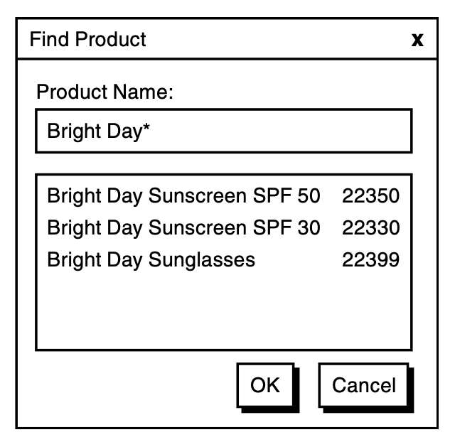
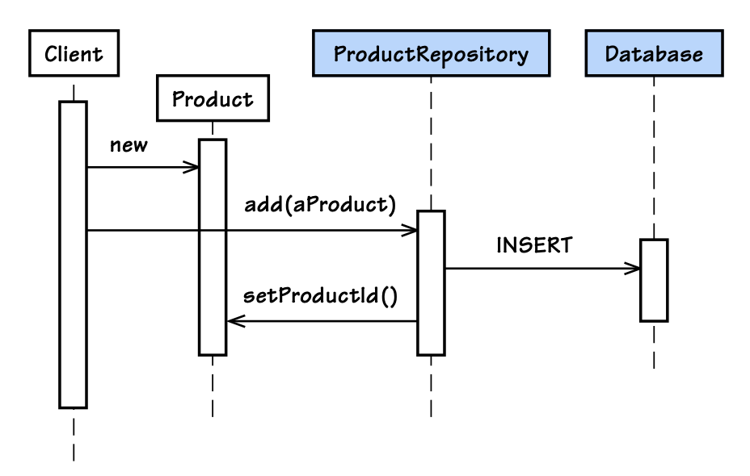
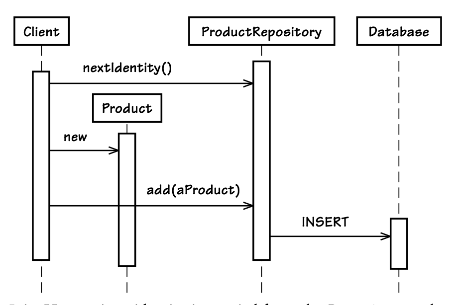
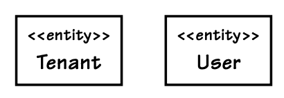
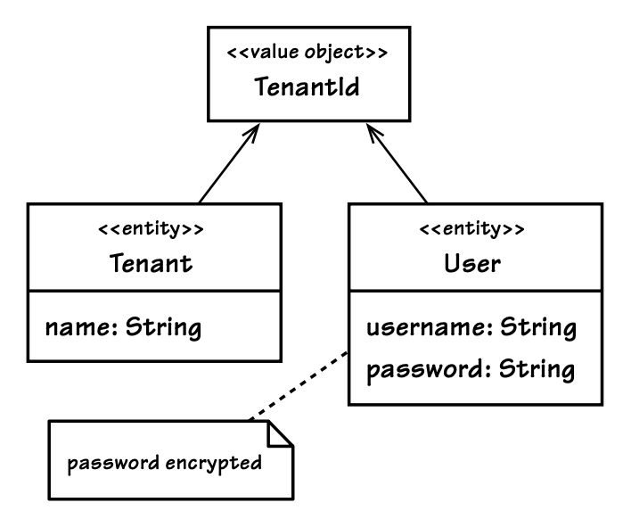
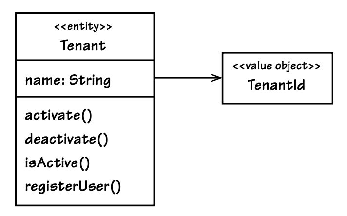
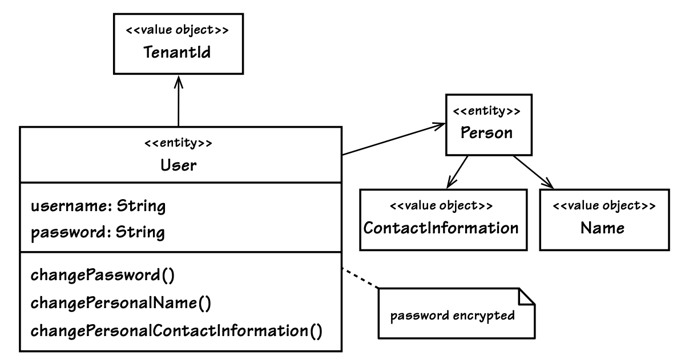
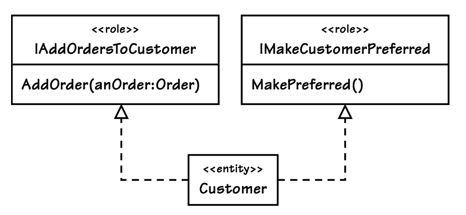
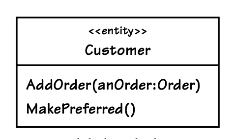

# Varlıklar (Entities)

***Geliştiricilerde, alan (domain) yerine veriye odaklanma eğilimi vardır. Bu, DDD’ye yeni başlayanlarda sıkça görülebilir; çünkü mevcut yazılım geliştirme yaklaşımları, veritabanına büyük önem verir. Zengin davranışlara sahip alan kavramlarını tasarlamak yerine, çoğunlukla verinin niteliklerini (sütunlar) ve ilişkilerini (foreign key’ler) düşünürüz.*** Bu yaklaşım, veri modelini nesne karşılıklarına yansıtarak “alan modelimizdeki” neredeyse her kavramın sadece getter ve setter metodları içeren birer Entity (Varlık) olarak yazılmasına neden olur. Tüm bunları otomatik olarak üreten araçlar bulmak oldukça kolaydır. Özellik erişim metodlarında (property accessors) yanlış bir şey olmayabilir, ancak DDD’deki Entity’lerin sahip olması gereken tek davranış bu değildir.

Bu, SaaSOvation geliştiricilerinin karşılaştığı bir tuzaktı. Varlık tasarımı konusunda onların deneyimlerinden ders çıkarın.

> **Bu Bölümün Yol Haritası**
>
> - Benzersiz şeyleri modellememiz gerektiğinde, Varlıkların (Entities) neden doğru yere sahip olduğunu düşünün.  
> - Varlıklar için benzersiz kimliklerin nasıl üretilebileceğini öğrenin.
> - Bir ekibin Ubiquitous Language (Ortak Dil) kavramını Varlık tasarımıyla nasıl yakaladığını bir tasarım oturumunda gözlemleyin.
> - Varlık rollerini ve sorumluluklarını nasıl ifade edebileceğinizi öğrenin.
> - Varlıkların nasıl doğrulanabileceğini (validation) ve kalıcı depolamaya (persistence) nasıl kaydedilebileceğini gösteren örnekleri inceleyin.

## Neden Entity Kullanırız?

Bir domain kavramını **Entity (Varlık)** olarak tasarlarız çünkü onun bireyselliği (kimliği) bizim için önemlidir — sistemdeki diğer tüm nesnelerden ayırt edilebilir olması zorunlu bir kısıtlamadır. **Entity, benzersiz bir şeydir ve uzun zaman boyunca sürekli olarak değişime uğrayabilir**. Bu değişimler o kadar büyük olabilir ki, nesne eskisinden oldukça farklı görünebilir. **Yine de, kimliği sayesinde aynı nesne olmaya devam eder.**

Nesne değiştikçe, değişikliklerin ne zaman, nasıl ve kim tarafından yapıldığını izlemek isteyebiliriz. Ya da, sadece mevcut formunun önceki değişim geçişleri hakkında yeterli ipucu verdiğini düşünüp, açık bir şekilde geçmişi izlemeye gerek duymayabiliriz. Her değişim detayı izlenmese bile, bu nesneler üzerinde ömürleri boyunca meydana gelebilecek geçerli değişim dizilerini düşünebilir ve tartışabiliriz. **İşte Entity'leri Value Object’lerden ayıran temel farklar bu benzersiz kimlik ve değişebilirlik (mutability) özellikleridir.**

Her zaman Entity kullanmak doğru yaklaşım olmayabilir. Yanlış kullanım, çoğu kişinin fark ettiğinden daha sık gerçekleşir. Genellikle bir kavram Value Object olarak modellenmelidir. Bu fikir rahatsız edici geliyorsa, DDD (Domain Driven Design) belki de iş ihtiyaçlarınıza uygun değildir. Belki de CRUD tabanlı (Create, Read, Update, Delete) bir sistem daha uygun olacaktır. Eğer öyleyse, bu karar projenizin zaman ve para açısından tasarruf etmesini sağlayabilir. Ancak CRUD yaklaşımını seçmek her zaman bu kaynakları korumaz.

İşletmeler genellikle, veri tabanındaki tabloları süslü bir şekilde düzenleyen editörler geliştirmek için fazla çaba harcarlar. Doğru araç seçimi yapılmazsa, karmaşıklaştırılmış CRUD çözümleri gereğinden fazla pahalı olur. CRUD mantıklı olduğunda, Groovy ve Grails, Ruby on Rails gibi diller ve framework’ler en uygun tercihlerdir. Doğru karar verilirse, zaman ve maliyet tasarrufu sağlar.

Öte yandan, eğer CRUD yaklaşımını yanlış sistemlere—daha karmaşık ve DDD’nin hassasiyetini hak eden sistemlere—uygularsak, bu karardan pişman olabiliriz. Sistem karmaşıklığı arttığında, yanlış araç seçiminin sınırlamalarıyla yüzleşiriz. CRUD sistemleri yalnızca veriyi yakalayarak rafine bir iş modeli ortaya koyamaz.

Eğer DDD, işletmenin kârlılığı açısından makul bir yatırım ise, Entity’leri amacına uygun şekilde kullanmalıyız.

> Bir nesne, niteliklerinden (attributes) ziyade kimliği (identity) ile ayırt ediliyorsa, modeldeki tanımında bu durumu ön plana almalıyız. Sınıf tanımını sade tutmalı ve yaşam döngüsünün sürekliliğine ve kimliğine odaklanmalıyız. Nesnenin formu veya geçmişi ne olursa olsun, onu ayırt edebileceğimiz bir yöntem tanımlamalıyız... 
> 
> “Model, bir şeyin aynı şey olduğunu neyin belirlediğini tanımlamalıdır.” [Evans, s. 92]

Bu bölüm, Entity’lere doğru vurgu nasıl yapılır onu öğretiyor ve çeşitli Entity tasarım tekniklerini sana gösteriyor.

## Benzersiz Kimlik (Unique Identity)

Bir Entity tasarımının ilk aşamalarında, özellikle o Entity'yi benzersiz kılan birincil özelliklere ve davranışlara, ayrıca sorgulama için yararlı olanlara odaklanırız. Diğer tüm özellik ve davranışları ise, bu temel unsurlar netleşene kadar bilinçli olarak göz ardı ederiz.

> ⚠️ "Özelliklere ya da davranışlara odaklanmak yerine, Entity nesnesinin tanımını, özellikle onu tanımlayan ya da eşleştirmek için yaygın olarak kullanılan en temel özelliklere indir. Sadece kavram için gerekli olan davranışları ve o davranışın gerektirdiği özellikleri ekle."  ***— [Evans, s. 93]***

İlk yapacağımız şey de tam olarak bu olacak. Kimlik oluşturmak için elimizde farklı seçeneklerin olması çok önemlidir. Aynı şekilde, bu benzersizliğin zaman içinde korunmasını sağlamak da bir o kadar önemlidir.

Bir Entity’nin benzersiz kimliği, her zaman bulma ya da eşleştirme açısından pratik olmayabilir. Bu kimliğin aramada kullanılıp kullanılamayacağı genellikle onun insan tarafından okunabilir olup olmamasına bağlıdır. Örneğin, bir uygulamada bir kişinin ismine göre arama yapılabiliyorsa, ismin büyük ihtimalle o kişinin benzersiz kimliği olarak kullanılmadığı anlamına gelir. Çünkü insanlar sık sık aynı isme sahip olabilir. Öte yandan, eğer bir şirketin vergi numarasına göre arama yapılıyorsa, bu durumda vergi numarası büyük olasılıkla o şirketin benzersiz kimliği olarak kullanılır — çünkü devletler tarafından verilen vergi numaraları tektir.

Value Object'ler, benzersiz kimlikleri taşıyan nesneler olarak kullanılabilir. Değiştirilemez olmaları sayesinde kimlik stabilitesini sağlarlar ve kimliğe özgü davranışlar merkezi bir noktada toplanabilir. Bu sayede kimlik bilgisine dair tüm mantık modelin diğer kısımlarına ya da client kodlara sızmaz.

Aşağıda, kimlik oluşturma stratejilerinden bazıları verilmiştir. Basitten karmaşığa doğru sıralanmıştır:

- Kullanıcı, uygulamaya bir veya birden fazla benzersiz değer girer. Uygulama bu değerlerin benzersizliğini sağlamak zorundadır.
    
- Uygulama, benzersizliği garanti eden bir algoritma kullanarak kimliği dahili olarak üretir. Bu işlem için bir kütüphane ya da framework kullanılabilir.
    
- Uygulama, benzersiz kimliği üretmek için bir veritabanı gibi bir kalıcı veri kaynağına güvenir.
    
- Başka bir Bounded Context (sistem ya da uygulama) benzersiz kimliği zaten belirlemiştir. Kullanıcı, bu kimliği girer veya mevcut seçeneklerden birini seçer.

ℹ️ Şimdi bu stratejilerin her birine ve bunlara dair çeşitli zorluklara bakacağız. **Teknik çözümler çeşitlendikçe, yan etkiler neredeyse kaçınılmazdır.** Örneğin, relational veritabanlarını kullanırken oluşan **“leak” (sızıntı), domain modelimize yansıyabilir.** Kimlik üretimi konusunu; kimliğin ne zaman üretileceği, **veritabanının referanssal kimliğinin domain objeleri üzerindeki etkisi** ve **ORM kullanımının bu durumu nasıl etkilediği** gibi başlıklarla tamamlayacağız. Ayrıca, **benzersiz kimliklerin kararlı kalmasını sağlamak için pratik önerilere de** yer vereceğiz.


### Kullanıcının Kimliği Belirlemesi (User Provides Identity)

Kullanıcının, benzersiz kimliği manuel olarak girmesi ilk bakışta basit bir yaklaşım gibi görünebilir. Kullanıcı tanınabilir bir değer ya da sembolü bir giriş alanına yazar ya da mevcut seçenekler arasından birini seçer ve Entity oluşturulur. Bu gerçekten de oldukça basit bir yaklaşımdır. Ancak, bazı komplikasyonlar ortaya çıkabilir.

Bu komplikasyonlardan biri, kullanıcıların kaliteli kimlik üretmesine güvenmektir. Kimlik benzersiz olabilir ama hatalı da olabilir. Çoğu zaman kimlikler değiştirilemez (immutable) olmalıdır, dolayısıyla kullanıcıların onları değiştirmemesi gerekir. Ancak bu her zaman geçerli değildir ve kullanıcılara kimliği düzeltme imkanı tanımak bazı durumlarda avantajlı olabilir.

Örneğin: Forum ve Discussion başlıklarını benzersiz kimlik olarak kullandığımızı varsayalım. Peki kullanıcı başlığı yanlış yazarsa ya da sonradan başlığın uygun olmadığını fark ederse ne olur? (Bkz. Şekil 5.1) Bu değişikliğin maliyeti nedir? Kullanıcının sağladığı kimlik ilk etapta düşük maliyetli bir yöntem gibi görünse de, gerçekte öyle olmayabilir. Kullanıcıların hem benzersiz hem de doğru ve uzun ömürlü kimlikler üretmesine güvenilebilir mi?


**Figure 5.1:** Forum başlığı yanlış yazılmıştır ve tartışma başlığı arzu edilenden daha azdır.

Bu sorunun önüne geçmek tasarım sürecindeki tartışmalarla başlar. Takımlar, kullanıcıların benzersiz kimlik tanımlayabilmesi için güvenli yaklaşımları değerlendirmelidir. İş akışına dayalı kimlik onayı, yüksek hacimli işlemler için uygun olmayabilir ancak insan tarafından okunabilir bir kimlik gerekiyorsa oldukça işe yarar. Kimlik, yıllarca iş dünyasında yaygın şekilde kullanılacaksa ve iş akışını desteklemek mümkünse, kimliğin kalitesini sağlamak için birkaç ekstra adım eklemek iyi bir yatırımdır.

Her zaman, kullanıcı tarafından girilen değerleri benzersiz kimlik olarak değil, Entity içinde eşleşme amacıyla kullanılabilecek özellikler olarak dahil etme seçeneğimiz vardır. Bu tür basit özellikler zamanla değişebilen operasyonel durumların bir parçası olarak daha kolay şekilde güncellenebilir. Bu durumda, benzersiz kimliği sağlamak için başka bir yöntem kullanmamız gerekecektir.

### Uygulamanın Kimlik Üretmesi (Application Generates Identity)

Uygulamanın otomatik olarak benzersiz kimlikler üretmesi için oldukça güvenilir yollar vardır. Ancak uygulama birden fazla node’a dağıtılmış (clustered) ise dikkatli olunmalıdır. Bazı kimlik üretim desenleri, neredeyse kesin olarak benzersiz kimlikler oluşturabilir. **UUID (Universally Unique Identifier)** ya da **GUID (Globally Unique Identifier)** bu türden bir yaklaşımdır.

Yaygın bir UUID varyasyonu, aşağıdaki adımların çıktılarının birleştirilmesiyle oluşturulur:

1.  Bilgisayarın o anki zamanı (milisaniye cinsinden)
    
2.  Uygulamanın çalıştığı bilgisayarın IP adresi
    
3.  Sanal makinedeki fabrika nesnesinin nesne kimliği (Java)
    
4.  Sanal makinede aynı jeneratörden üretilmiş rastgele bir sayı (Java)
    

Bu işlem, 128-bit'lik benzersiz bir değer üretir. Bu genellikle 32 veya 36 baytlık hexadecimal metin dizesi olarak ifade edilir. 36 baytlık format, tire (`-`) karakterleriyle ayrılmış yaygın bir biçimdir**, örneğin: `f36ab21c-67dc-5274-c642-1de2f4d5e72a`. Tireler olmadan 32 bayttır. Her iki durumda da bu kimlik insan tarafından okunabilir sayılmaz.

Java dünyasında bu yöntem, Java 1.5’ten itibaren gelen `java.util.UUID` sınıfı ile değiştirilmiştir. Bu sınıf, **Leach-Salz varyantına dayalı dört farklı üretim algoritmasını destekler.** Java'nın standart API'si ile kolayca rastgele bir UUID üretilebilir:

```java
String rawId = java.util.UUID.randomUUID().toString();
```

Bu örnek, **tip 4** UUID üretir ve **kriptografik olarak güçlü bir rastgele sayı üretici** olan `java.security.SecureRandom`'a dayanır. Tip 3 ise isim tabanlı şifreleme kullanır, örneğin:
Tip 3 ise `java.security.MessageDigest` sınıfını temel alarak isim tabalı bir şireleme kullanır. İsim tabanlı bir UUID elde etmek için:

```java
String rawId = java.util.UUID.nameUUIDFromBytes("Some text".getBytes()).toString();
```

Ayrıca, rastgele sayı üretimini şifreleme ile harmanlayabiliriz:

```java
SecureRandom randomGenerator = new SecureRandom();
int randomNumber = randomGenerator.nextInt();
String randomDigits = new Integer(randomNumber).toString();
MessageDigest encryptor = MessageDigest.getInstance("SHA-1");
byte[] rawIdBytes = encryptor.digest(randomDigits.getBytes());
```

Burada tek yapılması gereken, `rawIdBytes` dizisini **hexadecimal bir metin temsiline** dönüştürmektir. UUID oluşturmak için tekrar `nameUUIDFromBytes()` metodunu kullanabiliriz.

Başka kimlik üretim yöntemleri de vardır (örneğin `java.rmi.server.UID` veya `java.rmi.dgc.VMID`), ancak bunlar `java.util.UUID` kadar tercih edilmez ve bu yüzden burada ele alınmamaktadır.

**UUID, dış sistemlerle (örneğin veri tabanı gibi) etkileşime gerek duymadan oldukça hızlı bir şekilde üretilebilir.** Aynı türden bir Entity saniyede birçok kez oluşturulsa bile, UUID jeneratörü bu hıza yetişebilir.

ℹ️ **Daha yüksek performanslı sistemlerde UUID’leri önceden üreterek bellekte saklayabiliriz.** Önbellek yeniden doldurulabilir ve **sunucu yeniden başlatıldığında UUID kaybı bir sorun oluşturmaz**, çünkü kimlikler rastgele oluşturulmuştur. Sunucu açıldığında önbelleğin yeniden doldurulması, sistemde kopukluk yaratmaz.

Bu kadar büyük bir kimlik (örneğin UUID), bazı nadir durumlarda bellek yükü nedeniyle kullanışsız hale gelebilir. Bu gibi durumlarda, veritabanı tarafından üretilen 8 baytlık bir `long` türünde kimlik durumu iyileştirebilir. Daha küçük olan 4 baytlık bir `integer` türü, yaklaşık iki milyar benzersiz değer sağlayabilir ve bazı durumlar için yeterli olabilir. Bu yaklaşımlar bir sonraki bölümde ele alınacaktır.

Şu örneğe baktığımızda, bir UUID’yi kullanıcı arayüzünde göstermek istemememiz anlaşılabilir:

```
f36ab21c-67dc-5274-c642-1de2f4d5e72a
```

Tam bir UUID, kullanıcıdan gizlenebildiği ve insan tarafından okunabilir referans teknikleri kullanılabildiğinde uygundur. Örneğin, e-posta ile gönderilebilecek veya kullanıcılar arasında paylaşılabilecek URI'ler (hipermedya bağlantıları) tasarlanabilir. Bu durumda, HTML'deki `<a>text</a>` örneğinde olduğu gibi, bağlantının teknik kimliği arka planda kalır ve kullanıcıya sade bir metin gösterilir.

ℹ️ Eğer hexadecimal UUID’nin belirli segmentlerinin benzersizliğine güveniyorsanız, tamamı yerine sadece bir veya birkaç segmenti kullanmayı tercih edebilirsiniz. Ancak bu tür kısaltılmış kimlikler, yalnızca **bir Aggregate içindeki Entity’ler arasında yerel benzersizlik gerektiğinde daha güvenilirdir.** Yani Aggregate içinde bulunan Entity'ler, yalnızca aynı Aggregate içerisindeki diğer Entity'lerden benzersiz olmalıdır. **Öte yandan, bir Entity Aggregate Root olarak hizmet veriyorsa, küresel (global) benzersizliğe ihtiyaç duyar.**

Kendi kimlik üreticimiz, UUID’nin belirli segmentlerini kullanarak özel formatta kimlikler üretebilir. Örneğin:

```
APM-P-08-14-2012-F36AB21C
```

Bu 25 karakterlik kimlik:

- Agile Project Management bağlamını (APM) belirtir,  
- Bir **Product ( P )** varlığına aittir,  
- 14 Ağustos 2012 tarihinde oluşturulmuştur,  
- Ve `F36AB21C` parçası, oluşturulan bir UUID’nin ilk segmentidir.

Bu yapı, insan tarafından okunabilirliği yüksek tutarken aynı zamanda yüksek olasılıkla küresel benzersizlik sağlar. Bu durum yalnızca kullanıcılar için değil, Bounded Context'ler arasında kimliklerin taşındığı senaryolarda geliştiriciler için de faydalıdır, çünkü kimliğin hangi sistemden geldiği açıkça anlaşılır.

***SaaSOvation gibi çok kiracılı yapılarda, her tenant için Aggregate'ler ayrıldığı için bu tür bir yaklaşım pratik olabilir.***

Bu tür bir kimliği `String` olarak saklamak **iyi bir tercih olmayabilir.** Bunun yerine, **özel bir Value Object** tanımlamak daha uygundur:

```java
String rawId = "APM-P-08-14-2012-F36AB21C"; // sistem tarafından üretilmiş olur
ProductId productId = new ProductId(rawId);
...
Date productCreationDate =  productId.creationDate();

```

Bu sayede, kimlikle ilgili davranışlar `ProductId` Value Object içinde toplanır ve modelin geri kalanı bu detaylardan izole edilir.

Bir istemci, ürünün ne zaman oluşturulduğu gibi kimlik detaylarını talep edebilir ve bu bilgi kolayca sağlanabilir. İstemcilerin ham kimlik formatını anlamasına gerek yoktur. Artık Product (Ürün) Aggregate Root, oluşturulma tarihini istemcilere nasıl elde edildiğini belirtmeden sunabilir:

```java
public class Product extends Entity {
	private ProductId productId;
	...
	public Date creationDate() {
		return this.productId().creationDate();
	}
	...
}
```

Kimlik üretimi konusunda üçüncü taraf kütüphane ve framework'lerde bazı çözümler bulunabilir. Apache Commons projesinde, Commons Id (sandbox) bileşeni beş farklı kimlik üreteci sunar. Bazı kalıcılık (persistence) altyapıları, örneğin NoSQL Riak ve MongoDB, sizin için kimlik oluşturabilir. Riak'e bir veri kaydetmek için genelde HTTP PUT kullanırsınız, bu da bir anahtar gerektirir:

```http
PUT /riak/bucket/key
[object serialization]
```

Alternatif olarak, anahtar vermeden POST isteği de yapabilirsiniz; bu durumda Riak sizin için benzersiz bir kimlik oluşturur. Yine de, bu bölümün ilerleyen kısımlarında tartışıldığı gibi, erken kimlik üretimi mi yoksa geç kimlik üretimi mi yapılacağına karar vermek önemlidir.

Peki, uygulamanızda oluşturulan kimliklerin **Factory**’si ne olacak? Aggregate Root kimliği için ben genelde **Repository'yi tercih ederim**:

```java
public class HibernateProductRepository implements ProductRepository  {
	...
	public ProductId nextIdentity() {
		return new ProductId(java.util.UUID.randomUUID().toString().toUpperCase());
	}
	... 
}
```

Bu tür bir kimlik üretimi için doğal bir yer gibi görünüyor.

### Kalıcılık Mekanizması Kimlik Oluşturur

Benzersiz kimlik üretimini bir kalıcılık (persistence) mekanizmasına devretmenin bazı kendine özgü avantajları vardır. Eğer veritabanından bir sıralı ya da artan değer istenirse, bu değer her zaman benzersiz olacaktır.

İhtiyaç duyulan aralığa bağlı olarak, veritabanı 2 bayt, 4 bayt veya 8 bayt uzunluğunda benzersiz bir değer üretebilir.   Java'da:

- **2 baytlık short**: 32.767 benzersiz kimlik sağlar.  
- **4 baytlık int**: 2.147.483.647 benzersiz değer sunar.
- **8 baytlık long**: 9.223.372.036.854.775.807 farklı kimlik üretebilir.
    
Bu sayıların sıfır dolgulu metin temsilleri de oldukça dardır: sırasıyla 5, 10 ve 19 karakter. Bu tür sayılar ayrıca bileşik kimlikler oluşturmak için de kullanılabilir.

**Olası dezavantajlardan biri performanstır.** Her değer için veritabanına gitmek, uygulama içinde üretmeye kıyasla önemli ölçüde daha uzun sürebilir. Bu durum veritabanı yüküne ve uygulama talebine bağlıdır.

**Bir çözüm, artan/sıralı değerleri uygulama içinde önceden önbelleğe almaktır** (örneğin bir Repository’de). Bu yöntem işe yarayabilir, ancak sunucu node'ları yeniden başlatıldığında kullanılmayan pek çok değerin kaybedileceğini öngörmeliyiz. Eğer bu boşluklar kabul edilemezse ya da sadece küçük bir değer aralığı planlandıysa (örneğin 2 baytlık short), bu yaklaşım uygun olmayabilir. Kaybolan kimlikleri kurtarmak teknik olarak mümkün olabilir, ancak bu genellikle zahmete değmez.

Modelin geç kimlik üretimi ile çalışabilmesi durumunda, önbellekleme ve önceden tahsis etme bir sorun oluşturmaz. İşte Hibernate ve Oracle sequence kullanılarak yapılan örnek:

```xml
<id name="id" type="long" column="product_id">
    <generator class="sequence">
        <param name="sequence">product_seq</param>
    </generator>
</id>
```

Aynı yaklaşımın MySQL otomatik artan (auto-increment) sütunu kullanılarak yapılan örneği:

```xml
<id name="id" type="long" column="product_id">
    <generator class="native"/>
</id>
```

Bu yapı iyi performans sağlar ve Hibernate eşleme tanımında oldukça kolay yapılandırılır. Ancak, burada sorun kimliğin ne zaman üretildiğidir, bu da ilerleyen bölümlerde ele alınır. Bu alt bölümün geri kalanında ise erken kimlik üretimi gereksinimi ele alınacaktır.

> ***Sıra Önemli Olabilir**  *
>
> Bazen bir Varlık (Entity) için kimlik (identity) oluşturma ve atama işleminin _ne zaman_ yapıldığı önemlidir. Kimliğin erken oluşturulması ve atanması, Varlık veritabanına kaydedilmeden önce gerçekleşir. Kimliğin geç oluşturulması ve atanması ise, Varlık veritabanına kaydedildiği anda yapılır.

Aşağıdaki örnekte bir Repository, Oracle sıralayıcısından (sequence) sıradaki değeri sorguyla alarak **erken oluşturmayı** desteklemektedir:

```java
public ProductId nextIdentity() {
	Long rawProductId = (Long)
		this.session()
			.createSQLQuery("select product_seq.nextval as product_id from dual")
			.addScalar("product_id", Hibernate.LONG)
			.uniqueResult();
	return new ProductId(rawProductId);
}
```

Oracle, sıralayıcıdan dönen değerleri Hibernate'in varsayılan olarak `BigDecimal` türünde map etmesi nedeniyle, Hibernate'e `product_id` sonucunun `Long` olarak dönüştürülmesini istediğimizi açıkça belirtmemiz gerekir.

Peki ya Oracle gibi sıralayıcıları desteklemeyen **MySQL** gibi veritabanlarında ne yaparız?  
MySQL, **auto-increment** (otomatik artan) sütunları destekler. Ancak auto-increment değeri genellikle satır veritabanına yeni eklendiğinde atanır. Yine de, MySQL'deki auto-increment özelliğini Oracle sequence gibi çalıştırmak mümkündür:

```sql
mysql> CREATE TABLE product_seq (nextval INT NOT NULL);
Query OK, 0 rows affected (0.14 sec) 

mysql> INSERT INTO product_seq VALUES (0);
Query OK, 1 row affected (0.03 sec) 

mysql> UPDATE product_seq SET nextval=LAST_INSERT_ID(nextval + 1);
Query OK, 1 row affected (0.03 sec)
Rows matched: 1  Changed: 1  Warnings: 0 

mysql> SELECT LAST_INSERT_ID();
+------------------+
| LAST_INSERT_ID() |
+------------------+ 

| 1| +------------------+  
1 row in set (0.06 sec)
mysql> SELECT * FROM product_seq;
+---------+
| nextval |
+---------+ 

| 1| +---------+  
1 row in set (0.00 sec)
```

MySQL veritabanında `product_seq` adında bir tablo oluşturduk. Ardından, bu tablonun tek sütunu olan `nextval` alanını 0 değeriyle başlatarak ilk satırı ekledik. Bu iki adım, Product (Ürün) varlığı için bir **sequence emülatörü (benzetişim)** kurmuş oluyor. Sonraki iki SQL ifadesi ise tek bir sequence değeri üretimini göstermektedir. İlk olarak, tablonun tek satırını güncelleyerek `nextval` sütununu 1 artırıyoruz. Bu işlemde MySQL’in `LAST_INSERT_ID()` fonksiyonu kullanılıyor. Bu fonksiyonun parametresi olan ifade (`nextval + 1`) önce çalıştırılıyor, ardından sonucu `nextval` sütununa atanıyor. `LAST_INSERT_ID()` fonksiyonu içinde kullanılan `nextval + 1` ifadesinin sonucu **sabit** kalır, böylece hemen ardından gelen `SELECT LAST_INSERT_ID()` sorgusunda, az önceki güncelleme işlemiyle üretilmiş olan `nextval` değeri döner. Son olarak, test amacıyla `SELECT * FROM product_seq` sorgusuyla tablonun güncel haline bakarak `nextval` sütunundaki değerin `LAST_INSERT_ID()` fonksiyonunun döndürdüğü değerle aynı olduğunu doğrulayabiliriz.

Hibernate 3.2.3 sürümü, **taşınabilir (portable)** sequence oluşturma desteği sağlayan `org.hibernate.id.enhanced.SequenceStyleGenerator` sınıfını kullanır, ancak bu yalnızca geç kimlik oluşturmayı destekler (yani Entity veritabanına eklendiği anda kimlik atanır). Repository içinde erken kimlik üretimi yapabilmek için özel bir Hibernate veya JDBC sorgusu yazmamız gerekir. İşte MySQL için `ProductRepository` sınıfındaki `nextIdentity()` metodunun yeniden yazılmış hali:

```java
public ProductId nextIdentity() {
	long rawId = -1L;
	try { 
		PreparedStatement ps = this.connection().prepareStatement(
			"update product_seq set next_val=LAST_INSERT_ID(next_val + 1)"); 

		ResultSet rs = ps.executeQuery(); 

		try {
			rs.next(); 
			rawId = rs.getLong(1);
        } finally {
			try {
				rs.close();
			} catch(Throwable t) {
				// ignore
			}
		}
	} catch (Throwable t) {
		throw new IllegalStateException("Cannot generate next identity", t); 
	}

	return new ProductId(rawId);
}
```

JDBC kullanıldığında, `LAST_INSERT_ID()` fonksiyonunun sonucunu almak için veritabanına ikinci bir sorgu göndermeye gerek yoktur. Güncelleme sorgusu her şeyi halleder. Sadece `ResultSet` içinden `long` (uzun tamsayı) değerini alırız ve bunu kullanarak bir `ProductId` nesnesi oluştururuz.

Son bir püf noktası, Hibernate içinden bir JDBC `Connection` nesnesi elde etmektir. Bu biraz zahmetli olabilir ama mümkündür:

```java
private Connection connection() {
	SessionFactoryImplementor sfi = (SessionFactoryImplementor)sessionFactory;
	ConnectionProvider cp = sfi.getConnectionProvider();
	return cp.getConnection();
}
```

Bir `Connection` nesnesi olmadan bir `PreparedStatement` çalıştırıp `ResultSet` alamayız. Bu da taşınabilir (portable) bir sequence kullanmayı imkânsız hale getirir.

Oracle, MySQL ve diğer veritabanlarından taşınabilir sequence’ler kullanarak, daha küçük boyutlu ve garantili olarak benzersiz kimlikler üretebiliriz. Ayrıca bu yöntem, veritabanına kaydedilmeden önce (pre-insert) kimliklerin oluşturulmasını da destekler.

### Başka Bir Bounded Context Kimlik Atadığında

Başka bir _Bounded Context_ kimlik atadığında, bizim bu kimliği bulmamız, eşleştirmemiz ve sistemimize atamamız gerekir. DDD’deki bu tür entegrasyonlar, _Context Maps_ (Bölüm 3) ve _Integrating Bounded Contexts_ (Bölüm 13)'te açıklanır.

**Tam eşleşme yapmak en arzu edilen senaryodur.** Kullanıcılar, aranan sonucu net şekilde belirleyebilmek için bir veya daha fazla benzersiz bilgi (örneğin hesap numarası, kullanıcı adı, e-posta adresi gibi) sağlamalıdır.

Çoğunlukla, **eşleşme bulanık (fuzzy) bir arama ile olur**, bu da birden fazla sonuç dönebilir ve insan kullanıcının seçim yapmasını gerektirir. Bunu Şekil 5.2’de görüyoruz: Kullanıcı, aradığı Entity için joker karakterli (wildcard) bir kriter girer. Biz de harici Bounded Context’in API’sine istek göndeririz. API bu aramayı sıfır, bir veya birden fazla benzer nesne ile sonuçlandırabilir. Kullanıcı, bu sonuçlar arasından istediği seçeneği belirler. Seçilen Entity'nin kimliği, bizim yerel kimliğimiz olarak kullanılır. Ayrıca, bu harici Entity’den bazı durum bilgileri (özellikler) de bizim yerel Entity’mize kopyalanabilir.



**Figure 5.2:** Arama, bir kimlik bulmak için harici bir sistemle eşleşmenin sonucudur. Seçim kullanıcı arayüzü kimliği görüntüleyebilir veya görüntülemeyebilir. Bu örnek bunu göstermektedir.

Bu yaklaşımın **senkronizasyon etkileri** vardır. Harici sistemlerde referans verdiğimiz nesneler değiştiğinde ne olacak? Yerel Entity’leri etkileyebilecek bu değişiklikleri nasıl bileceğiz? Bu sorun, _Event-Driven Architecture (Bölüm 4)_ ve _Domain Events (Bölüm 8)_ kullanılarak çözülebilir. Yerel Bounded Context, dış sistemlerin yayınladığı Domain Event’lere abone olur. İlgili bir bildirim alındığında, yerel sistemimiz kendi Aggregate Entity’lerini harici sistemdeki duruma göre günceller. Bazen, senkronizasyon yerel sistem tarafından başlatılır ve yapılan değişiklikler dış sisteme gönderilir.

Bu yapı nadiren kolaydır, ancak **daha otonom sistemler** kurmamızı sağlar. Otonomi sağlandığında, aramalar yalnızca yerel nesnelerle sınırlı hale getirilebilir. Bu, dış sistemlerin nesnelerini önbelleğe almak anlamına gelmez. Bunun yerine, _Context Mapping’te (Bölüm 3)_ anlatıldığı gibi, harici kavramları yerel Bounded Context’e çevirmek anlamına gelir.

Bu yaklaşım, **kimlik oluşturma stratejileri arasındaki en karmaşık olanıdır.** Yerel Entity’nin bakımında, yalnızca yerel domain davranışları değil, aynı zamanda harici sistemlerdeki değişiklikler de etkili olabilir. Bu yaklaşımı **mümkün olduğunca temkinli ve sınırlı kullanmak gerekir.**

### Kimlik Üretiminin Zamanlaması Önemli Olduğunda

Kimlik üretimi, ya nesne oluşturulurken erken bir aşamada gerçekleşebilir ya da veritabanına kaydedilirken (persist işlemi sırasında) geç bir aşamada olabilir. Bazı durumlarda kimliğin erken üretilmesi kritik olabilirken, bazı durumlarda bunun bir önemi yoktur. Eğer zamanlama önemliyse, bu sürecin neden önemli olduğunu ve neleri etkilediğini anlamamız gerekir.

En basit senaryoyu düşünelim: Yeni bir Entity’nin (örneğin bir Product) veritabanına eklendiği sırada kimliğin geç üretilmesini tolere edebiliyorsak, zamanlama önemli değildir. Bu durum, Şekil 5.3’te gösterilmiştir. Client, yeni bir `Product` örneği oluşturur ve bunu `ProductRepository`'ye ekler. `Product` nesnesi ilk kez oluşturulduğunda, client henüz onun kimliğine ihtiyaç duymaz. Bu da iyi bir şeydir, çünkü o anda kimlik henüz mevcut değildir. Kimlik ancak nesne persist edildikten sonra var olur.

Peki, zamanlama neden önemli olabilir? Şu senaryoyu düşünelim: Client, yayımlanan Domain Event'lere abonedir. Yeni bir `Product` oluşturulduğunda bir Event oluşur. Bu Event, bir Event Store’a (Bkz: Bölüm 8) kaydedilir. Daha sonra bu Event’ler, Bounded Context dışındaki abonelere bildirim olarak gönderilir. Şekil 5.3’teki yaklaşıma göre, Domain Event, client daha yeni `Product`'ı `ProductRepository`'ye eklemeden önce oluşur. Bu durumda Domain Event, yeni `Product`'ın geçerli kimliğini içeremez.

Domain Event’in doğru şekilde oluşturulabilmesi için, kimlik üretiminin önceden tamamlanmış olması gerekir. Şekil 5.4’te bu erken kimlik üretimi gösterilmektedir. Burada client, `ProductRepository`'den bir sonraki kimliği sorgular ve bu kimliği `Product` yapıcısına (constructor) geçirerek yeni nesneyi oluşturur. Bu sayede Domain Event, kimliği tam olan bir nesneye dayanarak doğru şekilde oluşturulabilir.



**Figure 5.3:** Benzersiz bir kimlik tahsis etmenin en basit yolu, nesnenin ilk kez kalıcı hale getirildiğinde veri deposunun bunu oluşturmasını sağlamaktır.



**Figure 5.4:** Burada benzersiz kimlik Repository'den sorgulanır ve nesne oluşumu sırasında atanır. Kimlik oluşturmanın karmaşıklığı Repository implementasyonunun arkasında gizlidir.

Kimlik üretimi, bir Entity (varlık) persist edilene (veritabanına kaydedilene) kadar geciktirildiğinde başka bir sorun daha ortaya çıkabilir. Bu sorun, iki veya daha fazla yeni Entity nesnesi bir `java.util.Set` koleksiyonuna eklenmek istendiğinde ortaya çıkar. Bu nesneler henüz kimlik (ID) atanmamış olduğu için (örneğin, kimlikleri `null`, `0` ya da `-1` olabilir), birbirleriyle aynıymış gibi görünürler. Eğer Entity’nin `equals()` metodu yalnızca kimlikleri karşılaştırıyorsa, bu yeni nesneler birbirinin aynısı gibi algılanır. Bu durumda sadece ilk eklenen nesne `Set` içerisinde tutulur, geri kalanları ise dışlanır (eklenmez). Bu da başta anlaşılması ve çözülmesi zor olan, tuhaf bir hataya neden olur.

**Bu hatayı önlemek için iki çözümden biri uygulanmalıdır:**

1.  Tasarımı değiştirip kimlik üretimini ve atamasını erken aşamada gerçekleştirmek.
    
2.  Ya da `equals()` metodunu, domain kimliği dışında başka alanları karşılaştıracak şekilde yeniden düzenlemek.
    

Eğer ikinci yaklaşım yani `equals()` metodu tercih edilirse, bu Entity artık bir Value Object gibi ele alınmalıdır. Bu durumda `hashCode()` metodu da, `equals()` metodu ile uyumlu olacak şekilde yeniden yazılmalıdır. Bu ikisi birlikte çalışarak nesnelerin `Set` gibi koleksiyonlarda doğru şekilde ayırt edilmesini sağlar.

```java
public class User extends Entity  {
	... 
	@Override
	public boolean equals(Object anObject) {
		boolean equalObjects = false;
        if (anObject != null && this.getClass() == anObject.getClass()) {
			User typedObject = (User) anObject;
			equalObjects = 
				this.tenantId().equals(typedObject.tenantId()) &&
				this.username().equals(typedObject.username()));
		}

		return equalObjects;
	} 

	@Override
	public int hashCode() {
		int hashCode = 
			+ (151513 * 229) 
			+ this.tenantId().hashCode()
			+ this.username().hashCode(); 
		return hashCode;
	} 
	... 
}
```

Eğer sistem multitenant bir yapıya sahipse, o zaman **TenantId** (kiracı kimliği) de nesnenin benzersiz kimliğinin bir parçası olarak değerlendirilmelidir. Yani, farklı kiracılara ait iki User (kullanıcı) nesnesi hiçbir şekilde birbirine eşit kabul edilmemelidir.

**Daha da önemlisi**, `Set` gibi koleksiyonlara nesne eklenmesi durumunda ortaya çıkan yukarıdaki eşitlik sorunuyla karşılaşıldığında, ben **kimliğin erken oluşturulması ve atanması** yaklaşımını, **Value Object benzeri eşitlik testine göre** daha çok tercih ederim.

Çünkü Entity nesnelerinde `equals()` ve `hashCode()` metodlarının, nesnenin benzersiz kimliğine göre tanımlanması, diğer niteliklere (örneğin isim, e-posta vs.) göre tanımlanmasına kıyasla daha arzu edilir bir yaklaşımdır.

Haklısın, daha çok açıklayıcı ve özetleyici bir şekilde çevirmişim. Şimdi metni orijinal yapısına daha sadık, birebir ve sade bir Türkçe çeviriyle tekrar sunuyorum:

### Vekil Kimlik (Surrogate Identity)

Bazı ORM araçları, örneğin Hibernate, nesne kimliklerini kendi koşullarıyla yönetmek ister. Hibernate, her Entity’nin birincil kimliği olarak veritabanının yerel türünü, örneğin sayısal bir sıra numarasını tercih eder. Eğer domain başka bir tür kimlik gerektiriyorsa, bu durum Hibernate için istenmeyen bir çakışma yaratır. Bunu düzeltmek için iki kimlik kullanmamız gerekir. Kimliklerden biri domain modeli için tasarlanır ve domain’in gerekliliklerine uygundur. Diğeri ise Hibernate için olup, bu kimliğe vekil kimlik (surrogate identity) adı verilir.

Vekil kimlik oluşturmak oldukça basittir. Entity içinde bu vekil kimliği tutacak bir özellik (attribute) oluşturun. Genellikle `long` veya `int` yeterlidir. Veritabanında, bu kimliği tutacak bir sütun oluşturun ve üzerine bir birincil anahtar (primary key) kısıtlaması koyun. Ardından Entity'nin Hibernate eşleme (mapping) tanımına bir `<id>` öğesi ekleyin. Bu kimlik domain’e özgü kimlikle ilgili değildir. Sadece ORM, yani Hibernate için oluşturulmuştur.

Vekil kimliği dış dünyadan saklamak en iyisidir. Çünkü vekil kimlik domain modelinin bir parçası değildir; görünür hale getirilmesi kalıcılık sızıntısına (persistence leakage) yol açar. Her ne kadar bazı sızıntılar kaçınılmaz olsa da, model geliştiricileri ve istemcilerden saklamak için bazı adımlar atabiliriz.

Bir koruma yöntemi olarak, [Fowler’ın Kurumsal Uygulama Mimarileri] (Layer Supertype) desenini kullanabiliriz:

```java
public abstract class IdentifiedDomainObject implements Serializable  {
	private long id = -1;

	public IdentifiedDomainObject() {
		super();
	}

	protected long id() {
		return this.id;
	}

	protected void setId(long anId) {
		this.id = anId;
	}
}
```

Bu **Layer Supertype (Katman Üst Tipi)**, `IdentifiedDomainObject` adlı soyut bir sınıftır ve surrogate (ikincil/vekil) birincil anahtarı dış dünyadan gizler. Bu sınıf, `protected` erişim belirleyicili yardımcı metotlar aracılığıyla bu kimliği erişilebilir kılar. Client'lar (yani dış kullanıcılar veya geliştiriciler), bu metotların kendileri için mi tanımlandığı konusunda kafa karışıklığı yaşamazlar, çünkü bu metotlar sadece ilgili Entity’nin tanımlandığı modül (Module) içinde görünürdür (bkz. Bölüm 9). İsterseniz bu metotları tamamen `private` da yapabilirsiniz. Hibernate, ister `public`, ister `private` olsun, tüm erişim seviyelerindeki alan ve metotları yansıma (reflection) aracılığıyla sorunsuz bir şekilde kullanabilir. Yani ORM tarafından erişimde herhangi bir sorun yaşanmaz. Ayrıca bu tür bir Layer Supertype, **optimistic concurrency (iyimser eşzamanlılık kontrolü)** gibi özellikleri desteklemek amacıyla da genişletilebilir. Bu tür kullanımlara, **Aggregate yapılarında** (bkz. Bölüm 10) rastlanabilir.

Şimdi Hibernate tanımında bu surrogate `id` alanını veritabanı sütununa nasıl eşleyeceğimizi görmemiz gerekiyor. Aşağıdaki örnekte `User` sınıfındaki `id` alanı, veritabanındaki `id` adlı sütuna eşlenmiştir:

```sql
<hibernate-mapping default-cascade="all">
	<class 
		name="com.saasovation.identityaccess.domain.model.identity.User"
		table="tbl_user"
		lazy="true">
			<id name="id" type="long" column="id" unsaved-value="-1"> 
				<generator class="native"/>
			</id>
			...
	</class>
</hibernate-mapping>
```

Aşağıda, `User` nesnelerini saklamak için tanımlanmış bir MySQL tablo yapısı yer alıyor:

```sql
CREATE TABLE `tbl_user` (
	`id` int(11) NOT NULL auto_increment,
	`enablement_enabled` tinyint(1) NOT NULL,
	`enablement_end_date` datetime,
	`enablement_start_date` datetime,
	`password` varchar(32) NOT NULL,
	`tenant_id_id` varchar(36) NOT NULL,
	`username` varchar(25) NOT NULL,
	KEY `k_tenant_id_id` (`tenant_id_id`),
	UNIQUE KEY `k_tenant_id_username` (`tenant_id_id`,`username`),
	PRIMARY KEY (`id`)
) ENGINE=InnoDB;
```

İlk sütun olan `id`, surrogate (vekil) kimlik olarak görev yapar. Tanımın sonundaki `PRIMARY KEY` ifadesiyle de bu sütunun tablonun birincil anahtarı olduğu belirtilmiştir. Burada **surrogate kimlik ile domain’e ait (iş anlamındaki) kimlik arasındaki farkı** net biçimde görebiliriz. Domain kimliği, `tenant_id_id` ve `username` sütunlarından oluşur. Bu iki alan birlikte `k_tenant_id_username` adlı **benzersiz bir anahtar (unique key)** oluşturur.

ℹ️ **Domain kimliğinin veritabanında birincil anahtar rolünü üstlenmesi gerekmez.** Bunun yerine surrogate `id`, veritabanı için birincil anahtar olarak görev alır. Bu tercih, **Hibernate gibi ORM araçlarının beklentilerini karşılamak açısından da faydalıdır.**

Surrogate birincil anahtarlar, veri modeliniz boyunca **başka tablolarda yabancı anahtar (foreign key)** olarak kullanılabilir. Bu yaklaşım:

-   **Referential integrity (ilişkisel bütünlük)** sağlar,
    
-   İşletmenizdeki veri yönetimi gereksinimleri (örneğin denetim/audit süreçleri) için destek sunar,
    
-   Kullanılan araçlar açısından uyumluluk sağlayabilir.
    

Bu ilişkisel bütünlük, Hibernate’in tabloları birbirine bağlaması açısından da önemlidir—özellikle de bire-çok (1:N) gibi ilişki türlerinin uygulanmasında. Ayrıca, veritabanından Aggregate’leri okurken yapılan JOIN işlemlerinde performans açısından avantaj sağlar.

### Kimliğin (Identity) Kararlılığı

Çoğu durumda, bir nesneye (Entity) atanmış olan benzersiz kimlik (unique identity), değişime karşı korunmalı ve o nesne yaşamını sürdürdüğü sürece sabit (kararlı) kalmalıdır.

Kimliğin değiştirilmesini engellemek için basit önlemler alınabilir. Örneğin:

-   Kimlik değerini değiştiren **setter metotları dışarıdan erişilemeyecek** şekilde gizlenebilir.
    
-   Ya da bu setter metoduna bir **koruma (guard)** yerleştirilerek, **Entity'nin kendi içinden bile kimliğin tekrar değiştirilmesi engellenebilir.**
    

Bu tür koruma mekanizmaları, setter metotlara yerleştirilen "assertion"lar (doğrulamalar) yoluyla kodlanır.

```java
public class User extends Entity  {
	...
	protected void setUsername(String aUsername) {
		if (this.username != null) {
			throw new IllegalStateException("The username may not be changed.");
		}
		if (aUsername == null) {
			throw new IllegalArgumentException("The username may not be set to null.");
		}
		this.username = aUsername;
	}
	...
}
```

Bu örnekte, **username** özelliği, **User Entity**'nin **domain identity** olarak yalnızca bir kez ve yalnızca **içsel olarak (internal)** değiştirilebilir. **setUsername()** metodu, dışarıdan erişime kapalı olan bir **self-encapsulation (öz-yineleme)** sağlar.

Bir Entity'nin **public (genel) davranışı**, setter metoduna kendisini devrettiğinde, bu metod username özelliğini kontrol eder. Eğer bu değer zaten **null olmayan** bir değer almışsa, bu **değiştirilemez (unchangeable)** bir durumun belirtisidir. Böyle bir durumda, **IllegalStateException** fırlatılır. Bu hata, username değerinin yalnızca bir kez değiştirilebileceğini belirtir.

> *Bu yaklaşım, sistemin tutarlılığını ve belirli iş kurallarını koruyarak güvenli bir şekilde veri yönetimini sağlar.*

**Düşünme Zamanı**

- Şu anki domain'inizdeki bazı gerçek Entity'leri düşünün ve isimlerini yazın.

> Bu Entity'lerin **domain** ve **surrogate** kimlikleri nelerdir? Kimliklerin herhangi biri, başka bir kimlik oluşturma türü veya kimlik atamasının zamanlamasıyla daha iyi hizmet edebilir miydi?

• Her bir Entity'nin yanına, kimlik atama yaklaşımının (kullanıcı, uygulama, kalıcılık, veya diğer Bounded Context) farklı olması gerekip gerekmediğini ve nedenini belirtin (şu anda değiştiremiyorsanız bile).

• Her bir Entity'nin yanına, erken kimlik oluşturma (early identity generation) veya geç kimlik oluşturma (late identity generation) kullanılması gerektiğini ve nedenini belirtin.

> Her bir kimliğin **stabilitesini (stability)** düşünün, bu da gerekirse geliştirebileceğiniz bir alan olabilir.

---

Bu setter, Hibernate'in nesne durumunu kalıcılıktan yeniden oluşturması gerektiğinde engel oluşturmaz. Nesne ilk olarak varsayılan, sıfır parametreli yapıcıyla oluşturulduğunda, **username** özelliği başlangıçta **null** olacaktır. Bu, yeniden başlatmanın düzgün bir şekilde gerçekleşmesini sağlar ve setter, yalnızca bir kez Hibernate tarafından başlatılan atamanın yapılmasına olanak tanır. Bu işlem, Hibernate'e kalıcılık ve yeniden su besleme (rehydration) amacıyla alan (özellik) erişimi kullanması talimatı verildiğinde tamamen bypass edilir.

Bir test, **modify-once guard**'ın **User** kimliğinin durumunu düzgün bir şekilde koruduğunu doğrular:

```java
public class UserTest extends IdentityTest {
	...
	public void testUsernameImmutable() throws Exception {
		try {
			User user = this.userFixture(); 
			user.setUsername("testusername");
			fail("The username must be immutable after initialization.");
		} catch (IllegalStateException e) {
			// expected, fall through
		}
	}
	... 
}
```

Bu örnek test, modelin nasıl çalıştığını gösterir. Başarıyla tamamlandığında, setUsername() metodunun mevcut, null olmayan kimliği değiştirilmesinden koruduğunu kanıtlar. (Guards ve Entity testleri doğrulama kısmında daha ayrıntılı olarak tartışılacaktır.)

## Entity'leri ve Onların Doğal Özelliklerini Keşfetmek

Şimdi SaaSOvation ekiplerinin öğrendiği bazı derslere bakalım...

> Başlangıçta CollabOvation ekibi, Java kodunda çok fazla entity-relation (ER) modellemesi yapma tuzağına düştü. Veritabanı, tablolar ve sütunlar üzerinde fazla durdular ve bunların nesnelere nasıl yansıdığına odaklandılar. Bu, büyük ölçüde bir **Anemik Domain Model** [Fowler, Anemic] oluşturmalarına yol açtı ve bu model çok fazla getter ve setter içeriyordu. Daha çok **DDD** (Domain-Driven Design) üzerine düşünmeleri gerektiğini anlamalıydılar. Güvenlik karmaşasını çözmeleri gerektiğinde (Bounded Contexts (2) bölümünde açıklandığı gibi), **Ubiquitous Language** üzerinde daha fazla odaklanmayı öğrendiler. Bu, iyi sonuçlar verdi. Bu bölümde, daha yeni **Identity ve Access Context** ekibinin öğrendikleri derslerden nasıl faydalandığını göreceğiz.

Ubiquitous Language (Evrensel Dil), temiz bir şekilde ayrılmış Bounded Context içinde, domain modelimizi tasarlamak için ihtiyaç duyduğumuz kavramları ve terimleri sağlar. Bu Dil birdenbire ortaya çıkmaz. Domain uzmanlarıyla dikkatli tartışmalar ve gereksinimlerin araştırılması yoluyla geliştirilmelidir. Ortaya çıkan bazı terimler, nesneleri adlandıran isimler (isimler), onları tanımlayan sıfatlar ve nesnelerin yaptığı şeyleri belirten fiiller olabilir. Nesnelerin yalnızca sınıfları adlandıran isimler ve öne çıkan işlemleri adlandıran fiillerden oluştuğu yanılgısına düşmek bir hata olurdu; sadece bunları dikkate alarak derin bir içgörü elde edebileceğimizi düşünmek yanlış olur. Kendimizi bu şekilde sınırlamak, modelin hak ettiği akıcılığı ve zenginliği engelleyebilir. Tartışmalara ve spesifikasyonların gözden geçirilmesine yatırım yapmak, önemli düşünceler, çabalar, anlaşmalar ve uzlaşmalar yansıtan bir Dil geliştirmeye yardımcı olacaktır. Sonuç olarak, ekip Dil’i tamamen cümleler halinde konuşur ve model, konuşulan Dili açıkça yansıtır.

Eğer bu özel domain senaryolarının ekip tartışmalarından sonra da uzun süre devam etmesi önemliyse, onları hafif bir belge şeklinde kaydedin. Başlangıçta Ubiquitous Language'ınız bir **glossary (terimler sözlüğü)** ve basit kullanım senaryoları seti şeklinde olabilir. Ancak, Dili sadece **glossary** ve **senaryolar** olarak düşünmek bir hata olur. Sonuçta, Dil kodunuzla modellenir ve belgeleme ile senkronize tutmak zor veya imkansız olabilir.

### Entity'leri ve Property'lerini Keşfetmek

Çok temel bir örneği ele alalım. **Identity and Access Context**'te **SaaSOvation** ekibi, bir **User** modellemesi yapması gerektiğini biliyor. Gerçekten de bu modelleme örneği *Core Domain'den (2)* alınmamış olsa da, daha sonra o örneğe geçeceğiz. Şu an, Core Domain'in içindeki ek karmaşıklıkları bir kenara bırakıp, daha temel bir Entity'ye odaklanmak istiyorum. Bu örnek, etkili bir öğretim aracı olarak kullanılabilecek kadar yeterli bir modelleme zorluğuna sahip.

----------

İşte ekibin, **Ubiquitous Language**'dan (Evrensel Dil) yaklaşık olarak yansıyan yazılım gereksinimlerinden (kullanıcı hikayeleri ya da kullanım senaryoları değil) bildiği şeyler. Bunlar biraz daha ayrıntılandırılmaya ihtiyaç duyuyordu:

• Kullanıcılar, bir kiracılık (tenancy) ile ilişkili olarak var olur ve onun kontrolü altındadır.  
• Bir sistemin kullanıcıları kimlik doğrulamasına sahip olmalıdır.  
• Kullanıcılar kişisel bilgilere sahiptir, bu bilgiler arasında ad ve iletişim bilgileri yer alır.  
• Kullanıcıların kişisel bilgileri, kendileri veya bir yönetici tarafından değiştirilebilir.  
• Kullanıcıların güvenlik bilgileri (şifreler) değiştirilebilir.

Ekip dikkatlice okumalı ve dinlemeliydi. “Değiştirme” kelimesinin farklı formlarını gördüklerinde, en az bir **Entity** ile karşı karşıya olduklarından oldukça emindiler. Doğru, “değiştirme” kelimesi bazen “Değeri değiştir” yerine “Entity’yi değiştir” anlamına da gelebilir. Ekip, hangi yapı taşını kullanmaları gerektiği konusunda başka bir belirleyici şey var mı diye düşündü. Evet, vardı. Anahtar kelime *“kimlik doğrulama*”ydı, bu da onlara bir tür arama çözümünün sağlanması gerektiğini güçlü bir şekilde gösterdi. Eğer bir sürü şey varsa ve bunlardan biri birçok şey arasında bulunması gereken tek şeyse, o zaman tüm diğerlerinden ayırt edebilmek için benzersiz bir kimliğe ihtiyacınız vardır. Bir arama, kiracılarla ilişkilendirilmiş birçok kullanıcıdan bir tanesini çözmek için yapılacaktır.

----------

Peki ya kullanıcıların kiracılık tarafından kontrol edilmesiyle ilgili ifade? Bu, gerçek Entity’nin `Tenant` olduğunu ima etmiyor mu? Bu, *Aggregates (10)* hakkında bir tartışma başlatıyor ki bunu o bölümde ele alacağız. Kısaca cevap, “evet ve hayır.” Evet, bir `Tenant` entity vardır, ancak bu, `User` entity olmadığı anlamına gelmez. Her ikisi de birer **Entity**'dir. Tenant ve User'ın iki farklı **Aggregate**'in kökleri (Roots) olduğunu anlamak için, ilgili bölüme bakabilirsiniz. Evet, hem User hem de Tenant sonuçta Aggregate türleridir, ancak ekip, bu endişelerle ilk başta ilgilenmemeyi tercih etmiştir.

Her **User**, diğerlerinden açıkça ayırt edilebilecek şekilde benzersiz biçimde tanımlanmalıdır. Ayrıca bir User, zaman içinde değişiklikleri desteklemelidir. Bu nedenle, bir **Entity** olduğuna hiç şüphe yoktur. Bu aşamada, kullanıcının içindeki kişisel bilgileri nasıl modelleyeceğimiz önemli değildir.

---

Ekip, ilk gereksinimin anlamını netleştirmeye biraz zaman ayırmak zorundaydı:

- Kullanıcılar, bir kiracılık (tenancy) ile ilişkili olarak var olur ve onun kontrolü altındadır.

Başlangıçta ekip, bu ifadeyi kullanıcıların kiracılara ait olduğunu belirtecek bir şekilde not alarak ya da cümleyi değiştirerek düzenleyebilirdi, ancak kullanıcıların kiracılar tarafından **sahiplenildiğini**, ama doğrudan onlar tarafından **toplanıp saklanmadığını** (collect and contain) ifade etmek istediler. Ekip dikkatli olmalıydı çünkü çok fazla teknik ya da taktiksel modelleme detaylarına boğulmak istemediler. Bu açıklamaların tüm ekip için anlamlı olması gerekiyordu. Sonunda şu ifadelere ulaştılar:

-   Kiracılar, davet yoluyla birçok kullanıcının kaydına izin verir.
    
-   Kiracılar aktif olabilir ya da devre dışı bırakılabilir.
    
-   Bir sistemin kullanıcıları kimlik doğrulamalıdır, ancak bu sadece kiracı aktifse mümkündür.
    
-   ...
    

Sürpriz bir şekilde, daha fazla tartışma sonucunda ekip, sadece cümlelerle uğraşmanın ötesine geçerek gereksinimlere çok daha fazla anlam katmayı başardı. Orijinal ifadenin eksik olduğu ortaya çıktı. Gerçekte olan şuydu:

-   Kullanıcılar, yalnızca bir kiracılık altında ve davet ile kayıt olabiliyorlardı.
    
-   Ayrıca, kiracının aktif ya da pasif olması durumu da önemliydi. Bir kullanıcı ancak kiracı aktifse kimlik doğrulayabiliyordu.

Bu gereksinimlerin yeniden ifade edilmesi, yeni bir gereksinimin eklenmesi ve bir diğerinin netleştirilmesi; aslında olan bitenin çok daha doğru bir tanımını ortaya koydu.

Bu çaba, kullanıcıların yaşam döngüsünü yöneten şeyin ne olduğuna dair potansiyel yanlış anlamaları ortadan kaldırdı. Ancak şunu net biçimde ortaya koydu: Her kim kullanıcıları “sahipleniyorsa”, bazı kullanıcılar belirli koşullar altında erişilemez hale gelebilir. İşte bu, o an için en önemli senaryolardan biriydi.

Bu noktada ekip, **Ubiquitous Language** (Evrensel Dil) için bir terimler sözlüğünün ilk adımlarını atmış gibiydi. Yine de bu tanımları detaylandırmak için henüz yeterli bilgiye sahip değillerdi. Sözlüğe bir şeyler eklemek için biraz daha beklemeye karar verdiler.

Ancak artık bildikleri birkaç **Entity** vardı (Şekil 5.5’te gösteriliyor). Bir sonraki adımda, bu Entity’lerin nasıl benzersiz olarak tanımlanacağı ve aynı türde birçok nesne arasında bu Entity’leri bulmak için hangi ek özelliklerin gerektiği anlaşılmalıydı.



**Figure 5.5:** 2 Entity, `Tenant` ve `User`, erken keşif sonrasında

Ekip, her **Tenant**’ı benzersiz şekilde tanımlamak için tam bir UUID kullanmaya karar verdi. Bu, kimliğin uygulama tarafından üretildiği bir durumdu. Bu büyük metin değeri yalnızca **benzersizliği garanti ettiği** için değil, aynı zamanda **güvenliği artırdığı** için de kolayca gerekçelendirildi. Çünkü birinin rastgele doğru UUID’yi üretmesi ve gizli verilere erişmesi oldukça zordur. Ekip ayrıca, her Tenant’a ait Entity’lerin birbirinden açıkça ayrılması gerektiğini fark etti. Bu, genellikle barındırılan uygulamalar ve hizmetlerle çalışan, birbirleriyle rekabet halinde olan işletmelerin güvenlik kaygılarını karşılamak amacıyla belirtilen bir gereksinimdi. Dolayısıyla, sistemdeki her Entity, bu benzersiz kimlikle etiketlenecek ve her sorgu bu kimliği içermek zorunda olacaktı.

UUID bir Entity midir? Hayır. Bu benzersiz tenant kimliği bir **Entity değil**, bir **Value** (Değer).  
Peki, bu değerin özel bir türü (specialized type) olmalı mı, yoksa sadece bir `String` olarak mı kalmalı?

Kimlik üzerinde ***Side-Effect-Free Functions (6)*** ihtiyaç yoktu. Bu sadece büyük bir sayının onaltılık (hex) metin temsiliydi. Ancak bu kimlik çok geniş bir alanda kullanılacağı için, güçlü tip kullanımı avantajlı olabilirdi. Ekip bir `TenantId` isimli **Value Object** tanımlayarak, **her aboneye ait Entity’nin doğru kimlikle etiketlendiğinden emin olmak** istedi.

> 🎯 Bu yaklaşım, **type-safety (tip güvenliği)** sayesinde modelin sağlamlığını artırır.

Tenant, **adlandırılmalıydı**. Bu ad, özel bir davranış içermediği için sadece bir `String` olabilir. Ad, sorgularda çözümleme yapmak için yardımcı olurdu. Örneğin bir destek görevlisi, yardım sağlamak için önce tenant’ı adıyla bulmak zorunda kalabilir. Bu nedenle ad, **gerekli bir özellik** ve aynı zamanda bir **"intrinsic characteristic"** yani "doğasında var olan, ayırt edici bir özelliktir". Tenant adına özgünlük (unique) kısıtı eklenebilir; ama bu şimdilik kritik bir detay değil.

Her abonelikle birlikte aşağıdaki gibi başka özellikler de olabilir:
-   Destek sözleşmesi ve çağrı PIN’i
-   Fatura ve ödeme bilgileri
-   İşletme konumu ve müşteri iletişim kişileri

Ancak bunlar güvenlik kapsamına girmez; bunlar daha çok iş süreçleri ile ilgilidir. Bu nedenle bu bilgileri *Identity and Access Context* içinde modellemek uygunsuz olur. Destek, faturalama ve müşteri ilişkileri gibi konular ayrı *Bounded Context*’lerde ele alınmalıdır.



**Figure 5.6:** Bir *Entity* keşfedilip adlandırıldıktan sonra, onu benzersiz bir şekilde tanımlayan ve bulunmasını sağlayan nitelikleri/özellikleri ortaya çıkarın.

### Destek Süreci ve Bounded Context Ayrımı

**Destek (Support)**, farklı bir Context içinde yönetilecektir. Yazılım, önce tenant'ı adıyla bulduktan sonra, o tenant’ın **benzersiz TenantId**’sini kullanacaktır. Bu kimlik sayesinde örneğin, Destek (Support) Context'ine, Faturalama (Billing) Context'ine, Müşteri İlişkileri Yönetimi (CRM) Context'ine erişim sağlanabilir.

> 🎯 Bu Context ayrımı, Domain-Driven Design’da **Bounded Context**'lerin sınırlarını doğru çizmek açısından önemlidir.

Tenant’a ait destek sözleşmeleri, işletme konumu, ve müşteri iletişim bilgileri, doğrudan güvenlikle ilgili değildir. Ancak, tenant’a ait adın sistemde yer alması, destek ekiplerinin hızlıca yardımcı olabilmesi açısından yine de faydalıdır.  **Bu nedenle ad, Tenant nesnesinin içinde olmalıdır.**

Ekip, Tenant’ın temelini tamamladıktan sonra, **User Entity’sine** yöneldi.  Soru şuydu: **Kullanıcının benzersiz kimliği ne olmalı?** Çoğu kimlik sistemi, **benzersiz bir kullanıcı adı** (username) kullanılmasını destekler. Kullanıcı adının ne içerdiği önemli değildir; **tenant içinde benzersiz** olması yeterlidir. **Tenant’lar arasında benzersiz olmasına gerek yoktur.** Kullanıcılar, kendi kullanıcı adlarını belirleyebilir. Eğer abone olan işletmenin kullanıcı adıyla ilgili kuralları varsa ya da adlar dış sistemlerle entegre (federated security) şekilde belirleniyorsa, bu durumda kullanıcıların bu kurallara uyması beklenir.

> Bu doğrultuda, ekip `User` sınıfına basitçe bir `username` özelliği tanımladı.

Bir gereksinime göre, bir **security credential** (güvenlik kimlik bilgisi) bulunmalıdır. Bu da aslında bir **paroladır**. Ekip bu tanımı temel alarak `User` sınıfına bir `password` özelliği ekledi.   Ancak çok önemli bir kural vardı:

> **Parola asla açık metin (clear text) olarak saklanmayacak.**

Bu yüzden, parolaların **şifrelenerek saklanması** gerekiyordu. Bu da ekipte şu düşünceyi doğurdu:   Bu işlemi yapacak bir yapı gerekli. O halde bu iş için bir **Domain Service** tanımlanmalı.

> 🔐 Bu servis, her parola kullanıcıya atanırken onu şifreleyecek.

Bu noktada, **Ubiquitous Language** için bir **terimler sözlüğü** hazırlanmaya başlandı. Şimdilik sınırlı ama yararlıydı:

-   **Tenant**: Kimlik ve erişim hizmetlerinin (ve diğer çevrimiçi hizmetlerin) abonesi olan adlandırılmış organizasyon. Kullanıcı kaydını davet yoluyla sağlar.
    
-   **User**: Tenant’a ait, kişisel adı ve iletişim bilgileri olan, kayıtlı bir güvenlik öznesidir. Kendine özgü bir kullanıcı adına ve şifrelenmiş bir parolaya sahiptir.
    
-   **Encryption Service**: Açık metin olarak saklanmaması gereken parola ve diğer verileri şifreleme imkanı sağlar.
    
Son bir soru daha vardı: **Parola, kullanıcı kimliğinin bir parçası sayılmalı mı?** Sonuçta parola, kullanıcıyı bulmak için kullanılıyor olabilir. Eğer öyle olsaydı, `username` ve `password` birlikte tek bir yapı haline getirilip `SecurityPrincipal` gibi bir **Whole Value Object** haline getirilebilirdi. Bu, kavramı çok daha açık ve anlamlı yapardı. Ancak bu fikir önemli bir gereksinimi gözden kaçırır:

-   Parolalar değiştirilebilir.
    
-   Bazı durumlarda, sisteme parola sağlanmadan da kullanıcıyı bulmak gerekebilir.  
    (Örneğin, bir kullanıcının bir Role'e sahip olup olmadığını kontrol etmek için.)
    

Bu tür işlemler **kimlik doğrulama (authentication)** değil, **yetkilendirme (authorization)** için yapılır. Bu durumda, her sorguda parola istenmesi anlamsız olurdu. **Sonuç: Parola, kimlik değildir.**  
Ancak, kimlik doğrulama sırasında `username` ve `password` birlikte kullanılabilir.

`SecurityPrincipal` adında bir **Value Object** oluşturma fikri, modelleme açısından **olumlu ve istenen bir öneri** olarak ortaya çıktı. Bu fikir, ileride yeniden değerlendirilmek üzere not edildi. Ayrıca, üzerinde henüz durulmayan başka kavramlar da vardı. Örneğin:

-   Kullanıcı kayıt davetlerinin nasıl sağlanacağı,
    
-   Kişisel ad ve iletişim bilgilerine dair detaylar.
    

Bu konuların, bir sonraki hızlı yineleme (iteration) sırasında ele alınacağı belirtildi.

### Temel Davranışları Ortaya Çıkarmak

Temel nitelikler belirlendikten sonra, ekip artık olmazsa olmaz davranışları araştırmaya başlayabildi…

> Ekip, kendilerine verilen temel gereksinimlere yeniden göz attıktan sonra, artık **Tenant** ve **User** varlıklarının davranışlarını keşfetmeye yöneldi:
>
> - Kiracılar aktif hale getirilebilir veya devre dışı bırakılabilir.
    

----------

Bir **Tenant’ın aktif ya da pasif hale getirilmesi** konusu düşünüldüğünde, çoğumuzun aklına büyük ihtimalle **Boolean bir toggle** (aç/kapa anahtarı) gelir. Bu doğru olsa da, nasıl uygulandığı bu noktada önemli değildir.

Eğer `active` niteliğini, class diagramındaki Tenant’ın "attributes" bölümüne ekleseydik, bu okuyucuya gerçekten anlamlı bir şey anlatır mıydı? Örneğin, `Tenant.java` sınıfında aşağıdaki gibi bir alan tanımı ne kadar açıklayıcı olurdu?

```java
public class Tenant extends Entity {
    ...
    private boolean active;
    ...

```

Muhtemelen tam olarak değil. Üstelik, başlangıçta yalnızca kimlik tanımlamaya ve sorgulamalarda eşleşmeye yardımcı olan niteliklere odaklanmak istiyoruz. Bu tür destekleyici ayrıntıları sonradan eklemek daha doğrudur.

---

Ekip, `setActive(boolean)` gibi bir metot tanımlamayı da düşünebilirdi. Ancak bu da gereksinimin dilini tam olarak yansıtmazdı. Genel amaçlı “setter” metotlarının tamamen uygunsuz olduğu söylenemez, ancak bunlar yalnızca **Ubiquitous Language** tarafından destekleniyorsa ve **bir isteği yerine getirmek için birden fazla setter kullanılması gerekmiyorsa** tercih edilmelidir.  
Çünkü birden fazla setter kullanmak amacın ne olduğunu belirsiz hale getirir. Aslında tek bir anlamlı **Domain Event** (Alan Olayı) yayımlanması gereken durumlarda işin doğasını karmaşıklaştırır.

Ekip, domain uzmanlarının bu durumlardan bahsederken "aktif hale getirme" ve "devre dışı bırakma" terimlerini kullandığını fark etti. Bu terimleri korumak adına, modelde `activate()` ve `deactivate()` gibi özel işlemler tanımlamaya karar verdiler.

Aşağıdaki kod parçası, niyeti açıkça belirten bir arayüz (Intention Revealing Interface) örneğidir [Evans] ve ekibin giderek şekillenen Ubiquitous Language’iyle uyumludur:

```java
public class Tenant extends Entity {
	...
	public void activate() {
		// TODO: implement 
	}
	public void deactivate() {
		// TODO: implement
	} 
	...
}
```

Fikirlerini canlandırmak için ekip ilk olarak yeni davranışları kullanmanın nasıl bir his olduğunu görmek için bir test geliştirdi:

```java
public class TenantTest ... {
	public void testActivateDeactivate() throws Exception {
		Tenant tenant = this.tenantFixture();
		assertTrue(tenant.isActive());

		tenant.deactivate();
		assertFalse(tenant.isActive());

		tenant.activate();
		assertTrue(tenant.isActive());
	}
}
```

Bu testin ardından ekip, arayüzün kalitesi konusunda kendine güven duymaya başladı.  
Testi yazmak onlara başka bir metodun daha eksik olduğunu fark ettirdi: `isActive()` metodu.  
Böylece **üç yeni metoda** karar verdiler (bkz. Şekil 5.7):

- `activate()`
- `deactivate()`
- `isActive()`   

Ayrıca Ubiquitous Language sözlüğü de genişletildi:

- **Activate tenant:** Bu işlemle bir kiracıyı aktif hale getirmeyi sağlar ve geçerli durumu doğrulamak mümkündür.
    
- **Deactivate tenant:** Bu işlemle kiracı devre dışı bırakılır. Kiracı devre dışı durumdayken kullanıcılar kimlik doğrulaması yapamaz.
    
- **AuthenticationService:** Kullanıcıların kimlik doğrulamasını koordine eder; önce, kullanıcıya ait olan kiracının aktif olup olmadığını kontrol eder.
    


**Figure 5.7:** Vazgeçilmez davranışlar ilk hızlı iterasyon sırasında `Tenant`'a atanır. Bazı davranışlar karmaşıklık nedeniyle atlanmıştır ancak yakında eklenebilir.

Bu son maddeyle birlikte yeni bir **Domain Service** daha keşfedilmiş oldu.  

Bir kullanıcıyı eşleştirmeye çalışmadan önce, sistemin önce `Tenant.isActive()` durumunu kontrol etmesi gerekir. Bu anlayış, aşağıdaki gereksinim üzerine düşünülürken ortaya çıktı:

- Sistemin kullanıcıları kimlik doğrulamasından geçmelidir, ancak yalnızca kiracının aktif olması durumunda bu gerçekleşebilir.

Kimlik doğrulama işlemi sadece doğru `username` ve `password` ile eşleşmekten ibaret değildir;  
daha üst seviye bir koordinasyon gereklidir.  İşte bu noktada Domain Service yapıları oldukça faydalı olur. Detaylar daha sonra eklenebilir. Şimdilik önemli olan, ekibin `AuthenticationService` adını yakalayıp Ubiquitous Language'e dahil etmiş olmasıdır. **Test-first yaklaşımının** gerçekten işe yaradığı bir durum oldu bu.

Ekip ayrıca şu gereksinimi de gözden geçirdi:

-   **Kiracılar, birçok kullanıcının davet yoluyla kayıt olmasına izin verir.**

Bu maddeyi dikkatlice analiz etmeye başladıklarında, bunun ilk hızlı iterasyona göre biraz daha karmaşık olduğunu fark ettiler.  Bu işin içinde belli ki bir **Invitation (Davet)** nesnesi vardı. Fakat elimizdeki gereksinim bu konuda yeterli bilgi vermediği için, davranışın nasıl yönetileceği de net değildi. Bu nedenle ekip, bu konuyu modellemeyi ileri bir zamana erteledi. İlk etapta daha fazla geri bildirim almayı planladılar — erken dönem domain uzmanları ve müşterilerden. Yine de, bir metot tanımlamayı ihmal etmediler:

-   `registerUser()`  
    
Bu metot, **User nesnelerinin oluşturulması** açısından temel bir işlevdir (bkz. ilgili bölüm: **_“Construction”_**).

Son olarak ekip, tekrar `User` sınıfına döndü ve aşağıdaki gereksinimleri ele aldı:

-   **Kullanıcılar kişisel bilgilere sahiptir**, buna ad ve iletişim bilgileri dahildir.
    
-   **Kişisel bilgiler**, kullanıcıların kendileri ya da bir yönetici tarafından **değiştirilebilir.**
    
-   **Kullanıcıların güvenlik bilgileri (şifreleri)** değiştirilebilir.

**"User"** ile birlikte, iki yaygın güvenlik deseni olan **"Fundamental Identity"** birlikte uygulandı.  
“**Personal**” teriminin kullanılması, Kullanıcı ile birlikte bir **kişisel bilgi** kavramının da geldiğini açıkça gösteriyordu. Ekip, önceki açıklamalara dayanarak bu yapının **composition (bileşim)** ve **behavior (davranış)** ortaya koydu.

`Person`, `User` sınıfına fazla sorumluluk yüklenmemesi için ayrı bir sınıf olarak modellendi.   "**Personal**" kelimesinden yola çıkarak, ekip Ubiquitous Language’e şu tanımı ekledi:

-   **Person (Kişi):** Kullanıcıya ait kişisel verileri içerir ve yönetir. Buna isim ve iletişim bilgileri dahildir.

Peki, `Person` bir Entity mi, yoksa Value Object mi? Burada da **"değişim" (change)** kelimesi belirleyici oldu.   Bir kişinin sadece iş telefon numarası değiştiğinde, tüm `Person` nesnesini değiştirmek gereksiz görünüyordu. Bu nedenle ekip, `Person`'ı bir **Entity (Varlık)** olarak modellemeye karar verdi. `Person`, içinde iki Value Object tutar:

-   `Name`
-   `ContactInformation`

Bu kavramlar şu an için biraz belirsizdi, ama ileride **refactor** edilmesi gerektiği de açıktı.

Kullanıcının kişisel ismi ve iletişim bilgilerinde yapılacak değişikliklerin nasıl yönetileceği konusu, daha fazla tartışmaya yol açtı. Örneğin, İstemciler (clients), `User` içindeki `Person` nesnesine doğrudan erişmeli mi? Bir geliştirici şunu sorguladı:

> “Her `User` gerçekten bir kişi midir? Ya bir dış sistem olursa?”

Bu şu anki sistemde geçerli olmasa da, ileride karşılaşılabilecek olası ihtiyaçlara karşı doğru bir endişeydi. Eğer istemciler `User`’ın yapısına doğrudan erişir ve `Person` üzerinden davranışları tetiklemeye başlarsa, gelecekte yapılacak değişikliklerde istemcilerin de **refactor** edilmesi gerekebilir.

Bunun yerine, eğer bu kişisel davranışları doğrudan `User` üzerinde modellenseler, yani daha **genelleştirilmiş bir “security principal”** (güvenlik öznesi) kavramı olarak ele alsalar,  
bu gibi zincirleme değişikliklerin (ripple effect) önüne geçilebilir. Ekip bu fikri test etmek için örnek testler yazdı ve bu yaklaşımın doğru olduğuna karar verdi. Sonuç olarak `User`, Şekil 5.8’de gösterildiği şekilde modellendi.




**Figure 5.8:** Kullanıcı'nın temel davranışı daha fazla ilişkilendirmeyi ortaya çıkarır. Ekip, aşırı spesifik olmadan, işlemlerle birlikte birkaç nesne daha modelledi.

Başka değerlendirmeler de vardı. Ekip, `Person` nesnesi dışa açılmalı mı, yoksa tüm istemcilerden tamamen gizlenmeli mi? sorusunu tartıştı. Şimdilik, `Person`’ın sadece bilgi sorgulama amacıyla dışa açık bırakılmasına karar verildi. İleride, bu accessor (erişim sağlayıcı), bir **Principal arayüzü** sunacak şekilde yeniden tasarlanabilir. Bu durumda `Person` ve `System`, bu arayüzü uygulayan **özelleşmiş Principal** sınıfları olabilir. Ekip, anlayışları derinleştikçe bu yapıyı **refactor edebilecekti.**

Tempolarını bozmadan çalışan ekip, sıradaki gereksinimin ortaya koyduğu Ubiquitous Language ifadesini hemen fark etti:

> • Kullanıcının güvenlik bilgileri (parola) değiştirilebilir.

Bu gereksinime karşılık olarak, `User` sınıfına bir `changePassword()` davranışı tanımlandı. Bu, gereksinimlerde geçen terimi doğrudan yansıtır ve alan uzmanlarını (domain experts) memnun eder.

> Şifre, şifrelenmiş olsa bile, hiçbir zaman istemcilere gösterilmez.

Parola bir kez `User` üzerine atanırsa, artık **Aggregate sınırlarının dışına çıkarılmaz.** Kimlik doğrulamak isteyen herhangi bir bileşen, **yalnızca** `AuthenticationService` üzerinden işlem yapabilir.

🎯 Ayrıca ekip, sistemde **değişikliğe neden olan tüm davranışların**, başarıyla tamamlandığında **spesifik bir Domain Event** (Alan Olayı) yayınlaması gerektiğine karar verdi. Bu düzeyde detaylar, ilk iterasyonda ele almak istedikleri şeyler değildi, ama **olayların gerekliliğini** fark etmiş oldular.  
**Olaylar (Events)** en az iki önemli işe yarayacaktı:

1.  Tüm nesnelerin yaşam döngüsü boyunca yapılan değişikliklerin izlenmesini sağlamak. (Bu konu ileride detaylandırılıyor.)
    
2.  Harici abonelerin bu değişikliklere senkronize olmasına imkân tanımak.  Böylece dış sistemler, bu sayede **kendi içlerinde bağımsız (autonomous)** kalabilirlerdi.

---

Bu konular, kitabın **“Events” (Bölüm 8)** ve **“Integrating Bounded Contexts” (Bölüm 13)** başlıklarında daha detaylı olarak ele alınacaktır.

### Roller ve Sorumluluklar

Modelleme sürecinin bir yönü, nesnelerin oynadığı rolleri ve üstlendikleri sorumlulukları keşfetmektir. Rol ve sorumluluk analizi, genel olarak domain nesnelerine uygulanabilir bir yaklaşımdır. Ancak burada, özellikle Entity (Varlık) nesnelerinin rollerine ve sorumluluklarına odaklanıyoruz.

"Rol" terimi için biraz bağlama ihtiyacımız var. Örneğin, **Kimlik ve Erişim (Identity and Access) Bağlamı** tartışılırken, bir _Role (Rol)_ terimi:

-   Sistemdeki genel bir güvenlik endişesini temsil eden bir **Entity** ve **Aggregate Root** olarak ele alınır.
    
-   İstemciler (client'lar), bir kullanıcının belirli bir güvenlik rolünde olup olmadığını sorgulayabilir.
    
**Yani burada sözü edilen "Role", kullanıcının bir _security role_ oynayıp oynamadığıyla ilgilidir.** Ancak şu an tartıştığımız konu tamamen farklıdır. Bu bölümdeki "rol" kavramı; sistemdeki nesnelerin (objelerin), modelde nasıl roller oynadığıyla ilgilidir.

Tabii! İşte metnin Türkçe çevirisi:

***Domain Nesnelerinin Birden Fazla Rol Üstlenmesi***

Nesne yönelimli programlamada genellikle, bir sınıfın **oynadığı rol**, **uyguladığı (implement ettiği) arabirimler (interfaces)** tarafından belirlenir. Doğru şekilde tasarlanmışsa, bir sınıf her bir interface için tek bir rol oynar. Eğer sınıf açıkça tanımlanmış hiçbir interface uygulamıyorsa (yani herhangi bir interface implement etmiyorsa), varsayılan olarak kendi sınıfının rolünü oynar. Başka bir deyişle, böyle bir sınıf, **public metotlarının oluşturduğu örtük (implicit) bir arayüz** sunar. Önceki örneklerdeki `User` sınıfı, herhangi bir açık interface uygulamamasına rağmen, tek bir rol oynar: User.

Şimdi şöyle bir senaryoyu varsayalım, **tek bir nesnenin hem "User" hem de "Person" rollerini oynamasını istiyoruz.** (Bu doğrudan önerilmiyor, ama şimdilik böyle bir fikri değerlendirdiğimizi varsayalım.) Eğer bunu yaparsak, artık `User` nesnesinin içinde ayrı bir `Person` nesnesine ihtiyaç kalmaz. Bunun yerine, iki rolü birden oynayan tek bir nesne olur.

Peki neden böyle bir şey yapmak isteyelim? Genellikle bunun nedeni, iki veya daha fazla nesne arasında hem benzerlikler hem de farklar görmemizdir. Bu örtüşen özellikleri tek bir nesne üzerinden birden fazla interface aracılığıyla modellemek mümkün olabilir. Örneğin, tek bir nesne hem **User** hem de **Person** olabilir ve bu sınıfa şöyle bir isim verilebilir: **`HumanUser`**

```java
public interface User {
	...
}
public interface Person {
	...
}
public class HumanUser implements User, Person {
	...
}
```

Elbette! İşte bu bölümün Türkçe çevirisi:

----------

Bu mantıklı mı? Belki. Ancak işleri karmaşık hale getirme ihtimali de var. Eğer her iki arayüz de karmaşıksa, bunların ikisini birden tek bir nesnede (object) uygulamak oldukça zor olabilir. Ayrıca, Kullanıcı (User), bir sistem de olabilir. Bu durumda gerekli arayüz sayısı üçe çıkar: User, Person ve System. **User, Person ve System rollerini aynı anda oynayacak tek bir nesne tasarlamak**, işleri daha da zorlaştırabilir. Belki bunu daha **genel amaçlı bir “Principal” (Yetkili/Temsilci) sınıfı oluşturarak** sadeleştirebiliriz:

```java
public interface User {
	...
}
public interface Principal {
	...
}
public class UserPrincipal implements User, Principal {
	...
}
```

Bu tasarımla, **gerçek "principal" (yetkili/temsilci) tipini çalışma zamanında (runtime) belirlemeye çalışıyoruz** — yani geç bağlama (late binding) yaklaşımı. **Bir kişi (person) temsilcisi ile bir sistem (system) temsilcisinin farklı uygulamaları vardır.** Sistemler, kişilerin sahip olduğu türde iletişim bilgilerine ihtiyaç duymaz. Yine de bunu denemek isteyebiliriz, **Yönlendirme (forwarding delegation) kullanan bir uygulama tasarlayarak.** Bunu yapmak için, çalışma zamanında hangi türün mevcut olduğunu kontrol ederiz ve mevcut olan nesneye yönlendirme (delegate etme) yaparız:

```java
public interface User {
	...
}

public interface Principal {
	public Name principalName();
	...
}

public class PersonPrincipal implements Principal {
	...
}

public class SystemPrincipal implements Principal {
	...
}

public class UserPrincipal implements User, Principal {
	private Principal personPrincipal;
	private Principal systemPrincipal;
	... 

	public Name principalName() {
		if (personPrincipal != null) {
			return personPrincipal.principalName();
		} else if (systemPrincipal != null) {
			return systemPrincipal.principalName();
		} else {
			throw new IllegalStateException("The principal is unknown.");
		}
	}
	... 
}
```

Bu tasarım çeşitli sorunlar doğurur. Bunlardan biri, **nesne şizofrenisi (object schizophrenia)** (Tıbbi olarak şizofreninin tanımı olmayan çoklu kişiliğe sahip bir nesneyi tanımlar. Kafa karıştırıcı ismin ardındaki asıl sorun nesne kimliği karmaşasıdır) olarak bilinen durumdur. Davranış, _forwarding_ (yönlendirme) veya _dispatching_ (iletime) olarak bilinen bir teknikle başka nesnelere devredilir.   Ancak `personPrincipal` ya da `systemPrincipal`, davranışın aslında çağrıldığı `UserPrincipal` Entity’sinin kimliğini taşımaz. Nesne şizofrenisi, bu delege edilen nesnelerin, onları çağıran (orijinal) nesnenin kimliğinden habersiz olduğu durumu tanımlar. Delege edilen nesnelerin içinde bir tür "ben kimim?" karmaşası yaşanır. Bu demek değildir ki, somut sınıflardaki her delege metodu ana nesnenin kimliğini almak zorunda. Ama bazı metotlar gerçekten buna ihtiyaç duyabilir. Bu durumda `UserPrincipal` referansını parametre olarak geçebiliriz — fakat bu da tasarımı karmaşıklaştırır  ve aslında `Principal` arayüzünün değişmesini gerektirir. Bu hiç iyi değil. [Gamma ve arkadaşları]nın da söylediği gibi:

> “Delegasyon yalnızca basitleştirdiği yerde iyi bir tasarım seçimidir; karmaşıklaştırdığı yerde değil.”

Bu noktada bu modelleme zorluğunu çözmeye çalışmayacağız. Amaç, nesne rollerinin nasıl zorluklar yaratabileceğini göstermek ve bu modelleme stilini dikkatli kullanmamız gerektiğini vurgulamaktır. **Qi4j** [Öberg] gibi doğru araçlarla bu durumu iyileştirmek mümkün olabilir.

Durumu iyileştirmek için, **rol arayüzlerini daha ince taneli (fine-grained) hale getirmek** faydalı olabilir —  bu da **Udi Dahan**'ın [Dahan, Roles] önerdiği bir yaklaşımdır. Aşağıdaki iki gereksinim, bize daha ince taneli arayüzler yaratma imkânı verir:

- Bir müşteriye yeni sipariş ekleyin.
    
- Bir müşteriyi “tercihli müşteri (preferred)” yapın.  _(Bu seviyeye ulaşma koşulu belirtilmemiştir.)_

`Customer` sınıfı, iki **fine-grained rol arayüzünü** uygular: `IAddOrdersToCustomer` ve `IMakeCustomerPreferred`. Bu arayüzlerin her biri yalnızca tek bir işlemi tanımlar — Şekil 5.9’da görüldüğü gibi. Hatta `IValidator` gibi başka arayüzler de uygulanabilir.

Aggregate'ler bölümünde (Bölüm 10) tartışıldığı üzere, normalde bir `Customer` nesnesi üzerine  
çok sayıda nesne (örneğin tüm `Order`’lar) toplanmaz. Bu yüzden bunu salt bir örnek, sadece nesne rollerinin nasıl kullanılabileceğini göstermek amacıyla oluşturulmuş yapay bir örnek olarak görelim.



**Figure 5.9:** C#.NET adlandırma kurallarını kullanan `Customer` Entity, `IAddOrdersToCustomer` ve `IMakeCustomerPreferred` olmak üzere iki nesne rolü uygular.

Arayüz isimlerinde kullanılan “`I`” öneki, .NET programlamada yaygın bir stil olarak bilinir. .NET yaklaşımını genel olarak takip etmenin yanı sıra, bazıları bunun okunabilirliği artırdığını da düşünür:  

- “I add orders to customer” (Müşteriye sipariş eklerim)  
  
- “I make customer preferred” (Müşteriyi tercihli yaparım) gibi.

“`I`” öneki olmadan, geriye fiil-temelli şu tür isimler kalır: `AddOrdersToCustomer`, `MakeCustomerPreferred` — ki bunlar daha az tercih edilebilir olabilir. Genelde arayüzleri **isim (noun)** ya da **sıfat (adjective)** olarak adlandırmaya alışkınız; bu standart burada da elbette uygulanabilir.

Bu stilin bazı avantajlarını düşünelim: **Bir Entity'nin rolü kullanım senaryosuna (use case) göre değişebilir.** Bir istemci (client), bir `Customer` nesnesine yeni bir `Order` örneği eklemek istediğinde üstlendiği rol, aynı müşteriyi “tercihli” yapmak istediğindeki rolden farklıdır. Buna ek olarak, teknik bir avantaj da vardır: **Farklı kullanım senaryoları, farklı veri çekme stratejileri (fetching strategies) gerektirebilir.**

```java
IMakeCustomerPreferred customer = session.Get<IMakeCustomerPreferred>(customerId); 
customer.MakePreferred(); 

...

IAddOrdersToCustomer customer = session.Get<IAddOrdersToCustomer>(customerId); 
customer.AddOrder(order);
```

Kalıcılık (persistence) mekanizması, `Get<T>()` metodunun parametreleştirilmiş tip adı olan `T`’yi sorgular. Bu tür (type) kullanılarak, altyapıya önceden kayıtlı olan ilgili **veri çekme stratejisi (fetching strategy)** bulunur. Eğer arayüz için özel bir çekme stratejisi tanımlı değilse, **varsayılan strateji** kullanılır. Bu çekme stratejisi çalıştırıldığında, `Customer` nesnesi **belirli kullanım senaryosunun ihtiyaç duyduğu şekliyle** yüklenir.

Bu yaklaşımın teknik faydalarından biri şudur:  **Rol işaretleyici arayüzler (role marker interfaces)**, sahne arkasında bazı özel kancaların (hooks) çalışmasına yardımcı olabilir. Örneğin, her role özel bazı doğrulama işlemleri, o role karşılık gelen arayüzle ilişkilendirilerek yapılabilir. Böylece bir Entity kalıcı hale getirilirken (persist edilirken), o role özel bir `validator` çalıştırılabilir.

İnce taneli (fine-grained) arayüzler, `Customer` gibi sınıfların davranışları kendileri içinde uygulamalarını kolaylaştırır. Yani, davranışların ayrı sınıflara delege edilmesine gerek kalmaz.  
Bu da nesne şizofrenisini (object schizophrenia) önlemeye yardımcı olur.

Şu soruyu sormak yerinde olur: **Customer davranışlarını role göre ayırmanın domain modellemede gerçekten bir avantajı var mı?** Örneğin, önceki `Customer` ile Şekil 5.10’daki `Customer` karşılaştırıldığında, biri diğerinden daha mı iyidir? Bir istemcinin yanlışlıkla `AddOrder()` metodunu çağırıp aslında `MakePreferred()` çağırması gerektiğini fark edememesi ne kadar olası?  
Muhtemelen çok değil. Ancak bu yaklaşımı yalnızca bu kıyasla yargılamak doğru olmaz.



**Figure 5.10:** Burada `Customer`, daha önce farklı arayüzlerde bulunan işlemlerin artık Entity sınıfının tek bir arayüzünde toplanmasıyla modellenmiştir.

**Belki de rol arayüzlerinin en pratik kullanımı en basit olanıdır:** İstemcilere sızmasını istemediğimiz uygulama detaylarını gizlemek için arayüzlerden faydalanabiliriz. Yani, bir arayüzü yalnızca istemcilerin kullanmasını istediğimiz işlevleri açığa çıkaracak şekilde tasarlarız, ve başka hiçbir şeyi göstermeyiz. Uygulama sınıfı (`Customer` gibi), arayüzden çok daha karmaşık olabilir. Her türlü destekleyici property’leri, getter/setter’ları ve yalnızca model içindeki davranışları olabilir — ama istemciler bunları asla göremez. Mesela, bir araç veya framework bizi istemediğimiz halde bazı `public` metodlar yazmaya zorluyor olabilir. Ancak bu metodlar, **domain model arayüzünü etkilemez**. Yani teknik detayların alan modeline bulaşmasının önüne geçilmiş olur — bu da **doğrudan domain modelleme açısından bir avantajdır.**

Her tasarım tercihinde olduğu gibi burada da şunu unutmamak gerekir: **Teknik tercihlerden önce her zaman Ubiquitous Language (herkesin ortak dili) geçerli olmalıdır.** Çünkü DDD yaklaşımında en önemli şey, iş alanını (business domain) en doğru şekilde modellemektir.

**248. sayfa
