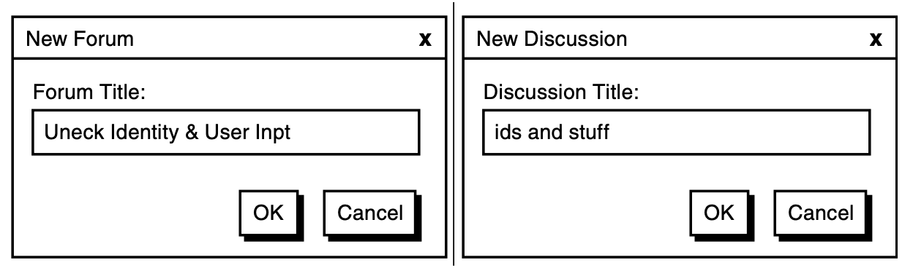

# Varlıklar (Entities)

***Geliştiricilerde, alan (domain) yerine veriye odaklanma eğilimi vardır. Bu, DDD’ye yeni başlayanlarda sıkça görülebilir; çünkü mevcut yazılım geliştirme yaklaşımları, veritabanına büyük önem verir. Zengin davranışlara sahip alan kavramlarını tasarlamak yerine, çoğunlukla verinin niteliklerini (sütunlar) ve ilişkilerini (foreign key’ler) düşünürüz.*** Bu yaklaşım, veri modelini nesne karşılıklarına yansıtarak “alan modelimizdeki” neredeyse her kavramın sadece getter ve setter metodları içeren birer Entity (Varlık) olarak yazılmasına neden olur. Tüm bunları otomatik olarak üreten araçlar bulmak oldukça kolaydır. Özellik erişim metodlarında (property accessors) yanlış bir şey olmayabilir, ancak DDD’deki Entity’lerin sahip olması gereken tek davranış bu değildir.

Bu, SaaSOvation geliştiricilerinin karşılaştığı bir tuzaktı. Varlık tasarımı konusunda onların deneyimlerinden ders çıkarın.

> **Bu Bölümün Yol Haritası**
>
> - Benzersiz şeyleri modellememiz gerektiğinde, Varlıkların (Entities) neden doğru yere sahip olduğunu düşünün.  
> - Varlıklar için benzersiz kimliklerin nasıl üretilebileceğini öğrenin.
> - Bir ekibin Ubiquitous Language (Ortak Dil) kavramını Varlık tasarımıyla nasıl yakaladığını bir tasarım oturumunda gözlemleyin.
> - Varlık rollerini ve sorumluluklarını nasıl ifade edebileceğinizi öğrenin.
> - Varlıkların nasıl doğrulanabileceğini (validation) ve kalıcı depolamaya (persistence) nasıl kaydedilebileceğini gösteren örnekleri inceleyin.

## Neden Entity Kullanırız?

Bir domain kavramını **Entity (Varlık)** olarak tasarlarız çünkü onun bireyselliği (kimliği) bizim için önemlidir — sistemdeki diğer tüm nesnelerden ayırt edilebilir olması zorunlu bir kısıtlamadır. **Entity, benzersiz bir şeydir ve uzun zaman boyunca sürekli olarak değişime uğrayabilir**. Bu değişimler o kadar büyük olabilir ki, nesne eskisinden oldukça farklı görünebilir. **Yine de, kimliği sayesinde aynı nesne olmaya devam eder.**

Nesne değiştikçe, değişikliklerin ne zaman, nasıl ve kim tarafından yapıldığını izlemek isteyebiliriz. Ya da, sadece mevcut formunun önceki değişim geçişleri hakkında yeterli ipucu verdiğini düşünüp, açık bir şekilde geçmişi izlemeye gerek duymayabiliriz. Her değişim detayı izlenmese bile, bu nesneler üzerinde ömürleri boyunca meydana gelebilecek geçerli değişim dizilerini düşünebilir ve tartışabiliriz. **İşte Entity'leri Value Object’lerden ayıran temel farklar bu benzersiz kimlik ve değişebilirlik (mutability) özellikleridir.**

Her zaman Entity kullanmak doğru yaklaşım olmayabilir. Yanlış kullanım, çoğu kişinin fark ettiğinden daha sık gerçekleşir. Genellikle bir kavram Value Object olarak modellenmelidir. Bu fikir rahatsız edici geliyorsa, DDD (Domain Driven Design) belki de iş ihtiyaçlarınıza uygun değildir. Belki de CRUD tabanlı (Create, Read, Update, Delete) bir sistem daha uygun olacaktır. Eğer öyleyse, bu karar projenizin zaman ve para açısından tasarruf etmesini sağlayabilir. Ancak CRUD yaklaşımını seçmek her zaman bu kaynakları korumaz.

İşletmeler genellikle, veri tabanındaki tabloları süslü bir şekilde düzenleyen editörler geliştirmek için fazla çaba harcarlar. Doğru araç seçimi yapılmazsa, karmaşıklaştırılmış CRUD çözümleri gereğinden fazla pahalı olur. CRUD mantıklı olduğunda, Groovy ve Grails, Ruby on Rails gibi diller ve framework’ler en uygun tercihlerdir. Doğru karar verilirse, zaman ve maliyet tasarrufu sağlar.

Öte yandan, eğer CRUD yaklaşımını yanlış sistemlere—daha karmaşık ve DDD’nin hassasiyetini hak eden sistemlere—uygularsak, bu karardan pişman olabiliriz. Sistem karmaşıklığı arttığında, yanlış araç seçiminin sınırlamalarıyla yüzleşiriz. CRUD sistemleri yalnızca veriyi yakalayarak rafine bir iş modeli ortaya koyamaz.

Eğer DDD, işletmenin kârlılığı açısından makul bir yatırım ise, Entity’leri amacına uygun şekilde kullanmalıyız.

> Bir nesne, niteliklerinden (attributes) ziyade kimliği (identity) ile ayırt ediliyorsa, modeldeki tanımında bu durumu ön plana almalıyız. Sınıf tanımını sade tutmalı ve yaşam döngüsünün sürekliliğine ve kimliğine odaklanmalıyız. Nesnenin formu veya geçmişi ne olursa olsun, onu ayırt edebileceğimiz bir yöntem tanımlamalıyız... 
> 
> “Model, bir şeyin aynı şey olduğunu neyin belirlediğini tanımlamalıdır.” [Evans, s. 92]

Bu bölüm, Entity’lere doğru vurgu nasıl yapılır onu öğretiyor ve çeşitli Entity tasarım tekniklerini sana gösteriyor.

## Benzersiz Kimlik (Unique Identity)

Bir Entity tasarımının ilk aşamalarında, özellikle o Entity'yi benzersiz kılan birincil özelliklere ve davranışlara, ayrıca sorgulama için yararlı olanlara odaklanırız. Diğer tüm özellik ve davranışları ise, bu temel unsurlar netleşene kadar bilinçli olarak göz ardı ederiz.

> ⚠️ "Özelliklere ya da davranışlara odaklanmak yerine, Entity nesnesinin tanımını, özellikle onu tanımlayan ya da eşleştirmek için yaygın olarak kullanılan en temel özelliklere indir. Sadece kavram için gerekli olan davranışları ve o davranışın gerektirdiği özellikleri ekle."  ***— [Evans, s. 93]***

İlk yapacağımız şey de tam olarak bu olacak. Kimlik oluşturmak için elimizde farklı seçeneklerin olması çok önemlidir. Aynı şekilde, bu benzersizliğin zaman içinde korunmasını sağlamak da bir o kadar önemlidir.

Bir Entity’nin benzersiz kimliği, her zaman bulma ya da eşleştirme açısından pratik olmayabilir. Bu kimliğin aramada kullanılıp kullanılamayacağı genellikle onun insan tarafından okunabilir olup olmamasına bağlıdır. Örneğin, bir uygulamada bir kişinin ismine göre arama yapılabiliyorsa, ismin büyük ihtimalle o kişinin benzersiz kimliği olarak kullanılmadığı anlamına gelir. Çünkü insanlar sık sık aynı isme sahip olabilir. Öte yandan, eğer bir şirketin vergi numarasına göre arama yapılıyorsa, bu durumda vergi numarası büyük olasılıkla o şirketin benzersiz kimliği olarak kullanılır — çünkü devletler tarafından verilen vergi numaraları tektir.

Value Object'ler, benzersiz kimlikleri taşıyan nesneler olarak kullanılabilir. Değiştirilemez olmaları sayesinde kimlik stabilitesini sağlarlar ve kimliğe özgü davranışlar merkezi bir noktada toplanabilir. Bu sayede kimlik bilgisine dair tüm mantık modelin diğer kısımlarına ya da client kodlara sızmaz.

Aşağıda, kimlik oluşturma stratejilerinden bazıları verilmiştir. Basitten karmaşığa doğru sıralanmıştır:

- Kullanıcı, uygulamaya bir veya birden fazla benzersiz değer girer. Uygulama bu değerlerin benzersizliğini sağlamak zorundadır.
    
- Uygulama, benzersizliği garanti eden bir algoritma kullanarak kimliği dahili olarak üretir. Bu işlem için bir kütüphane ya da framework kullanılabilir.
    
- Uygulama, benzersiz kimliği üretmek için bir veritabanı gibi bir kalıcı veri kaynağına güvenir.
    
- Başka bir Bounded Context (sistem ya da uygulama) benzersiz kimliği zaten belirlemiştir. Kullanıcı, bu kimliği girer veya mevcut seçeneklerden birini seçer.

ℹ️ Şimdi bu stratejilerin her birine ve bunlara dair çeşitli zorluklara bakacağız. **Teknik çözümler çeşitlendikçe, yan etkiler neredeyse kaçınılmazdır.** Örneğin, relational veritabanlarını kullanırken oluşan **“leak” (sızıntı), domain modelimize yansıyabilir.** Kimlik üretimi konusunu; kimliğin ne zaman üretileceği, **veritabanının referanssal kimliğinin domain objeleri üzerindeki etkisi** ve **ORM kullanımının bu durumu nasıl etkilediği** gibi başlıklarla tamamlayacağız. Ayrıca, **benzersiz kimliklerin kararlı kalmasını sağlamak için pratik önerilere de** yer vereceğiz.


### Kullanıcının Kimliği Belirlemesi (User Provides Identity)

Kullanıcının, benzersiz kimliği manuel olarak girmesi ilk bakışta basit bir yaklaşım gibi görünebilir. Kullanıcı tanınabilir bir değer ya da sembolü bir giriş alanına yazar ya da mevcut seçenekler arasından birini seçer ve Entity oluşturulur. Bu gerçekten de oldukça basit bir yaklaşımdır. Ancak, bazı komplikasyonlar ortaya çıkabilir.

Bu komplikasyonlardan biri, kullanıcıların kaliteli kimlik üretmesine güvenmektir. Kimlik benzersiz olabilir ama hatalı da olabilir. Çoğu zaman kimlikler değiştirilemez (immutable) olmalıdır, dolayısıyla kullanıcıların onları değiştirmemesi gerekir. Ancak bu her zaman geçerli değildir ve kullanıcılara kimliği düzeltme imkanı tanımak bazı durumlarda avantajlı olabilir.

Örneğin: Forum ve Discussion başlıklarını benzersiz kimlik olarak kullandığımızı varsayalım. Peki kullanıcı başlığı yanlış yazarsa ya da sonradan başlığın uygun olmadığını fark ederse ne olur? (Bkz. Şekil 5.1) Bu değişikliğin maliyeti nedir? Kullanıcının sağladığı kimlik ilk etapta düşük maliyetli bir yöntem gibi görünse de, gerçekte öyle olmayabilir. Kullanıcıların hem benzersiz hem de doğru ve uzun ömürlü kimlikler üretmesine güvenilebilir mi?



**Figure 5.1:** Forum başlığı yanlış yazılmıştır ve tartışma başlığı arzu edilenden daha azdır.

Bu sorunun önüne geçmek tasarım sürecindeki tartışmalarla başlar. Takımlar, kullanıcıların benzersiz kimlik tanımlayabilmesi için güvenli yaklaşımları değerlendirmelidir. İş akışına dayalı kimlik onayı, yüksek hacimli işlemler için uygun olmayabilir ancak insan tarafından okunabilir bir kimlik gerekiyorsa oldukça işe yarar. Kimlik, yıllarca iş dünyasında yaygın şekilde kullanılacaksa ve iş akışını desteklemek mümkünse, kimliğin kalitesini sağlamak için birkaç ekstra adım eklemek iyi bir yatırımdır.

Her zaman, kullanıcı tarafından girilen değerleri benzersiz kimlik olarak değil, Entity içinde eşleşme amacıyla kullanılabilecek özellikler olarak dahil etme seçeneğimiz vardır. Bu tür basit özellikler zamanla değişebilen operasyonel durumların bir parçası olarak daha kolay şekilde güncellenebilir. Bu durumda, benzersiz kimliği sağlamak için başka bir yöntem kullanmamız gerekecektir.

### Uygulamanın Kimlik Üretmesi (Application Generates Identity)

Uygulamanın otomatik olarak benzersiz kimlikler üretmesi için oldukça güvenilir yollar vardır. Ancak uygulama birden fazla node’a dağıtılmış (clustered) ise dikkatli olunmalıdır. Bazı kimlik üretim desenleri, neredeyse kesin olarak benzersiz kimlikler oluşturabilir. **UUID (Universally Unique Identifier)** ya da **GUID (Globally Unique Identifier)** bu türden bir yaklaşımdır.

Yaygın bir UUID varyasyonu, aşağıdaki adımların çıktılarının birleştirilmesiyle oluşturulur:

1.  Bilgisayarın o anki zamanı (milisaniye cinsinden)
    
2.  Uygulamanın çalıştığı bilgisayarın IP adresi
    
3.  Sanal makinedeki fabrika nesnesinin nesne kimliği (Java)
    
4.  Sanal makinede aynı jeneratörden üretilmiş rastgele bir sayı (Java)
    

Bu işlem, 128-bit'lik benzersiz bir değer üretir. Bu genellikle 32 veya 36 baytlık hexadecimal metin dizesi olarak ifade edilir. 36 baytlık format, tire (`-`) karakterleriyle ayrılmış yaygın bir biçimdir**, örneğin: `f36ab21c-67dc-5274-c642-1de2f4d5e72a`. Tireler olmadan 32 bayttır. Her iki durumda da bu kimlik insan tarafından okunabilir sayılmaz.

Java dünyasında bu yöntem, Java 1.5’ten itibaren gelen `java.util.UUID` sınıfı ile değiştirilmiştir. Bu sınıf, **Leach-Salz varyantına dayalı dört farklı üretim algoritmasını destekler.** Java'nın standart API'si ile kolayca rastgele bir UUID üretilebilir:

```java
String rawId = java.util.UUID.randomUUID().toString();
```

Bu örnek, **tip 4** UUID üretir ve **kriptografik olarak güçlü bir rastgele sayı üretici** olan `java.security.SecureRandom`'a dayanır. Tip 3 ise isim tabanlı şifreleme kullanır, örneğin:
Tip 3 ise `java.security.MessageDigest` sınıfını temel alarak isim tabalı bir şireleme kullanır. İsim tabanlı bir UUID elde etmek için:

```java
String rawId = java.util.UUID.nameUUIDFromBytes("Some text".getBytes()).toString();
```

Ayrıca, rastgele sayı üretimini şifreleme ile harmanlayabiliriz:

```java
SecureRandom randomGenerator = new SecureRandom();
int randomNumber = randomGenerator.nextInt();
String randomDigits = new Integer(randomNumber).toString();
MessageDigest encryptor = MessageDigest.getInstance("SHA-1");
byte[] rawIdBytes = encryptor.digest(randomDigits.getBytes());
```

Burada tek yapılması gereken, `rawIdBytes` dizisini **hexadecimal bir metin temsiline** dönüştürmektir. UUID oluşturmak için tekrar `nameUUIDFromBytes()` metodunu kullanabiliriz.

Başka kimlik üretim yöntemleri de vardır (örneğin `java.rmi.server.UID` veya `java.rmi.dgc.VMID`), ancak bunlar `java.util.UUID` kadar tercih edilmez ve bu yüzden burada ele alınmamaktadır.

**UUID, dış sistemlerle (örneğin veri tabanı gibi) etkileşime gerek duymadan oldukça hızlı bir şekilde üretilebilir.** Aynı türden bir Entity saniyede birçok kez oluşturulsa bile, UUID jeneratörü bu hıza yetişebilir.

ℹ️ **Daha yüksek performanslı sistemlerde UUID’leri önceden üreterek bellekte saklayabiliriz.** Önbellek yeniden doldurulabilir ve **sunucu yeniden başlatıldığında UUID kaybı bir sorun oluşturmaz**, çünkü kimlikler rastgele oluşturulmuştur. Sunucu açıldığında önbelleğin yeniden doldurulması, sistemde kopukluk yaratmaz.

Bu kadar büyük bir kimlik (örneğin UUID), bazı nadir durumlarda bellek yükü nedeniyle kullanışsız hale gelebilir. Bu gibi durumlarda, veritabanı tarafından üretilen 8 baytlık bir `long` türünde kimlik durumu iyileştirebilir. Daha küçük olan 4 baytlık bir `integer` türü, yaklaşık iki milyar benzersiz değer sağlayabilir ve bazı durumlar için yeterli olabilir. Bu yaklaşımlar bir sonraki bölümde ele alınacaktır.

Şu örneğe baktığımızda, bir UUID’yi kullanıcı arayüzünde göstermek istemememiz anlaşılabilir:

```
f36ab21c-67dc-5274-c642-1de2f4d5e72a
```

Tam bir UUID, kullanıcıdan gizlenebildiği ve insan tarafından okunabilir referans teknikleri kullanılabildiğinde uygundur. Örneğin, e-posta ile gönderilebilecek veya kullanıcılar arasında paylaşılabilecek URI'ler (hipermedya bağlantıları) tasarlanabilir. Bu durumda, HTML'deki `<a>text</a>` örneğinde olduğu gibi, bağlantının teknik kimliği arka planda kalır ve kullanıcıya sade bir metin gösterilir.

ℹ️ Eğer hexadecimal UUID’nin belirli segmentlerinin benzersizliğine güveniyorsanız, tamamı yerine sadece bir veya birkaç segmenti kullanmayı tercih edebilirsiniz. Ancak bu tür kısaltılmış kimlikler, yalnızca **bir Aggregate içindeki Entity’ler arasında yerel benzersizlik gerektiğinde daha güvenilirdir.** Yani Aggregate içinde bulunan Entity'ler, yalnızca aynı Aggregate içerisindeki diğer Entity'lerden benzersiz olmalıdır. **Öte yandan, bir Entity Aggregate Root olarak hizmet veriyorsa, küresel (global) benzersizliğe ihtiyaç duyar.**

Kendi kimlik üreticimiz, UUID’nin belirli segmentlerini kullanarak özel formatta kimlikler üretebilir. Örneğin:

```
APM-P-08-14-2012-F36AB21C
```

Bu 25 karakterlik kimlik:

- Agile Project Management bağlamını (APM) belirtir,  
- Bir **Product ( P )** varlığına aittir,  
- 14 Ağustos 2012 tarihinde oluşturulmuştur,  
- Ve `F36AB21C` parçası, oluşturulan bir UUID’nin ilk segmentidir.

Bu yapı, insan tarafından okunabilirliği yüksek tutarken aynı zamanda yüksek olasılıkla küresel benzersizlik sağlar. Bu durum yalnızca kullanıcılar için değil, Bounded Context'ler arasında kimliklerin taşındığı senaryolarda geliştiriciler için de faydalıdır, çünkü kimliğin hangi sistemden geldiği açıkça anlaşılır.

***SaaSOvation gibi çok kiracılı yapılarda, her tenant için Aggregate'ler ayrıldığı için bu tür bir yaklaşım pratik olabilir.***

Bu tür bir kimliği `String` olarak saklamak **iyi bir tercih olmayabilir.** Bunun yerine, **özel bir Value Object** tanımlamak daha uygundur:

```java
String rawId = "APM-P-08-14-2012-F36AB21C"; // sistem tarafından üretilmiş olur
ProductId productId = new ProductId(rawId);
...
Date productCreationDate =  productId.creationDate();

```

Bu sayede, kimlikle ilgili davranışlar `ProductId` Value Object içinde toplanır ve modelin geri kalanı bu detaylardan izole edilir.

Bir istemci, ürünün ne zaman oluşturulduğu gibi kimlik detaylarını talep edebilir ve bu bilgi kolayca sağlanabilir. İstemcilerin ham kimlik formatını anlamasına gerek yoktur. Artık Product (Ürün) Aggregate Root, oluşturulma tarihini istemcilere nasıl elde edildiğini belirtmeden sunabilir:

```java
public class Product extends Entity {
	private ProductId productId;
	...
	public Date creationDate() {
		return this.productId().creationDate();
	}
	...
}
```

Kimlik üretimi konusunda üçüncü taraf kütüphane ve framework'lerde bazı çözümler bulunabilir. Apache Commons projesinde, Commons Id (sandbox) bileşeni beş farklı kimlik üreteci sunar. Bazı kalıcılık (persistence) altyapıları, örneğin NoSQL Riak ve MongoDB, sizin için kimlik oluşturabilir. Riak'e bir veri kaydetmek için genelde HTTP PUT kullanırsınız, bu da bir anahtar gerektirir:

```http
PUT /riak/bucket/key
[object serialization]
```

Alternatif olarak, anahtar vermeden POST isteği de yapabilirsiniz; bu durumda Riak sizin için benzersiz bir kimlik oluşturur. Yine de, bu bölümün ilerleyen kısımlarında tartışıldığı gibi, erken kimlik üretimi mi yoksa geç kimlik üretimi mi yapılacağına karar vermek önemlidir.

Peki, uygulamanızda oluşturulan kimliklerin **Factory**’si ne olacak? Aggregate Root kimliği için ben genelde **Repository'yi tercih ederim**:

```java
public class HibernateProductRepository implements ProductRepository  {
	...
	public ProductId nextIdentity() {
		return new ProductId(java.util.UUID.randomUUID().toString().toUpperCase());
	}
	... 
}
```

Bu tür bir kimlik üretimi için doğal bir yer gibi görünüyor.

*** 222. sayfa